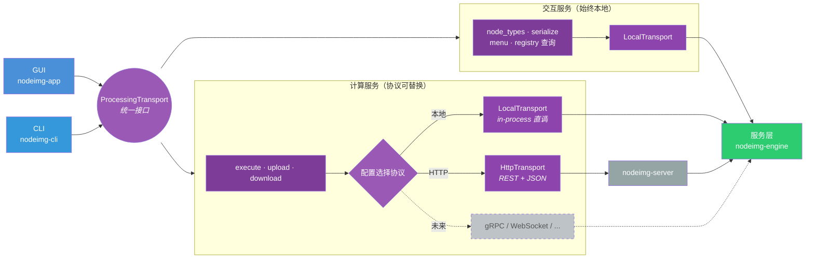
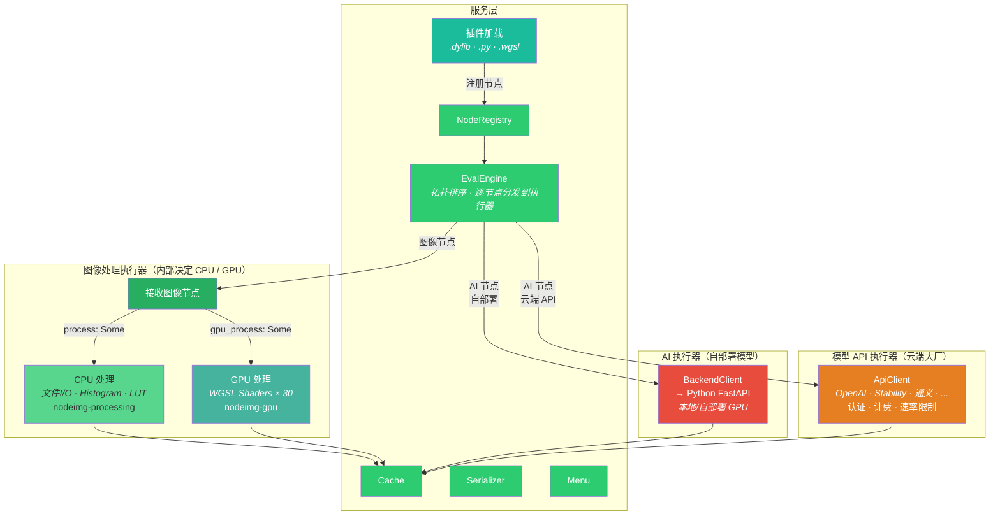
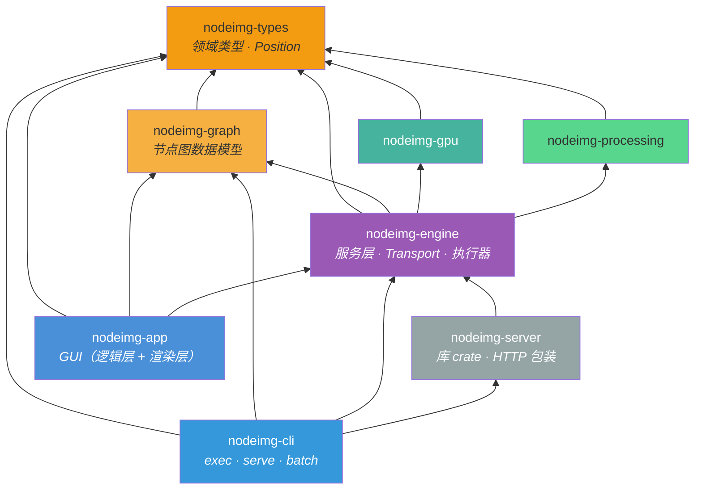
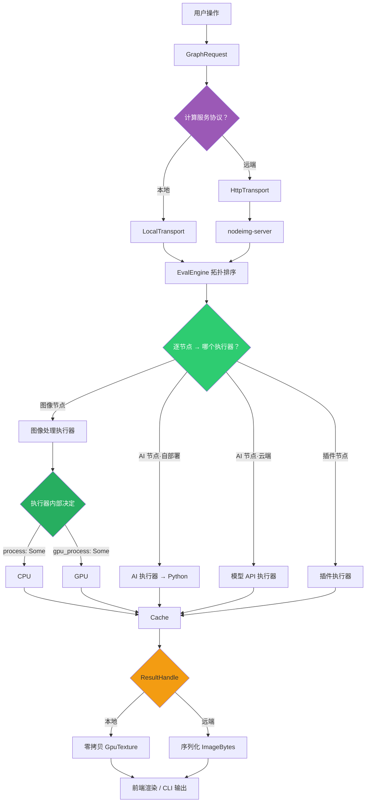
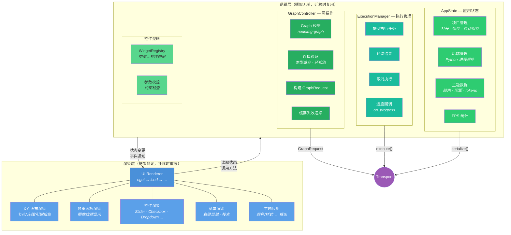
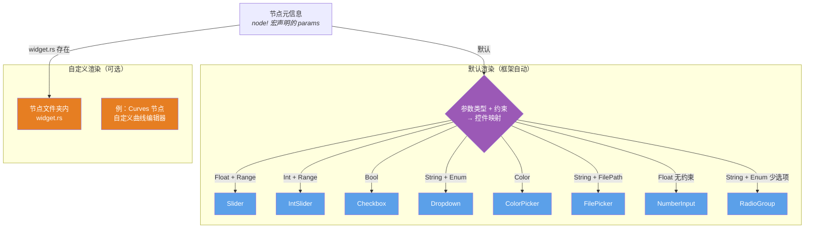
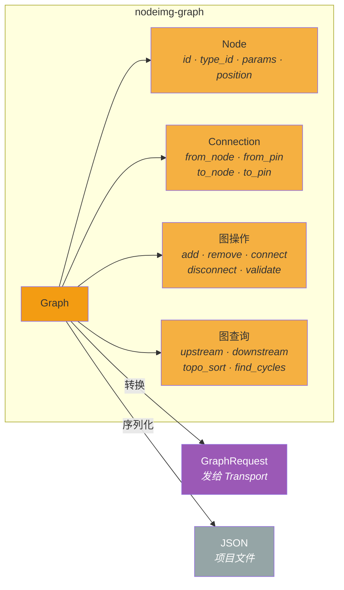
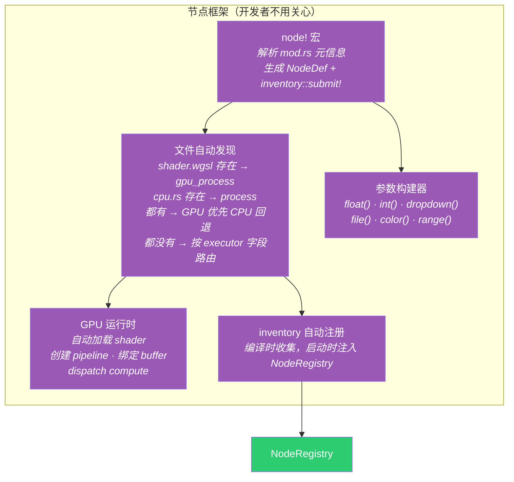
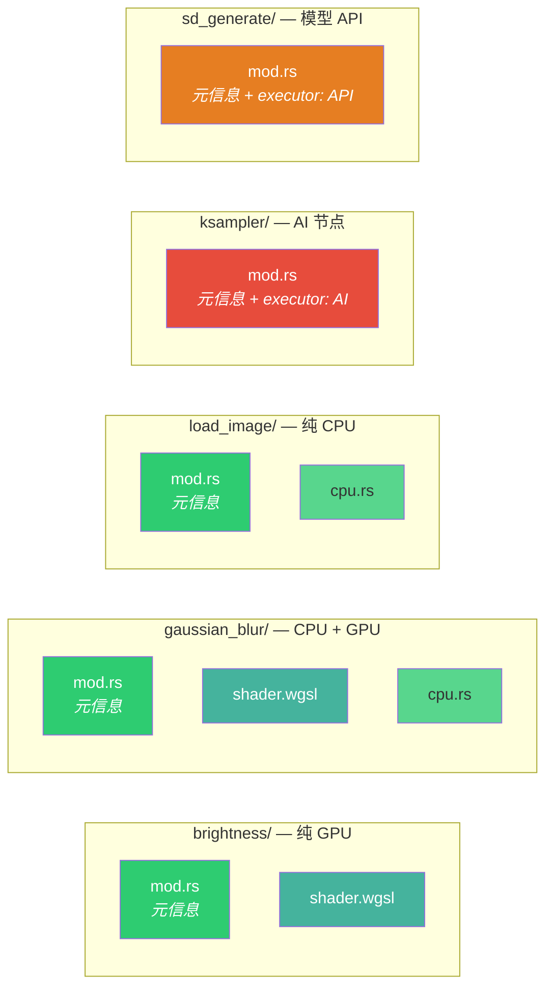

# 目标架构

## 1. 调用链总览

统一 trait 接口，协议层可替换。交互服务始终本地，计算服务根据配置选择协议。



> 前端只看到统一的 trait 接口，不感知底层协议。协议层可随时替换（HTTP → gRPC → WebSocket），只需对齐接口。

---

## 2. 服务层内部

EvalEngine 拓扑排序后，逐节点按类型分发到执行器。



> EvalEngine 只决定分发给哪个执行器。CPU/GPU 的选择是图像处理执行器内部的事，根据节点声明的 `process` / `gpu_process` 决定。

---

## 3. Crate 依赖

箭头 = "依赖于"。



> GUI 不依赖 nodeimg-gpu（图像处理 GPU 归服务层）。CLI 内嵌 server，一个二进制搞定。nodeimg-graph 被 app、cli、engine 共用。

---

## 4. 执行流程



---

## 5. Python AI 后端


> 地址可配置，本地模式可自动拉起，不可用时不影响图像处理。前端不感知 Python 后端的存在。

---

## 6. App 层内部架构

nodeimg-app 内部分为**逻辑层**（框架无关）和**渲染层**（框架特定），逻辑层迁移 UI 框架时完全复用。



> 渲染层只负责"把状态画出来"和"把用户操作转为方法调用"。所有判断、校验、状态管理在逻辑层。

### 节点渲染器

节点 UI 由框架根据参数元信息自动生成，特殊节点可覆写。



```
节点文件夹（含自定义 UI）：
curves/
├── mod.rs              # 元信息
├── cpu.rs              # CPU 处理
└── widget.rs           # 自定义曲线编辑器 UI（可选，覆写默认渲染）

brightness/
├── mod.rs              # 元信息
└── shader.wgsl         # 无 widget.rs → 框架根据 Float+Range 自动生成 Slider
```

> 99% 的节点不需要写 widget.rs。只有 Curves、Gradient Editor 等需要特殊交互的节点才覆写。

---

## 7. nodeimg-graph — 自建图模型

框架无关的节点图数据结构，替代 egui-snarl 的 `Snarl<NodeInstance>`。



> 依赖 nodeimg-types（NodeInstance、Position、Value）。被 app、cli、engine 共用。

---

## 8. 节点架构

新建节点 = 新建文件夹 + mod.rs 写元信息 + 放入 shader.wgsl / cpu.rs。不改任何其他文件。

### 节点框架



### 节点文件夹约定



> mod.rs 只写元信息（node! 宏），shader.wgsl / cpu.rs 按文件名自动绑定，不用在 mod.rs 中声明。

### 目录结构

按执行器类型分三个目录，所有节点统一 Rust 定义：

```
crates/nodeimg-engine/src/
├── builtins/                 # 图像处理节点
│   ├── brightness/
│   │   ├── mod.rs            # node! { name, category, inputs, outputs, params }
│   │   └── shader.wgsl       # 自动绑定为 gpu_process
│   ├── gaussian_blur/
│   │   ├── mod.rs
│   │   ├── shader.wgsl       # GPU 优先
│   │   └── cpu.rs            # CPU 回退
│   ├── load_image/
│   │   ├── mod.rs
│   │   └── cpu.rs            # 自动绑定为 process
│   └── mod.rs                # inventory::iter 收集
│
├── ai_nodes/                 # AI 自部署节点
│   ├── ksampler/
│   │   └── mod.rs            # node! { ..., executor: AI }
│   ├── load_checkpoint/
│   │   └── mod.rs
│   └── mod.rs
│
└── api_nodes/                # 模型 API 节点
    ├── sd_generate/
    │   └── mod.rs            # node! { ..., executor: API }
    ├── dalle_generate/
    │   └── mod.rs
    └── mod.rs
```

Python 端只保留推理服务，不再定义节点：

```
python/
├── server.py                 # FastAPI 推理服务
├── executor.py               # 推理执行
├── device.py                 # GPU 检测
└── models/                   # 模型文件管理
```

> 所有节点定义统一 Rust 侧。Python 端退化为纯推理服务。

---

## 设计决策

| 决策 | 结论 | 来源 |
|------|------|------|
| 本地 vs 远端 | 统一接口，交互服务始终本地，计算服务协议可替换 | #12 #13 |
| GPU 归属 | 服务层拥有图像处理 GPU，前端 wgpu 仅 UI 渲染 | #12 |
| 逐节点分发 | EvalEngine 按节点类型分发，同一图可混合多种节点 | #12 |
| CPU + GPU | 协作关系，节点声明用哪个 | 现有设计 |
| 进度反馈 | execute() 接受 on_progress 回调 | #4 #77 |
| 返回值 | ResultHandle：Local 零拷贝 / Remote 序列化 | 新决策 |
| Serializer | 在服务层，前端共用 | #73 #78 |
| 位置类型 | nodeimg-types 定义 Position（替代 egui::Pos2） | #78 |
| 插件 | NodeRegistry 注册，支持 .dylib / .py / .wgsl | #27 |
| CLI serve | 内嵌 nodeimg-server（库 crate） | #18 |
| Python 后端 | 可配置、可自动拉起、可独立部署 | #12 |
| 远端文件 | Transport 含 upload/download | 新决策 |
| 模型 API 执行器 | 独立于 AI 执行器，处理云端大厂 API（认证/计费/速率限制） | 新决策 |
| 调度模式扩展 | 帧循环/关键帧是 EvalEngine 新模式，不是新执行器 | #29 #30 |
| 错误处理 | 统一 ExecutionError 传回前端 | 新决策 |
| Graph 模型 | 新建 nodeimg-graph crate，框架无关，替代 egui-snarl | 新决策 |
| App 分层 | app 内部拆 逻辑层（复用）+ 渲染层（重写），不新建 crate | #75 #76 |
| 节点架构 | 所有节点 Rust 定义，每节点一个文件夹，inventory 宏自动注册 | 新决策 |
| 节点目录 | builtins/（图像）、ai_nodes/（自部署AI）、api_nodes/（云端API）三目录 | 新决策 |
| Shader 位置 | 和节点定义放一起（同文件夹），不再集中在 nodeimg-gpu | 新决策 |
| Python 端定位 | 纯推理服务，不再定义节点，节点定义全部在 Rust 侧 | 新决策 |
| 节点渲染 | 框架根据参数类型+约束自动生成 UI，可选 widget.rs 覆写 | 新决策 |
