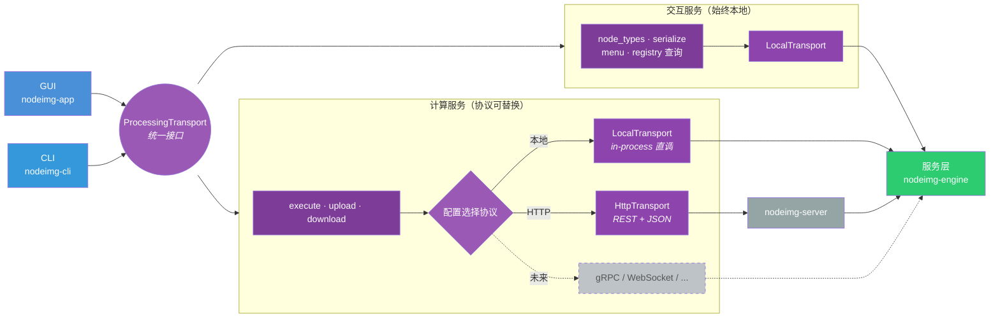
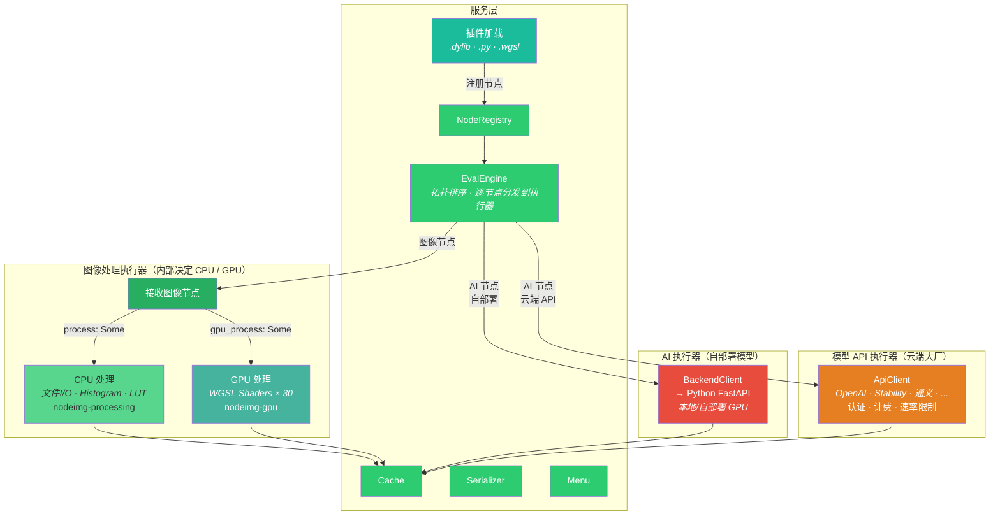
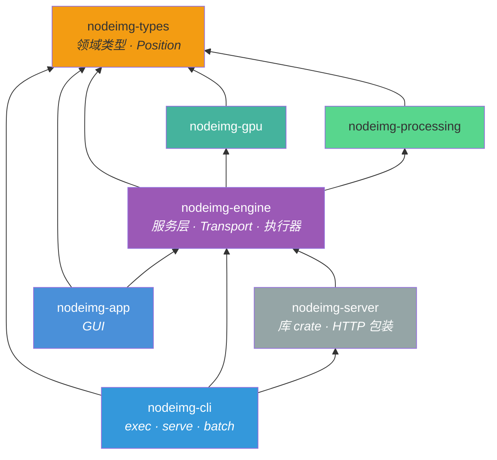
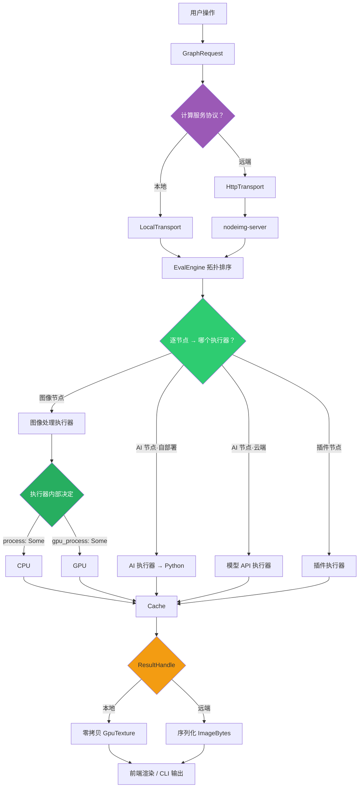
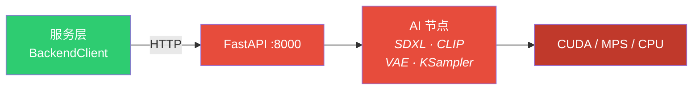

# 目标架构

## 1. 调用链总览

统一 trait 接口，协议层可替换。交互服务始终本地，计算服务根据配置选择协议。

> 前端只看到统一的 trait 接口，不感知底层协议。协议层可随时替换（HTTP → gRPC → WebSocket），只需对齐接口。

---

## 2. 服务层内部

EvalEngine 拓扑排序后，逐节点按类型分发到执行器。

> EvalEngine 只决定分发给哪个执行器。CPU/GPU 的选择是图像处理执行器内部的事，根据节点声明的 `process` / `gpu_process` 决定。

---

## 3. Crate 依赖

箭头 = "依赖于"。

> GUI 不依赖 nodeimg-gpu（图像处理 GPU 归服务层）。CLI 内嵌 server，一个二进制搞定。

---

## 4. 执行流程

---

## 5. Python AI 后端

> 地址可配置，本地模式可自动拉起，不可用时不影响图像处理。前端不感知 Python 后端的存在。

---

## 设计决策

| 决策 | 结论 | 来源 |
|------|------|------|
| 本地 vs 远端 | 统一接口，交互服务始终本地，计算服务协议可替换 | #12 #13 |
| GPU 归属 | 服务层拥有图像处理 GPU，前端 wgpu 仅 UI 渲染 | #12 |
| 逐节点分发 | EvalEngine 按节点类型分发，同一图可混合多种节点 | #12 |
| CPU + GPU | 协作关系，节点声明用哪个 | 现有设计 |
| 进度反馈 | execute() 接受 on_progress 回调 | #4 #77 |
| 返回值 | ResultHandle：Local 零拷贝 / Remote 序列化 | 新决策 |
| Serializer | 在服务层，前端共用 | #73 #78 |
| 位置类型 | nodeimg-types 定义 Position（替代 egui::Pos2） | #78 |
| 插件 | NodeRegistry 注册，支持 .dylib / .py / .wgsl | #27 |
| CLI serve | 内嵌 nodeimg-server（库 crate） | #18 |
| Python 后端 | 可配置、可自动拉起、可独立部署 | #12 |
| 远端文件 | Transport 含 upload/download | 新决策 |
| 模型 API 执行器 | 独立于 AI 执行器，处理云端大厂 API（认证/计费/速率限制） | 新决策 |
| 调度模式扩展 | 帧循环/关键帧是 EvalEngine 新模式，不是新执行器 | #29 #30 |
| 错误处理 | 统一 ExecutionError 传回前端 | 新决策 |
