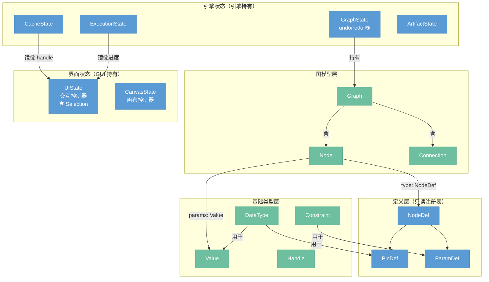

# 数据模型

> 系统中所有数据结构的集中定义：类型、图模型、运行时状态、界面状态。

## 总览



---

## 基础类型层

这些类型是系统的原语，被上层所有模型引用。对应 ProseMirror 中的 `Attrs`、`Mark`。

### DataType

数据类型标识符，描述引脚和值的种类。

```
DataType = image | mask | float | int | bool | color | string | handle
```

AI 类型（`model`、`clip`、`vae`、`conditioning`、`latent`）仅在 Python 进程 VRAM 中存在，在 Rust 侧统一用 `Handle` 传递。

### Value

运行时值，节点参数和执行结果的实际数据。

| 变体 | 内容 | 说明 |
|------|------|------|
| `Image` | `GpuTexture` | GPU 纹理，WGPU 资源 |
| `Float` | `f32` | |
| `Int` | `i64` | |
| `Bool` | `bool` | |
| `Color` | `[f32; 4]` | RGBA |
| `String` | `String` | |
| `Handle` | `Handle` | Python VRAM 数据引用 |

### Constraint

参数的合法性约束，附加在 `ParamDef` 上。开放类型，通过 `ConstraintRegistry` 注册扩展：

```
Constraint {
    type_id: String,    // "range" | "enum" | "file_path" | "multiline" | 自定义...
    params:  JsonValue, // 类型特定参数
}
```

内置约束类型：

| type_id | params | 说明 |
|---------|--------|------|
| `range` | `{ min, max }` | 数值范围 |
| `enum` | `{ options: [...] }` | 枚举选项 |
| `file_path` | `{ extensions: [...] }` | 文件扩展名过滤 |
| `multiline` | `{}` | 多行文本输入 |

新增约束类型通过注册表扩展，无需修改核心代码：

```rust
constraint_registry.register(ConstraintDef {
    type_id:     "color_picker",
    validate:    Box::new(|value, _params| matches!(value, Value::Color(_))),
    widget_hint: Box::new(|_| WidgetHint::ColorPicker),
});
```

### Handle

Python 进程 VRAM 数据的引用凭证，不含实际数据。

```
Handle { id: u64, data_type: DataType }
```

Handle 跨越 Rust/Python 边界传递，Rust 侧只持有引用，不持有数据本体。

---

## 定义层（只读注册表）

节点类型的静态定义，运行时只读，由 `节点管理器` 持有。对应 ProseMirror 中的 `Schema` 和 `NodeType`。

### NodeDef

一种节点的完整类型规格。

```
NodeDef {
    type_id:  String,
    name:     String,
    category: String,
    inputs:   Vec<PinDef>,
    outputs:  Vec<PinDef>,
    params:   Vec<ParamDef>,
}
```

`is_ai_node()` 判据：`process.is_none() && gpu_process.is_none()`。

### PinDef

引脚定义。

```
PinDef { name: String, data_type: DataType, optional: bool }
```

### ParamDef

参数定义。

```
ParamDef {
    name:          String,
    data_type:     DataType,
    constraint:    Option<Constraint>,
    default_value: Value,
}
```

---

## 图模型层

图的数据结构，表示用户构建的节点网络。对应 ProseMirror 中的文档树（`Node`、`Fragment`）。

### Graph

节点图的完整数据。

```
Graph {
    nodes:       HashMap<NodeId, Node>,
    connections: Vec<Connection>,
}
```

Graph 是不可变值类型，所有修改产生新 Graph，旧 Graph 由 `GraphState` 版本栈保留。节点间通过 `Arc<Node>` 结构共享，修改单个节点只 clone 该节点。

### Node

图中的节点实例。

```
Node {
    id:       NodeId,
    type_id:  String,
    params:   HashMap<String, Value>,
    position: Vec2,
}
```

`position` 是画布坐标，属于图模型的一部分（需要持久化）。`params` 只存用户设置的值，默认值从 `NodeDef` 查询。

### Connection

两个引脚之间的有向连线。

```
Connection {
    from_node: NodeId,
    from_pin:  String,
    to_node:   NodeId,
    to_pin:    String,
}
```

单输入引脚：同一 `to_pin` 最多一条入边。

---

## 引擎状态

引擎持有的运行时状态，所有前端（GUI、CLI、AI 操作员）通过引擎 API 读写。

### GraphState

图数据的版本管理容器。

```
GraphState {
    current:    Arc<Graph>,
    undo_stack: Vec<Arc<Graph>>,
    redo_stack: Vec<Arc<Graph>>,
}
```

- 每次 commit 操作将当前版本入 undo 栈，产生新 Graph 设为 current
- `set_param(preview=true)` 和拖拽中的 `move_node` 只更新 current，不入栈
- undo 栈深度可配置

### ExecutionState

当前执行轮次的状态。

```
ExecutionState {
    status:      Idle | Running | Cancelled,
    node_status: HashMap<NodeId, NodeStatus>,
}

NodeStatus = Pending | Running { progress: f32 } | Done | Failed { error: String }
```

### CacheState

节点执行结果的内存缓存。

```
CacheState {
    entries: HashMap<NodeId, CacheEntry>,
}

CacheEntry { value: Value, version: u64 }
```

`Handle` 类型的条目豁免 LRU 淘汰（由 Python 进程管理生命周期）。`version` 与图版本对应，用于脏检测。

### ArtifactState

AI/API 节点输出 Image 时的持久化历史归档。

```
ArtifactState {
    history: HashMap<NodeId, Vec<Artifact>>,
}

Artifact { handle: Handle, timestamp: u64, metadata: ArtifactMeta }
```

只存图片 Handle，不存完整 Value。缓存未命中时作为回源。

---

## 界面状态

GUI 私有状态，引擎不感知。

### UIState

交互控制器持有的界面数据，镜像自引擎事件。

```
UIState {
    selection:    Selection,
    execution:    ExecutionMirror,
    panel_layout: PanelLayout,
}

Selection       { nodes: HashSet<NodeId> }
ExecutionMirror { status: ..., node_status: ..., preview_handle: Option<Handle> }
PanelLayout     { node_library: bool, preview: bool, ai_chat: bool }
```

`Selection` 是纯界面状态——不影响执行，不持久化，CLI 无此概念。AI 操作员若需聚焦某节点，通过 GUI 命令发给交互控制器，而非引擎 API。

`ExecutionMirror` 是 `ExecutionState` 的轻量副本，由交互控制器在收到引擎事件时同步更新。

### CanvasState

画布控制器持有的画布私有状态。

```
CanvasState {
    viewport:    Viewport,
    interaction: Option<ActiveInteraction>,
}

Viewport          { offset: Vec2, zoom: f32 }
ActiveInteraction = Dragging { nodes: Vec<NodeId>, start: Vec2 }
                  | Connecting { from_pin: PinRef, cursor: Vec2 }
                  | BoxSelecting { start: Vec2, end: Vec2 }
```

`interaction` 是进行中的临时交互状态，操作完成后清空。

---

## 配置

应用启动配置，四层合并：CLI 参数 > 环境变量 > TOML 文件 > 默认值。

```
AppConfig {
    cache:   CacheConfig  { result_limit_mb: u32, texture_limit_mb: u32 },
    python:  PythonConfig { url: String, auto_launch: bool },
    api:     HashMap<String, ApiConfig { api_key: String, endpoint: String }>,
}
```
