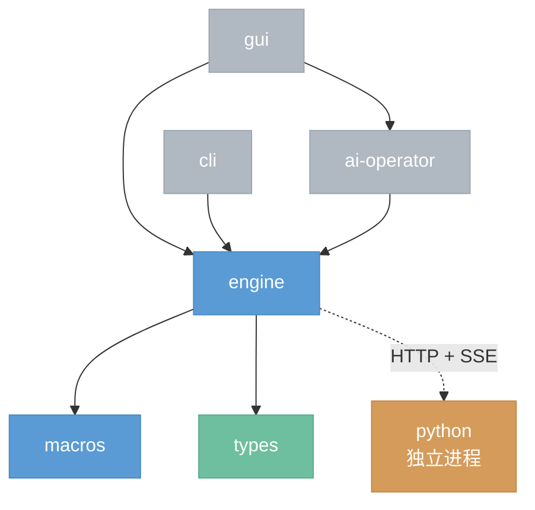

# 文件架构

> **暂定,随时可能重新设计。** 本文档将目标架构的各模块映射到具体文件布局,用于验证目标架构能否干净落地。文件结构应随目标架构文档的演进同步调整。

## 总览



实线箭头 = Rust crate 依赖,虚线箭头 = 进程间通信(非代码级依赖)。

## 顶层结构

```
nodeimg/
├── Cargo.toml
├── types/                  ← 0.1.0 基础类型层
├── engine/                 ← 4.x.x 引擎 + 5.x.x 项目文件
├── macros/                 ← node! 过程宏 (proc-macro = true)
├── gui/                    ← 2.x.x GUI
├── cli/                    ← 3.x.x CLI (future)
├── ai-operator/            ← 1.0.0 AI 操作员 (future)
├── python/                 ← 6.0.0 Python 后端
└── docs/
```

> **为什么 `macros/` 是独立 crate？** Rust 过程宏必须在独立 crate 中定义（`proc-macro = true`），这是语言限制。`engine` 依赖 `macros` 以使用 `node!` 宏。

---

## `types/`

基础类型原语,被所有 crate 依赖。

```
types/src/
├── lib.rs
├── value.rs                DataType, Value
├── constraint.rs           Constraint, ConstraintRegistry, ConstraintDef
├── handle.rs               Handle
├── id.rs                   NodeId, PinRef
├── geometry.rs             Vec2 (Position)
└── texture.rs              GpuTexture
```

---

## `engine/`

引擎核心,包含所有 4.x.x 文档描述的子模块、GPU/CPU 基础设施、后端客户端、Provider 实现、内置节点。

```
engine/src/
├── lib.rs                  Engine facade (引擎 API)
│
├── graph/                                                  ← 4.2.0 节点图控制器
│   ├── mod.rs              Graph, Node, Connection
│   ├── version.rs          版本管理器 (GraphState + undo/redo)
│   ├── editor.rs           图编辑器 (add_node/connect/set_param…)
│   ├── validate.rs         结构校验器 (环检测/类型兼容)
│   └── topology.rs         拓扑查询器
│
├── node_manager/                                           ← 4.4.0 + 4.3.0
│   ├── mod.rs              仅导出
│   ├── manager.rs          NodeManager 对外总入口
│   │
│   ├── model/
│   │   ├── mod.rs          仅导出
│   │   ├── pin_def.rs      PinDef
│   │   ├── param_def.rs    ParamDef / ParamExpose
│   │   ├── exposed_pin.rs  展开后的正式接口视图
│   │   ├── node_def.rs     NodeDef + ExecuteFn
│   │   └── inventory_entry.rs  NodeDefEntry + inventory + Python 注册包含
│   │
│   ├── collect/
│   │   ├── mod.rs          仅导出
│   │   ├── collect_rust_defs.rs    收集 Rust 节点定义
│   │   ├── collect_python_defs.rs  Python 节点声明规格与 expose 解析辅助
│   │   └── merge_node_defs.rs      合并多来源 NodeDef
│   │
│   ├── store/
│   │   ├── mod.rs          仅导出
│   │   └── defs_by_type.rs 按 type_id 持有节点定义
│   │
│   ├── index/
│   │   ├── mod.rs          仅导出
│   │   ├── defs_by_category.rs     分类索引
│   │   └── defs_by_search.rs       搜索索引
│   │
│   └── query/
│       ├── mod.rs          仅导出
│       ├── list_node_defs.rs       列出全部节点定义
│       ├── get_node_def.rs         按 type_id 查询节点定义
│       ├── list_nodes_by_category.rs   按分类列举节点
│       ├── list_exposed_pins.rs    列出展开后的正式接口
│       ├── list_exposed_input_pins.rs  过滤输入接口
│       ├── list_exposed_output_pins.rs 过滤输出接口
│       ├── search_nodes.rs         搜索节点
│       └── list_categories.rs      列出全部分类
│
├── scheduler/                                              ← 4.1.0
│   ├── mod.rs              Scheduler
│   ├── planner.rs          执行规划器 (版本对比 + 脏传播 + 分层)
│   ├── runtime.rs          执行运行时 (rayon 并行)
│   ├── cancel.rs           CancelToken + 超时计时器
│   └── dispatch.rs         执行器注册表
│
├── cache/                                                  ← 4.5.0
│   ├── mod.rs              Cache facade
│   ├── manager.rs          CacheManager 对外入口
│   │
│   ├── model/
│   │   ├── mod.rs
│   │   ├── cache_key.rs    CacheKey / TextureKey
│   │   ├── exec_signature.rs   执行签名
│   │   ├── generation_id.rs GenerationId
│   │   ├── preview_request.rs 预览请求模型
│   │   ├── result_entry.rs 结果缓存条目
│   │   ├── texture_entry.rs 纹理缓存条目
│   │   ├── budget.rs       内存预算
│   │   ├── error.rs        错误定义
│   │   └── stats.rs        统计快照
│   │
│   ├── result_store/
│   │   ├── mod.rs
│   │   ├── lookup.rs       结果缓存查询
│   │   ├── write.rs        结果缓存写入
│   │   ├── invalidate.rs   结果缓存失效
│   │   ├── lru.rs          结果缓存访问顺序
│   │   ├── eviction.rs     结果缓存淘汰策略
│   │   └── bytes.rs        结果缓存字节计量
│   │
│   ├── texture_store/
│   │   ├── mod.rs
│   │   ├── store.rs        纹理缓存存储
│   │   ├── preview_source.rs 预览源选择
│   │   ├── upload.rs       预览纹理上传
│   │   ├── lru.rs          纹理缓存访问顺序
│   │   └── bytes.rs        纹理缓存字节计量
│   │
│   └── release_queue/
│       ├── mod.rs
│       ├── queue.rs        待释放 Handle 队列
│       ├── releaser.rs     Handle 释放执行
│       └── retry_policy.rs 重试策略
│
├── artifact/                                               ← 4.6.0
│   ├── mod.rs              仅导出
│   ├── manager.rs          ArtifactManager
│   │
│   ├── model/
│   │   ├── mod.rs
│   │   ├── record.rs       ArtifactRecord
│   │   ├── request.rs      Create/Select/Delete/Export 请求
│   │   ├── stats.rs        统计结果
│   │   └── error.rs        错误定义
│   │
│   ├── persistence/
│   │   ├── mod.rs
│   │   ├── store.rs        产物文件读写
│   │   ├── index.rs        内存索引
│   │   └── index_file.rs   artifacts.json 磁盘结构
│   │
│   ├── lifecycle/
│   │   ├── mod.rs
│   │   ├── selector.rs     当前选用
│   │   ├── restorer.rs     自动回源
│   │   ├── validator.rs    一致性校验
│   │   ├── cleaner.rs      清理策略
│   │   └── exporter.rs     导出
│   │
│   └── handler/
│       ├── mod.rs
│       ├── handler.rs      ArtifactHandler trait
│       ├── registry.rs     handler 注册表
│       └── image.rs        Image handler
│
├── events.rs                                               ← 4.8.0 事件系统 (mpsc broadcast)
│
├── project/                                                ← 4.7.0 + 5.0.0
│   ├── mod.rs              ProjectManager (new/open/save/close)
│   ├── bundle.rs           .nodeimg bundle 生命周期
│   └── serializer.rs       graph.json + artifacts.json 序列化
│
├── executors/
│   ├── mod.rs              Executor trait
│   ├── image/                                              ← 4.9.0 图像处理执行器
│   │   ├── mod.rs          ImageExecutor
│   │   ├── context.rs      ExecContext<'a>
│   │   ├── gpu.rs          GpuExecutor (wgpu device/queue + Pipeline 缓存)
│   │   └── cpu.rs          CpuExecutor (文件 I/O + 格式转换)
│   ├── ai/                                                 ← 4.10.0 AI 执行器
│   │   ├── mod.rs          AIExecutor
│   │   ├── runtime.rs      AIRuntime trait + RuntimeHealth
│   │   ├── python_http.rs  PythonHttpRuntime
│   │   └── progress.rs     ProgressSender
│   └── api/                                                ← 4.11.0 + 4.11.1
│       ├── mod.rs          APIExecutor
│       ├── provider.rs     Provider trait, ProviderRegistry, ModelInfo, ParamType
│       └── providers/      内置 Provider 实现
│           ├── mod.rs
│           ├── openai.rs
│           └── stability.rs
│
├── builtins/                                               ← 4.3.0 图像节点 (一节点一目录)
│   ├── mod.rs              register_all
│   ├── brightness/         纯 GPU 节点
│   │   ├── mod.rs          node! 宏
│   │   └── shader.wgsl
│   ├── load_image/         纯 CPU 节点
│   │   ├── mod.rs
│   │   └── cpu.rs
│   ├── blur/               多 shader 节点 (双 pass)
│   │   ├── mod.rs
│   │   ├── shader_h.wgsl
│   │   └── shader_v.wgsl
│   ├── lut_apply/          GPU + CPU 混合
│   │   ├── mod.rs
│   │   ├── shader.wgsl
│   │   └── cpu.rs
│   ├── curves/             带自定义控件
│   │   ├── mod.rs
│   │   ├── shader.wgsl
│   │   └── widget.rs       曲线编辑器覆写默认控件映射
│   └── ...                 其他节点按上述 5 种模式之一组织
│
└── api_nodes/                                              ← 4.3.0 API 节点 (一节点一目录)
    ├── mod.rs
    └── sd_generate/
        └── mod.rs
```

---

## `gui/`

GUI 前端,所有 2.x.x 文档描述的模块。

```
gui/src/
├── lib.rs
├── main.rs
├── state.rs                UIState, Selection, ExecutionMirror, PanelLayout
│
├── canvas/                                                 ← 2.1.x
│   ├── mod.rs              NodeCanvas widget                  ← 2.1.0
│   ├── state.rs            CanvasState, Viewport, ActiveInteraction, HoverTarget, VideoPlaybackState
│   ├── controller/                                         ← 2.1.1
│   │   ├── mod.rs          CanvasController
│   │   ├── hit_test.rs     HitTester
│   │   ├── viewport.rs     ViewportController
│   │   ├── selection.rs    SelectionController
│   │   ├── drag.rs         DragController
│   │   └── connect.rs      ConnectController
│   └── render/
│       ├── mod.rs
│       ├── background.rs
│       ├── node.rs         节点渲染器 (Header/Content/Params/引脚)  ← 2.1.2
│       ├── connection.rs   连线渲染器                                ← 2.1.4
│       └── overlay.rs      叠加层 (临时连线/选中框)
│
├── controllers/                                            ← 2.10.0 交互控制器
│   ├── mod.rs              InteractionController
│   ├── project.rs          ProjectController
│   ├── execution.rs        ExecutionController
│   ├── backend.rs          BackendController
│   ├── window.rs           WindowController
│   ├── notification.rs     NotificationService
│   └── commands.rs         CommandRegistry
│
├── panels/
│   ├── mod.rs
│   ├── preview/                                            ← 2.2.0
│   │   ├── mod.rs
│   │   ├── renderer.rs     PreviewRenderer trait + 注册
│   │   ├── image.rs        Shader widget (Image/Mask)
│   │   ├── video.rs        视频解码线程
│   │   └── text.rs         文本渲染
│   ├── library.rs          节点库弹窗                         ← 2.3.0
│   ├── ai_chat.rs          AI 对话面板                        ← 2.4.0
│   ├── toolbar.rs          ToolbarItem, Section, Action       ← 2.5.0
│   └── statusbar.rs        StatusItem, Position, StatusView   ← 2.6.0
│
├── widgets/                                                ← 2.1.3 参数控件系统
│   ├── mod.rs              WidgetRegistry, WidgetEntry
│   ├── slider.rs           Slider + SliderInt
│   ├── drag_value.rs       DragValue
│   ├── dropdown.rs         Dropdown + RadioGroup
│   ├── checkbox.rs         Checkbox
│   ├── color.rs            ColorPicker
│   ├── file.rs             FilePicker
│   └── preview.rs          ImagePreview, ActionButton
│
├── theme/                                                  ← 2.7.0
│   ├── mod.rs              Theme (iced trait)
│   ├── token.rs            TokenDef
│   ├── registry.rs         TokenRegistry
│   ├── category.rs         CategoryRegistry (GUI 的分类定义)
│   └── palette.rs          亮/暗/色盲模式
│
└── shortcuts.rs                                            ← 2.8.0 KeyBinding, Context, Action
```

---

## `cli/` (future)

```
cli/src/
├── lib.rs
├── main.rs
└── commands/
    ├── mod.rs
    ├── exec.rs             exec 命令
    ├── batch.rs            batch 命令
    └── info.rs             info 命令
```

---

## `ai-operator/` (future)

```
ai-operator/src/
├── lib.rs
├── client.rs               LLM 客户端
├── tools.rs                工具集(引擎 API 封装)
├── context.rs              上下文构建
├── validator.rs            验证器
├── history.rs              对话历史
└── mcp.rs                  MCP Server
```

---

## `python/`

```
python/
├── pyproject.toml
├── transport.py            Transport 抽象 + HTTP (FastAPI) 实现
├── executor.py             执行调度
├── handle_store.py         HandleStore 抽象 + dict 实现
├── compute.py              ComputeBackend 抽象 + CUDA/MPS/CPU 实现
├── response.py             ResponseSerializer 抽象 + 内置实现
└── nodes/                  AI 节点目录
    ├── load_checkpoint.py
    ├── clip_text_encode.py
    ├── empty_latent_image.py
    ├── ksampler.py
    └── vae_decode.py
```

---

## 目标文档映射

验证每份编号目标文档都有文件归属:

| 编号 | 文档主题 | 文件归属 |
|---|---|---|
| 0.1.0 | 数据模型 | `types/` 全部 |
| 1.0.0 | AI 操作员 (future) | `ai-operator/` |
| 2.0.0 | GUI 总览 | `gui/` 整体 |
| 2.1.0 | 节点画布 | `gui/src/canvas/mod.rs` |
| 2.1.1 | 画布控制器 | `gui/src/canvas/controller/` |
| 2.1.2 | 节点(视觉) | `gui/src/canvas/render/node.rs` |
| 2.1.3 | 参数控件 | `gui/src/widgets/` |
| 2.1.4 | 连线 | `gui/src/canvas/render/connection.rs` |
| 2.2.0 | 预览面板 | `gui/src/panels/preview/` |
| 2.3.0 | 节点库 | `gui/src/panels/library.rs` |
| 2.4.0 | AI 对话 | `gui/src/panels/ai_chat.rs` |
| 2.5.0 | 工具栏 | `gui/src/panels/toolbar.rs` |
| 2.6.0 | 状态栏 | `gui/src/panels/statusbar.rs` |
| 2.7.0 | 主题系统 | `gui/src/theme/` |
| 2.8.0 | 快捷键 | `gui/src/shortcuts.rs` |
| 2.10.0 | 交互控制器 | `gui/src/controllers/` |
| 3.0.0 | CLI (future) | `cli/` |
| 4.0.0 | 引擎总览 | `engine/` 整体 |
| 4.1.0 | 执行调度器 | `engine/src/scheduler/` |
| 4.2.0 | 节点图控制器 | `engine/src/graph/` |
| — | node! 宏 | `macros/src/lib.rs` |
| 4.3.0 | 节点(概念) | `engine/src/node_manager/model/` + `builtins/` + `api_nodes/` |
| 4.4.0 | 节点管理器 | `engine/src/node_manager/` |
| 4.5.0 | 缓存 | `engine/src/cache/` |
| 4.6.0 | 产物管理器 | `engine/src/artifact/` |
| 4.7.0 | 项目管理器 | `engine/src/project/` |
| 4.8.0 | 事件系统 | `engine/src/events.rs` |
| 4.9.0 | 图像执行器 | `engine/src/executors/image/` |
| 4.10.0 | AI 执行器 | `engine/src/executors/ai/` |
| 4.11.0 | API 执行器 | `engine/src/executors/api/` |
| 4.11.1 | Provider | `engine/src/executors/api/provider.rs` + `providers/` |
| 5.0.0 | 项目文件 | `engine/src/project/serializer.rs` |
| 6.0.0 | Python 后端 | `python/` |

**全部 19 个编号文档 + macros 宏 crate 均有对应文件归属,无遗漏。**

---

## 命名约定

1. **crate 名去 `nodeimg-` 前缀** — 用 `engine` 不用 `nodeimg-engine`
2. **不用 `crates/` 包裹目录** — workspace 成员直接放在仓库根
3. **文件名不重复路径语义** — `executors/image/gpu.rs` 而非 `executors/image/image_gpu.rs`
4. **一文件/目录一概念** — 按 prosemirror 哲学,文件名是概念名
5. **节点 = 目录** — 每个节点一个子目录,按需含 `mod.rs + shader.wgsl + cpu.rs + widget.rs`

---

## 关键决策

### CategoryRegistry 在 GUI 里

`CategoryRegistry` 是前端展示层概念,持有 `{id, label, color}`。engine 不持有它,engine 只认 `NodeDef.category` 字符串。各前端按自己需求持有(GUI 的含 color,CLI/AI 若需要可各自维护 label 映射)。

**位置:** `gui/src/theme/category.rs`

### Python 文件名对齐抽象接口

6.0.0 定义了 4 个核心抽象接口(Transport / ComputeBackend / HandleStore / ResponseSerializer),文件名对齐抽象名而非实现名:

- `transport.py`(原 server.py)— Transport 抽象 + HTTP 实现
- `compute.py`(原 device.py)— ComputeBackend 抽象 + CUDA/MPS/CPU 实现
- `handle_store.py` — HandleStore 抽象 + 实现
- `response.py` — ResponseSerializer 抽象 + 实现
- `executor.py` — 执行调度(无对应抽象)

**原因:** 抽象接口可替换(Transport → WebSocket),实现名会过期,抽象名保持稳定。

### providers/ 在 API 执行器内

`Provider` 是 API 执行器的插件单元(4.11.1 是 4.11.0 的子文档),execute() 只被 APIExecutor 调用,因此归属到 `engine/src/executors/api/providers/`,与 API 执行器其他代码内聚。

### builtins 只列示例

图像节点预计 30+ 个,会持续增减。文件架构文档只列 5 个代表性节点(覆盖所有模式:纯 GPU / 纯 CPU / 多 shader / GPU+CPU 混合 / 带自定义控件),完整清单见 `docs/current/catalog.md`。

---

## 与现有代码的差异

与 `crates/nodeimg-*` 的当前布局相比的结构变更:

| 变更 | 当前 | 目标 |
|---|---|---|
| 去 `crates/` 包裹 | `crates/nodeimg-engine/` | `engine/` |
| 去 `nodeimg-` 前缀 | `nodeimg-app` | `gui`(重命名) |
| 合并 `gpu` crate | 独立 `nodeimg-gpu/` | `engine/src/executors/image/gpu.rs` |
| 合并 `processing` crate | 独立 `nodeimg-processing/` | `engine/src/executors/image/cpu.rs` + 节点内 cpu.rs |
| 移除 `server` crate | 独立 `nodeimg-server/` | 删除(目标文档无对应) |
| 节点目录化 | 扁平 `builtins/blur.rs` | 目录 `builtins/blur/mod.rs + shader.wgsl` |
| shader 分散 | 集中 `gpu/src/shaders/*.wgsl` | 归属节点目录 `builtins/{node}/shader.wgsl` |
| 新增 crate | — | `cli/`、`ai-operator/`(future) |

**迁移不在本文档范围**,此处仅记录结构差异。
