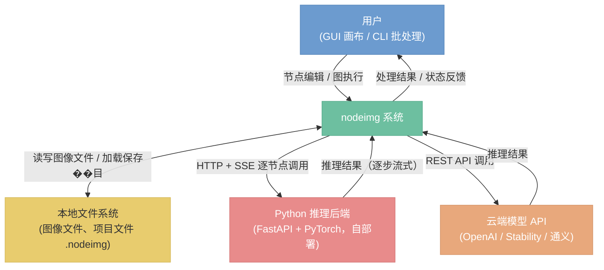

# 系统上下文

> nodeimg 系统与外部世界的边界和交互对象

## 总览

nodeimg 是一个基于 Rust 的节点式图像处理工具，运行在用户本地机器上。系统居中，通过明确定义的接口与四类外部参与者交互：操作系统的文件系统、用户（通过 GUI 或 CLI）、自部署的 Python 推理后端，以及可选接入的云端模型 API。

系统边界内的所有处理逻辑（GPU shader 计算、拓扑调度、AI 推理编排）对外部参与者不可见，外部只感知输入/输出接口。

---

## 系统边界

### 包含什么

| 能力域 | 说明 |
|--------|------|
| 节点图编辑 | GUI 画布支持拖拽连线，CLI 支持无界面批处理执行 |
| 图像处理 | GPU shader（WGSL）执行像素级运算，CPU 算法处理直方图、LUT 等分析型任务 |
| 执行调度 | 对节点图做拓扑排序，分发给 GPU 执行器、CPU 执行器、AI 执行器并行处理 |
| AI 推理编排 | 调度本地 Python 后端（SDXL 等）和云端模型 API，汇聚推理结果回节点图 |
| 项目文件管理 | 将节点图结构（节点、连线、参数）序列化为 `.nodeimg` 文件，支持保存和加载 |

### 不包含什么

- **AI 模型训练**：系统只做推理，不涉及模型训练和微调
- **视频处理**：只处理静态图像，不支持逐帧视频流
- **3D 渲染**：不涉及三维场景、网格或体积渲染
- **在线协作**：无多用户实时协同编辑，项目文件由用户自行管理和分发

---

## 外部交互

### 用户（GUI / CLI）

用户是系统的主要操作者。GUI 模式下，用户在节点画布上拖拽节点、连接引脚、调整参数，并触发图执行；系统将处理进度、预览图像、错误信息反馈给界面。CLI 模式下，用户传入项目文件路径和参数，系统无界面地执行图并将结果写入文件系统。

**数据流向：** 用户操作 → 节点图状态变更 → 执行引擎调度 → 处理结果渲染回 GUI / 写出到文件。

### 本地文件系统

文件系统是系统持久化的唯一本地介质。两类数据进出：

- **图像文件**：`.png`、`.jpg`、`.exr` 等，由 Load Image 节点读入，由 Save Image 节点写出
- **项目文件**（`.nodeimg`）：序列化的节点图结构，保存用户的编辑状态和参数配置

**数据流向：** 文件路径由用户提供，系统在执行时按需读写，不在内存中长期持有原始文件句柄。

### Python 推理后端

Python 后端是用户在本地自行部署的推理服务（FastAPI + PyTorch / Diffusers），运行 SDXL 等扩散模型。系统通过 HTTP 协议调用，使用 Server-Sent Events（SSE）实现逐节点、逐步骤的流式推理进度回传。

**数据流向：** 系统发出 HTTP 请求（含提示词、参数、输入图像）→ 后端执行推理 → SSE 流式返回中间结果和最终图像 → 系统将结果注入节点图缓存。

**约束：** 后端地址在配置中指定。当 `python_auto_launch = true`（默认）时，App 自动启动并管理 Python 进程生命周期（启动、健康检查、崩溃重启、退出时关闭）；当 `python_auto_launch = false` 时，用户自行部署后端，系统仅通过配置地址连接。详见 `15-python-backend-protocol.md`。

### 云端模型 API

云端 API（OpenAI Image、Stability AI、通义万象等）是可选的远端推理能力扩展。当节点图中包含云端 API 节点时，系统在执行阶段向对应 API 发起 REST 调用，将返回的图像或推理结果注入节点图。

**数据流向：** 系统发出 HTTPS 请求（含 API Key、提示词、参数）→ 云端服务推理 → 返回结果 → 系统注入节点图缓存。

**约束：** API Key 由用户在配置中提供，系统不存储凭据到项目文件；网络不可用时该类节点执行失败，不影响纯本地节点的执行。
