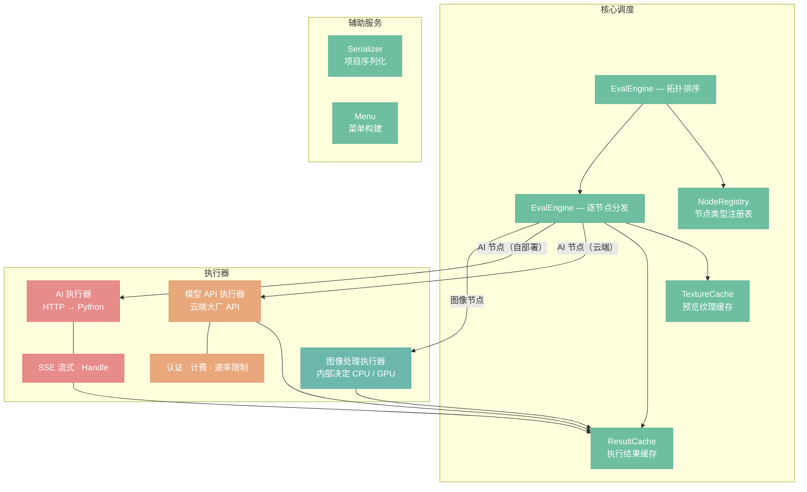
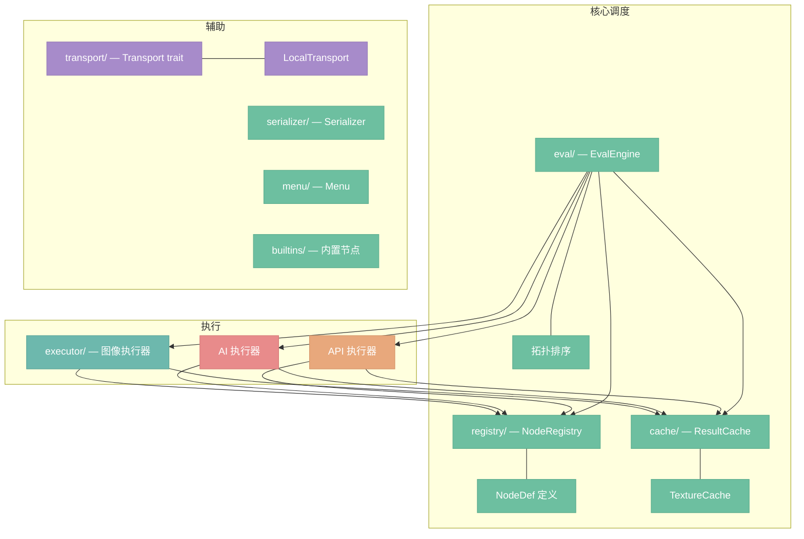
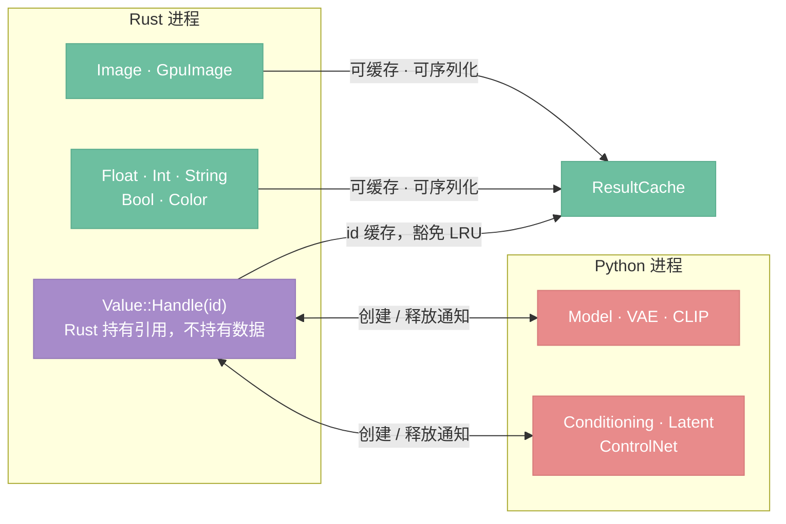

# 服务层内部

> EvalEngine 如何调度执行，服务层内部模块如何组织

## 总览

服务层（`nodeimg-engine`）是系统的执行核心。`EvalEngine` 接收节点图、执行拓扑排序，再按节点类型将每个节点分发给三类执行器处理，结果统一流入 `Cache`。



---

## EvalEngine 分发逻辑

拓扑排序完成后，`EvalEngine` 对每个节点查询 `NodeDef` 的 `executor` 字段判断路由目标：

| 节点类型 | 判定依据 | 路由目标 |
|----------|---------|---------|
| 图像处理节点 | `executor == ExecutorType::Image`（缺省值） | 图像处理执行器 |
| AI 节点（自部署） | `executor == ExecutorType::AI` | AI 执行器 |
| API 节点（云端） | `executor == ExecutorType::API` | 模型 API 执行器 |

**`ExecutorType` 枚举**（定义在 `NodeDef` 上，由 `node!` 宏的 `executor` 字段设置）：

```rust
pub enum ExecutorType {
    Image,  // 缺省，图像处理执行器（GPU 像素运算 + CPU 文件 I/O 与分析，按职责分派）
    AI,     // AI 执行器 → Python 推理后端
    API,    // 模型 API 执行器 → 云端大厂 API
}
```

**兼容性校验**（启动时）：`Image` 类型的节点必须提供 `process` 或 `gpu_process` 至少一个，否则注册失败。`AI` 和 `API` 类型的节点 `process` 和 `gpu_process` 均为 `None`。

图像处理执行器内部按节点职责分派：像素级运算走 `gpu_process`（GPU shader），文件 I/O 和数据分析走 `process`（CPU）。两者协作而非对立，大多数节点只提供其中一条路径。这一分派对 `EvalEngine` 不可见。

执行器将结果封装为 `ResultEnvelope` 写入 `ResultCache`，`EvalEngine` 在下游节点读取时从缓存取出对应 `Value`。

---

## engine 内部模块图

`nodeimg-engine` 内部按关注点划分为 8 个 mod 文件夹，不拆分为独立 crate（决策 D19：拆 crate 带来编译边界和版本同步成本，而这些模块始终一起发布、一起测试）。



`registry`、`transport`、`serializer`、`menu`、`builtins` 相互独立，只被更上层的模块引用，自身不引入内部循环依赖。

---

## 数据类型边界与 Handle 机制

Rust 侧能理解和操作的类型，与只存在于 Python 进程内的类型，有明确的边界。



**Handle 生命周期规则：**

- Handle 的生命周期等于对应 `ResultCache` 条目的生命周期。
- 当 Cache 条目因参数变化或连接断开而失效时，若 entry 类型为 Handle，系统调用 `POST /handles/release` 通知 Python 释放对应的 GPU 对象（Tensor / 模型权重）。
- 当 VRAM 不足导致节点执行失败时，Rust 根据 Python 报告的 Handle 列表和 VRAM 占用信息，主动选择释放目标后重试执行。此路径与缓存失效驱动的常规释放互补。详见 `15-python-backend-protocol.md`。
- Rust 侧不直接管理 Python 对象的内存，Handle 只是一个不透明的字符串 ID。

---

## Cache 架构

Cache 分为两个独立组件，关注点不同，淘汰逻辑不应纠缠（决策 D03）。

### ResultCache

存储执行结果，是执行线程和 UI 线程的共享数据源。

| 维度 | 说明 |
|------|------|
| 缓存内容 | `Value::Image`、`Value::GpuImage`（图像处理结果）；`Value::Handle`（AI 推理结果）；API 执行结果（`Value::Image` 等） |
| 失效策略 | 失效驱动——参数变更或连接断开时，递归将下游节点标记为脏，下次执行前清除 |
| 内存上限 | 可选 LRU 内存上限，触发时淘汰最久未访问的条目 |
| Handle 豁免 | Handle 条目豁免 LRU 淘汰（决策 D04）：淘汰 Handle 意味着需要重新触发 Python 推理，代价远高于重新上传纹理 |
| Handle 释放 | 失效时检查 entry 类型，若为 Handle，调用 `POST /handles/release` 通知 Python 释放对象 |
| 并发访问 | `RwLock` 保护——执行线程持写锁写入结果，UI 线程持读锁读取预览数据 |

### TextureCache

存储预览用的 GPU 纹理，仅供 UI 渲染使用。

| 维度 | 说明 |
|------|------|
| 缓存内容 | `GpuTexture`，由 `ResultCache` 中的 `Value::Image` 上传 GPU 生成 |
| 淘汰策略 | LRU + VRAM 上限（决策 D05）：VRAM 有限，必须主动淘汰 |
| 丢失代价 | 可接受——从 `ResultCache` 的 `Image` 重新上传即可恢复，代价远低于重新执行节点 |
| 并发访问 | 仅 UI 主线程访问，无需同步原语 |

**分离理由：** 执行结果（`ResultCache`）的失效由图的拓扑变化驱动，与 VRAM 压力无关；纹理（`TextureCache`）的淘汰由 VRAM 上限驱动，与执行逻辑无关。两者混在一起会导致淘汰逻辑相互干扰（决策 D03）。

---

## ResultEnvelope

`Transport` 层根据协议决定结果的传递形式：

```rust
enum ResultEnvelope {
    Local(Value),            // 直接引用，含 GpuImage，零拷贝
    Remote(SerializedValue), // 序列化后的字节流
}

/// 编码格式为 bincode，包含图像像素数据和尺寸等元信息
pub struct SerializedValue(pub Vec<u8>);
```

**路径决策（决策 D12）：**

- `LocalTransport` 返回 `Local(Value)`：同进程直接传递引用，`GpuImage` 不需要经过 CPU，零拷贝。
- `HttpTransport` 返回 `Remote(SerializedValue)`：跨进程或跨网络时，将 `Value` 序列化为 bincode 字节流传输。

前端的 `ExecutionManager` 统一处理两种形式——收到 `Local` 直接存入本地 Cache，收到 `Remote` 先反序列化再存入 Cache。`Transport` 实现对上层透明，上层无需感知底层是直调还是 HTTP。
