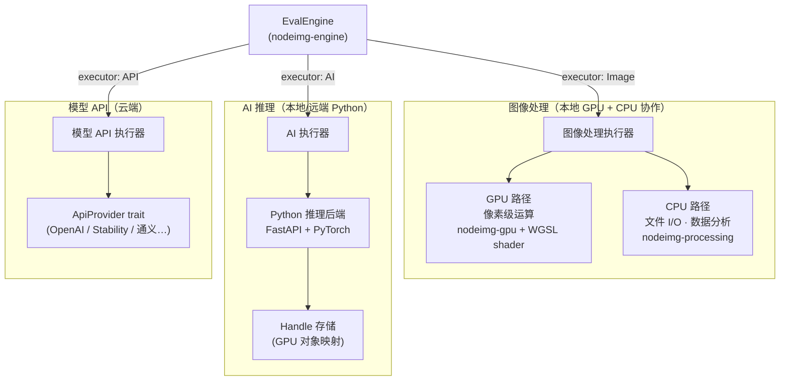
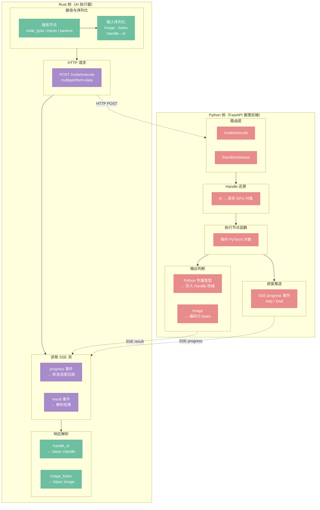
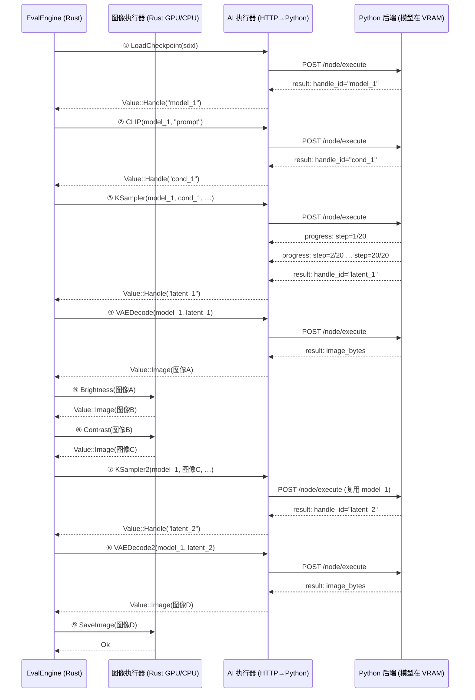

# 三路执行器

> 图像处理、AI 推理、模型 API 三路执行器的详细设计

## 总览

`EvalEngine` 在拿到一个节点后，根据 `NodeDef.executor` 字段判断走哪条执行路径：

- `ExecutorType::Image`（缺省）→ **图像处理执行器**（本地 GPU + CPU 协作，按节点职责分派）
- `ExecutorType::AI` → **AI 执行器**（HTTP → Python 推理后端）
- `ExecutorType::API` → **模型 API 执行器**（外部 REST API）



---

## 图像处理执行器

图像处理执行器在**同一进程内**运行，不产生任何网络调用。GPU 和 CPU 是协作关系，各有专长，按节点职责分派：

**GPU 路径（`gpu_process: Some`）— 像素级运算**

执行器从节点定义中取出 shader 源码（通过 `include_str!` 在编译期嵌入，跟随节点文件夹存放），提交给 `nodeimg-gpu` 运行时，按 `16×16` workgroup size 分发计算。所有像素级运算（亮度、对比度、模糊、混合等）走此路径。

**CPU 路径（`process: Some`）— 文件 I/O 与数据分析**

节点函数直接以 `&[u8]`（或 `image::DynamicImage`）为输入输出，调用 `nodeimg-processing` 中的算法。适用于 GPU 无法完成的操作：文件 I/O（`load_image`、`save_image`）、直方图计算、LUT 文件解析。

**分派规则：** 大多数节点只提供一条路径——像素运算只写 `gpu_process`，I/O 和分析只写 `process`。少数节点（如 `gaussian_blur`）同时提供两条路径，此时 GPU 优先，CPU 仅在 GPU 上下文不可用时（无兼容 GPU 或驱动问题）作为降级选项。

---

## AI 执行器

AI 执行器是 Rust 与 Python 后端之间的协议桥。两侧职责明确分离：



**Handle 存储**

Python 后端维护一张 `handle_id → GPU 对象` 的映射表。当节点返回的是 PyTorch Tensor、模型权重或 CLIP embedding 等 Python 专属类型时，后端将其存入映射表并返回一个不透明的 `handle_id`。Rust 侧将其包装为 `Value::Handle`，在后续节点中作为输入透传，无需跨进程传输大体积数据。

当 `EvalEngine` 的缓存失效时，它会调用 `/handles/release`，按 `handle_id` 列表批量释放 Python 侧的 GPU 内存，避免 VRAM 泄漏。

**进度反馈**

`POST /node/execute` 返回 SSE 流：

- 非迭代节点直接推送一条 `result` 事件后关闭流。
- 迭代节点（如 `KSampler`）每步推送一条 `progress` 事件（字段：`step`、`total`），最后推送 `result` 事件。Rust 侧将 `progress` 事件转发给 UI 层的进度回调，实现实时进度展示。

---

## 混合图执行示例

下面是一个 AI 推理与图像处理节点交替执行的典型场景，展示了 `EvalEngine` 的逐节点分发策略：



**为什么选择逐节点分发而非子图委托？**

子图委托方案（将连续 AI 节点批量发送给 Python 执行）看似减少了 HTTP 往返次数，但带来了更高的复杂度：

1. **Handle 跨边界传递变复杂**：当图像处理节点的输出（`Value::Image`）作为 AI 节点的输入时，子图边界难以静态划分，必须在运行时动态切割，逻辑复杂。
2. **缓存粒度变粗**：`EvalEngine` 的缓存以节点为粒度。子图委托后，局部节点失效会导致整个子图重新执行，丧失细粒度缓存的优势。
3. **步骤⑦展示了 Handle 复用的关键优势**：`model_1` 在 Python VRAM 中始终存在，第二次 `KSampler` 调用直接透传 `handle_id`，无需重新加载模型，延迟极低。逐节点分发天然支持这种跨越中间图像处理步骤的 Handle 复用。

---

## 模型 API 执行器（新增）

模型 API 执行器针对云端大厂推理 API（如 OpenAI、Stability AI、通义千问）设计，与 AI 执行器的核心差异在于无状态：每次调用都是独立的 HTTP 请求，不存在跨调用共享的 Handle。

| | AI 执行器 | 模型 API 执行器 |
|---|----------|----------------|
| 目标 | 自部署 Python 推理后端 | 云端大厂 API（OpenAI、Stability、通义） |
| 调用模式 | 逐节点调用，Handle 共享模型 | 一次调用完成整个生成 |
| 节点粒度 | 模块化拆分（LoadCheckpoint / KSampler / VAEDecode 分离） | 单节点封装整个 API 调用 |
| 中间状态 | Handle 在 Python VRAM，跨节点复用 | 无中间状态，无状态调用 |
| 额外关注 | SSE 进度、Handle 生命周期管理 | ��证、计费、速率限制、重试 |

**统一 `ApiProvider` trait（决策 D11）**

不同云端 API 在认证方式、请求格式和错误码上差异显著。通过统一 trait 隔离变化点，节点实现只面向 trait，不感知具体厂商：

```rust
trait ApiProvider {
    fn authenticate(&self, config: &ProviderConfig) -> Result<Client>;
    fn execute(&self, node_type: &str, inputs: &Inputs, params: &Params) -> Result<Value>;
    fn rate_limit_status(&self) -> RateLimitInfo;
}
```

每个厂商实现一个结构体（如 `OpenAiProvider`、`StabilityProvider`），在启动时根据配置注入到对应节点。`rate_limit_status()` 供 `EvalEngine` 在调度时决策是否需要退避等待，避免因速率超限产生无效请求。
