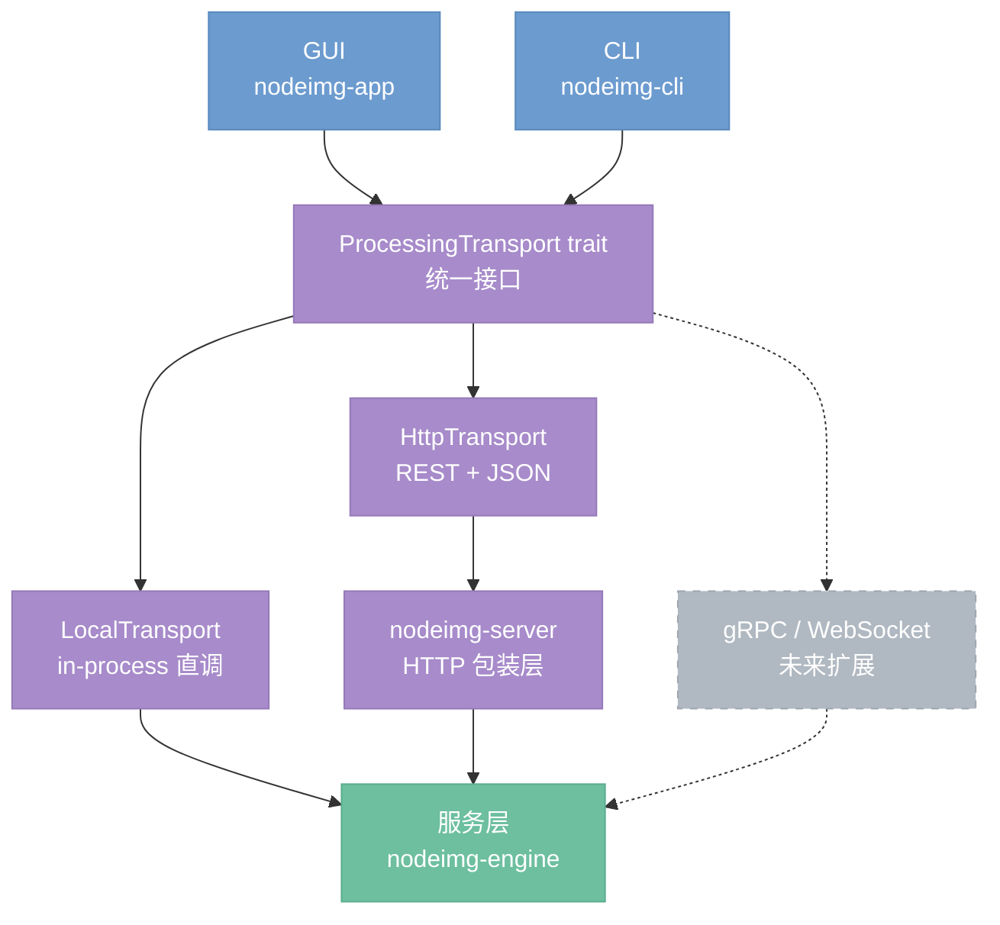
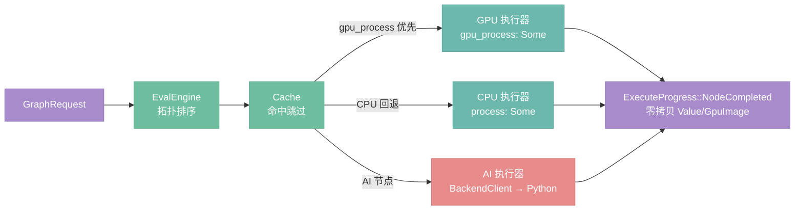
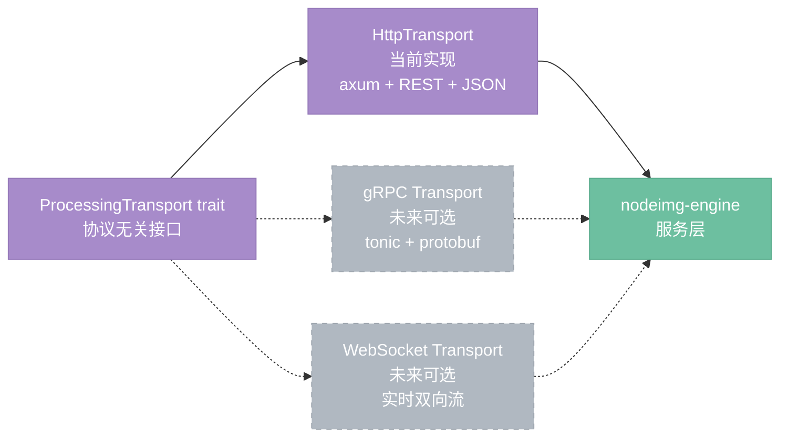

# Transport 与 Server 接口

定位：`ProcessingTransport` trait 实现协议透明性，前端只看到统一接口，不感知底层是本地直调还是远端 HTTP。`nodeimg-server` 定义远端通信契约，是 HTTP 协议的一个可替换实现。

---

## 总览



> 前端只持有 `Arc<dyn ProcessingTransport>`，协议层可随时替换。`HttpTransport` 经由 `nodeimg-server` 转发到服务层；`LocalTransport` 进程内直调，零网络开销。

---

## 1. Transport trait — 统一接口，协议可替换

`ProcessingTransport` 是前端与执行层之间的唯一边界。所有方法要求 `&self`，内部可变性由实现侧（`Mutex`）管理。

```rust
pub trait ProcessingTransport: Send + Sync + 'static {
    // 交互服务 — 始终低延迟，本地或远端均可同步调用
    fn node_types(&self) -> Result<Vec<NodeTypeDef>, String>;
    fn generate_menu(&self) -> Vec<MenuCategory>;
    fn load_graph(&self, json: &str) -> Result<SerializedGraph, String>;
    fn is_compatible(&self, from_type: &str, to_type: &str) -> bool;

    // 计算服务 — 执行节点图，逐节点推送进度
    fn execute(&self, request: &GraphRequest, progress: Sender<ExecuteProgress>) -> Result<(), String>;
    fn invalidate(&self, node_id: NodeId);
    fn invalidate_all(&self);
    fn get_cached(&self, node_id: NodeId) -> Option<HashMap<String, Value>>;

    // 辅助
    fn health_check(&self) -> Result<HealthResponse, String>;
    fn would_create_cycle(&self, target: NodeId, connections: &[ConnectionRequest]) -> bool;
}
```

**设计原则：**

- trait 方法均同步。调度异步属于 app 侧 `ExecutionManager` 的职责，transport 不引入 async runtime。
- `execute()` 通过 `Sender<ExecuteProgress>` 推送逐节点结果，实现流式反馈而非等待全图完成。
- `health_check()` / `node_types()` 启动时调用一次；`invalidate()` 在参数变更时同步调用。

---

## 2. LocalTransport — in-process 直调，零拷贝

`LocalTransport` 是默认实现，将 engine 内部的 `NodeRegistry`、`EvalEngine`、`Cache`、`BackendClient` 包装在 `Mutex` 后面，暴露统一接口。

```rust
pub struct LocalTransport {
    registry: Mutex<NodeRegistry>,
    type_registry: Mutex<DataTypeRegistry>,
    category_registry: CategoryRegistry,
    cache: Mutex<Cache>,
    gpu_ctx: Option<Arc<GpuContext>>,
    backend: Option<BackendClient>,
}
```

**执行路径：**



**关键特性：**

- 结果通过 `Value::GpuImage(Arc<GpuTexture>)` 传递，不发生 GPU→CPU 回读，除非下游节点是 CPU 节点。
- `ExecuteProgress::NodeCompleted` 携带 `HashMap<String, Value>`，前端在 `ExecutionManager::poll()` 中非阻塞消费。
- 本地模式结果枚举变体为 `ResultEnvelope::Local`，远端模式为 `ResultEnvelope::Remote`（含序列化字节），前端根据变体决定是否需要反序列化。

---

## 3. nodeimg-server 抽象接口（决策 D10）

`nodeimg-server` 是一个库 crate，对外暴露两组服务接口。CLI 内嵌该库（`nodeimg-cli` 依赖 `nodeimg-server`），无需独立进程。

**D10 决策：交互服务始终本地，计算服务协议可替换。**

### 交互服务（4 个，前端直接同步调用）

| 端点 | 方法 | 说明 |
|------|------|------|
| `/node_types` | GET | 返回所有已注册节点的 `Vec<NodeTypeDef>` |
| `/menu` | GET | 返回分类菜单 `Vec<MenuCategory>` |
| `/serialize` | POST | `SerializedGraph` → JSON 字节 |
| `/deserialize` | POST | JSON 字节 → `SerializedGraph`（填充缺失参数默认值） |

交互服务响应时间 < 10ms，不涉及图像数据，始终走同步路径。

### 计算服务（5 个，支持异步流式）

| 端点 | 方法 | 请求 | 响应 |
|------|------|------|------|
| `/execute` | POST | `GraphRequest` | `TaskId` |
| `/poll/{task_id}` | GET | — | `Stream<ProgressEvent>` (SSE) |
| `/cancel/{task_id}` | DELETE | — | `()` |
| `/upload` | POST | 文件字节 | `FileId` |
| `/download/{file_id}` | GET | — | `Bytes` |

`HttpTransport` 调用 `/execute` 后得到 `TaskId`，随即通过 `/poll` SSE 流接收 `ProgressEvent`，逐节点推送给 app 侧 `ExecutionManager`，行为与 `LocalTransport` 对齐。

### 核心数据类型（Rust 结构体）

```rust
/// 异步任务句柄，由 /execute 返回
pub struct TaskId(pub u64);

/// 进度事件，通过 /poll SSE 流推送
pub enum ProgressEvent {
    /// 单个节点完成
    NodeCompleted { node_id: u64, outputs_file_id: FileId },
    /// 全图执行完成
    Finished,
    /// 执行出错
    Error { node_id: Option<u64>, message: String },
    /// 心跳（保持连接）
    Heartbeat,
    /// 取消确认
    Cancelled,
}

/// 上传文件的引用句柄
pub struct FileId(pub String);
```

`ProgressEvent::NodeCompleted` 不直接携带图像数据，而是携带 `FileId`，前端按需调用 `/download/{file_id}` 获取字节。本地模式无需此步骤。

---

## 4. 协议无关性 — 不绑 HTTP，axum 是一个实现

`nodeimg-server` 的服务接口定义为 Rust trait，axum 是当前的一个实现选项，未来可替换为 gRPC、WebSocket 或其他协议，而无需修改前端代码。



**替换协议的影响范围：**

- 前端（`nodeimg-app`、`nodeimg-cli`）：零修改，只持有 `Arc<dyn ProcessingTransport>`。
- `nodeimg-engine`：零修改，服务层不感知传输层。
- 只需新增一个 Transport 实现 crate，对齐 trait 方法签名即可。

**当前状态：** `nodeimg-server` 为空壳（见 Issue #12），`HttpTransport` 尚未实现。现阶段所有场景均走 `LocalTransport`，架构已就位，待 server 实现后无缝切换。
