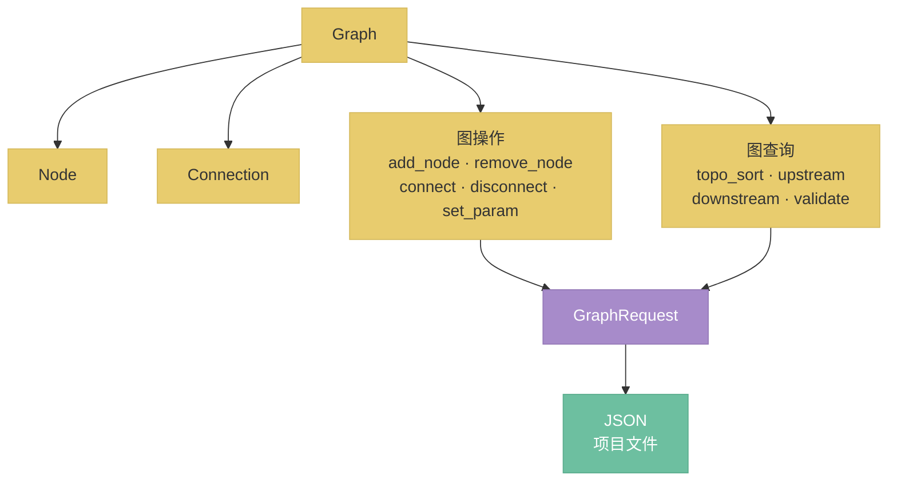

# nodeimg-graph 数据模型

节点图的数据结构和操作 API，nodeimg-graph crate 的完整设计。

## 总览



---

## 1. 与 nodeimg-types 的边界（决策 D22）

**结论：** Node 定义在 nodeimg-graph��nodeimg-types 只保留原子类型。

| 属于 nodeimg-types | 属于 nodeimg-graph |
|--------------------|--------------------|
| `NodeId`（`type NodeId = Uuid`） | `Node`（完整节点结构体） |
| `Position`（`struct Position { x: f32, y: f32 }`） | `Connection`（连接关系） |
| `Value`（枚举，图像/���点/整数/字符串/布尔） | `Graph`（容器和操作集合） |
| `DataType`、`Constraint` | 所有图操作和图查询方法 |

理由：nodeimg-types 是无依赖的原子层，被 gpu、processing、engine 等多个 crate 共用；把 Node 放进 types 会使 types 承载业务语义，破坏分层。nodeimg-graph 依赖 types，engine / app / cli 依赖 graph。

---

## 2. 数据类型体系

nodeimg-types 定义两组核心类型枚举：`Value`（运行时数据值）和 `DataType`（编译期类型标识）。

### Value 枚举

`Value` 是节点引脚之间传递的运行时数据，分为三类：

```rust
pub enum Value {
    // ── Rust 可理解类型（可序列化、可缓存、可直接操作）──
    Image(DynamicImage),        // 像素图像（RGBA）
    GpuImage(Arc<GpuTexture>),  // GPU 纹理（仅本地模式，不可序列化）
    Mask(DynamicImage),         // 单通道蒙版
    Float(f64),
    Int(i64),
    String(String),
    Bool(bool),
    Color([f32; 4]),            // RGBA 浮点色值

    // ── Python 专属类型（通过 Handle 引用，不含实际数据）──
    Handle { id: String, data_type: DataTypeId },
}
```

**Handle 说明：** AI 节点的输出（Model、Conditioning、Latent 等）驻留在 Python 进程的 GPU 内存中，Rust 端只持有不透明的 string ID。Handle 的创建、引用、释放遵循 `15-python-backend-protocol.md` 定义的协议。

### DataTypeId 与 Python 专属类型

`DataTypeId` 是类型的字符串标识符，用于引脚定义和连接兼容性检查：

| DataTypeId | 说明 | Value 表示 | 存在位置 |
|------------|------|-----------|---------|
| `image` | 像素图像 | `Value::Image` / `Value::GpuImage` | Rust 内存 / GPU |
| `mask` | 单通道蒙版 | `Value::Mask` | Rust 内存 / GPU |
| `float` | 浮点数 | `Value::Float` | Rust |
| `int` | 整数 | `Value::Int` | Rust |
| `string` | 字符串 | `Value::String` | Rust |
| `bool` | 布尔值 | `Value::Bool` | Rust |
| `color` | RGBA 颜色 | `Value::Color` | Rust |
| `model` | Diffusion 模型（UNet/DiT） | `Value::Handle` | Python VRAM |
| `clip` | 文本编码器模型 | `Value::Handle` | Python VRAM |
| `vae` | VAE 编解码模型 | `Value::Handle` | Python VRAM |
| `conditioning` | 条件化信息（embedding + metadata） | `Value::Handle` | Python VRAM |
| `latent` | 潜空间张量 | `Value::Handle` | Python VRAM |
| `control_net` | ControlNet 模型 | `Value::Handle` | Python VRAM |
| `clip_vision` | CLIP Vision 模型 | `Value::Handle` | Python VRAM |
| `clip_vision_output` | CLIP Vision 编码输出 | `Value::Handle` | Python VRAM |
| `style_model` | Style/IP-Adapter 模型 | `Value::Handle` | Python VRAM |
| `upscale_model` | 超分辨率模型 | `Value::Handle` | Python VRAM |
| `sampler` | 采样算法对象 | `Value::Handle` | Python |
| `sigmas` | Sigma 调度序列 | `Value::Handle` | Python |
| `noise` | 噪声对象 | `Value::Handle` | Python |
| `guider` | 引导器对象 | `Value::Handle` | Python |

**类型兼容性规则：** 连接两个引脚时，`DataTypeId` 必须完全匹配。特殊例外：`image` 类型的输出可以连接到 `mask` 类型的输入（自动提取亮度通道），反之亦然。兼容性判断由 engine 层的 `DataTypeRegistry` 负责，graph 层不做类型检查（见本文档第 4 节）。

### Constraint 枚举

参��约束，用于校验和控件映射：

```rust
pub enum Constraint {
    Range { min: f64, max: f64 },            // 数值范围
    Enum(Vec<String>),                       // 枚举选项
    FilePath(Vec<String>),                   // 文件选择器，限定扩展名
    Multiline,                               // 多行文本输入
}
```

---

## 3. 核心数据结构

```rust
/// 整张节点图
pub struct Graph {
    pub nodes: HashMap<NodeId, Node>,
    pub connections: Vec<Connection>,
}

/// 节点实例
pub struct Node {
    pub id: NodeId,
    pub type_id: String,                    // 对应 NodeDef 的注册键
    pub params: HashMap<String, Value>,     // 当前参数值
    pub position: Position,                 // 画布坐标
}

/// 节点间的一条连接
pub struct Connection {
    pub from_node: NodeId,
    pub from_pin: String,   // 输出引脚名
    pub to_node: NodeId,
    pub to_pin: String,     // 输入引脚名
}
```

设计约束：
- `Graph` 不持有 `NodeDef`（节点元信息由 engine 层的 `NodeRegistry` 管理），graph crate 不依赖 engine。
- `params` 只存用户设置的值；默认值由 `NodeDef` 的参数定义提供，渲染时合并。
- 一个输入引脚只能有一个连入连接（在 `connect` 时强制检查）。

---

## 4. 图操作 API

```rust
impl Graph {
    /// 添加节点，返回分配的 NodeId
    pub fn add_node(&mut self, type_id: impl Into<String>, position: Position) -> NodeId;

    /// 删除节点，同时删除所有以该节点为端点的连接
    pub fn remove_node(&mut self, id: NodeId) -> Result<(), GraphError>;

    /// 建立连接；若目标引脚已有连接则先断开旧连接；
    /// 内部执行环检测，若新连接会导致环则返回 WouldCreateCycle
    pub fn connect(
        &mut self,
        from_node: NodeId, from_pin: impl Into<String>,
        to_node: NodeId,   to_pin:   impl Into<String>,
    ) -> Result<(), GraphError>;

    /// 断开指定连接
    pub fn disconnect(
        &mut self,
        from_node: NodeId, from_pin: &str,
        to_node: NodeId,   to_pin:   &str,
    ) -> Result<(), GraphError>;

    /// 修改节点参数
    pub fn set_param(
        &mut self,
        node_id: NodeId,
        key: impl Into<String>,
        value: Value,
    ) -> Result<(), GraphError>;
}
```

`GraphError` 枚举：

```rust
pub enum GraphError {
    NodeNotFound(NodeId),
    ConnectionNotFound,
    PinNotFound { node: NodeId, pin: String },
    WouldCreateCycle,
}
```

`remove_node` 的级联删除是有意为之：保持图始终处于一致状态，调用方无需手动清理孤立连接。

**环检测归属：** `connect()` 在插入新连接前执行从 `to_node` 到 `from_node` 的可达性检查（DFS），若可达则拒绝连接并返回 `WouldCreateCycle`。这属于 graph 层的结构正确性保障，与 engine 层的类型兼容性检查无关。`Transport.would_create_cycle()` 是供前端在连线拖拽时做预检查的快捷方法，底层调用同一逻辑。

---

## 5. 图查询 API

```rust
impl Graph {
    /// 拓扑排序；图中存在环时返回 CycleError
    pub fn topo_sort(&self) -> Result<Vec<NodeId>, CycleError>;

    /// 指定节点的所有直接上游节点（向该节点输出数据的节点）
    pub fn upstream(&self, node_id: NodeId) -> Vec<NodeId>;

    /// 指定节点的所有直接下游节点（接收该节点输出的节点）
    pub fn downstream(&self, node_id: NodeId) -> Vec<NodeId>;

    /// 结构完整性检查（不检查类型兼容性，类型检查由 engine 层负责）
    pub fn validate(&self) -> Vec<ValidationError>;
}

pub struct CycleError {
    pub cycle: Vec<NodeId>,   // 构成环的节点序列
}

pub enum ValidationError {
    DuplicateConnection { to_node: NodeId, to_pin: String },
    SelfLoop { node: NodeId },
}
```

类型兼容性（DataType 匹配、Constraint 检查）不在 graph 层验证，由 engine 层的 `GraphController` 在 `connect` 前调用 `NodeRegistry` 完成。graph 层只做结构检查（环检测、单输入、自环、节点/引脚存在性）。

---

## 6. 序列化

graph crate 提供 `to_json` / `from_json`，项目文件格式包含 `version` 字段用于向后兼容迁移。

```rust
impl Graph {
    pub fn to_json(&self) -> serde_json::Value;
    pub fn from_json(json: &serde_json::Value) -> Result<Self, DeserializeError>;
}
```

项目文件顶层结构：

```json
{
    "version": 1,
    "graph": {
        "nodes": { "<uuid>": { "type_id": "brightness", "params": { "exposure": 0.5 }, "position": { "x": 120.0, "y": 80.0 } } },
        "connections": [
            { "from_node": "<uuid>", "from_pin": "output", "to_node": "<uuid>", "to_pin": "input" }
        ]
    }
}
```

`version` 字段由 app 层的 `ProjectManager` 负责读取和迁移，graph 的 `from_json` 只解析当前版本格式。迁移逻辑（版本 N → N+1）集中在 app 层，不散落在 graph crate 内部。
