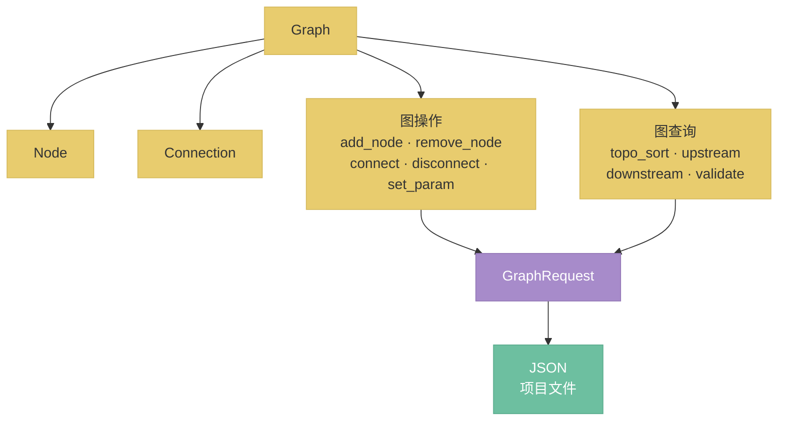

# nodeimg-graph 数据模型

节点图的数据结构和操作 API，nodeimg-graph crate 的完整设计。

## 总览



---

## 1. 与 nodeimg-types 的边界（决策 D22）

**结论：** Node 定义在 nodeimg-graph��nodeimg-types 只保留原子类型。

| 属于 nodeimg-types | 属于 nodeimg-graph |
|--------------------|--------------------|
| `NodeId`（`type NodeId = Uuid`） | `Node`（完整节点结构体） |
| `Position`（`struct Position { x: f32, y: f32 }`） | `Connection`（连接关系） |
| `Value`（枚举，图像/���点/整数/字符串/布尔） | `Graph`（容器和操作集合） |
| `DataType`、`Constraint` | 所有图操作和图查询方法 |

理由：nodeimg-types 是无依赖的原子层，被 gpu、processing、engine 等多个 crate 共用；把 Node 放进 types 会使 types 承载业务语义，破坏分层。nodeimg-graph 依赖 types，engine / app / cli 依赖 graph。

---

## 2. 核心数据结构

```rust
/// 整张节点图
pub struct Graph {
    pub nodes: HashMap<NodeId, Node>,
    pub connections: Vec<Connection>,
}

/// 节点实例
pub struct Node {
    pub id: NodeId,
    pub type_id: String,                    // 对应 NodeDef 的注册键
    pub params: HashMap<String, Value>,     // 当前参数值
    pub position: Position,                 // 画布坐标
}

/// 节点间的一条连接
pub struct Connection {
    pub from_node: NodeId,
    pub from_pin: String,   // 输出引脚名
    pub to_node: NodeId,
    pub to_pin: String,     // 输入引脚名
}
```

设计约束：
- `Graph` 不持有 `NodeDef`（节点元信息由 engine 层的 `NodeRegistry` 管理），graph crate 不依赖 engine。
- `params` 只存用户设置的值；默认值由 `NodeDef` 的参数定义提供，渲染时合并。
- 一个输入引脚只能有一个连入连接（在 `connect` 时强制检查）。

---

## 3. 图操作 API

```rust
impl Graph {
    /// 添加节点，返回分配的 NodeId
    pub fn add_node(&mut self, type_id: impl Into<String>, position: Position) -> NodeId;

    /// 删除节点，同时删除所有以该节点为端点的连接
    pub fn remove_node(&mut self, id: NodeId) -> Result<(), GraphError>;

    /// 建立连接；若目标引脚已有连接则先断开旧连接
    pub fn connect(
        &mut self,
        from_node: NodeId, from_pin: impl Into<String>,
        to_node: NodeId,   to_pin:   impl Into<String>,
    ) -> Result<(), GraphError>;

    /// 断开指定连接
    pub fn disconnect(
        &mut self,
        from_node: NodeId, from_pin: &str,
        to_node: NodeId,   to_pin:   &str,
    ) -> Result<(), GraphError>;

    /// 修改节点参数
    pub fn set_param(
        &mut self,
        node_id: NodeId,
        key: impl Into<String>,
        value: Value,
    ) -> Result<(), GraphError>;
}
```

`GraphError` 枚举：

```rust
pub enum GraphError {
    NodeNotFound(NodeId),
    ConnectionNotFound,
    PinNotFound { node: NodeId, pin: String },
    WouldCreateCycle,
}
```

`remove_node` 的级联删除是有意为之：保持图始终处于一致状态，调用方无需手动清理孤立连接。

---

## 4. 图查询 API

```rust
impl Graph {
    /// 拓扑排序；图中存在环时返回 CycleError
    pub fn topo_sort(&self) -> Result<Vec<NodeId>, CycleError>;

    /// 指定节点的所有直接上游节点（向该节点输出数据的节点）
    pub fn upstream(&self, node_id: NodeId) -> Vec<NodeId>;

    /// 指定节点的所有直接下游节点（接收该节点输出的节点）
    pub fn downstream(&self, node_id: NodeId) -> Vec<NodeId>;

    /// 结构完整性检查（不检查类型兼容性，类型检查由 engine 层负责）
    pub fn validate(&self) -> Vec<ValidationError>;
}

pub struct CycleError {
    pub cycle: Vec<NodeId>,   // 构成环的节点序列
}

pub enum ValidationError {
    DuplicateConnection { to_node: NodeId, to_pin: String },
    SelfLoop { node: NodeId },
}
```

类型兼容性（DataType 匹配、Constraint 检查）不在 graph 层验证，由 engine 层的 `GraphController` 在 `connect` 前调用 `NodeRegistry` 完成。graph 层只做结构检查。

---

## 5. 序列化

graph crate 提供 `to_json` / `from_json`，项目文件格式包含 `version` 字段用于向后兼容迁移。

```rust
impl Graph {
    pub fn to_json(&self) -> serde_json::Value;
    pub fn from_json(json: &serde_json::Value) -> Result<Self, DeserializeError>;
}
```

项目文件顶层结构：

```json
{
    "version": 1,
    "graph": {
        "nodes": { "<uuid>": { "type_id": "brightness", "params": { "exposure": 0.5 }, "position": { "x": 120.0, "y": 80.0 } } },
        "connections": [
            { "from_node": "<uuid>", "from_pin": "output", "to_node": "<uuid>", "to_pin": "input" }
        ]
    }
}
```

`version` 字段由 app 层的 `ProjectManager` 负责读取和迁移，graph 的 `from_json` 只解析当前版本格式。迁移逻辑（版本 N → N+1）集中在 app 层，不散落在 graph crate 内部。
