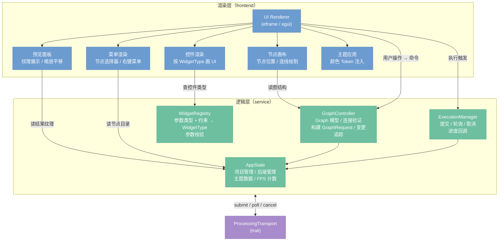
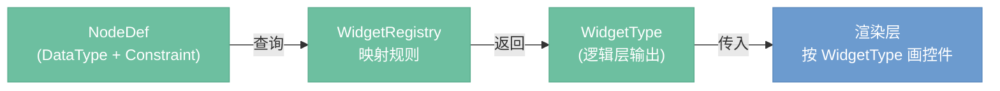
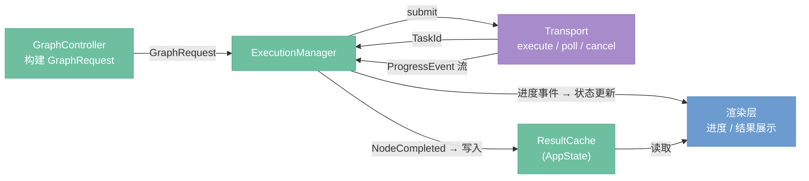
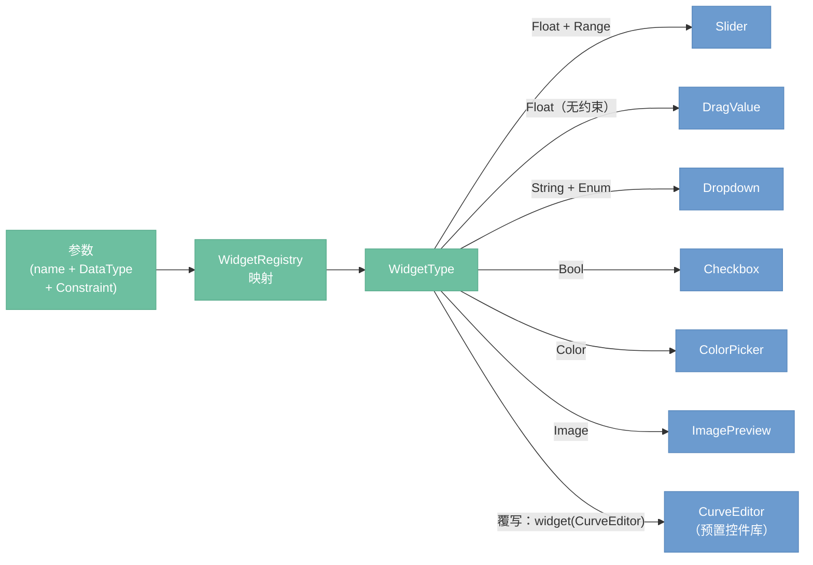

# App 层

> App 层的逻辑/渲染分离架构，框架无关的核心逻辑设计

## 总览

`nodeimg-app` 在内部分为两层：**逻辑层**持有所有状态和业务规则，**渲染层**仅负责把状态画到屏幕上。两层之间没有循环依赖——渲染层读取逻辑层的状态，通过事件/命令把用户操作反馈给逻辑层；逻辑层不引用任何 UI 框架类型。



逻辑层通过 `ProcessingTransport` trait 与服务层通信，不感知底层是 `LocalTransport` 还是 `HttpTransport`。

---

## 逻辑层/渲染层分离

**设计意图：** 渲染层与 `eframe/egui` 强耦合，逻辑层不引用任何框架类型。当 UI 框架迁移（如切换到 Web 前端或原生 UI 工具包）时，逻辑层可以整体复用，只需为新框架重新实现渲染层。

**分离边界：**

| 职责 | 归属 |
|------|------|
| 图状态、节点参数、项目文件 | 逻辑层 |
| 连接合法性验证 | 逻辑层（GraphController） |
| 控件类型映射 | 逻辑层（WidgetRegistry） |
| 参数校验（范围、枚举合法性） | 逻辑层（WidgetRegistry） |
| 将状态画成像素 | 渲染层 |
| 框架事件处理（鼠标/键盘） | 渲染层 |
| 主题颜色的实际注入 | 渲染层（ThemeApply） |

**通信方式：** 渲染层不直接修改逻辑层状态——用户操作通过命令对象（`AppCommand` 枚举）传入逻辑层，逻辑层统一处理后更新状态，渲染层在下一帧读取新状态。这与 Elm/Redux 的单向数据流类似，便于调试和回放。

---

## WidgetRegistry 归属（决策 D20）

`WidgetRegistry` 属于**逻辑层**，不属于渲染层。

**原因：** 控件类型的选择依赖对数据类型和约束的理解（例如：`Float + Range` 约束应映射为滑块，`Enum` 应映射为下拉框）。这是业务规则，不是渲染细节。若放入渲染层，每次框架迁移都需要重新实现控件映射逻辑，且无法独立测试。

**分工说明：**

- `nodeimg-engine`（服务层）：通过 `NodeDef` 提供每个参数的 `DataType` 和 `Constraint`。
- `WidgetRegistry`（逻辑层）：根据 `DataType + Constraint` 的组合，映射为 `WidgetType` 枚举值。
- 渲染层：只接收 `WidgetType`，不做类型判断，直接调用对应的 egui 绘制函数。



**映射示例：**

| DataType | Constraint | WidgetType |
|----------|-----------|------------|
| `Float` | `Range(min, max)` | `Slider` |
| `Float` | 无 | `DragValue` |
| `Int` | `Range(min, max)` | `SliderInt` |
| `String` | `Enum(variants)` | `Dropdown` |
| `Bool` | — | `Checkbox` |
| `Color` | — | `ColorPicker` |
| `Image` | — | `ImagePreview` |

---

## ExecutionManager 工作机制（决策 D23）

`ExecutionManager` 负责管理图执行的全生命周期：提交、进度追踪、取消、结果收割。

**提交流程：**

1. `GraphController` 将当前图构建为 `GraphRequest`（序列化的节点图结构）。
2. `ExecutionManager` 调用 `Transport.execute(graph_request)`，通过 channel 接收 `TaskId`。
3. `TaskId` 存入 `AppState.pending_task`，UI 展示执行中状态。

**进度事件推送：**

`Transport.poll(task_id)` 以流的形式推送 `ProgressEvent`：

| 事件 | 含义 |
|------|------|
| `NodeStarted { node_id }` | 某节点开始执行，UI 高亮该节点 |
| `NodeCompleted { node_id, result }` | 某节点执行完毕，结果写入 `ResultCache` |
| `NodeFailed { node_id, error }` | 某节点执行失败，UI 展示错误标记 |
| `Progress { node_id, step, total }` | AI 节点迭代进度（来自 SSE 转发） |

**取消机制：** `ExecutionManager` 持有当前任务的 `CancelToken`（内部为 `AtomicBool`）。调用 `cancel()` 设置标志位；执行线程在每个节点间隙检查标志，提前退出。取消后 `AppState.pending_task` 清空，UI 恢复空闲状态。

**结果存放：** 所有 `NodeCompleted` 事件携带的结果由 `ExecutionManager` 写入 `ResultCache`（`AppState` 持有引用）。渲染层在下一帧从 `ResultCache` 读取预览数据，通过 `TextureCache` 转为 GPU 纹理展示。



---

## 节点渲染器

节点渲染器负责把单个节点的 `NodeDef`（参数列表）画成可交互的控件组。控件类型由 `WidgetRegistry` 决策，渲染层执行绘制。

**参数类型到控件的映射流程：**



**控件覆写机制（决策 D24）：**

`node!` 宏允许节点定义时显式指定某个参数的控件类型，覆盖 `WidgetRegistry` 的默认映射：

```rust
node! {
    name: "ColorGrade",
    params: [
        param!("curve", DataType::Float, widget: CurveEditor),
        param!("strength", DataType::Float, Constraint::Range(0.0, 1.0)),
    ],
    ...
}
```

`widget: CurveEditor` 直接绑定到预置控件库中的 `CurveEditor` 组件，渲染层无需经过 `WidgetRegistry` 查表。不指定 `widget` 的参数走默认映射路径。

**`widget.rs` 的废除（决策 D24）：** 原有的 `widget.rs` 将所有控件逻辑集中在一个文件中，导致增加新控件时需要修改中心文件，且控件与参数类型之间的关联隐式存在。新方案中，控件选择要么由 `WidgetRegistry` 的映射表决定（数据驱动，可测试），要么在 `node!` 宏中显式声明（局部可见，零隐式依赖）。`widget.rs` 不再承担控件路由职责。
