# App 层

> App 层的逻辑/渲染分离架构，框架无关的核心逻辑设计

## 总览

`nodeimg-app` 在内部分为两层：**逻辑层**持有所有状态和业务规则，**渲染层**仅负责把状态画到屏幕上。两层之间没有循环依赖——渲染层读取逻辑层的状态，通过事件/命令把用户操作反馈给逻辑层；逻辑层不引用任何 UI 框架类型。

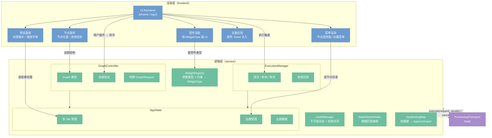

逻辑层通过 `ProcessingTransport` trait 与服务层通信，不感知底层是 `LocalTransport` 还是 `HttpTransport`。

---

## 启动与关闭

### 启动序列

GUI 和 CLI 共享核心初始化流程（步骤 1–7），仅末尾入口不同。

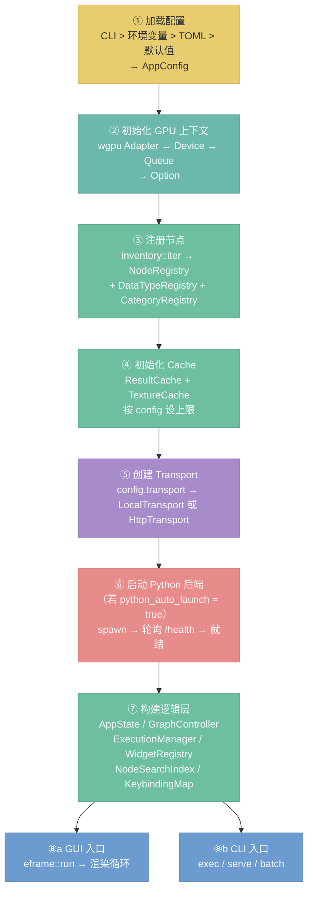

**关键说明：**

- **步骤②** GPU 初始化可能失败（无兼容 GPU 或驱动问题），此时 `GpuContext` 为 `None`，所有 GPU 节点回退到 CPU 路径。App 正常启动，不阻塞。
- **步骤⑥** Python 后端是可选依赖。启动失败或超时（30 秒）后 App 仍正常运行，AI 节点灰显不可用，图像处理节点不受影响。详见 `15-python-backend-protocol.md`。
- **步骤⑤→⑥ 顺序依赖**：`LocalTransport` 需要持有 `BackendClient`（AI 执行器的 HTTP 客户端），因此 Transport 创建在 Python 启动之前，但 `BackendClient` 的连接验证在 Python 就绪后才完成。

### 关闭序列

```
App 退出
  │
  ├─ ① 取消所有正在执行的任务（设置 CancelToken）
  ├─ ② 等待后台执行线程退出
  ├─ ③ 关闭 Python 后端
  │     ├─ SIGTERM
  │     ├─ 等待 5 秒
  │     └─ 未退出 → SIGKILL
  ├─ ④ 释放 GPU 资源（GpuContext drop）
  └─ ⑤ 退出进程
```

未保存的项目在渲染层关闭窗口时拦截（`eframe` 的 `on_close_event`），弹出保存确认对话框，不在关闭序列中处理。

---

## 逻辑层/渲染层分离

**设计意图：** 渲染层与 `eframe/egui` 强耦合，逻辑层不引用任何框架类型。当 UI 框架迁移（如切换到 Web 前端或原生 UI 工具包）时，逻辑层可以整体复用，只需为新框架重新实现渲染层。

**分离边界：**

| 职责 | 归属 |
|------|------|
| 图状态、节点参数、项目文件 | 逻辑层 |
| 连接合法性验证 | 逻辑层（GraphController） |
| 控件类型映射 | 逻辑层（WidgetRegistry） |
| 参数校验（范围、枚举合法性） | 逻辑层（WidgetRegistry） |
| 将状态画成像素 | 渲染层 |
| 框架事件处理（鼠标/键盘） | 渲染层 |
| 主题颜色的实际注入 | 渲染层（ThemeApply） |

**通信方式：** 渲染层不直接修改逻辑层状态——用户操作通过命令对象（`AppCommand` 枚举）传入逻辑层，逻辑层统一处理后更新状态，渲染层在下一帧读取新状态。这与 Elm/Redux 的单向数据流类似，便于调试和回放。

---

## 主题系统（决策 D36）

主题通过 `Theme` trait 定义语义化颜色接口，具体配色由 `DarkTheme` / `LightTheme` 实现。逻辑层持有 `Arc<dyn Theme>`，渲染层每帧调用 trait 方法取色，不硬编码任何颜色值。

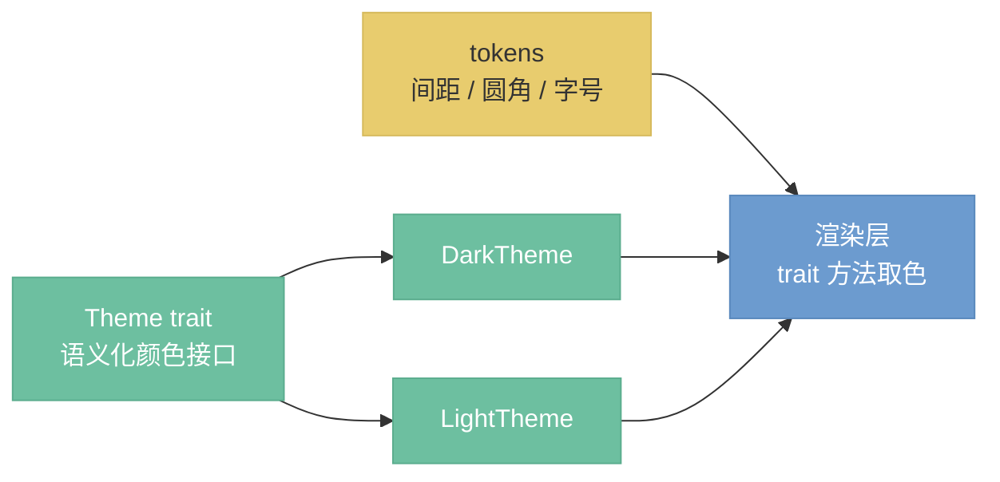

### Theme trait

```rust
pub trait Theme: Send + Sync {
    // ── 全局 ──
    fn canvas_bg(&self) -> Color32;           // 画布背景
    fn panel_bg(&self) -> Color32;            // 侧边面板背景
    fn panel_separator(&self) -> Color32;     // 面板分割线
    fn accent(&self) -> Color32;              // 强调色（选中、焦点）
    fn accent_hover(&self) -> Color32;        // 强调色悬停态

    // ── 文字 ──
    fn text_primary(&self) -> Color32;        // 主文字
    fn text_secondary(&self) -> Color32;      // 次要文字（标签、提示）

    // ── 节点 ──
    fn node_body_fill(&self) -> Color32;      // 节点体背景
    fn node_body_stroke(&self) -> Stroke;     // 节点体边框
    fn node_shadow(&self) -> Shadow;          // 节点投影
    fn node_header_text(&self) -> Color32;    // 节点标题文字
    fn category_color(&self, cat_id: &str) -> Color32;  // 节点头部按分类着色
    fn pin_color(&self, data_type: &str) -> Color32;    // 引脚按数据类型着色

    // ── 控件 ──
    fn widget_bg(&self) -> Color32;           // 控件背景
    fn widget_hover_bg(&self) -> Color32;     // 控件悬停背景
    fn widget_active_bg(&self) -> Color32;    // 控件激活背景

    // ── 框架注入 ──
    fn apply(&self, ctx: &egui::Context);     // 注入 egui 全局视觉样式
    fn node_header_frame(&self, cat_id: &str) -> Frame;  // 节点头部 Frame
    fn node_body_frame(&self) -> Frame;       // 节点体 Frame
}
```

### 语义化颜色映射

**节点头部颜色**——按分类（`CategoryId`）区分，用户一眼识别节点类型：

| 分类 | 色调 | 用途 |
|------|------|------|
| data | 蓝 | 文件 I/O（LoadImage、SaveImage） |
| generate | 紫 | 图像生成（纯色、渐变、噪声） |
| color | 橙 | 调色（亮度、曲线、色��） |
| transform | 绿 | 变换（缩放、裁剪、旋转） |
| filter | 粉 | 滤镜（模糊、锐化、降噪） |
| composite | 金 | 合成（混合、蒙版） |
| tool | 灰 | 工具（预览、直方图） |
| ai | 紫红 | AI 节点（采样、模型加载） |

**引脚颜色**——按数据类型（`DataTypeId`）区分，用户通过颜色匹配判断连线兼容性：

| 数据类型 | 色调 | 说明 |
|---------|------|------|
| image | 蓝 | 像素图像 |
| mask | 青绿 | 蒙版 |
| float | 橙 | 浮点数 |
| int | 青 | 整数 |
| string | 灰 | 字符串 |
| color | 紫 | 颜色 |
| boolean | 红 | 布尔 |
| model | 亮紫 | Diffusion 模型（Handle） |
| clip | 金 | CLIP 模型（Handle） |
| vae | 红 | VAE 模型（Handle） |
| conditioning | 淡紫 | 条件化信息（Handle） |
| latent | 粉 | 潜空间张量（Handle） |

### Design Tokens

布局常量独立于颜色，定义在 `tokens` 模块中，Dark/Light 主题共用：

| Token | 值 | 用途 |
|-------|---|------|
| 节点圆角 | 6px | 节点体和头部的圆角半径 |
| 节点最小宽度 | 180px | 节点在画布上的最小宽度 |
| 引脚半径 | 5px | 输入/输出引脚圆点的半径 |
| 面板内边距 | 8px | 侧边面板的内边距 |
| 控件间距 | 4px | 节点内参数控件之间的垂直间距 |

### 归属与切换

- `Arc<dyn Theme>` 由 `AppState`（逻辑层）持有，渲染层通过引用访问
- 切换主题通过 `AppCommand::ToggleTheme` 触发，替换 `Arc` 引用，下一帧全局生效
- 新增主题只需实现 `Theme` trait，不修改渲染层代码

---

## WidgetRegistry 归属（决策 D20）

`WidgetRegistry` 属于**逻辑层**，不属于渲染层。

**原因：** 控件类型的选择依赖对数据类型和约束的理解（例如：`Float + Range` 约束应映射为滑块，`Enum` 应映射为下拉框）。这是业务规则，不是渲染细节。若放入渲染层，每次框架迁移都需要重新实现控件映射逻辑，且无法独立测试。

**分工说明：**

- `nodeimg-engine`（服务层）：通过 `NodeDef` 提供每个参数的 `DataType` 和 `Constraint`。
- `WidgetRegistry`（逻辑层）：根据 `DataType + Constraint` 的组合，映射为 `WidgetType` 枚举值。
- 渲染层：只接收 `WidgetType`，不做类型判断，直接调用对应的 egui 绘制函数。

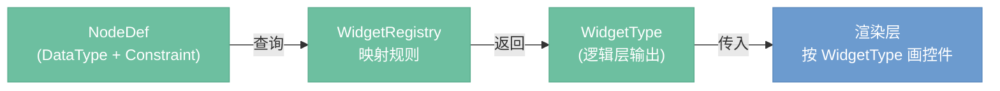

**映射示例：**

| DataType | Constraint | WidgetType |
|----------|-----------|------------|
| `Float` | `Range(min, max)` | `Slider` |
| `Float` | 无 | `DragValue` |
| `Int` | `Range(min, max)` | `SliderInt` |
| `String` | `Enum(variants)` | `Dropdown` |
| `Bool` | — | `Checkbox` |
| `Color` | — | `ColorPicker` |
| `Image` | — | `ImagePreview` |

---

## ExecutionManager 工作机制（决策 D23）

`ExecutionManager` 负责管理图执行的全生命周期：提交、进度追踪、取消、结果收割。

**提交流程：**

1. `GraphController` 将当前图构建为 `GraphRequest`。
2. `ExecutionManager` 创建 channel（`Sender` + `Receiver`）和 `CancelToken`。
3. 调用 `Transport.execute(request, sender)`，Transport 在内部启动执行，通过 `Sender` 逐节点推送进度。
4. `AppState.executing = true`，UI 展示执行中状态。

**进度消费（channel 模式）：**

`ExecutionManager` 在每帧的 `update()` 中非阻塞地 `try_recv()` 所有待读事件：

| 事件 | 含义 |
|------|------|
| `ExecuteProgress::NodeStarted { node_id }` | 某节点开始执行，UI 高亮该节点 |
| `ExecuteProgress::NodeCompleted { node_id, outputs }` | 某节点执行完毕，结果写入 `ResultCache` |
| `ExecuteProgress::NodeFailed { node_id, error }` | 某节点执行失败，UI 展示错误标记 |
| `ExecuteProgress::Progress { node_id, step, total }` | AI 节点迭代进度（Transport 内部将 Python SSE 转发到 channel） |
| `ExecuteProgress::Finished` | 全图执行完成，清除执行状态 |
| `ExecuteProgress::Cancelled` | ���行已取消 |

ExecutionManager 只面向 channel，不感知底层是 `LocalTransport`（同进程直调）还是 `HttpTransport`（HTTP + SSE）。HttpTransport 在内部将 TaskId + poll SSE 流转换为 channel 推送，对上层透明。

**取消机制：** `ExecutionManager` 持有 `CancelToken`（内部为 `Arc<AtomicBool>`）。调用 `cancel()` 设置标志位；`LocalTransport` 的后台执行线程在每个节点间隙检查标志提前退出，`HttpTransport` 调用 `/cancel/{task_id}` 通知远端。取消后 `AppState.executing = false`，UI 恢复空闲状态。

**结果存放：** 所有 `NodeCompleted` 事件携带的结果由 `ExecutionManager` 写入 `ResultCache`（`AppState` 持有引用）。渲染层在下一帧从 `ResultCache` 读取预览数据，通过 `TextureCache` 转为 GPU 纹理展示。

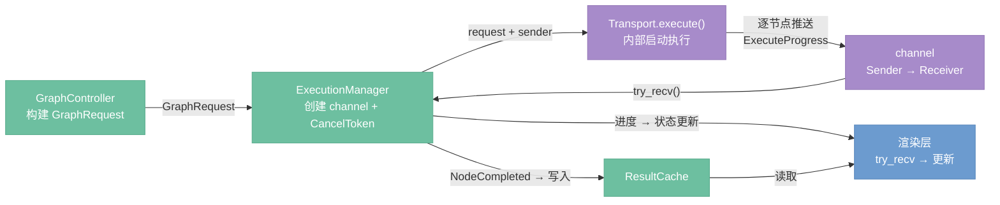

### 自动执行策略（决策 D35）

参数变更后的执行触发策略按执行器类型分为两路：

| 执行器类型 | 触发方式 | 行为 |
|-----------|---------|------|
| Image（GPU/CPU） | 自动，200ms 防抖 | 参数变更后 200ms 内无新变更则自动提交脏子图（变更节点 + 下游） |
| AI / API | 手动，Ctrl+Enter | 不自动执行，用户显式触发 |

**防抖机制：** 用户拖动滑块时每帧都产生参数变更事件，`ExecutionManager` 收到变更后重置 200ms 计时器，只在用户停止操作后才提交执行请求。计时器在逻辑层管理，渲染层只负责转发参数变更事件。

**Ctrl+Enter 手动执行：** 提交整图给 `EvalEngine`，引擎内部对缓存命中的节点自动跳过，等效于只重新执行参数已变更但未执行的节点。用户不需要理解"哪些节点过期"——按一次 Ctrl+Enter 就能把整图跑到最新状态。

**过期结果处理：** AI/API 节点的上游参数变更后，旧的执行结果保留在 `ResultCache` 中，预览继续显示旧图像，不做过期视觉提示。直到用户手动触发执行，新结果替换旧结果。这与 ComfyUI 的行为一致——用户对 AI 节点的执行时机有完全控制权。

**混合图场景示例：**

```
LoadCheckpoint → KSampler → VAEDecode → Brightness → SaveImage
     (AI)          (AI)        (AI)       (GPU)        (CPU)
```

用户将 Brightness 的值从 0.3 改为 0.5：
1. `GraphController` 标记 Brightness 及下游 SaveImage 为脏
2. 200ms 防抖后，`ExecutionManager` 自动提交脏子图
3. Brightness 和 SaveImage 重新执行，预览立即更新
4. AI 节点不受影响，保留缓存结果

用户将 KSampler 的 steps 从 20 改为 30：
1. `GraphController` 标记 KSampler 及下游为脏，但 KSampler 是 AI 节点
2. 不触发自动执行，预览保留旧图像
3. 用户按 Ctrl+Enter → 整图执行，LoadCheckpoint 缓存命中跳过，KSampler 以新参数重新采样，下游全部更新

### 预览更新链路

参数变更到屏幕像素刷新的端到端路径，涉及逻辑层、服务层和渲染层三层协作：

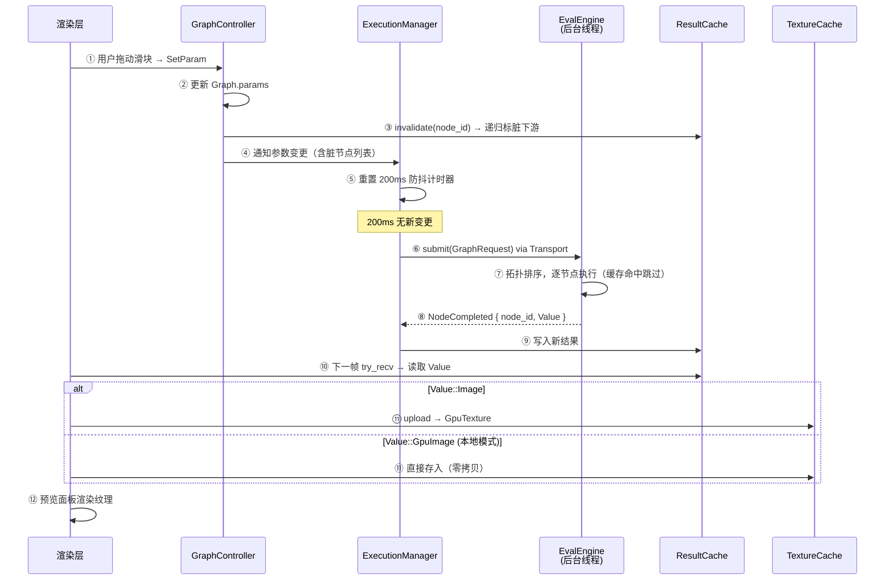

**关键设计点：**

- **步骤③ 缓存失效是同步的**：`invalidate` 在 UI 线程中立即执行，递归标脏下游节点，不等待后台执行完成。
- **步骤⑧→⑨ 逐节点增量更新**：每个节点完成后立即写入 `ResultCache`，渲染层在下一帧就能读取到中间结果，实现逐节点刷新预览，而非等待整图执行完毕。
- **步骤⑪ 纹理上传的两条路径**：`LocalTransport` 模式下 GPU 节点直接产出 `GpuImage`，不经过 CPU 回读；`HttpTransport` 模式下收到序列化的 `Image` 字节，需要 CPU→GPU 上传。
- **TextureCache 淘汰不阻塞预览**：纹理被 LRU 淘汰后，下次访问时从 `ResultCache` 的 `Image` 重新上传，代价低于重新执行节点。

---

## 节点渲染器

节点渲染器负责把单个节点的 `NodeDef`（参数列表）画成可交互的控件组。控件类型由 `WidgetRegistry` 决策，渲染层执行绘制。

**参数类型到控件的映射流程：**

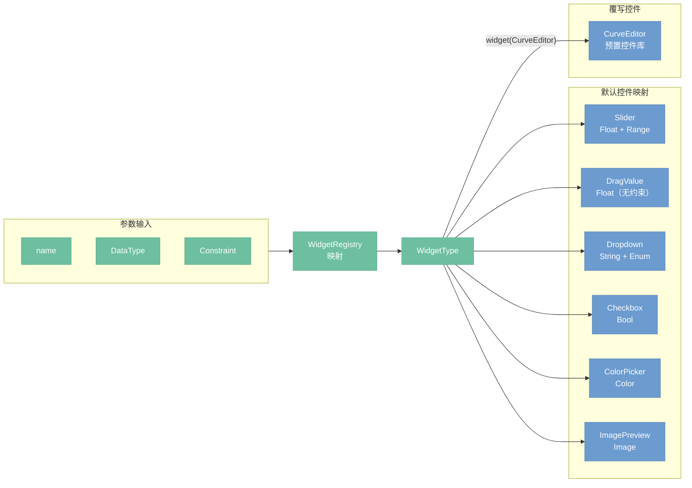

**控件覆写机制（决策 D24）：**

`node!` 宏允许节点定义时显式指定某个参数的控件类型，覆盖 `WidgetRegistry` 的默认映射：

```rust
node! {
    name: "ColorGrade",
    params: [
        param!("curve", DataType::Float, widget: CurveEditor),
        param!("strength", DataType::Float, Constraint::Range(0.0, 1.0)),
    ],
    ...
}
```

`widget: CurveEditor` 直接绑定到预置控件库中的 `CurveEditor` 组件，渲染层无需经过 `WidgetRegistry` 查表。不指定 `widget` 的参数走默认映射路径。

**`widget.rs` 的废除（决策 D24）：** 原有的 `widget.rs` 将所有控件逻辑集中在一个文件中，导致增加新控件时需要修改中心文件，且控件与参数类型之间的关联隐式存在。新方案中，控件选择要么由 `WidgetRegistry` 的映射表决定（数据驱动，可测试），要么在 `node!` 宏中显式声明（局部可见，零隐式依赖）。`widget.rs` 不再承担控件路由职责。

---

## Undo/Redo（决策 D32）

`UndoManager` 基于不可变状态 + 结构共享实现，每次操作生成新版本的 `GraphState`，旧版本入 undo 栈。节点通过 `Arc<Node>` 持有，修改时只 clone 被改的节点，未改变的节点在版本间共享引用。

```rust
struct UndoManager {
    undo_stack: Vec<GraphState>,  // 旧版本
    redo_stack: Vec<GraphState>,  // 被撤销的版本
    max_steps: usize,             // 上限（默认 100）
}

struct GraphState {
    nodes: HashMap<NodeId, Arc<Node>>,
    connections: Vec<Connection>,
    // 不含缓存和图像数据
}
```

**操作流程：**

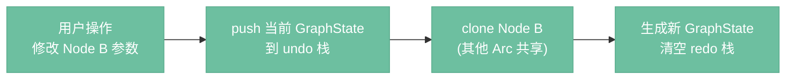

**进入 undo 栈的操作：** 添加/删除节点、连线/断线、修改参数、移动节点。

**不进入 undo 栈的操作：** 执行图（结果缓存不回滚）、保存文件、缩放/平移画布。

**归属：** 逻辑层。`UndoManager` 是 `ProjectTab` 的成员，每个项目 tab 独立维护自己的撤销历史。

---

## 节点搜索

双击画布空白处或按 Space 唤出搜索浮窗，输入关键词实时过滤节点列表，回车将选中节点添加到画布。

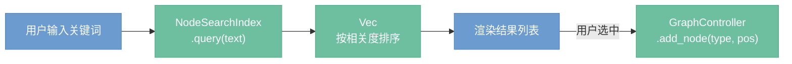

**搜索范围：**

- 节点名称（如 "KSampler"）
- 节点分类（如 "采样"）
- 关键词/别名（如输入 "blur" 匹配到 "Blur"）

**搜索算法：** 模糊匹配（子串匹配），结果按相关度排序——名称精确匹配优先，分类匹配次之。

**归属：** 逻辑层提供 `NodeSearchIndex`（启动时从 `NodeRegistry` 构建），渲染层只负责绘制搜索框和结果列表。

---

## 键盘快捷键（决策 D33）

逻辑层维护 `KeybindingMap`，映射快捷键组合到 `AppCommand` 枚举。渲染层捕获键盘事件后查表触发对应命令，不硬编码任何快捷键。

**默认快捷键：**

| 快捷键 | 命令 |
|--------|------|
| Ctrl+Z | Undo |
| Ctrl+Shift+Z | Redo |
| Ctrl+S | 保存项目 |
| Ctrl+O | 打开项目 |
| Ctrl+N | 新建项目 |
| Delete / Backspace | 删除选中节点/连线 |
| Ctrl+A | 全选 |
| Ctrl+C / Ctrl+V | 复制/粘贴节点 |
| Ctrl+D | 复制选中节点 |
| Space 或双击画布 | 唤出节点搜索 |
| Ctrl+Enter | 执行图 |
| Escape | 取消执行 / 关闭搜索 |
| Ctrl+T | 新建 tab |
| Ctrl+W | 关闭当前 tab |
| Ctrl+Tab | 切换到下一个 tab |

**可自定义：** 快捷键配置存在 `config.toml` 的 `[keybindings]` 段中，用户可覆盖默认值。添加新快捷键只需在 `AppCommand` 枚举增加变体并在默认映射表加一行，不影响渲染层。

---

## 多项目 Tab（决策 D34）

App 支持同时打开多个项目，每个项目独立一个 tab，类似浏览器标签页。

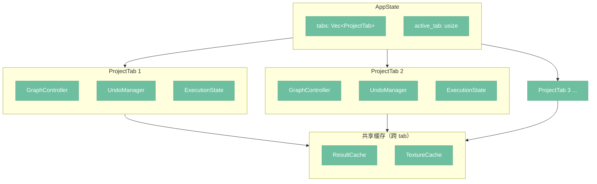

```rust
struct AppState {
    tabs: Vec<ProjectTab>,
    active_tab: usize,
    // ResultCache 和 TextureCache 跨 tab 共享
}

struct ProjectTab {
    title: String,
    file_path: Option<PathBuf>,
    graph_controller: GraphController,
    undo_manager: UndoManager,
    execution_state: ExecutionState,
    dirty: bool,  // 有未保存修改
}
```

**关键设计：**

- 每个 tab 有独立的 `GraphController`、`UndoManager`、执行状态——切换 tab 不丢失任何上下文
- `dirty` 标记未保存修改，关闭 tab 时提示保存
- 执行是 tab 级别的——一个 tab 在执行时可以切换到另一个 tab 编辑，不阻塞
- `ResultCache` 和 `TextureCache` 跨 tab 共享，避免 VRAM 重复占用，缓存条目通过 `(TabId, NodeId)` 区分归属

---

## nodeimg-cli

`nodeimg-cli` 是与 GUI 并列的另一个前端，面向无界面场景。它复用 `ProcessingTransport` trait 与服务层交互，不依赖任何 UI 框架。

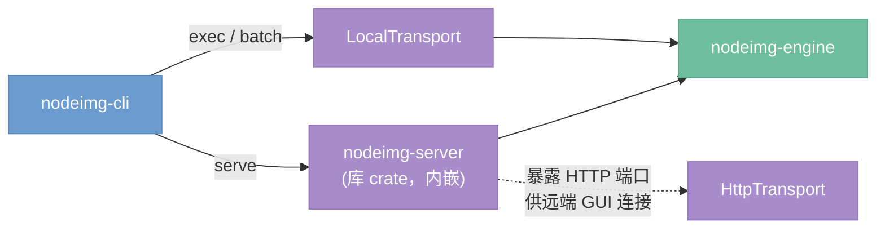

### 子命令

#### `nodeimg exec <project.nodeimg>`

执行单个项目文件并将结果写入文件系统。

```
nodeimg exec workflow.nodeimg [选项]

选项：
  --output, -o <dir>          输出目录（默认：项目文件同级目录）
  --transport <local|http>    传输模式（默认：local）
  --server-url <url>          HTTP 模式下的服务端地址
  --param <node_id>.<key>=<value>  覆盖节点参数（可多次指定）
  --no-python                 跳过 Python 后端启动，AI 节点标记为失败
```

**执行流程：**

1. 加载 `config.toml` + CLI 参数合并为 `AppConfig`
2. 根据 `transport` 配置创建 `LocalTransport` 或 `HttpTransport`
3. 调用 `Transport.load_graph()` 加载项目文件
4. 应用 `--param` 覆盖指定节点参数
5. 调用 `Transport.execute()`，在 stderr 输出逐节点进度
6. SaveImage 节点的输出写入 `--output` 目录
7. 退出码：0 = 全部成功，1 = 部分节点失败，2 = 图加载失败

#### `nodeimg serve [选项]`

启动 HTTP 服务端，供远端 GUI 或其他客户端连接。内嵌 `nodeimg-server` 库 crate。

```
nodeimg serve [选项]

选项：
  --port, -p <port>           监听端口（默认：8080）
  --host <addr>               绑定地址（默认：127.0.0.1）
  --no-python                 不自动启动 Python 后端
```

**行为：**

- 启动 `nodeimg-engine` 服务层 + `nodeimg-server` HTTP 包装层
- 暴露 `04-transport.md` 中定义的交互服务（4 个）和计算服务（5 个）端点
- 按 `python_auto_launch` 配置决定是否拉起 Python 后端
- stdout 输出结构化日志（tracing），Ctrl+C 优雅关闭

#### `nodeimg batch <dir|glob> [选项]`

批量执行多个项目文件。

```
nodeimg batch ./projects/*.nodeimg [选项]

选项：
  --output, -o <dir>          输出根目录（每个项目创建子目录）
  --jobs, -j <N>              并行执行数（默认：1）
  --continue-on-error         某个项目失败后继续执行其余项目
  --param <node_id>.<key>=<value>  覆盖参数（应用到所有项目）
```

**行为：**

- 扫描匹配的 `.nodeimg` 文件，按 `--jobs` 控制并行度
- 每个项目独立��行，等同于单独调用 `exec`
- `--continue-on-error` 时跳过失败项目，最终汇总报告
- 退出码：0 = 全部成功，1 = 有失败项目

### 与 GUI 的共享与差异

| 维度 | GUI (nodeimg-app) | CLI (nodeimg-cli) |
|------|-------------------|-------------------|
| Transport | `LocalTransport`（默认）或 `HttpTransport` | 同左 |
| 进度反馈 | UI 渲染进度条 + 节点高亮 | stderr 文本进度 |
| 多项目 | Tab 并行编辑 | `batch --jobs` 并行执行 |
| 交互 | 实时编辑、预览、Undo | 无交互，一次性执行 |
| 依赖 | eframe / egui | 无 UI 依赖 |
| 使用场景 | 日常创作 | CI/CD 流水线、脚本化批处理 |
