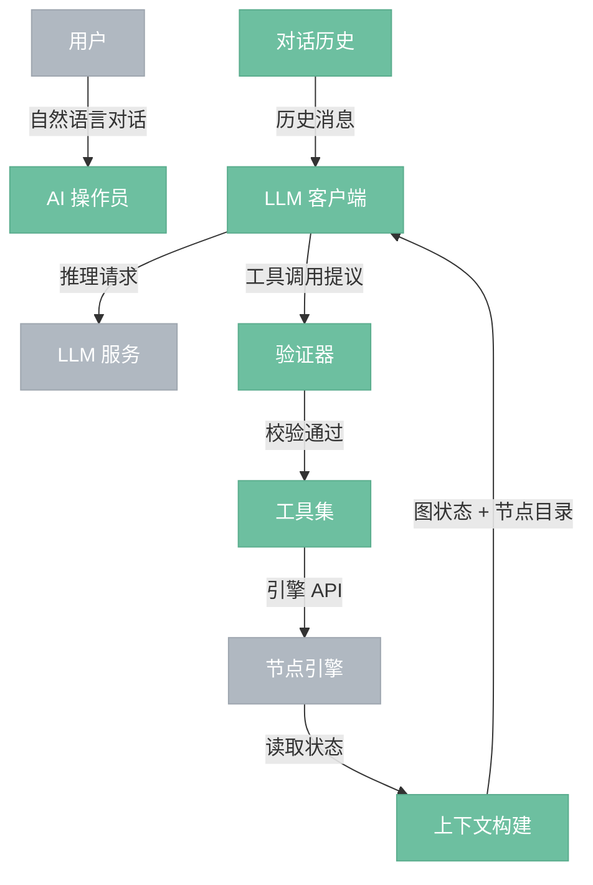
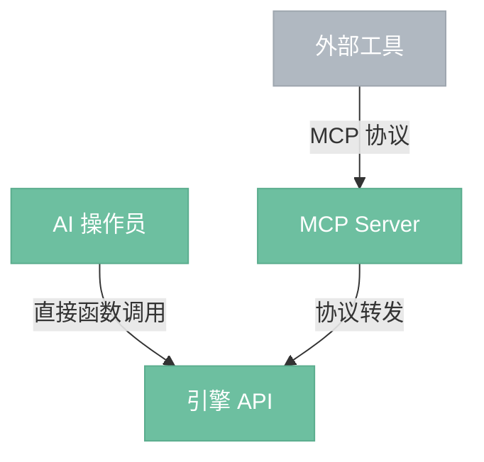

# AI 操作员

> GUI 内嵌的对话助手，接收用户自然语言指令，直接调用引擎 API 操作节点图。

## 总览



---

## 组件

- **LLM 客户端**：调用大模型服务（云端或本地）。简单指令可路由到本地小模型（低延迟），复杂指令路由到云端大模型（高质量）。
- **工具集**：引擎 API 封装为 LLM 可调用的工具（创建节点、连线、改参数、执行、取消等）。AI 操作员与引擎同进程，直接函数调用，零网络延迟。
- **上下文构建**：将当前节点图状态、可用节点列表、执行状态组装为 LLM 上下文，让 LLM 了解当前环境。
- **验证器**：校验 LLM 提议的操作——节点类型是否存在、连接是否兼容、参数是否合法。防止 LLM 幻觉导致无效操作。
- **对话历史**：维护多轮对话记忆，支持上下文连续的交互。

---

## 能力

| 能力 | 说明 | 示例 |
|------|------|------|
| 创建节点 | 按用户描述创建并连接节点 | "加一个模糊节点连到输出" |
| 调整参数 | 修改节点参数值 | "把亮度调到 0.5" |
| 构建流程 | 根据目标自动搭建节点链 | "帮我搭一个 SDXL 文生图流程" |
| 执行控制 | 触发执行、取消执行 | "执行一下" / "取消" |
| 解释说明 | 解释节点图的结构和参数含义 | "这个节点是干嘛的" |

---

## 交互模式

AI 操作员通过引擎 API 操作，与用户手动操作走同一条路径。GUI 自动刷新——AI 操作员修改了节点图，画布立刻反映变化，用户无需手动刷新。

```
用户输入 → LLM 推理 → 验证器校验 → 引擎 API 执行 → 事件系统通知 → GUI 刷新
```

---

## 性能策略

| 策略 | 说明 |
|------|------|
| 分级调度 | 简单指令（改参数）走本地小模型或规则匹配，秒回；复杂指令（搭流程）走云端大模型 |
| 流式反馈 | 边执行边在画布上展示变化，不等全部完成才刷新 |
| 批量操作 | 一次 LLM 调用生成完整计划，本地批量执行引擎 API，减少 LLM 调用次数 |
| 模板缓存 | 常见工作流模板预缓存（如 SDXL 文生图），命中时跳过 LLM 推理 |

---

## MCP 支持

AI 操作员内部直接调用引擎 API（同进程，零延迟）。引擎额外暴露 MCP server 供外部工具使用：



- **内部**：AI 操作员 → 引擎 API，直接调用，无协议开销
- **外部**：Claude Code、Cursor 等 → MCP Server → 引擎 API，标准协议，可远程访问

两条路径共用同一套引擎 API，行为一致。

---

## 边界情况

- **意图不明确**：AI 操作员反问用户确认，不猜测执行。
- **操作失败**：引擎 API 返回错误时，AI 操作员向用户解释原因。
- **LLM 幻觉**：验证器拦截不存在的节点类型、不兼容的连接等无效操作，向用户说明。
- **LLM 不可用**：网络断开或服务异常时，AI 操作员提示不可用，用户仍可手动操作 GUI。
- **引擎不可用**：AI 操作员仍可回答问题和解释概念，但无法执行操作。
