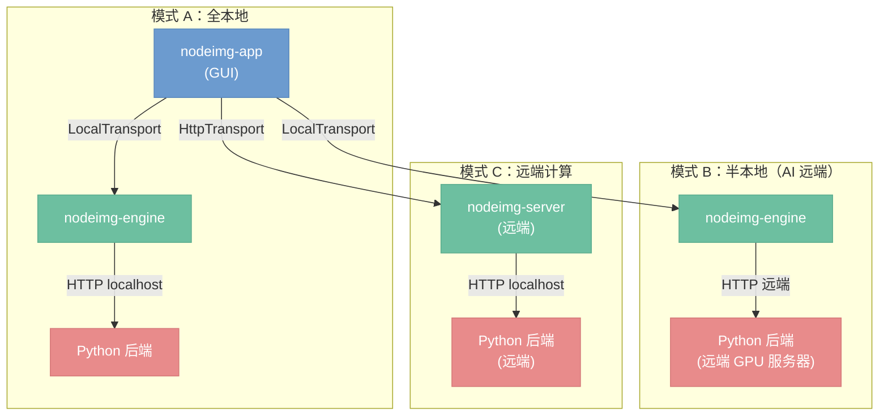

# 横切关注点

> 跨层面的约束和策略——安全、日志、测试、性能、部署、版本。

## 总览

横切关注点不属于任何单一层，但对所有层都施加约束。本文涵盖六个子主题：

1. **安全性（D13）** — 认证/鉴权、路径校验、后端认证的扩展点
2. **可观测性（D14）** — 结构化日志与 tracing span 策略
3. **测试策略（D15）** — 按层分级的测试方法
4. **性能目标** — 各计算路径的延迟指标
5. **部署拓扑（D16）** — 三种运行模式
6. **版本兼容（D17）** — 项目文件与协议接口的向后兼容策略

---

## 安全性（决策 D13）

当前为本地桌面应用，无网络暴露面，暂不实施认证。待远端部署模式（`HttpTransport` + server crate）落地时，需在对应位置补充安全策略。扩展点设计如下：

| 扩展点 | 所在层 / 组件 | 当前状态 | 远端要求 |
|--------|--------------|---------|---------|
| 认证 / 鉴权 | Transport 层 / `nodeimg-server` | 无认证，全部放行 | HTTP 中间件（Bearer Token 或 API Key），拒绝未授权请求 |
| 路径校验 | `LoadImage` / `SaveImage` 节点 | 无限制，可访问任意路径 | 远端模式下限制至允许目录白名单，禁止路径穿越（`..`） |
| 后端认证 | AI 执行器 → Python 后端 | 无认证，直连本地端口 | 预留 `Authorization: Bearer <token>` 请求头，Token 来自配置项 |

---

## 可观测性（决策 D14）

使用 `tracing` crate 进行结构化日志与 span 追踪，替代裸 `println!`。每个关键操作附带结构化字段（节点 ID、耗时、数据量），便于日志聚合与后期分析。计时数据同时通过 `ProgressEvent` 回传前端，在进度区展示节点耗时。

关键观测点：

| 事件 | 日志级别 | 关键字段 |
|------|---------|---------|
| 节点执行开始 | `INFO` | `node_id`、`node_type` |
| 节点执行结束 | `INFO` | `node_id`、`duration_ms` |
| 节点执行失败 | `ERROR` | `node_id`、`error`、`duration_ms` |
| Cache 命中 / 失效 | `DEBUG` | `node_id`、`cache_key`、`hit: bool` |
| Transport 请求 / 响应 | `DEBUG` | `endpoint`、`status`、`bytes`、`duration_ms` |
| Handle 创建 / 释放 | `DEBUG` | `handle_id`、`action: created|released` |
| VRAM / 内存变化 | `INFO` | `vram_used_mb`、`result_cache_mb`、`texture_cache_mb` |

---

## 测试策略（决策 D15）

按层选择合适的测试粒度：离数据最近的层优先单元测试，跨进程边界优先集成测试，最终效果用感知哈希回归保障。

| 层 | 测试类型 | 说明 |
|----|---------|------|
| `nodeimg-types` / 图结构 | 单元测试 | 数据类型约束、拓扑排序正确性，无外部依赖 |
| `nodeimg-gpu` | 集成测试 | CI 环境使用 wgpu 软件渲染后端（`dx12/vulkan` 回退至 `wgpu::Backends::all()`），验证 shader 输出像素值 |
| `nodeimg-engine` | 单元测试 + 集成测试 | Mock `Transport` trait 替换真实后端，验证 `EvalEngine` 调度逻辑与 Cache 失效行为 |
| `nodeimg-server` | 接口测试 | 启动本地 server，发送 HTTP 请求，断言响应格式与状态码 |
| `nodeimg-app` | 逻辑层单元测试 | 测试 `ExecutionManager`、参数验证等可剥离逻辑；egui 渲染层不纳入自动化测试 |
| 节点回归 | 感知哈希（perceptual hash）比对 | 对关键节点（亮度、曲线、色调映射等）固定输入，断言输出图像的感知哈希在阈值内，防止 shader 改动引入视觉退化 |

---

## 性能目标

以下为各计算路径的目标延迟上限。AI 节点执行时间受模型规模与硬件影响差异过大，不设定量化目标。

| 场景 | 目标延迟 |
|------|---------|
| GPU 节点，1080p 图像 | < 10 ms |
| GPU 节点，4K 图像 | < 50 ms |
| CPU 节点，1080p 图像 | < 100 ms |
| 20 节点图完整求值（全 GPU，1080p） | < 500 ms |
| Cache 命中（无重新执行） | < 1 ms |
| UI 帧率 | 60 fps（eframe 默认帧率） |
| Transport 延迟，LocalTransport | < 0.1 ms（同进程引用传递） |
| Transport 延迟，HttpTransport（局域网） | < 50 ms（往返，含序列化） |

---

## 部署拓扑（决策 D16）

系统支持三种运行模式，通过配置项 `transport` 切换，代码无需改动。

| 模式 | 部署方式 | 使用的 Transport | 适用场景 |
|------|---------|-----------------|---------|
| 全本地 | GUI、engine、Python 后端同一台机器 | `LocalTransport` | 高端工作站，GPU 资源充足 |
| 半本地 | GUI + engine 在本地，Python 后端在远端 GPU 服务器 | `LocalTransport`（GUI↔engine） + HTTP（engine↔Python） | AI 推理太重，本地 GPU 不足以跑 SDXL |
| 远端计算 | GUI 在本地，`nodeimg-server` + Python 后端在远端 | `HttpTransport` | 无本地 GPU，全部算力在远端 |

**半本地模式的意义：** SDXL 等大型扩散模型需要 16–24 GB VRAM，本地消费级显卡难以承载，但图像处理节点（亮度、曲线、锐化等）可以在本地 GPU 高效执行。半本地模式允许两者分离，图像处理保持低延迟，AI 推理转移至专用 GPU 服务器。

---

## 版本兼容（决策 D17）

### 项目文件兼容

项目文件（`.nodeimg`，JSON/bincode 格式）包含 `version` 字段，加载时按以下规则处理：

| 情况 | 处理策略 |
|------|---------|
| 文件版本 == 当前版本 | 直接加载 |
| 文件版本 < 当前版本 | 运行迁移函数（migration chain），将旧格式逐步升级至当前版本 |
| 节点类型不存在（插件缺失） | 跳过该节点，保留其余图结构，提示用户 |
| 节点参数缺失（新增字段） | 填充该参数的默认值，不报错 |
| 文件版本 > 当前版本 | 拒绝加载，提示用户升级应用 |

### Transport 接口版本协商

`HttpTransport` 在建立连接时进行版本握手：

1. 客户端在请求头附带 `X-Nodeimg-Version: <semver>`
2. 服务端检查主版本号（major）是否兼容
3. 主版本号一致则接受连接；不一致则返回 `409 Conflict`，并在响应体说明服务端版本
4. 次版本号（minor）差异视为向后兼容，客户端可继续使用，但应在日志中记录版本差异警告
