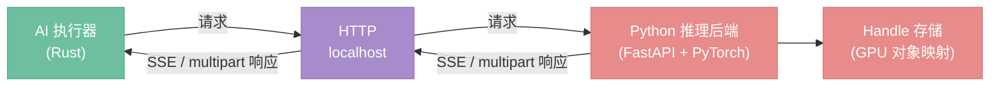
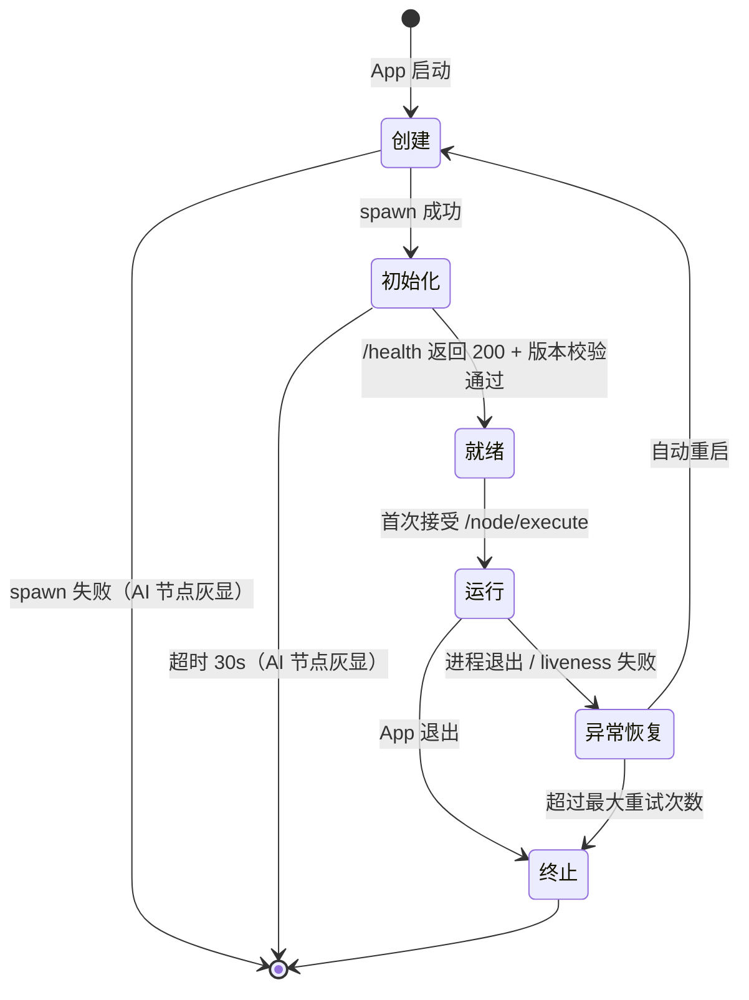

# Python 后端协议

> AI 执行器与 Python 推理后端之间的通信协议——接口契约、数据格式、生命周期管理。

## 总览

Python 推理后端是独立进程，运行 FastAPI + PyTorch，负责执行 AI 节点的模型推理。AI 执行器（Rust 侧）通过 HTTP 协议与其通信，逐节点调用、流式获取进度、管理 GPU 对象生命周期。



> 此通信通道是引擎内部组件之间的通信（AI 执行器 ↔ Python），与 `04-transport.md` 中的 `ProcessingTransport`（前端 ↔ 服务层）完全独立。

---

## 1. 接口总览

| 接口 | 方法 | 用途 | 响应类型 |
|------|------|------|----------|
| `/health` | GET | 设备状态、VRAM、Handle 统计、协议版本 | JSON |
| `/node/execute` | POST | 执行单个 AI 节点 | SSE 流（Handle 输出）或 multipart（Image 输出） |
| `/node/cancel/{execution_id}` | POST | 取消正在执行的节点 | JSON |
| `/handles/release` | POST | 批量释放 Handle | JSON |

Rust 端可并发发送多个 `/node/execute` 请求（对无依赖的 AI 节点），Python 端维护执行队列，根据 GPU 负载决定串行或并行执行。

---

## 2. `/health`

**请求：** `GET /health`

**响应：**

```json
{
  "protocol_version": "1.0",
  "device": "cuda",
  "gpu_name": "RTX 4090",
  "vram_total_mb": 24576,
  "vram_free_mb": 18432,
  "handles": [
    {"id": "load_checkpoint_model_0001", "data_type": "model", "vram_mb": 6800},
    {"id": "clip_encode_conditioning_0002", "data_type": "conditioning", "vram_mb": 12}
  ]
}
```

**用途：**

- **启动时：** Rust 轮询此接口确认 Python 就绪，校验 `protocol_version` 兼容性
- **VRAM 不足时：** Rust 调用此接口获取 Handle 列表和 VRAM 占用，决定释放哪些 Handle 后重试
- **UI 展示：** GPU 名称、VRAM 剩余等信息可展示给用户

---

## 3. `/node/execute`

### 请求

`POST /node/execute`，`Content-Type: multipart/form-data`

Part 1（JSON）：

```json
{
  "execution_id": "exec_001",
  "node_type": "ksampler",
  "inputs": {
    "model": {"handle": "load_checkpoint_model_0001"},
    "positive": {"handle": "clip_encode_conditioning_0002"},
    "negative": {"handle": "clip_encode_conditioning_0003"},
    "latent_image": {"handle": "empty_latent_latent_0004"}
  },
  "params": {
    "seed": 42,
    "steps": 20,
    "cfg": 7.0,
    "sampler_name": "euler",
    "scheduler": "karras"
  }
}
```

Part 2+（binary，可选）：当输入包含 Image 类型时（如 img2img 场景），图像原始字节作为独立 part，JSON 中对应字段引用 part 名称：`{"image_part": "input_image"}`。

### 响应——Handle 输出（SSE 流）

当节点输出为 Python 专属类型（Model、Conditioning、Latent 等）时，返回 SSE 流：

```
event: progress
data: {"step": 1, "total": 20}

event: progress
data: {"step": 5, "total": 20, "preview": "<base64 低分辨率预览>"}

event: progress
data: {"step": 20, "total": 20}

event: result
data: {"outputs": {"latent": {"handle": "ksampler_latent_0005", "data_type": "latent"}}}

event: done
data: {}
```

- `progress` 事件：迭代节点每步推送，`preview` 字段可选，由节点实现决定是否发送
- `result` 事件：执行结果，输出为 Handle 引用
- `done` 事件：流结束标记
- 非迭代节点（如 LoadCheckpoint）直接推送 `result` + `done`，不发 `progress`

### 响应——Image 输出（multipart）

当节点输出为 Image 时（如 VAEDecode），返回 `multipart/form-data`：

- Part 1（JSON）：`{"outputs": {"image": {"width": 1024, "height": 1024, "format": "png"}}}`
- Part 2（binary）：图像原始字节

不走 SSE，因为 Image 输出节点通常是一次性计算，不需要进度反馈，且图像数据是 binary。

### 错误响应

通过 SSE `error` 事件或 JSON 响应返回，`error_type` 字段区分三类错误：

```
event: error
data: {"error_type": "execution_error", "message": "CUDA out of memory"}
```

| error_type | 含义 | Rust 侧处理 |
|---|---|---|
| `execution_error` | 节点执行失败（CUDA OOM、模型文件不存在等） | 标红节点，向 UI 报告 |
| `handle_error` | Handle ID 不存在或已释放 | 失效对应缓存条目，重新执行上游 |
| `system_error` | Python 内部异常 | 全局通知，提示用户检查后端 |

三类错误与 `09-error-handling.md` 的分层 Error 体系对齐：`execution_error` 和 `handle_error` 映射为 `NodeError`，`system_error` 映射为 `TransportError`。

---

## 4. `/node/cancel/{execution_id}`

**请求：** `POST /node/cancel/exec_001`

**响应：**

```json
{"status": "cancelled"}
```

或 execution_id 不存在/已完成时：

```json
{"status": "not_found"}
```

**机制：** Python 端收到取消请求后设置标志位，迭代节点（如 KSampler）在每步采样前检查该标志，命中则中断循环，SSE 流推送 `cancelled` 事件后关闭：

```
event: cancelled
data: {}
```

非迭代节点执行时间短且不可中断，取消请求可能在执行完成后才到达，此时返回 `not_found`。

---

## 5. `/handles/release`

**请求：** `POST /handles/release`

```json
{"ids": ["load_checkpoint_model_0001", "clip_encode_conditioning_0002"]}
```

**响应：**

```json
{
  "released": ["load_checkpoint_model_0001", "clip_encode_conditioning_0002"],
  "not_found": []
}
```

**调用时机（由 Rust 端 ResultCache 驱动）：**

- 用户修改节点参数 → 该节点及下游缓存失效 → 失效条目中类型为 Handle 的，批量调用 release
- 用户删除节点或断开连接 → 同上
- VRAM 不足重试时 → Rust 主动选择释放目标后调用
- Python 崩溃重启后 → 无需调用（Python 端 VRAM 已随进程释放），Rust 端直接清除 Handle 缓存条目

`not_found` 的 ID 不视为错误——可能是 Python 重启后 Rust 端残留的旧引用，静默忽略。

---

## 6. Handle 机制

### Handle ID 格式

`{node_type}_{output_pin}_{自增计数器}`

示例：
- `load_checkpoint_model_0001` — LoadCheckpoint 输出的 model
- `clip_encode_conditioning_0002` — CLIPTextEncode 输出的 conditioning
- `ksampler_latent_0005` — KSampler 输出的 latent

计数器由 Python 端全局自增，保证唯一性。格式便于调试时追踪来源。

### Rust 侧

```rust
Value::Handle { id: String, data_type: DataTypeId }
```

Rust 不持有任何 GPU 数据，只持有不透明的 string ID。Handle 在节点间作为输入透传——Rust 从 ResultCache 取出上游的 `Value::Handle`，序列化为 `{"handle": "..."}` 发给 Python。

### Python 侧

```python
handle_store: dict[str, Any]  # handle_id → GPU 对象（Tensor / Model / VAE 等）
```

收到 `/node/execute` 请求时，Python 从 handle_store 还原输入 Handle 为真实 GPU 对象，执行节点函数，将输出中的 Python 专属类型存入 handle_store 并返回新 handle_id。

### 生命周期规则

与 `02-service-layer.md` 对齐：

- Handle 生命周期 = 对应 ResultCache 条目的生命周期
- 缓存失效时，Rust 调用 `/handles/release` 通知 Python 释放
- Handle 条目豁免 LRU 淘汰（重建代价远高于普通图像缓存）
- Python 崩溃 → Rust 清除所有 Handle 缓存条目，下次执行时自动重建

---

## 7. VRAM 管理

当 Python 端执行节点遇到 VRAM 不足时，返回携带 VRAM 信息的错误：

```
event: error
data: {
  "error_type": "execution_error",
  "message": "CUDA out of memory",
  "vram_info": {
    "vram_total_mb": 24576,
    "vram_free_mb": 1200,
    "required_mb": 6800,
    "handles": [
      {"id": "load_checkpoint_model_0001", "data_type": "model", "vram_mb": 6800},
      {"id": "load_checkpoint_model_0008", "data_type": "model", "vram_mb": 6800}
    ]
  }
}
```

Rust 端处理流程：

1. 读取 `vram_info` 中的 Handle 列表和占用
2. 根据策略选择释放目标（如最久未被下游引用的 Handle）
3. 调用 `/handles/release` 释放选中的 Handle
4. 同时失效 ResultCache 中对应条目及其下游
5. 重试 `/node/execute`

决策权在 Rust 端——Python 只报告现状，不自行淘汰。这保证两端状态一致。

此路径与缓存失效驱动的常规释放路径互补：常规路径是主动清理（参数变更时释放），VRAM 不足路径是被动恢复（空间不够时腾挪）。

---

## 8. 进程生命周期

Python 后端作为独立进程，生命周期分为 6 个状态，参考 Kubernetes Pod / systemd 的行业标准模型：

```
创建 → 初始化 → 就绪 → 运行 → 异常恢复 → 终止
```



### ① 创建

Rust 侧 spawn Python 子进程，进程尚未可用。

```
读取配置（10-config.md）
  ├─ python_backend_url: 后端地址（默认 http://localhost:8188）
  └─ python_auto_launch: 是否自动启动（默认 true）

若 python_auto_launch = true
  ├─ spawn 子进程：python server.py --port {port} --models-dir {models_dir}
  ├─ stdout/stderr 重定向到 App 日志（tracing）
  └─ 端口冲突时自动递增（最多尝试 3 次）

若 python_auto_launch = false
  └─ 跳过 spawn，假设用户已手动启动后端，直接进入初始化阶段
```

**失败处理：** spawn 失败（Python 未安装、路径错误等）→ AI 节点灰显不可用，图像处理节点正常工作。Python 后端是可选依赖。

### ② 初始化

Python 进程已启动，正在加载 FastAPI 应用、检测 GPU 设备、初始化 Handle 存储。Rust 侧等待其完成。

```
轮询 GET /health（间隔 500ms，最多 30 秒）
  ├─ 尚未响应 → 继续轮询
  ├─ 返回 200 → 进入就绪判定
  └─ 超时 30s → UI 提示，AI 节点灰显不可用
```

### ③ 就绪

`/health` 返回 200，Rust 校验 `protocol_version` 兼容性，通过后 AI 节点变为可用状态。

```
校验 protocol_version
  ├─ 主版本号一致 → AI 节点可用，进入运行状态
  ├─ 次版本号差异 → 日志警告，仍可运行
  └─ 主版本号不匹配 → UI 提示用户更新 Python 端，AI 节点不可用
```

**就绪 ≠ 运行：** 就绪表示"可以接活"，但尚未处理过任何请求。此时模型尚未加载到 VRAM（模型按需加载，由 LoadCheckpoint 节点触发）。

### ④ 运行

正常服务中，持续接受 Rust 侧的 `/node/execute` 调用。Rust 定期通过 liveness 检查确认进程健康。

```
运行期间：
  ├─ 接收并处理 /node/execute 请求
  ├─ 管理 Handle 存储（创建 / 还原 / 释放）
  ├─ 响应 /handles/release（缓存失效驱动）
  │
  └─ Liveness 检查（定期）
       ├─ 方式：GET /health（间隔 30s）
       ├─ 成功 → 继续运行
       ├─ 连续 3 次失败 → 判定为异常，进入异常恢复
       └─ 检测到进程退出 → 立即进入异常恢复
```

**Liveness vs Readiness：**
- Readiness（就绪探针）：启动阶段使用，确认进程可以接受请求
- Liveness（存���探针）：运行阶段使用，确认进程没有卡死或崩溃

### ⑤ 异常恢复

检测到 Python 进程异常（崩溃退出或 liveness 失败），执行状态清理后自动重启。

```
检测到异常
  │
  ├─ ① 状态清理
  │    ├─ 清除 ResultCache 中所有 Handle 类型的条目
  │    ├─ 递归失效这些条目的下游缓存
  │    └─ 重置 BackendClient 连接状态
  │
  ├─ ② 判断是否重启
  │    ├─ 重启次数 < 最大重试次数（默认 3）→ 自动重启（回到创建阶段）
  │    ├─ 两次崩溃间隔 < 10s → 指数退避等待（1s, 2s, 4s）后重启
  │    └─ 超过最大重试次数 → 放弃重启，AI 节点灰显，进入终止状态
  │
  └─ ③ UI 通知
       └─ "AI 后端已重启，需重新执行" 或 "AI 后端多次崩溃，已停止重启"
```

**Python 崩溃后 Rust 无需调用 `/handles/release`：** Python 进程的 VRAM 随进程退出已被操作系统回收，Rust 端只需清除本地 Handle 缓存条目。

### ⑥ 终止

App 退出时优雅关闭 Python 进程。

```
App 退出
  │
  ├─ ① 取消所有正在执行的 AI 节点（POST /node/cancel）
  ├─ ② 发送 SIGTERM
  ├─ ③ 等待 5 秒（Python 清理资源、释放 VRAM）
  └─ ④ 未退出 → SIGKILL 强制终止
```

### 状态总结

| 状态 | Rust 侧行为 | Python 侧状态 | AI 节点可用性 |
|------|------------|--------------|-------------|
| 创建 | spawn 进程 | 进程启动中 | 不可用 |
| 初始化 | 轮询 /health | 加载 FastAPI、检测设备 | 不可用 |
| 就绪 | 校验版本 | 空闲，等待请求 | 可用 |
| 运行 | 发送请求 + liveness 检查 | 处理推理请求 | 可用 |
| 异常恢复 | 清理状态 + 自动重启 | 已退出 | 不可用 |
| 终止 | SIGTERM → SIGKILL | 清理退出 | 不可用 |

---

## 9. 超时机制

Rust 端为每个 `/node/execute` 请求设定超时，按节点类型区分：

| 节点类型 | 默认超时 | 理由 |
|----------|---------|------|
| LoadCheckpoint | 120s | 首次加载大模型需读磁盘 + 初始化 GPU |
| CLIPTextEncode | 30s | 文本编码，计算量小 |
| EmptyLatentImage | 10s | 纯内存分配 |
| KSampler | 600s | 高步数 + 高分辨率可能很慢 |
| VAEDecode | 60s | 单次 GPU 计算，大图较慢 |

**收到 `progress` 事件会重置超时计时器。** KSampler 跑 100 步可能要很久，但只要每步都有 progress 推送，就不会触发超时。超时只在 Python 端完全无响应时才生效。

超时触发后，Rust 调用 `POST /node/cancel/{execution_id}` 尝试取消，并向 UI 报告超时错误。

---

## 10. 并发模型

### Rust 端

EvalEngine 拓扑排序后，同层无依赖的 AI 节点通过 rayon 并发发送 `/node/execute` 请求（与 `08-concurrency.md` 的同层并行规则一致）。

示例——SDXL 典型图：

```
LoadCheckpoint ──→ CLIPTextEncode(正面) ──→ KSampler
                └→ CLIPTextEncode(反面) ──↗
                                          EmptyLatentImage ──↗
```

执行顺序：
1. LoadCheckpoint（串行）
2. CLIPTextEncode(正面) + CLIPTextEncode(反面) + EmptyLatentImage（**并发**，三个请求同时发出）
3. KSampler（等步骤 2 全部完成）
4. VAEDecode

### Python 端

并发请求进入执行队列后，由调度器决定执行策略：

- 轻量节点（CLIPTextEncode、EmptyLatentImage）：可并行执行，GPU 未打满
- 重型节点（KSampler）：独占 GPU，队列中其他请求等待其完成

调度策略是 Python 内部实现细节，协议层不规定具体算法。

---

## 11. Python 端内部架构

```
python/
├── server.py          # FastAPI 应用，路由定义
├── executor.py        # 执行队列调度
├── handle_store.py    # Handle 存储管理
├── device.py          # GPU 设备检测
└── nodes/             # 节点执行函数
    ├── __init__.py
    ├── load_checkpoint.py
    ├── clip_text_encode.py
    ├── empty_latent_image.py
    ├── ksampler.py
    └── vae_decode.py
```

### 各模块职责

**server.py** — HTTP 层，只做路由和序列化，不含业务逻辑：
- 接收 `/node/execute`，解析 multipart，交给 executor
- 接收 `/node/cancel`，转发给 executor
- 接收 `/handles/release`，转发给 handle_store
- `/health` 聚合 device 和 handle_store 信息返回

**executor.py** — 执行调度核心：
- 维护执行队列，分配 `execution_id`
- 根据 GPU 负载决定并行或排队
- 调用 handle_store 还原输入 Handle 为真实 GPU 对象
- 调用 nodes/ 中的执行函数
- 将输出中的 Python 专属类型存入 handle_store
- 管理取消标志位，迭代节点每步检查

**handle_store.py** — Handle 生命周期管理：
- `store(obj, node_type, output_pin) → handle_id`：存入 GPU 对象，生成 ID
- `resolve(handle_id) → obj`：还原为真实对象，不存在则抛出 handle_error
- `release(ids)`：释放指定 Handle，`del` 对象 + `gc.collect()` + `torch.cuda.empty_cache()`
- `list_all() → [HandleInfo]`：返回所有 Handle 及 VRAM 占用估算

**device.py** — 设备检测：
- CUDA / MPS / CPU 检测
- float16 / float32 选择
- VRAM 总量和剩余查询

**nodes/*.py** — 纯执行函数，每个文件一个节点：
- 输入：已还原的 GPU 对象 + 标量参数
- 输出：GPU 对象（由 executor 存入 handle_store）或 Image bytes
- 迭代节点接收 `progress_callback` 和 `cancel_flag` 参数
