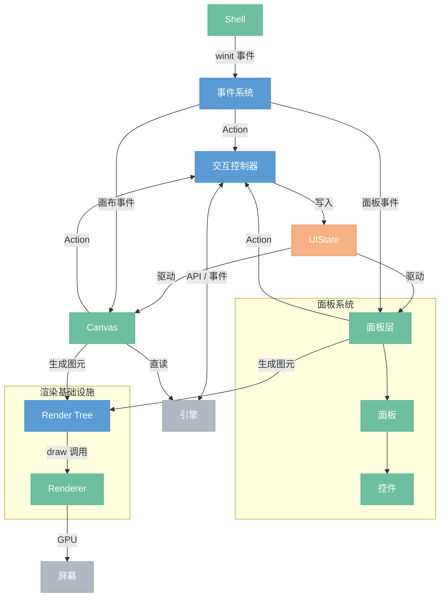

# GUI

> 图形界面前端。自建渲染 + 保留模式。画布编辑节点图、面板预览结果和调整参数。

## 模块总览



## 数据流

```plaintext
用户操作
  → Shell 收到 winit 事件
    → 事件系统：输入转换 → hit test（查 widget 树）→ 分发给目标 widget
      → widget 产生 Action（如"运行按钮被点击"）
        → 交互控制器：路由 action → 调引擎 API → 写 UIState → 通知脏 widget
          → Widget Tree：脏的 widget 重新生成 render tree 节点
            → Render Tree：脏的节点重建渲染缓存（tessellation、glyphon Buffer 等）
              → Renderer：遍历 render tree，发出 draw call → GPU 绘制
```

---

## 1. Shell

窗口和帧循环的薄封装。最外层的壳。

- **窗口管理** — 创建窗口、处理 resize、DPI 变化
- **GPU 上下文** — wgpu device / queue / surface 初始化
- **事件循环** — winit event loop，驱动每帧的 event → update → render

详见 [渲染层 §1](7.0.0-renderer.md)

## 2. 事件系统

把 OS 原始事件翻译成应用层事件，找到目标 widget，交给它处理。

- **输入转换** — winit 原始事件（物理按键、像素坐标）转为应用级事件（逻辑坐标、鼠标按钮）
- **Hit test** — 遍历 widget 树，根据坐标和 z-order 找到命中的 widget
- **焦点管理** — 键盘焦点追踪、Tab 切换、Escape 清除
- **事件分发** — 把事件交给命中的 widget，widget 产生 Action

事件捕获分两层：

- **面板级** — 事件系统负责。鼠标坐标 → hit test → 面板 → 控件 → Action
- **画布内部** — 画布控制器负责。画布是一个 widget，收到事件后自己做 hit test 判断点击了哪个节点/引脚/连线

## 3. 交互控制器

GUI 的消息中枢。widget 不直接调引擎，都经过交互控制器。

- **Action 路由** — widget 产生的 action（按钮点击、滑块拖动、画布选中节点）分发给对应处理器
- **引擎调用** — 翻译 action 为引擎 API（add\_node、connect、execute、set\_param 等）
- **UIState 写入** — 引擎返回结果 / 引擎推送事件后更新 UIState
- **脏通知** — UIState 变了，标记依赖该数据的 widget 为脏

## 4. UIState

纯数据仓库。交互控制器写，widget 树读。自己不做任何逻辑。

- **面板框架状态** — 每个面板的 visible、position、size
- **面板内容状态** — 每个面板的业务数据（预览的 zoom、属性面板的滚动位置）
- **全局共享状态** — 选中节点、执行进度、后端连接状态
- **画布状态** — camera transform、框选范围、拖拽中的连线
- **交互瞬态** — 当前拖拽 / resize 操作

```rust
UIState {
    panels: {
        "toolbar":    { visible, offset, size },
        "preview":    { visible, offset, size },
        "properties": { visible, offset, size },
    },
    content: {
        "preview":    { zoom: 1.0, offset: (0,0), image: None },
        "properties": { values: { "radius": 5.0, "opacity": 0.8 } },
    },
    active_interaction: Some(("preview", Drag)),
    selected_node: Some(NodeId(3)),
    execution_progress: None,
}
```

画布直读引擎图数据（节点、连线、参数），不经 UIState 镜像。UIState 只存 UI 相关的状态（选中、进度、面板显隐）。

详见 [面板系统 §2](2.9.0-panel.md)

## 5. Widget Tree

持久的 UI 元素层级。负责布局和脏标记。是 render tree 和事件系统的桥梁。

- **元素管理** — 创建 / 销毁 widget，维护父子关系
- **布局引擎** — measure（自底向上算尺寸）→ arrange（自顶向下分配位置）
- **布局节点** — Column（纵向）、Row（横向）、Scrollable（滚动）
- **脏标记** — UIState 变化后标记相关 widget，渲染时只更新脏的子树

### UI 层级结构

Window 下分为两棵平级的支树：Panel 支树和 Canvas 支树。两棵树共用同一套 Widget。

```plaintext
Window
│
├── Panel 支树（固定布局，Flexbox 控件树）
│   │
│   ├── Toolbar（工具栏）
│   │   ├── Button（新建/打开/保存）
│   │   ├── Button（撤销/重做）
│   │   └── Dropdown（导出格式）
│   │
│   ├── Properties（属性面板）
│   │   ├── Label（节点名称）
│   │   ├── Slider（参数调节）
│   │   ├── TextInput（精确输入）
│   │   ├── Toggle（开关选项）
│   │   └── ColorPicker（颜色选择）
│   │       ├── Slider × 3
│   │       ├── TextInput
│   │       └── Label
│   │
│   └── Preview（预览面板）
│       └── ImageView（输出预览）
│
├── Canvas 支树（无限空间，相机坐标系）
│   │
│   ├── NodeView（节点卡片 A）
│   │   ├── TitleBar（标题）
│   │   ├── Port（输入端口）× N
│   │   ├── Port（输出端口）× N
│   │   ├── Slider（参数）
│   │   ├── Toggle（开关）
│   │   ├── Thumbnail（缩略图预览）
│   │   └── PopupPanel（弹出面板，选中时出现，锚定节点底部）
│   │       ├── TextArea
│   │       └── ActionButton
│   │
│   ├── NodeView（节点卡片 B）
│   │   └── ...
│   │
│   └── ConnectionView（连线，跨节点引用）
│       ├── A.output[0] → B.input[0]
│       └── ...
│
└── Widget（共享叶子，被上面两棵树复用）
    ├── Button
    ├── Slider
    ├── TextInput
    ├── Toggle
    ├── Label
    ├── Dropdown
    ├── ImageView
    ├── Thumbnail
    ├── Port
    ├── TitleBar
    └── ColorPicker（复合 Widget）
```

### 树的作用

树描述**谁包含谁**。三个系统沿着树工作：

- **布局** — 父节点约束子节点的位置和大小
- **事件** — 从根往下找命中目标，事件沿树传递
- **渲染** — 按树的顺序决定绘制顺序（z-order）

### 三个系统在两棵树上的差异

|  | Panel 支树 | Canvas 支树 |
| --- | --- | --- |
| **布局** | Flexbox 树（measure → arrange） | 相机坐标系（世界坐标 → 屏幕坐标），NodeView 内部用 Flexbox |
| **事件** | 屏幕坐标 → 面板命中 → 控件命中 | 屏幕坐标 → 相机变换 → 节点/连线命中 |
| **渲染** | 共享 Renderer | 共享 Renderer |

布局和事件是**分裂**的（两棵树各自处理），渲染是**统一**的（都调同一个 Renderer），Widget 是**共享**的（同一套控件在两棵树中复用）。

### 设计要点

- **Panel 和 Canvas 平级** — 都是窗口中的顶级区域，内部机制不同：面板用 Flexbox 做固定布局，画布用相机坐标系做空间布局
- **Widget 是共享系统** — Slider 就是 Slider，不管放在属性面板还是节点卡片里，渲染和交互一致
- **Flexbox 布局引擎跟 Widget 走** — 面板和节点卡片内部都需要 Flexbox 排列控件，布局是 Widget 的能力而非 Panel 独有
- **Canvas 支树是树 + 连线** — 父子关系是树（Canvas → NodeView → Widget/PopupPanel），ConnectionView 是跨节点的横向引用
- **弹出面板各自实现** — 浮动面板和节点弹出面板行为差异大（定位、生命周期、层级），各自实现，视觉风格靠 theme 统一
- **Canvas 维护渲染状态，引擎持有数据** — 引擎的节点图只有数据（类型、参数、连接），Canvas 维护渲染状态（位置、大小、展开/折叠、路径缓存）
- **选中等 UI 状态存 UIState** — 引擎存数据，UIState 存 UI 状态（选中了谁、在拖什么、面板开没开）

### 目标文件结构

```plaintext
gui/src/
├── shell/        — 窗口、事件循环
├── renderer/     — GPU 渲染（共享）
│   ├── pipeline/     — 管线（quad, circle, curve, ...）
│   └── shaders/      — WGSL 着色器
├── widget/       — 共享 Widget 系统
│   ├── trait.rs      — Widget trait（id/layout/paint/event/hit_test/props_hash）
│   ├── state.rs      — InteractionState 枚举 + 状态转换逻辑
│   ├── action.rs     — Action 枚举（Click/Change/Toggle/Select）
│   ├── layout/       — Flexbox 布局引擎（measure → arrange）
│   ├── focus.rs      — 焦点管理
│   ├── text_edit.rs  — 文字编辑
│   └── atoms/        — Button, Slider, TextInput ...
├── panel/        — 面板支树
│   ├── tree/         — 面板的控件树
│   │   ├── tree.rs       — 存储（增删查节点）
│   │   ├── node.rs       — 节点数据
│   │   ├── desc.rs       — 声明式描述
│   │   ├── diff.rs       — 对比描述与旧树，更新
│   │   ├── paint.rs      — 绘制遍历
│   │   └── hit.rs        — 命中检测
│   ├── instances/    — 面板实例定义
│   │   ├── toolbar.rs    — 工具栏
│   │   └── preview.rs    — 预览面板
│   ├── layer.rs      — 面板层叠 z-order
│   ├── drag.rs       — 面板拖拽
│   ├── resize.rs     — 面板缩放
│   └── event.rs      — 面板事件分发
├── canvas/       — 画布支树
│   ├── tree/         — 画布元素树
│   │   ├── tree.rs       — 存储（节点卡片、连线）
│   │   ├── node.rs       — NodeView / ConnectionView 渲染状态
│   │   ├── diff.rs       — 引擎数据同步
│   │   ├── paint.rs      — 绘制遍历
│   │   └── hit.rs        — 命中检测
│   ├── camera.rs     — 相机变换（世界坐标 ↔ 屏幕坐标）
│   ├── pan.rs        — 平移
│   ├── background.rs — 网格背景
│   ├── event.rs      — 画布事件分发
│   ├── render.rs     — 画布渲染
│   ├── node_card.rs  — 节点卡片（读 NodeDef 自动映射控件）
│   └── popup.rs      — 节点弹出面板（锚定节点底部）
└── demo.rs
```

三个系统不是三个目录，而是贯穿现有模块的三条管线：

- **布局** — widget/layout/ 提供 Flexbox 引擎，panel 和 canvas 的树都调用它排列内部控件，canvas 额外通过 camera.rs 做世界坐标 → 屏幕坐标变换。当前 panel/tree/layout.rs 做 PanelNode ↔ LayoutBox 的转换适配，**待优化**：让树节点直接实现布局 trait，省掉中间转换
- **事件** — shell/ 产生 AppEvent → panel/event.rs 或 canvas/event.rs 各自做命中检测和分发 → Widget::event() 处理
- **渲染** — Widget::paint() 产生绘制调用 → panel/tree/paint.rs 或 canvas/tree/paint.rs 遍历树 → renderer/ 执行 GPU 绘制

Widget Tree 不持有渲染资源（glyphon Buffer、tessellation 结果等），这些在 Render Tree 里。

## 6. 控件库

面板内部的 UI 元素。三层架构：原子控件 → 组合控件 → 面板。

### 原子控件

最小使用单元。通过字符串 ID 标识，对外暴露事件接口。

| 类别 | 控件 | 暴露事件 |
| --- | --- | --- |
| 动作 | Button(id, label, icon) | Click |
| 输入 | Slider(id, label, range, **value**) | Change(f32) |
| 输入 | TextInput(id, label, **value**) | Change(String) |
| 输入 | Dropdown(id, options, **selected**) | Select(usize) |
| 输入 | Toggle(id, label, **value**) | Toggle(bool) |
| 查看 | ImageViewer(id, **image**) | Zoom(f32), Pan(Vector) |
| 查看 | TextDisplay(text) | — |
| 容器 | ListView(id, items, **selected**) | Select(usize) |
| 容器 | SearchBox(id, **query**) | Query(String) |
| 容器 | Group(id, label, **expanded**, children) | Toggle(bool) |
| 分割 | Separator, Spacing | — |

### 组合控件

原子控件 + 布局组合成更高级的控件。

| 组合控件 | 组成 | 暴露事件 |
| --- | --- | --- |
| TitleBar | TextDisplay + Spacing(Fill) + buttons + Button("close") | Click |
| NumberInput | TextDisplay(label) + TextInput + 拖拽调节 | Change(f32) |
| ColorPicker | 色盘 canvas + RGBA Slider | Change(Color) |

详见 [面板系统 §3-4](2.9.0-panel.md)

## 7. 面板

浮动面板系统。面板是纯函数：`(Content, UIState) → 控件树`。

- **面板框架** — 通用的浮动面板壳：拖拽移动、resize（八方向）、显隐、定位、圆角裁剪、全屏捕获层
- **面板注册** — `register_panel!` 宏，一个文件定义配置 + Content 状态 + layout 函数 + route 函数
- **面板实例** — Toolbar、Preview、Properties 等
- **面板层管理** — z-order 排序、遮挡关系

```rust
register_panel! {
    id: "preview",
    position: TopRight,
    size: (300, 250),

    struct Content { zoom: f32, ... }
    fn layout(content: &Content, ui: &UIState) -> _ { ... }
    fn route(id: &str, event: ControlEvent, content: &mut Content, ctx: &mut AppContext) { ... }
}
```

详见 [面板系统 §5-7](2.9.0-panel.md)

## 8. Render Tree

Widget Tree 和 Renderer 之间的中间层。持久的场景图，管理渲染缓存。

- **场景图** — 可视图元的树形结构（圆角矩形、文字、图片、裁剪组），与 widget 一一对应
- **渲染缓存** — 每个节点持有自己的渲染资源（glyphon Buffer、tessellation 结果、bind group）
- **脏检测** — widget 标脏后，对应的 render tree 节点重建缓存；干净的节点直接复用

Widget Tree 和 Render Tree 的区别：

|  | Widget Tree | Render Tree |
| --- | --- | --- |
| 管什么 | UI 概念（按钮、面板、画布） | 可视图元（矩形、文字、图片） |
| 负责什么 | 布局、事件、业务逻辑 | 渲染缓存、脏重建、draw 调用 |
| 持有什么 | 子 widget、布局结果、状态 | tessellation、glyphon Buffer 等 |

详见 [渲染层](7.0.0-renderer.md)

## 9. Renderer

GPU 渲染管线。接收 draw 调用，输出像素。不知道 UI 概念，只管画图元。

- **绘制接口** — draw\_rect / draw\_text / draw\_curve / draw\_image / push\_clip / pop\_clip
- **管线** — quad、curve、image、shadow、stencil、text、svg
- **Buffer 管理** — DynamicBuffer 帧间复用、SharedViewport
- **帧调度** — prepare → upload → render pass → submit

详见 [渲染层](7.0.0-renderer.md)

---

## 依赖方向

```plaintext
Shell → 事件系统 → Widget Tree → Render Tree → Renderer
                 ↘               ↗
            交互控制器 → UIState
                 ↕
              引擎 API
```

单向数据流。上游不依赖下游。UIState 是被动数据，不引用任何模块。