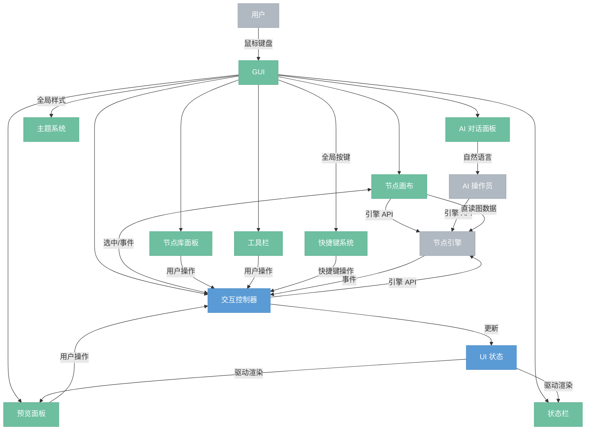

# GUI

> 图形界面前端，画布编辑节点图、预览结果，内含 AI 对话面板。

## 总览

---

## 模块

### 前端模块

- **节点画布**：节点图的可视化编辑区，GUI 最核心的模块。内含节点渲染器（负责节点 header/body/引脚绘制，body 内嵌参数控件系统渲染参数）、连线渲染。自建控件，不依赖第三方节点图库。
- **预览面板**：显示选中节点的输出预览。左侧悬浮面板，可拖动、可调整大小，覆盖在画布之上，随画布选中节点联动。支持缩放查看和像素级检查。自建 Canvas widget，自管渲染逻辑——引擎产出的 GPU 纹理在 wgpu 层直接 sample 显示，无需 CPU 回读。与节点画布模式一致：iced 提供容器和事件投递，渲染由面板自己控制。（变更：原为独立侧边面板，改为左侧悬浮可拖动面板）
- **节点库面板**：所有可用节点的搜索和添加入口。弹出式浮层，双击画布空白或拖出连接线后在空白处松开触发，顶部搜索框 + 下方分类菜单。
- **AI 对话面板**：内嵌的 AI 操作员对话界面。用户输入自然语言指令，转发给 AI 操作员处理。AI 操作员通过引擎 API 执行操作，GUI 通过事件感知变更自动刷新。
- **工具栏**：悬浮 pill 形状操作栏，默认居中固定在窗口顶部，可拖动移位。项目操作（新建/打开/保存/导出）、执行控制（运行/取消）、视图切换（面板显隐/布局切换）。（变更：原为顶部固定操作栏，改为悬浮 pill 可拖动）
- **状态栏**：底部状态信息区。显示后端连接状态、GPU 可用性、当前执行进度、FPS 等运行时信息。
- **主题系统**：全局样式管理。亮色/暗色模式切换，节点分类配色、引脚数据类型配色、文字/背景颜色 token。所有视觉模块从主题系统获取颜色。
- **快捷键系统**：全局和上下文快捷键管理。将按键组合映射为操作（Cmd+Z 撤销、Cmd+S 保存、Delete 删除节点等），不同焦点区域可注册不同快捷键。

### 逻辑模块

- **交互控制器**：GUI 全局的消息中枢。接收面板级用户操作（工具栏、节点库、预览面板、快捷键），翻译为引擎 API 调用；接收引擎事件（执行进度、图变更等），将相关状态同步到 UIState；管理面板级 UI 状态（面板显隐、布局）。全局快捷键操作（复制/粘贴/删除/全选）和引擎事件中与画布相关的部分转发给画布控制器处理。
- **UI 状态（UIState）**：交互控制器维护的轻量数据结构——当前选中节点、执行进度镜像、预览图 handle、面板显隐。预览面板和状态栏读 UIState 渲染；画布直接读引擎图数据，不经 UIState。

## 事件捕获

事件捕获分两层，各有归属：

- **面板级分发**：UI 框架（iced）负责。OS 事件（鼠标、键盘）根据焦点区域分发到对应面板的 Widget，各面板产生消息交给交互控制器。iced 在此仅承担渲染和原始事件投递，无需手动编写分发逻辑。
- **画布内部 hit-testing**：画布控制器负责。节点画布是一个自建控件，内部有大量可交互对象（节点、引脚、连线），框架不知道这些对象的位置。画布控制器接收原始鼠标事件，做 hit-testing 判断点击了哪个对象，翻译为语义消息（"开始连线"、"开始拖拽"、"选中节点"等）。

## 架构说明

GUI 采用类 Elm 架构（Model-View-Update），这是项目自身的架构选择，与具体 UI 框架无关。iced 仅作为壳——承担布局渲染和原始事件投递，不驱动业务架构。

**布局策略**：画布全屏占满窗口，所有其他面板（工具栏、预览面板、节点库等）以悬浮层叠加在画布之上，通过 Stack 容器实现，无固定分栏布局。（变更：原为固定侧边栏布局，改为画布全屏 + 悬浮面板叠加）

针对节点编辑器的特点做了如下调整：

| | 标准 Elm | 本设计 | 原因 |
|---|---|---|---|
| Model | 单一状态树，应用自己持有 | 核心状态在引擎，GUI 只持有轻量 UI 状态 | GUI 是纯前端，不持有业务数据 |
| Update | 单一 update 函数 | 拆成画布控制器 + 交互控制器 | 图内交互（有状态/连续）和面板交互（无状态/离散）性质不同 |
| View | 从 Model 渲染，产生 Message | 各前端模块渲染时捕获事件产生消息 | 与 Elm 一致 |
| 读路径 | View 只读 Model | 前端模块只读 UIState，UIState 由交互控制器从引擎同步 | 模块不耦合引擎 API，易于独立测试 |

## 交互方式

| 连接 | 说明 |
|------|------|
| 用户 → GUI | 鼠标键盘操作 |
| 节点画布 → 画布控制器 | 图内交互（拖拽、连线、框选、缩放等有状态操作） |
| 画布控制器 → 引擎 API | 图操作翻译为 API 调用（add_node、connect、move_node 等） |
| 画布控制器 → 交互控制器 | 选中状态变化，联动预览面板等模块 |
| 交互控制器 → 画布控制器 | 全局快捷键（复制/粘贴/删除/全选）、引擎事件转发 |
| 各面板 → 交互控制器 | 面板级用户操作（保存、执行、选节点类型等离散操作） |
| 快捷键系统 → 交互控制器 | 按键组合翻译为操作消息 |
| 交互控制器 → 引擎 API | 消息翻译为引擎 API 调用 |
| 引擎事件 → 交互控制器 | 引擎推送事件（执行进度、图变更等） |
| 交互控制器 → UIState | 将引擎事件同步为 UI 状态 |
| UIState → 各前端模块 | 模块渲染时读取，驱动界面更新 |
| AI 对话面板 → AI 操作员 | 转发自然语言指令（不经过控制器） |
