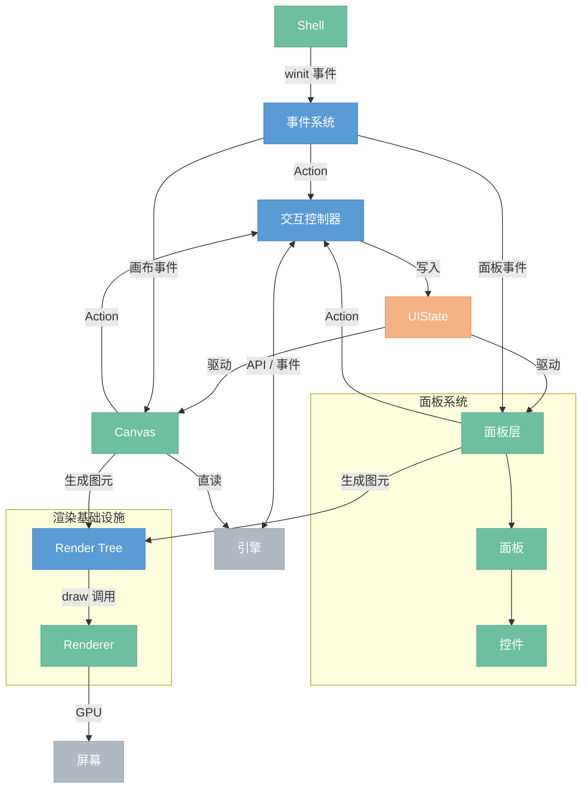

# GUI

> 图形界面前端。自建渲染 + 保留模式。画布编辑节点图、面板预览结果和调整参数。

## 模块总览



## 数据流

```
用户操作
  → Shell 收到 winit 事件
    → 事件系统：输入转换 → hit test（查 widget 树）→ 分发给目标 widget
      → widget 产生 Action（如"运行按钮被点击"）
        → 交互控制器：路由 action → 调引擎 API → 写 UIState → 通知脏 widget
          → Widget Tree：脏的 widget 重新生成 render tree 节点
            → Render Tree：脏的节点重建渲染缓存（tessellation、glyphon Buffer 等）
              → Renderer：遍历 render tree，发出 draw call → GPU 绘制
```

---

## 1. Shell

窗口和帧循环的薄封装。最外层的壳。

- **窗口管理** — 创建窗口、处理 resize、DPI 变化
- **GPU 上下文** — wgpu device / queue / surface 初始化
- **事件循环** — winit event loop，驱动每帧的 event → update → render

详见 [渲染层 §1](7.0.0-renderer.md)

## 2. 事件系统

把 OS 原始事件翻译成应用层事件，找到目标 widget，交给它处理。

- **输入转换** — winit 原始事件（物理按键、像素坐标）转为应用级事件（逻辑坐标、鼠标按钮）
- **Hit test** — 遍历 widget 树，根据坐标和 z-order 找到命中的 widget
- **焦点管理** — 键盘焦点追踪、Tab 切换、Escape 清除
- **事件分发** — 把事件交给命中的 widget，widget 产生 Action

事件捕获分两层：
- **面板级** — 事件系统负责。鼠标坐标 → hit test → 面板 → 控件 → Action
- **画布内部** — 画布控制器负责。画布是一个 widget，收到事件后自己做 hit test 判断点击了哪个节点/引脚/连线

## 3. 交互控制器

GUI 的消息中枢。widget 不直接调引擎，都经过交互控制器。

- **Action 路由** — widget 产生的 action（按钮点击、滑块拖动、画布选中节点）分发给对应处理器
- **引擎调用** — 翻译 action 为引擎 API（add_node、connect、execute、set_param 等）
- **UIState 写入** — 引擎返回结果 / 引擎推送事件后更新 UIState
- **脏通知** — UIState 变了，标记依赖该数据的 widget 为脏

## 4. UIState

纯数据仓库。交互控制器写，widget 树读。自己不做任何逻辑。

- **面板框架状态** — 每个面板的 visible、position、size
- **面板内容状态** — 每个面板的业务数据（预览的 zoom、属性面板的滚动位置）
- **全局共享状态** — 选中节点、执行进度、后端连接状态
- **画布状态** — camera transform、框选范围、拖拽中的连线
- **交互瞬态** — 当前拖拽 / resize 操作

```rust
UIState {
    panels: {
        "toolbar":    { visible, offset, size },
        "preview":    { visible, offset, size },
        "properties": { visible, offset, size },
    },
    content: {
        "preview":    { zoom: 1.0, offset: (0,0), image: None },
        "properties": { values: { "radius": 5.0, "opacity": 0.8 } },
    },
    active_interaction: Some(("preview", Drag)),
    selected_node: Some(NodeId(3)),
    execution_progress: None,
}
```

画布直读引擎图数据（节点、连线、参数），不经 UIState 镜像。UIState 只存 UI 相关的状态（选中、进度、面板显隐）。

详见 [面板系统 §2](2.9.0-panel.md)

## 5. Widget Tree

持久的 UI 元素层级。负责布局和脏标记。是 render tree 和事件系统的桥梁。

- **元素管理** — 创建 / 销毁 widget，维护父子关系
- **布局引擎** — measure（自底向上算尺寸）→ arrange（自顶向下分配位置）
- **布局节点** — Column（纵向）、Row（横向）、Scrollable（滚动）
- **脏标记** — UIState 变化后标记相关 widget，渲染时只更新脏的子树

```
Widget Tree
├── Canvas
│   ├── CanvasNode(id=1)
│   ├── CanvasNode(id=2)
│   └── Connection(1→2)
└── PanelLayer
    ├── Panel(toolbar)
    │   └── Row
    │       ├── Button("运行")
    │       └── Button("停止")
    └── Panel(preview)
        └── Column
            ├── TitleBar("预览")
            └── ImageViewer
```

Widget Tree 不持有渲染资源（glyphon Buffer、tessellation 结果等），这些在 Render Tree 里。

## 6. 控件库

面板内部的 UI 元素。三层架构：原子控件 → 组合控件 → 面板。

### 原子控件

最小使用单元。通过字符串 ID 标识，对外暴露事件接口。

| 类别 | 控件 | 暴露事件 |
|------|------|---------|
| 动作 | Button(id, label, icon) | Click |
| 输入 | Slider(id, label, range, **value**) | Change(f32) |
| 输入 | TextInput(id, label, **value**) | Change(String) |
| 输入 | Dropdown(id, options, **selected**) | Select(usize) |
| 输入 | Toggle(id, label, **value**) | Toggle(bool) |
| 查看 | ImageViewer(id, **image**) | Zoom(f32), Pan(Vector) |
| 查看 | TextDisplay(text) | — |
| 容器 | ListView(id, items, **selected**) | Select(usize) |
| 容器 | SearchBox(id, **query**) | Query(String) |
| 容器 | Group(id, label, **expanded**, children) | Toggle(bool) |
| 分割 | Separator, Spacing | — |

### 组合控件

原子控件 + 布局组合成更高级的控件。

| 组合控件 | 组成 | 暴露事件 |
|---------|------|---------|
| TitleBar | TextDisplay + Spacing(Fill) + buttons + Button("close") | Click |
| NumberInput | TextDisplay(label) + TextInput + 拖拽调节 | Change(f32) |
| ColorPicker | 色盘 canvas + RGBA Slider | Change(Color) |

详见 [面板系统 §3-4](2.9.0-panel.md)

## 7. 面板

浮动面板系统。面板是纯函数：`(Content, UIState) → 控件树`。

- **面板框架** — 通用的浮动面板壳：拖拽移动、resize（八方向）、显隐、定位、圆角裁剪、全屏捕获层
- **面板注册** — `register_panel!` 宏，一个文件定义配置 + Content 状态 + layout 函数 + route 函数
- **面板实例** — Toolbar、Preview、Properties 等
- **面板层管理** — z-order 排序、遮挡关系

```rust
register_panel! {
    id: "preview",
    position: TopRight,
    size: (300, 250),

    struct Content { zoom: f32, ... }
    fn layout(content: &Content, ui: &UIState) -> _ { ... }
    fn route(id: &str, event: ControlEvent, content: &mut Content, ctx: &mut AppContext) { ... }
}
```

详见 [面板系统 §5-7](2.9.0-panel.md)

## 8. Render Tree

Widget Tree 和 Renderer 之间的中间层。持久的场景图，管理渲染缓存。

- **场景图** — 可视图元的树形结构（圆角矩形、文字、图片、裁剪组），与 widget 一一对应
- **渲染缓存** — 每个节点持有自己的渲染资源（glyphon Buffer、tessellation 结果、bind group）
- **脏检测** — widget 标脏后，对应的 render tree 节点重建缓存；干净的节点直接复用

Widget Tree 和 Render Tree 的区别：

| | Widget Tree | Render Tree |
|---|---|---|
| 管什么 | UI 概念（按钮、面板、画布） | 可视图元（矩形、文字、图片） |
| 负责什么 | 布局、事件、业务逻辑 | 渲染缓存、脏重建、draw 调用 |
| 持有什么 | 子 widget、布局结果、状态 | tessellation、glyphon Buffer 等 |

详见 [渲染层](7.0.0-renderer.md)

## 9. Renderer

GPU 渲染管线。接收 draw 调用，输出像素。不知道 UI 概念，只管画图元。

- **绘制接口** — draw_rect / draw_text / draw_curve / draw_image / push_clip / pop_clip
- **管线** — quad、curve、image、shadow、stencil、text、svg
- **Buffer 管理** — DynamicBuffer 帧间复用、SharedViewport
- **帧调度** — prepare → upload → render pass → submit

详见 [渲染层](7.0.0-renderer.md)

---

## 依赖方向

```
Shell → 事件系统 → Widget Tree → Render Tree → Renderer
                 ↘               ↗
            交互控制器 → UIState
                 ↕
              引擎 API
```

单向数据流。上游不依赖下游。UIState 是被动数据，不引用任何模块。
