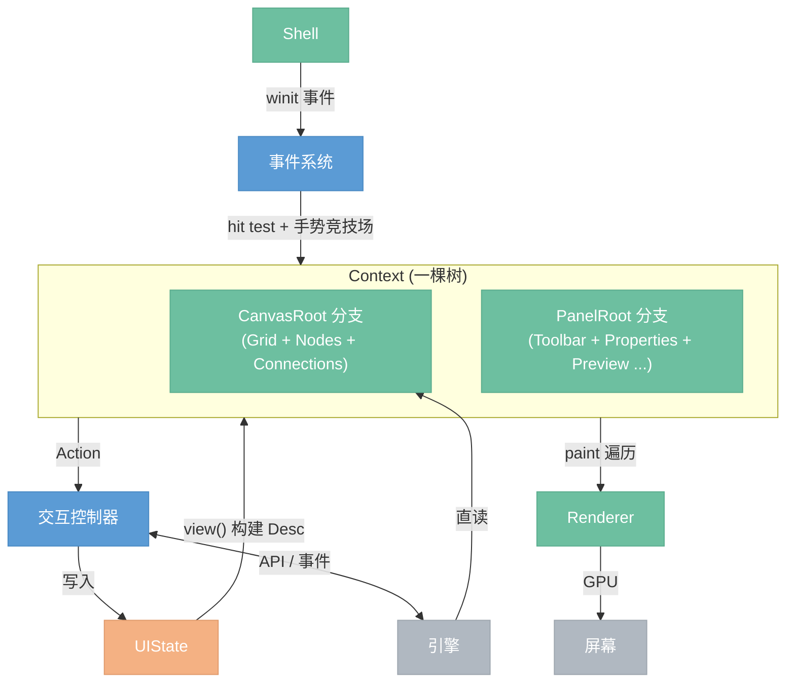

# GUI

> 图形界面前端。自建渲染 + 保留模式。画布编辑节点图、面板预览结果和调整参数。

## 模块总览



## 数据流

```plaintext
用户操作
  → Shell 收到 winit 事件
    → 事件系统：输入转换 → Context.hit_test → hit chain（从叶子到根）
      → 手势竞技场：命中链上节点注册 recognizers → 竞争 → 产出 Action
        → 交互控制器：路由 action → 调引擎 API → 写 UIState
          → update：view() 构建 Desc → reconcile 更新树
            → render：tree/layout/ 算位置 → tree/paint.rs 遍历树 → Renderer GPU 绘制
```

---

## 1. Shell

窗口和帧循环的薄封装。最外层的壳。

- **窗口管理** — 创建窗口、处理 resize、DPI 变化
- **GPU 上下文** — wgpu device / queue / surface 初始化
- **事件循环** — winit event loop，驱动每帧的 event → update → render

详见 [渲染层 §1](7.0.0-renderer.md)

## 2. 事件系统

把 OS 原始事件翻译成应用层事件，找到命中目标并产出 Action。

- **输入转换** — winit 原始事件（物理按键、像素坐标）转为应用级事件（逻辑坐标、鼠标按钮）
- **统一 Hit test** — `Context.hit_test(x, y)` 遍历一棵树（PanelRoot 在前、CanvasRoot 在后，反向遍历实现 z-order），基于 `hittable` 和 `gestures` 属性判断命中。遇到 Transform 节点（如 CanvasRoot 的 camera）对坐标做逆变换。返回 hit chain（从叶子到根的完整路径）而不是单个节点 id
- **手势竞技场** — hit chain 上各节点注册 gesture recognizers（Tap、Drag、LongPress、Resize），竞技场根据移动距离、时间等条件竞争，产出唯一的 Action
- **焦点管理** — 键盘焦点追踪、Tab 切换、Escape 清除
- **事件分发** — 产出的 Action 交给交互控制器处理

整棵树只有一套命中测试和一套事件分发逻辑。CanvasRoot 和 PanelRoot 作为一棵树的两个分支，在 `Context.hit_test` 内部通过 Transform 节点区分坐标系——不存在独立的"面板事件"和"画布事件"两套分发机制。

## 3. 交互控制器

GUI 的消息中枢。控件不直接调引擎，Action 都经过交互控制器。

- **Action 路由** — 手势竞技场产出的 Action（携带 widget id 和手势数据）分发给对应处理器
- **引擎调用** — 翻译 Action 为引擎 API（add\_node、connect、execute、set\_param 等）
- **UIState 写入** — 引擎返回结果 / 引擎推送事件后更新 UIState

## 4. UIState

纯数据仓库。交互控制器写，控件树读。自己不做任何逻辑。

- **面板内容状态** — 每个面板的业务数据（预览的 zoom、属性面板的参数值）
- **全局共享状态** — 选中节点、执行进度、后端连接状态
- **画布状态** — camera transform、框选范围、拖拽中的连线
- **交互瞬态** — 当前拖拽 / resize 操作

```rust
UIState {
    content: {
        "preview":    { zoom: 1.0, offset: (0,0), image: None },
        "properties": { values: { "radius": 5.0, "opacity": 0.8 } },
    },
    active_interaction: Some(("preview", Drag)),
    selected_node: Some(NodeId(3)),
    execution_progress: None,
}
```

**面板的几何状态（位置、大小、visible）不存 UIState**，而是挂在 Panel widget 的树节点上，跨帧保留。reconcile 不覆盖这些运行时状态字段，面板从 Desc 传入的只是初始值和 content。

画布直读引擎图数据（节点、连线、参数），不经 UIState 镜像。UIState 只存 UI 业务状态（选中、进度、内容参数）。

详见 [面板系统 §2](2.9.0-panel.md)

## 5. 控件树

**全局一棵树**。Context 持有这棵树，布局、事件、渲染三件事都直接在这棵树上完成。基本概念（图元、容器、三级控件）详见 [基本概念](2.14.0-concepts.md)。

- **三种节点类型** —— `NodeKind::{ Container, Leaf(LeafKind), Widget(Box<dyn WidgetProps>) }`
- **声明式更新** — view() 构建 Desc 描述树 → reconcile 对比旧树，按 id 匹配复用/创建/销毁
- **布局引擎** — 通过 LayoutTree trait 泛型操作，measure（自底向上算尺寸）→ arrange（自顶向下分配位置），支持 Flexbox 和 Absolute 定位，结果直接写入节点 rect
- **渲染遍历** — tree/paint.rs 遍历树，Container 按 Decoration 画背景/边框/阴影/圆角，Leaf 按 LeafKind 分发到对应渲染管线，Widget 递归展开后继续遍历
- **命中测试** — tree/hit.rs 遍历树，基于 `hittable` 和 `gestures` 属性判断命中，返回 hit chain（从叶子到根的完整路径）

### 节点类型

| 类型 | NodeKind | 用途 |
|------|---------|------|
| 容器 | `Container` | 结构骨架，有子节点，负责布局（BoxStyle）和视觉装饰（Decoration），不产出 Action |
| 图元 | `Leaf(LeafKind)` | 不可再分的渲染单元，可直接在控件 `build()` 中使用，支持 id 和 gestures |
| 控件 | `Widget(Box<dyn WidgetProps>)` | 带 Props 的交互单元，`build()` 展开为子树，分原子/组合/特定框架三级 |

LeafKind 列表：Text、Image、Icon、Circle、Line、Curve、Path、Grid、Connection、CustomPaint。详见 [基本概念 §图元](2.14.0-concepts.md)。

### Context 一棵树，两个分支

Context 根节点 Root 下有两个分支：**CanvasRoot（画布分支）** 和 **PanelRoot（面板分支）**。CanvasRoot 在前（先绘制 = 在底层），PanelRoot 在后（后绘制 = 在上层），这样面板天然画在画布之上。

`Desc::Widget` 在树中存为 `Widget` 节点，reconcile 调用 `WidgetProps::build()` 展开子树。应用代码层面看到的是控件函数（`button(...)`、`panel(...)`、`node_card(...)` 等）以及原子控件内部直接组合的 Container + Leaf 子树。

### UI 层级结构

```plaintext
Root — Container
│
├── CanvasRoot — Container(Transform: camera)              先绘制，底层
│   │
│   ├── background — Leaf(LeafKind::Grid)                  图元直接作为画布背景
│   │
│   ├── Nodes — Container
│   │   │
│   │   ├── node_blur — Widget(NodeCardProps)              Framework Widget
│   │   │   ├── [build 展开] →
│   │   │   ├── title_bar — Widget(TitleBarProps)          Composite Widget
│   │   │   │   ├── Leaf(Text "Blur")                      图元（直接使用）
│   │   │   │   ├── spacer — Container(Fill)
│   │   │   │   └── close — Widget(ButtonProps)            Atomic Widget
│   │   │   │       └── Container(decoration)
│   │   │   │           └── Leaf(Text "×")                 图元（Button 内部直接用）
│   │   │   │
│   │   │   ├── ports — Container(Column)
│   │   │   │   ├── in_port — Container(Row)
│   │   │   │   │   ├── Leaf(Circle, gestures: [Tap])      图元（端口圆点，可命中）
│   │   │   │   │   └── Leaf(Text "Image")                 图元
│   │   │   │   └── out_port — Container(Row) ...
│   │   │   │
│   │   │   ├── params — Container(Column)
│   │   │   │   └── radius — Widget(SliderProps)           Atomic Widget
│   │   │   │       └── Container(Row)
│   │   │   │           ├── Leaf(Text "Radius")            图元
│   │   │   │           ├── Container(decoration: 轨道)
│   │   │   │           │   └── Container(decoration: 填充)
│   │   │   │           └── Leaf(Text "5.0")               图元
│   │   │   │
│   │   │   └── preview — Container(decoration)
│   │   │       └── Leaf(Image thumbnail)                  图元
│   │   │
│   │   ├── node_output — Widget(NodeCardProps) ...
│   │   │
│   │   └── (选中节点时) popup — Widget(PopupPanelProps)   Composite Widget
│   │       └── ... 注入的内容
│   │
│   └── Connections — Container
│       ├── Leaf(LeafKind::Connection {                    图元直接作为节点连线
│       │          from_port: NodeId,
│       │          to_port: NodeId,
│       │          gestures: [Tap] })
│       └── Leaf(LeafKind::Connection { ... })
│
└── PanelRoot — Container                                  后绘制，上层
    │
    ├── toolbar — Widget(PanelProps, Absolute)             Framework Widget
    │   ├── title_bar — Widget(TitleBarProps, draggable)   Composite Widget
    │   │   ├── Leaf(Text "工具栏")                        图元
    │   │   └── Widget(ButtonProps "close")
    │   └── content — Container(Row, padding)              ← 注入的内容
    │       ├── Widget(ButtonProps "新建")
    │       ├── Widget(ButtonProps "打开")
    │       ├── Widget(ButtonProps "保存")
    │       └── Widget(DropdownProps)
    │
    ├── properties — Widget(PanelProps, Absolute)          Framework Widget
    │   ├── title_bar — Widget(TitleBarProps, draggable)
    │   └── content — Container(Column, Scroll)            ← 注入的内容
    │       ├── Leaf(Text "节点名称")                      图元
    │       ├── Widget(SliderProps "半径")
    │       ├── Widget(TextInputProps "精确输入")
    │       ├── Widget(ToggleProps "HDR")
    │       └── Widget(ColorPickerProps "颜色")            Composite Widget
    │           ├── Leaf(LeafKind::CustomPaint 色盘)       图元直接作为自定义绘制
    │           ├── Widget(SliderProps "R")
    │           ├── Widget(SliderProps "G")
    │           ├── Widget(SliderProps "B")
    │           └── Widget(TextInputProps "Hex")
    │
    └── preview — Widget(PanelProps, Absolute)             Framework Widget
        ├── title_bar — Widget(TitleBarProps, draggable)
        └── content — Container
            └── Widget(ImageViewerProps)                    Atomic Widget
```

原子控件的 `build()` 直接组合 Container 和 Leaf 子树——这是最常见的写法。简单的显示（文字、图标、图片、端口圆点、连线）作为 Leaf 直接出现，需要交互时在 Leaf 上加 `gestures` 即可。Container 只管结构和装饰，不产出 Action。

### 树的作用

树描述**谁包含谁**。三个系统沿着树工作：

- **布局** — 父节点约束子节点的位置和大小
- **事件** — 从命中的叶子往上构造 hit chain，沿链收集 gesture recognizers
- **渲染** — 按树的顺序决定绘制顺序（z-order）

### 两个分支的差异

|  | PanelRoot 分支 | CanvasRoot 分支 |
| --- | --- | --- |
| **坐标系** | 屏幕坐标（无 transform） | 世界坐标（camera transform） |
| **顶层子项定位** | Absolute（屏幕 x, y） | Absolute（世界 x, y） |
| **子项内部布局** | Flexbox | Flexbox |
| **特有 LeafKind** | 无 | Grid、Connection |
| **共享基础设施** | 同一棵树、同一个布局引擎、同一套 paint/hit test | |

两个分支**共享全部基础设施**：一棵 tree、一个布局引擎、一套 paint/hit test 算法、同一套控件函数。差异仅在 CanvasRoot 的 Transform 属性和特有图元。不存在"两棵树"或"两套处理逻辑"的概念。

### 设计要点

- **Panel 和 Canvas 是一棵树的两个分支** — 不是两棵独立的树。CanvasRoot 先绘制（底层），PanelRoot 后绘制（上层），保证面板画在画布之上
- **面板是特定框架控件（Framework Widget）** — 面板的所有能力（自由定位、拖拽、resize、阴影、圆角）都来自容器的通用属性和手势系统，没有面板专属的实现
- **Camera 是 Container 的 transform 属性** — 不是独立概念。CanvasRoot 持有 `transform: Camera`，影响所有后代的绘制和命中测试坐标
- **原子控件直接组合图元** — 原子控件的 `build()` 直接写 Container + Leaf 子树，Leaf 本身支持 id 和 gestures。简单的显示不需要包装
- **控件函数是共享系统** — `slider()` 就是 `slider()`，不管放在属性面板还是节点卡片里，返回相同的子树
- **Flexbox 布局引擎通过 LayoutTree trait 共享** — 所有控件的内部布局都走同一套引擎
- **面板的几何状态挂在树节点上** — 位置、大小、visible 在 PanelNode 结构里跨帧保留，reconcile 不覆盖
- **Canvas 维护渲染状态，引擎持有数据** — 引擎的节点图只有数据（类型、参数、连接），Canvas 分支维护渲染状态（位置、大小、展开/折叠、路径缓存）
- **选中等 UI 业务状态存 UIState** — 引擎存数据，UIState 存 UI 业务状态（选中了谁、在拖什么、参数值）

### 目标文件结构

```plaintext
gui/src/
│
├── tree/                  ← 核心基础设施：一棵树 + 所有遍历算法
│   ├── tree.rs                存储：arena 实现、NodeId 索引、增删查节点
│   ├── node.rs                节点数据 PanelNode { id, style, decoration, kind, rect, children, ... }
│   │                           NodeKind::{ Container, Leaf(LeafKind), Widget(Box<dyn WidgetProps>) }
│   │                           LeafKind::{ Text, Image, Icon, Circle, Line, Curve, Path,
│   │                                        Grid, Connection, CustomPaint }
│   ├── desc.rs                声明式描述 Desc::{ Container, Leaf, Widget }
│   ├── diff.rs                reconcile：Desc ↔ 树对比，按 id 匹配复用/创建/销毁
│   ├── layout/                布局引擎
│   │   ├── types.rs               BoxStyle, Edges, Size, Decoration, Align, Justify, Overflow, Position
│   │   ├── measure.rs             自底向上算尺寸
│   │   └── arrange.rs             自顶向下分配位置（Flexbox + Absolute）
│   ├── paint.rs               绘制遍历（按 NodeKind/LeafKind 分发到渲染管线）
│   └── hit.rs                 命中测试（返回 hit chain，按 LeafKind 分发检测算法）
│
├── widget/                ← 控件定义（三级分层）
│   ├── props.rs               WidgetProps trait + WidgetBuild 返回类型
│   ├── atoms/                 原子控件（最小功能单元）
│   │   ├── button.rs
│   │   ├── slider.rs
│   │   ├── text_input.rs
│   │   ├── toggle.rs
│   │   ├── dropdown.rs
│   │   ├── checkbox.rs
│   │   └── image_viewer.rs
│   ├── composites/            组合控件（多个原子聚合）
│   │   ├── color_picker.rs
│   │   ├── number_input.rs
│   │   ├── search_box.rs
│   │   ├── title_bar.rs
│   │   ├── group.rs
│   │   └── popup_panel.rs
│   ├── frameworks/            特定框架控件模板（顶层结构单元）
│   │   ├── panel.rs               Panel 模板：chrome + content slot
│   │   └── node_card.rs           NodeCard 模板：card + ports + content
│   ├── state.rs               InteractionState（Normal/Hovered/Pressed/Focused/Disabled）
│   ├── action.rs              Action 枚举（Click/Change/Toggle/Select/DragStart 等）
│   ├── focus.rs               FocusState（焦点追踪、Tab 切换）
│   └── text_edit.rs           TextEditState（光标、选区、编辑操作）
│
├── gesture/               ← 手势识别系统
│   ├── recognizer.rs          GestureRecognizer trait
│   ├── arena.rs               GestureArena（多识别器竞争）
│   ├── tap.rs                 TapRecognizer（点击/双击）
│   ├── drag.rs                DragRecognizer
│   └── long_press.rs          LongPressRecognizer
│
├── canvas/                ← 画布特有逻辑（非控件系统，坐标系相关）
│   ├── camera.rs              相机变换（世界坐标 ↔ 屏幕坐标）
│   ├── pan.rs                 平移状态
│   └── background.rs          Leaf(Grid) 的实际渲染代码（被 tree/paint.rs 调用）
│
├── panel/                 ← 面板实例（用 widget/frameworks/panel 构建）
│   ├── toolbar.rs             Toolbar 实例（register_panel! 宏展开）
│   ├── properties.rs          Properties 实例
│   └── preview.rs             Preview 实例
│
├── context.rs             ← GUI 中心对象
│                              pub struct Context {
│                                  tree: Tree,
│                                  camera: Camera,
│                                  gesture_arena: Option<GestureArena>,
│                              }
│                              impl Context {
│                                  fn hit_test(&self, x, y) -> HitResult;
│                                  fn render(&self, renderer, viewport);
│                                  fn update(&mut self, desc: Desc);
│                              }
│
├── shell/                 ← 窗口、事件循环
│   ├── app.rs
│   ├── event.rs
│   ├── runner.rs
│   └── window.rs
│
├── renderer/              ← GPU 渲染管线
│   ├── pipeline/              quad, circle, curve, image, shadow, stencil, text, svg
│   ├── buffer.rs
│   ├── command.rs
│   └── ...
│
├── theme/                 ← 主题 token
│   └── mod.rs
│
└── lib.rs
```

### 依赖方向

```plaintext
shell       →  产生 AppEvent
renderer    →  被 tree/paint.rs 调用
tree/       →  核心，不依赖 widget
widget/     →  依赖 tree（WidgetProps::build 返回 Desc）
gesture/    →  依赖 widget（产出 Action）
canvas/     →  依赖 tree + renderer（background 画图）
panel/      →  依赖 widget/frameworks/panel
context.rs  →  依赖 tree + gesture + canvas
```

**核心原则**：`tree/` 不知道 `widget/` 的存在。树只认 NodeKind 三种类型。Widget 通过 trait 对象存在树里，树遍历时不关心 trait 的具体实现。

### 三条管线

三个系统不是三个目录，而是贯穿现有模块的三条管线：

- **布局** — `tree/layout/` 提供统一 Flexbox + Absolute 引擎，所有节点走同一套引擎。CanvasRoot 上的 Transform 属性负责世界坐标到屏幕坐标的变换
- **事件** — `shell/` 产生 AppEvent → `context.hit_test` 返回 hit chain → `gesture/arena` 按命中链注册识别器、竞争、产出 Action → 交互控制器路由
- **渲染** — `tree/paint.rs` 遍历整棵树，根据 NodeKind 分发：Container 画 Decoration、Leaf 按 LeafKind 走对应渲染管线、Widget 递归展开后继续遍历 → `renderer/` 执行 GPU 绘制

当前 paint 每帧全量遍历。将来可在节点上缓存渲染资源（详见 §8）。

## 6. 控件库

控件按**语义角色**分为三级（加上图元共四层），完整定义见 [基本概念](2.14.0-concepts.md)。

| 层级 | 作用 | 典型示例 |
|------|------|---------|
| 图元 (Primitive) | 不可再分的渲染单元，可带 id 和 gestures 直接使用 | Text, Image, Icon, Circle, Grid, Connection, CustomPaint |
| 原子控件 (Atomic) | 最小功能单元，直接组合 Container + Leaf 提供交互 | Button, Slider, TextInput, Toggle, Dropdown |
| 组合控件 (Composite) | 多原子聚合，完成一件复杂任务 | ColorPicker, NumberInput, SearchBox, Group |
| 特定框架控件 (Framework) | 应用顶层结构单元，带内容槽 | Panel, NodeCard |

**分层职责**：原子控件的 `build()` 可以直接组合 Container 和 Leaf 构成子树。组合控件的 `build()` 一般包含其他 Widget 节点。特定框架控件的 `build()` 除了 chrome 还接受一个内容槽 `Vec<Desc>`。每一层都可以嵌套下一层，没有强制约束。

详见 [基本概念 §控件](2.14.0-concepts.md) 和 [面板系统 §3-4](2.9.0-panel.md)

## 7. 面板

面板是**特定框架控件（Framework Widget）**——见 [基本概念 §特定框架控件](2.14.0-concepts.md)。不是独立的系统，只是一种承担应用顶层结构角色的组合控件。所有能力（自由定位、拖拽、resize、阴影圆角）都来自容器的通用属性和手势系统，没有面板专属的实现。

- **面板外壳由通用容器组合而成** — Absolute position（自由定位）+ Decoration（shadow/border/radius）+ draggable/resizable gestures + Container(Overflow::Scroll) 内容区
- **面板实例** — Toolbar、Properties、Preview 等，放在 `panel/` 目录下作为 PanelRoot 的直接子节点
- **面板 z-order 管理** — 由 PanelRoot 子节点顺序决定。点击面板时把它从 children 列表移到末尾（最后绘制 = z-order 最上），hit test 反向遍历（最后的先检查）
- **面板几何状态跨帧保留** — 位置、大小、visible 挂在 Panel widget 的树节点上，reconcile 不覆盖这些运行时字段

### register_panel! 宏

一个文件定义面板实例：打包配置 + 状态初始值 + layout 函数 + route 函数，展开为对应的 Panel widget 构造器。

```rust
register_panel! {
    id: "preview",
    position: TopRight,
    size: (300, 250),

    struct Content { zoom: f32, ... }
    fn layout(content: &Content, ui: &UIState) -> _ { ... }
    fn route(id: &str, event: Action, content: &mut Content, ctx: &mut AppContext) { ... }
}
```

详见 [面板系统 §5-7](2.9.0-panel.md)

## 8. 渲染缓存（将来优化）

当前每帧全量 reconcile + layout + paint，对小规模 UI 无压力。将来 UI 复杂化后可在现有树上做缓存优化：

- **脏检测** — 每个节点存 props_hash，reconcile 时只更新 hash 变化的节点
- **子树跳过** — paint 时 hash 未变的子树整个跳过
- **渲染资源缓存** — glyphon Buffer、tessellation 结果等按需缓存在节点上

不需要独立的 Render Tree 层。控件树本身已经细到图元级别（Container + Leaf + Widget），直接承担渲染遍历。这是 Flutter、SwiftUI、React 等框架的通用做法。

## 9. Renderer

GPU 渲染管线。接收 draw 调用，输出像素。不知道 UI 概念，只管画图元。

- **绘制接口** — draw\_rect / draw\_text / draw\_curve / draw\_image / push\_clip / pop\_clip
- **管线** — quad、curve、image、shadow、stencil、text、svg
- **Buffer 管理** — DynamicBuffer 帧间复用、SharedViewport
- **帧调度** — prepare → upload → render pass → submit

详见 [渲染层](7.0.0-renderer.md)

---

## 依赖方向

```plaintext
Shell → 事件系统 → 控件树 → Renderer
                 ↘        ↗
            交互控制器 → UIState
                 ↕
              引擎 API
```

单向数据流。上游不依赖下游。UIState 是被动数据，不引用任何模块。