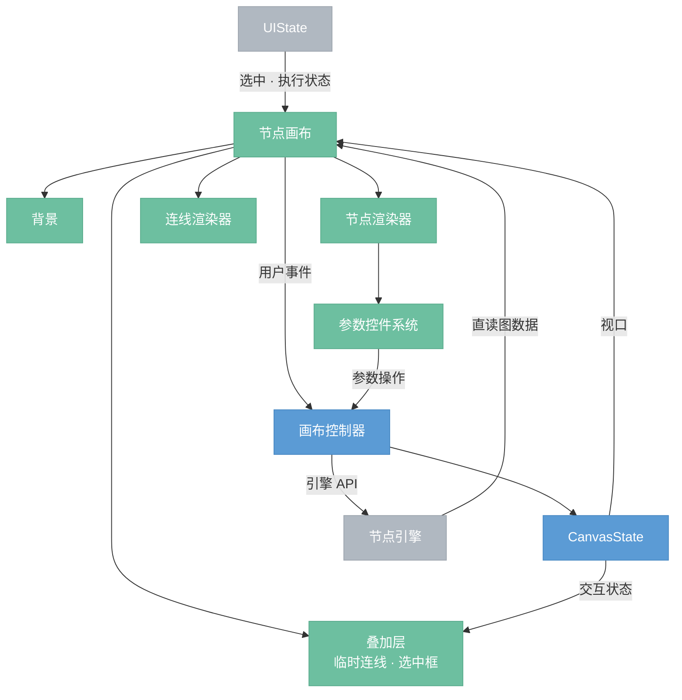

# 节点画布

> 节点图的可视化编辑区，GUI 最核心的模块。自建 Canvas widget，不依赖第三方节点图库。画布占满整个窗口，其他面板以悬浮层叠加其上。（变更：原为布局中的一个区域，改为全窗口填充）

## 总览

---

## 组件

- **背景**：画布背景，通常为网格，随视口平移缩放。
- **节点渲染器**：渲染每个节点的 header、body、引脚。body 内嵌参数控件系统。
- **参数控件系统**：节点 body 内的交互控件（滑块、下拉框、开关等）。捕获用户输入，通过画布控制器调用 `set_param`。
- **连线渲染器**：渲染已连接的贝塞尔曲线，颜色跟随源引脚数据类型。
- **叠加层**：渲染进行中的临时状态——拖拽连线时跟随鼠标的临时线、框选时的矩形。由 CanvasState 的 `ActiveInteraction` 驱动。
- **画布控制器**：画布的逻辑层，详见 [2.1.1-canvas-controller](./2.1.1-canvas-controller.draft.md)。

## 数据来源

| 数据 | 来源 | 说明 |
|------|------|------|
| 节点位置、连线、参数 | 引擎（直读） | 图数据量大，不经 UIState 镜像 |
| 选中节点、执行状态 | UIState | 交互控制器同步 |
| 视口位置/缩放 | CanvasState | 画布控制器维护 |
| 临时交互状态 | CanvasState | 拖拽/连线/框选进行中状态 |

## 执行状态显示

节点在执行期间根据 UIState 中的执行状态显示视觉反馈：

| 状态 | 显示 |
|------|------|
| 等待执行 | 无变化 |
| 执行中 | header 显示进度条或旋转指示器 |
| 执行完成 | 恢复正常 |
| 执行出错 | header 变红，显示错误图标 |
