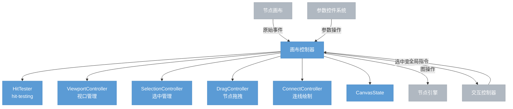

# 画布控制器

> 节点画布的逻辑层。接收画布原始事件，通过子模块协同处理所有画布内交互，调用引擎 API 执行图操作。

## 总览



---

## 子模块

### HitTester

接收鼠标位置，结合视口变换和节点布局，判断命中对象。优先级从高到低：

```
引脚 > 节点（header / body）> 连线 > 空白
```

视口裁剪：只对视口内可见节点做 hit-testing，大型图的性能保证。

### ViewportController

管理视口平移和缩放。

| 操作 | 触发方式 |
|------|---------|
| 平移 | 中键拖拽 / 空格+左键拖拽 |
| 缩放 | 滚轮 / 触控板双指捏合，以鼠标位置为中心 |
| 适应视口 | 工具栏按钮 / 快捷键，缩放到所有节点可见 |
| 滚动到节点 | AI 操作员或引擎事件触发，视口平移到目标节点 |
| LOD | 缩放比极小时，节点简化渲染（仅显示 header） |

`CanvasState.viewport` 随项目保存，重新打开时恢复上次视角。

### SelectionController

管理节点选中状态，变化后通知交互控制器更新 `UIState.selection`。

| 操作 | 行为 |
|------|------|
| 单击节点 | 选中该节点，清除其他选中 |
| Shift+单击 | 切换该节点的选中状态 |
| 单击空白 | 取消全部选中 |
| 框选 | 替换选中为框内所有节点 |
| Shift+框选 | 追加框内节点到选中 |
| Alt+框选 | 从选中中减去框内节点 |
| Cmd+A | 全选所有节点 |
| Tab | 循环选中下一个节点 |

**右键选中规则**：右键未选中节点时，先将其选中（清除其他选中）再弹出菜单；右键已选中节点时，保持当前选中状态。

### DragController

管理节点拖拽移动。

- **点击/拖拽区分阈值**：鼠标按下后移动超过 4px 才触发拖拽
- **多节点同步拖拽**：以鼠标按下的节点为锚点，所有选中节点同步偏移
- **Z 层序提升**：拖拽中的节点提升到最顶层渲染，完成后恢复
- **自动滚动**：拖拽接近画布边缘时视口自动跟随滚动
- **对齐辅助线**：拖拽时接近其他节点时显示对齐参考线
- **键盘微移**：方向键移动选中节点（1px），Shift+方向键（10px）

拖拽完成调用 `move_node(ids, positions)`。

### ConnectController

管理连线的绘制和重连。

- **新建连线**：从输出引脚拖出，跟随鼠标显示临时线
- **重连已有连线**：拖拽已有连线的端点到新引脚
- **兼容性高亮**：拖拽中兼容引脚高亮，不兼容引脚变暗
- **单输入引脚提示**：目标引脚已有连接时，显示"将断开原有连线"提示
- **连线路径高亮**：选中节点时，高亮该节点上下游所有连线
- **连线选中**：点击连线选中，Delete 键删除

连线完成调用 `connect(from, to)`；重连先 `disconnect` 再 `connect`。

---

## CanvasState 扩展

在 `0.1.0-models.md` 定义的基础上，补充：

```
CanvasState {
    viewport:    Viewport,
    interaction: Option<ActiveInteraction>,
    hover:       Option<HoverTarget>,
    z_order:     Vec<NodeId>,
    video:       HashMap<NodeId, VideoPlaybackState>,
}

VideoPlaybackState { playing: bool, current_frame: u64 }

HoverTarget = Node(NodeId)
            | Pin(NodeId, PinId)
            | Connection(ConnectionId)
```

---

## 事件处理原则

**键盘焦点管理**：焦点在节点内文本输入或参数控件时，Delete/空格等键由控件消费，不触发画布快捷键。

**Escape 取消**：任何进行中的交互（连线、框选、拖拽）按 Escape 均可取消，清空 `ActiveInteraction`。

**交互中按 Undo**：拖拽或连线进行中按 Cmd+Z，等同于 Escape（取消当前交互），不触发引擎 undo。

**Tooltip 延迟**：悬停引脚/连线超过 600ms 才显示 Tooltip。

**鼠标离开窗口**：拖拽中鼠标移出窗口后松开，正确取消当前交互，清空 `ActiveInteraction`。

---

## 引擎 API 调用

| 操作 | API |
|------|-----|
| 移动节点 | `move_node(ids, positions)` |
| 新建连线 | `connect(from_node, from_pin, to_node, to_pin)` |
| 断开连线 | `disconnect(connection_id)` |
| 添加节点 | `add_node(type_id, position)` |
| 删除节点 | `remove_nodes(ids)` |
| 修改参数 | `set_param(node_id, param, value, preview)` |

---

## 右键菜单

检测右键事件，确定菜单内容后发给交互控制器渲染：

| 右键对象 | 菜单内容 |
|---------|---------|
| 节点 | 删除、复制、粘贴、断开所有连线 |
| 连线 | 删除连线 |
| 空白处 | 粘贴 |

---

## 刷新机制

画布重绘由两类来源触发，画布控制器统一管理：

### 内部触发（CanvasState 变化）

画布控制器修改 CanvasState 后立即通知画布重绘：

| 变化 | 触发场景 |
|------|---------|
| `viewport` 变化 | 平移、缩放、适应视口 |
| `interaction` 变化 | 拖拽中节点位置、临时连线跟随鼠标、框选矩形更新 |
| `hover` 变化 | 鼠标移入/移出节点、引脚、连线 |
| `z_order` 变化 | 拖拽开始/结束时节点层序变化 |

### 外部触发（交互控制器下发）

引擎事件或全局状态变化通过交互控制器通知画布控制器：

| 来源 | 触发场景 |
|------|---------|
| 图数据变更 | 节点增删、连线增删、参数变化 |
| 执行状态变化 | 节点开始执行、完成、出错 |
| 选中状态变化 | 其他途径（AI 操作员）触发的选中变更 |

### iced 实现

画布是 iced 的 `Canvas` widget，内部维护 `Cache`。需要重绘时调用 `cache.clear()`，iced 在下一帧重新调用 `Program::draw`。

```
CanvasState 变化 / 外部通知
    → 画布控制器调用 cache.clear()
    → iced 下一帧触发 Program::draw
    → 画布从引擎 + UIState + CanvasState 读取最新数据渲染
```

高频更新场景（拖拽中每帧变化）直接在 `Program::update` 里更新状态并 clear cache，不走消息系统。

---

## 外部拖放

| 拖放内容 | 行为 |
|---------|------|
| 从节点库拖入 | 在放置位置创建对应类型节点 |
| 从 OS 拖入图片文件 | 创建 LoadImage 节点，路径填入参数 |
| 从 OS 拖入视频文件 | 创建 LoadVideo 节点 |
