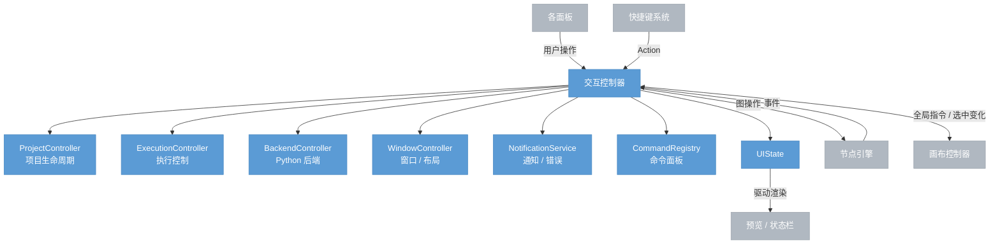

# 交互控制器

> GUI 全局的消息中枢。接收各面板的用户操作，路由给子模块处理；接收引擎事件，维护 UIState 并通知各模块刷新。

## 总览



---

## 核心职责

交互控制器本身只做两件事，其余委派给子模块：

1. **消息路由** — 接收面板操作和快捷键 Action，分发给对应子模块
2. **UIState 维护** — 接收引擎事件，更新 UIState，通知各模块刷新

---

## 子模块

### ProjectController

项目文件的完整生命周期管理。

| 职责 | 说明 |
|------|------|
| 新建 / 打开 / 保存 | 调用引擎项目管理器 |
| 项目模板 | 提供预设模板选择界面 |
| 最近文件列表 | 记录并持久化最近打开的项目 |
| 文件关联 | 处理 OS 传入的 `.nodeimg` 文件打开请求 |
| 自动保存 | 定时触发保存，防止数据丢失 |
| 保存时状态收集 | 聚合引擎图状态 + 画布视口状态后写文件 |
| Dirty 标记 | 维护未保存状态，驱动窗口标题的 `•` 标记 |

### ExecutionController

执行流程管理。

| 职责 | 说明 |
|------|------|
| 运行 / 取消 | 调用引擎执行 API |
| 执行队列 | 多次触发时排队或忽略，策略可配置 |
| AI 批量撤销 | AI 操作员的连续操作打包为单个 undo 单元 |
| Undo 协调 | Cmd+Z 时判断：画布有进行中交互 → 取消交互；否则 → 引擎 undo |

### BackendController

Python 推理后端的连接管理。

| 职责 | 说明 |
|------|------|
| 自动启动 | `python_auto_launch=true` 时 app 启动时拉起后端进程 |
| 连接状态监测 | 定期心跳检测，推送连接状态到 UIState |
| 崩溃恢复 | 检测到后端崩溃时自动重启，AI 节点恢复 pending 状态 |
| 手动重连 | 提供手动重连入口（状态栏点击） |

### WindowController

窗口和布局管理。

| 职责 | 说明 |
|------|------|
| 窗口标题 | 显示项目名 + dirty 标记（`project.nodeimg •`） |
| 面板布局 | 管理面板显隐和尺寸，持久化到 AppConfig |
| 焦点管理 | 模态对话框打开时锁定焦点，关闭后恢复 |
| 模态对话框栈 | 管理多层叠加对话框（确认框、设置面板等） |
| 退出确认 | 有未保存修改时弹出确认对话框 |
| 视口跟随 | AI 操作员选中节点后，通知画布控制器滚动到该节点 |

### NotificationService

用户反馈和错误显示。

| 职责 | 说明 |
|------|------|
| Toast 通知 | 操作成功/失败的临时提示，自动消失 |
| 错误处理 | 引擎 API 调用失败时展示错误信息 |
| 通知去重 | 批量错误合并为一条，避免 Toast 堆叠 |
| 辅助功能通知 | 向系统无障碍 API 发送操作完成通知 |

### CommandRegistry

全局命令聚合，驱动命令面板。

| 职责 | 说明 |
|------|------|
| Action 注册 | 聚合所有子模块和画布控制器的可用 Action |
| 命令面板 | Cmd+Shift+P 打开，支持搜索并执行任意 Action |
| 快捷键提示 | 为命令面板中的 Action 显示对应快捷键 |

---

## UIState 维护

交互控制器接收引擎事件后更新 UIState，驱动相关模块重绘：

| 引擎事件 | UIState 变更 | 通知模块 |
|---------|------------|---------|
| 图变更 | — | 画布（直读引擎） |
| 执行进度 | `execution.node_status` | 画布（节点状态）、状态栏 |
| 执行完成 | `execution.preview_handle` | 预览面板 |
| 选中变化（外部） | `selection` | 画布、预览面板 |

---

## 右键菜单

画布控制器发出菜单意图后，由交互控制器在 GUI 层渲染浮层：

```
画布控制器 →|"菜单内容 + 位置"| 交互控制器 → 渲染右键菜单浮层
用户点击菜单项 → 交互控制器 → 对应 Action（删除节点、添加节点等）
```

---

## 应用启动序列

```
加载 AppConfig
    → BackendController 启动 Python 后端（如需）
    → ProjectController 恢复上次项目（如有）
    → WindowController 恢复面板布局
    → 各模块就绪，渲染初始 UI
```
