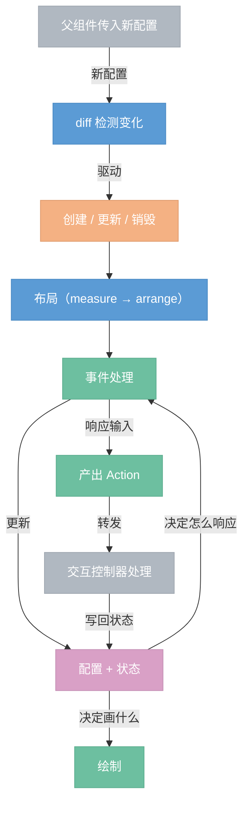

# Widget 解剖：一个控件由什么组成

> 基于 Flutter、SwiftUI、Qt、WPF 等主流框架的共性总结。

## 八个组成部分

### 1. 身份（Identity）

每个控件有唯一标识，用于 diff 时判断"这个控件还是不是之前那个"。

- **id / key** — 控件的唯一标识符
- **props hash** — 属性指纹，判断"虽然是同一个控件，但内容变了"

身份决定了控件的生命周期：id 变了 = 旧控件销毁 + 新控件创建；id 不变但 hash 变了 = 更新。

### 2. 配置（Configuration / Props）

从外部传入的不可变参数，描述"这个控件是什么样的"。

```
Button:  label, icon, disabled
Slider:  label, range, step
Toggle:  label
```

配置是只读的。控件自己不修改配置，配置变化由外部驱动（父组件重新传入新配置 → diff 检测到变化 → 更新控件）。

### 3. 状态（State）

控件内部的可变数据，分两类：

**交互状态**（所有控件通用，框架统一管理）：

```
Normal → Hovered → Pressed → Normal
                           ↘ Focused
                 Disabled（忽略所有输入）
```

状态转换规则：
- 鼠标进入 → Hovered
- 鼠标按下 → Pressed
- 鼠标松开 → 回到 Hovered + 触发 Action
- 鼠标离开 → Normal
- Tab 键 → Focused
- Pressed 时鼠标移出 → 仍保持 Pressed（捕获机制，直到松开）

**业务状态**（部分控件私有）：

```
TextInput:  光标位置、选区范围、编辑内容
Slider:     拖拽中的临时值
Dropdown:   展开/折叠
ScrollView: 滚动偏移
```

### 4. 布局（Layout）

控件声明自己需要多大空间，父容器决定实际分配多少。

两阶段过程：
- **measure**（自底向上）— 每个控件报告"我要多大"
- **arrange**（自顶向下）— 父容器分配"你在哪、给你多大"

布局结果是一个矩形（x, y, width, height），控件后续在这个矩形内绘制和检测命中。

### 5. 绘制（Paint / Render）

根据配置 + 状态，在布局分配的矩形内画出自己。

```
Button(label="Save", state=Hovered):
  → 画 zinc-100 背景（hover 态）
  → 画 zinc-200 边框
  → 画 "Save" 文字居中
```

绘制是纯输出，不修改任何状态。同一个（配置 + 状态）组合永远画出相同的结果。

### 6. 事件（Event Handling）

控件收到输入事件，结合当前状态，决定做什么。

```
Button(state=Pressed) + MouseRelease → 产出 Action::Click
Slider(state=Pressed) + MouseMove   → 算新值 → 产出 Action::Change(0.75)
TextInput(state=Focused) + KeyPress('a') → 插入字符 → 产出 Action::Change("...a")
```

控件不直接执行业务逻辑，只产出 Action。Action 由上层的交互控制器处理。

### 7. 命中测试（Hit Test）

判断一个屏幕坐标是否落在控件上。

大多数控件是简单的矩形检测。特殊形状（圆形按钮、不规则区域）可以覆写。

命中测试的结果决定了事件发给谁。

### 8. 生命周期（Lifecycle）

控件从出现到消失的过程：

| 阶段 | 触发条件 | 做什么 |
|------|---------|--------|
| 创建 | diff 发现新 id | 初始化状态、分配资源 |
| 更新 | diff 发现 id 相同但 hash 变了 | 更新配置、可能重置部分状态 |
| 销毁 | diff 发现 id 消失 | 释放资源、清理状态 |

生命周期由 diff/reconcile 机制驱动，控件自己不管创建销毁。

## 框架 vs 控件的职责分工

| 职责 | 谁管 |
|------|------|
| 交互状态转换（hover/pressed/focused） | 框架 |
| 捕获机制（pressed 时锁定事件目标） | 框架 |
| 命中测试遍历（找到目标控件） | 框架 |
| diff/reconcile（生命周期驱动） | 框架 |
| 布局计算（Flexbox measure/arrange） | 框架 |
| 焦点管理（Tab 切换、焦点栈） | 框架 |
| 配置声明 | 控件 |
| 业务状态管理 | 控件 |
| 绘制实现 | 控件 |
| 事件响应（产出 Action） | 控件 |
| 布局声明（"我要多大"） | 控件 |
| 命中区域定义（默认矩形，可覆写） | 控件 |

## 一个控件的完整生命流程



每帧循环：布局（如果脏）→ 事件处理 → 状态更新 → 绘制。
