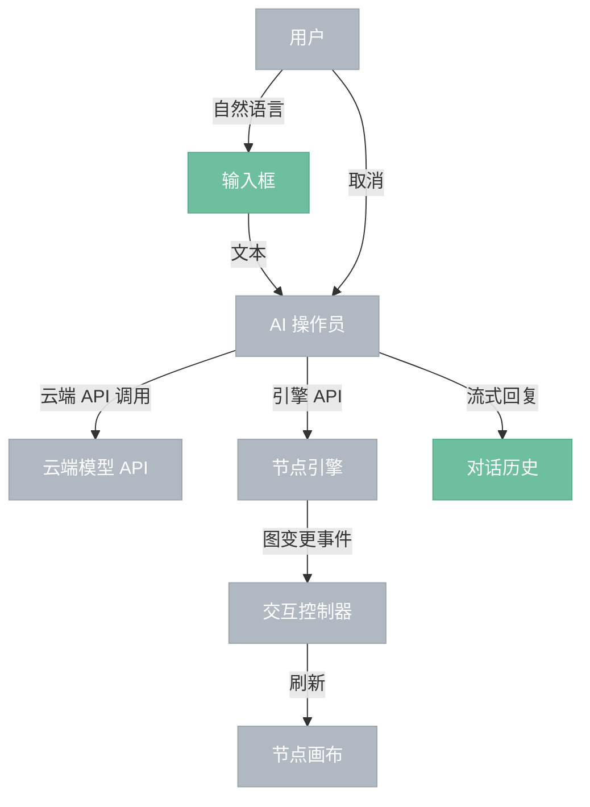

# AI 对话面板

> 内嵌的 AI 操作员对话界面。用户输入自然语言指令，AI 操作员通过云端 API 理解意图，调用引擎 API 执行操作，GUI 通过事件感知变更自动刷新。

## 界面结构

```
┌─────────────────────────┐
│  对话历史（滚动）         │
│                          │
│  [用户] 添加亮度节点      │
│  [AI]  正在添加节点…     │  ← 执行中状态（流式）
│  [AI]  已添加，正在连线…  │
│  [AI]  完成              │
│                          │
├─────────────────────────┤
│  输入框        [发送]    │
│               [取消]    │  ← 执行中时显示
└─────────────────────────┘
```

## 交互流程



## 执行中状态

AI 操作员执行期间：

- 每完成一个操作步骤，在对话历史中追加一条中间状态消息（流式显示）
- 输入框禁用，发送按钮替换为**取消**按钮
- 用户点击取消后，AI 操作员停止后续操作，已执行的操作不回滚（用户可手动 undo）

## 说明

- AI 对话面板与交互控制器**无直接连接**——指令直接转发给 AI 操作员，不经过控制器
- 画布刷新由引擎事件驱动，经由交互控制器，与对话面板无关
- 对话历史仅在本次会话内保留，不持久化
