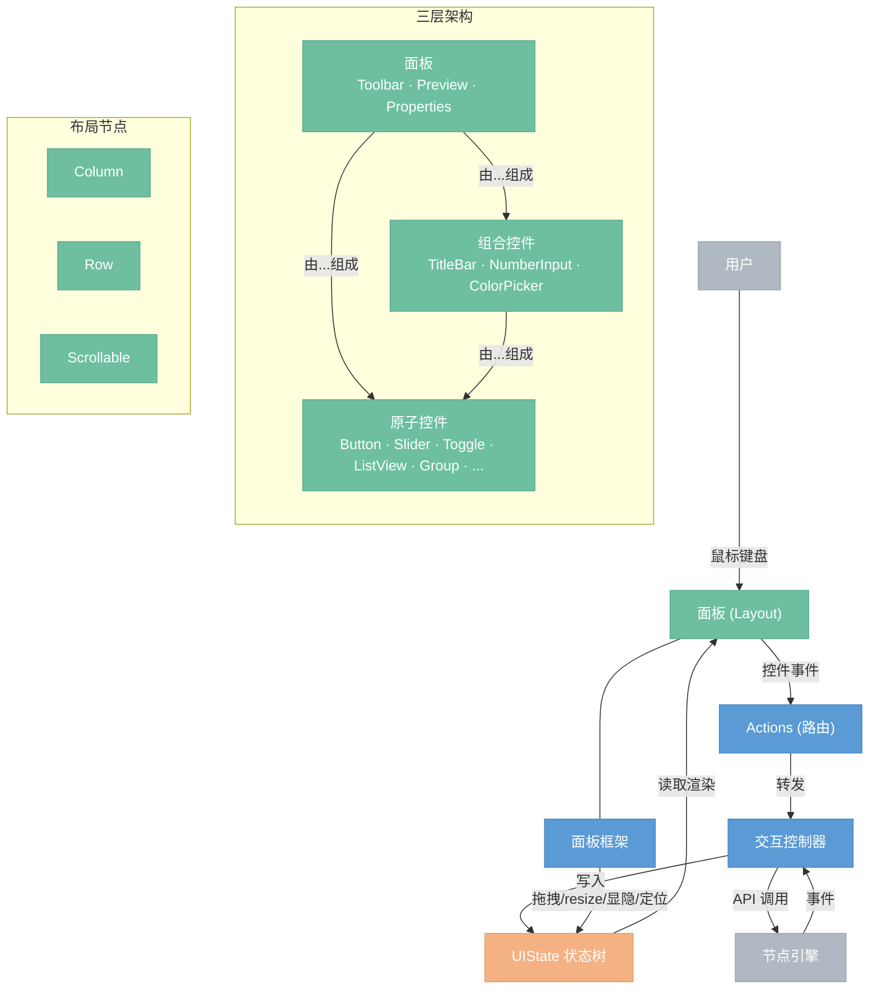

# 面板系统

> 面板系统由三层组成：原子控件 → 组合控件 → 面板。所有面板状态集中在 UIState 树中，面板是纯渲染函数。

## 总览



## 文件结构

```
gui/src/
├── panel/                      ── 面板框架
│   ├── mod.rs                     框架核心：register_panel! 宏、UIState、PanelFrame
│   ├── framework.rs               拖拽/resize/定位/全屏捕获层/overlay 路由
│   └── ui_state.rs                UIState 状态树定义
├── controls/                   ── 控件
│   ├── mod.rs                     导出所有控件
│   ├── atoms/                     原子控件
│   │   ├── mod.rs
│   │   ├── button.rs
│   │   ├── slider.rs
│   │   ├── text_input.rs
│   │   ├── dropdown.rs
│   │   ├── toggle.rs
│   │   ├── image_viewer.rs
│   │   ├── text_display.rs
│   │   ├── list_view.rs
│   │   ├── search_box.rs
│   │   ├── group.rs
│   │   └── separator.rs
│   └── composites/                组合控件
│       ├── mod.rs
│       ├── title_bar.rs
│       ├── number_input.rs
│       └── color_picker.rs
├── panels/                     ── 面板（每个一个文件，register_panel! 自动注册）
│   ├── mod.rs
│   ├── toolbar.rs
│   ├── preview.rs
│   ├── properties.rs
│   └── ...
├── canvas/                     ── 节点画布（独立于面板系统）
├── theme/                      ── 主题
└── lib.rs                      ── App 入口
```

## 1. 三层架构

```
面板          Toolbar, Preview, Properties, ...
  ↑ 由控件 + 布局组成
组合控件      TitleBar, NumberInput, ColorPicker
  ↑ 由原子控件 + 布局组成
原子控件      Button, Slider, TextDisplay, ListView, SearchBox, Group, ...
```

| 层级 | 定义 | 例子 |
|------|------|------|
| 原子控件 | 最小使用单元，对外不可拆分 | Button, Slider, Toggle, ListView, SearchBox, Group, Separator |
| 组合控件 | 原子控件 + 布局组合 | TitleBar, NumberInput, ColorPicker |
| 面板 | PanelConfig + Layout + Actions | Toolbar, Preview, Properties |

---

## 2. UIState 状态树

所有面板状态集中在一棵树中。面板不持有自己的状态，只读 UIState 渲染。

框架状态（visible, offset, size）由框架自动管理。内容状态由面板通过 `register_panel!` 宏自动注册，不需要手动修改 UIState。

```rust
UIState {
    // 面板框架状态（自动管理）
    panels: {
        "toolbar":    { visible, offset, size },
        "preview":    { visible, offset, size },
        "properties": { visible, offset, size },
    },

    // 面板内容状态（自动注册）
    content: {
        "toolbar":    {},
        "preview":    { zoom: 1.0, offset: (0,0), image: None },
        "properties": { values: { "radius": 5.0, "opacity": 0.8 } },
    },

    // 交互瞬态
    active_interaction: Some(("preview", Drag)),

    // 全局 UI 状态
    selected_node: Some(NodeId(3)),
    execution_progress: None,
}
```

### 数据流

```
用户交互 → 控件事件 → Actions（路由） → 交互控制器 → 修改 UIState
                                                        ↓
                                      Layout(ui_state) → 渲染
```

- **Layout** 读 UIState，输出内容树
- **Actions** 把控件事件路由给交互控制器
- **交互控制器** 修改 UIState（和调用引擎 API）
- 面板是纯函数：`UIState → Content`

---

## 3. 原子控件

最小使用单元。通过字符串 ID 标识，对外暴露事件接口。

| 类别 | 控件 | 参数 | 暴露事件 |
|------|------|------|---------|
| 动作 | Button | id, label, icon | `Click` |
| 输入 | Slider | id, label, range, **value** | `Change(f32)` |
| 输入 | TextInput | id, label, **value** | `Change(String)` |
| 输入 | Dropdown | id, label, options, **selected** | `Select(usize)` |
| 输入 | Toggle | id, label, **value** | `Toggle(bool)` |
| 查看 | ImageViewer | id, **image** | `Zoom(f32)`, `Pan(Vector)` |
| 查看 | TextDisplay | text | — |
| 容器 | ListView | id, items, **selected** | `Select(usize)` |
| 容器 | SearchBox | id, **query** | `Query(String)` |
| 容器 | Group | id, label, **expanded**, children | `Toggle(bool)` |
| 分割 | Separator | — | — |
| 分割 | Spacing | px | — |

**粗体**参数是当前值，从 Content 或 UIState 读取传入。

控件 ID 在面板内唯一即可，不同面板可以有相同 ID（事件路由到各自面板的 Actions，不会串）。

API 模式：无状态 → 函数，有状态 → struct（`new/update/view`）。

---

## 4. 组合控件

原子控件 + 布局组合成更高级的控件。

| 组合控件 | 组成 | 暴露事件 |
|---------|------|---------|
| TitleBar | `Row([TextDisplay, Spacing(Fill), ...buttons, Button("close")])` | `Click`（close 按钮） |
| NumberInput | `Row([TextDisplay(label), TextInput + 拖拽调节])` | `Change(f32)` |
| ColorPicker | `Column([色盘 canvas, Row([Slider(R), Slider(G), Slider(B), Slider(A)])])` | `Change(Color)` |

TitleBar 可扩展按钮：

```rust
TitleBar("Preview")                              // 只有关闭按钮
TitleBar("Preview", [Button("pin", "", "pin.svg")])  // 关闭 + 固定按钮
```

---

## 5. 布局节点

直接映射到 iced 原生 widget，任意嵌套。

| 布局节点 | iced widget | 说明 |
|----------|-------------|------|
| `Column` | `column` | 纵向排列 |
| `Row` | `row` | 横向排列 |
| `Scrollable` | `scrollable` | 内容超出时滚动 |

```
Content = Layout | Control
Layout  = Column(Content*) | Row(Content*) | Scrollable(Content)
Control = 原子控件 | 组合控件
```

---

## 6. 面板

新增面板只需写一个文件，通过 `register_panel!` 宏自动注册。使用 `inventory` crate（引擎节点注册同款）。

### 文件结构

```
gui/src/panels/
├── mod.rs
├── toolbar.rs
├── preview.rs
├── properties.rs
└── ...
```

### register_panel! 宏

一个文件定义一个面板的全部：配置、内容状态、布局、路由。

```rust
register_panel! {
    id: "面板ID",
    position: 默认位置,
    size: (宽, 高),

    struct Content { /* 面板内容状态，自动注册到 UIState */ }

    fn layout(content: &Content, ui: &UIState) -> _ { /* 内容树 */ }

    fn route(id: &str, event: ControlEvent, content: &mut Content, ctx: &mut AppContext) { /* 事件路由 */ }
}
```

### 示例

**工具栏**（无标题栏）

```rust
// gui/src/panels/toolbar.rs

register_panel! {
    id: "toolbar",
    position: TopCenter,
    size: (0, 0),  // 由内容撑开

    struct Content {}

    fn layout(_content: &Content, _ui: &UIState) -> _ {
        Row([
            Button("new", "New", "plus.svg"),
            Button("open", "Open", "folder.svg"),
            Button("save", "Save", "save-floppy-disk.svg"),
            Separator,
            Button("run", "Run", "play.svg"),
        ])
    }

    fn route(id: &str, event: ControlEvent, _content: &mut Content, ctx: &mut AppContext) {
        match (id, event) {
            ("new", Click)  => ctx.new_project(),
            ("open", Click) => ctx.open_project(),
            ("save", Click) => ctx.save_project(),
            ("run", Click)  => ctx.run(),
            _ => {}
        }
    }
}
```

**预览面板**（有标题栏）

```rust
// gui/src/panels/preview.rs

register_panel! {
    id: "preview",
    position: TopRight,
    size: (300, 250),

    struct Content {
        zoom: f32 = 1.0,
        offset: Vector = Vector::ZERO,
        image: Option<ImageHandle> = None,
    }

    fn layout(content: &Content, _ui: &UIState) -> _ {
        Column([
            TitleBar("Preview"),
            Row([
                Button("fit", "Fit", "fit.svg"),
                Button("reset", "1:1", "zoom.svg"),
            ]),
            ImageViewer("viewer", &content.image),
        ])
    }

    fn route(id: &str, event: ControlEvent, content: &mut Content, ctx: &mut AppContext) {
        match (id, event) {
            ("fit", Click)      => { content.zoom = 1.0; content.offset = Vector::ZERO; },
            ("reset", Click)    => content.zoom = 1.0,
            ("viewer", Zoom(d)) => content.zoom = (content.zoom + d).clamp(0.1, 10.0),
            ("viewer", Pan(v))  => content.offset = content.offset + v,
            ("close", Click)    => ctx.close_panel("preview"),
            _ => {}
        }
    }
}
```

**属性面板**（动态内容）

```rust
// gui/src/panels/properties.rs

register_panel! {
    id: "properties",
    position: TopRight,
    size: (280, 400),

    struct Content {}

    fn layout(_content: &Content, ui: &UIState) -> _ {
        Column([
            TitleBar("Properties"),
            match ui.selected_node {
                Some(node) => Scrollable(Column([
                    Group("Parameters", Column(
                        node.params.iter().map(|p| match p.kind {
                            Float(range) => Slider(&p.id, &p.name, range, p.value),
                            Enum(opts)   => Dropdown(&p.id, &p.name, opts, p.selected),
                            Color        => ColorPicker(&p.id, &p.name, p.value),
                            Bool         => Toggle(&p.id, &p.name, p.value),
                        }).collect()
                    )),
                ])),
                None => TextDisplay("No node selected"),
            },
        ])
    }

    fn route(id: &str, event: ControlEvent, _content: &mut Content, ctx: &mut AppContext) {
        match event {
            Change(v) | Select(v) | Toggle(v) => ctx.set_node_param(id, v),
            Click if id == "close" => ctx.close_panel("properties"),
            _ => {}
        }
    }
}
```

---

## 7. 面板框架

框架自动处理所有面板共有的机械行为：

- **拖拽移动** — 有 TitleBar 时拖标题栏，无 TitleBar 时拖整个面板
- **resize** — 鼠标悬停面板边缘时光标变化提示，支持八个方向（四边 + 四角），无视觉指示符
- **显隐** — 读 `UIState.panels[id].visible`
- **定位** — 根据 `PanelConfig.position` 自动 `float().translate(offset)`
- **全屏捕获层** — 面板只发 `DragStart`/`ResizeStart`，后续事件由全屏 `mouse_area` 统一捕获（解决 iced 局部坐标问题）
- **overlay 路由** — 根据 `UIState.active_interaction` 自动分发，新增面板不修改路由

---

## 8. 视觉规范

基于 Tailwind zinc 色系，间距 4 的倍数。

### 间距

| Token | 值 |
|-------|-----|
| 控件间距 | 8px |
| 面板内边距 | 12px |
| 分组间距 | 16px |

### 字号

| Token | 值 |
|-------|-----|
| 控件标签 | 12px |
| 控件值 | 12px |
| 分组标题 | 12px bold |

### 颜色

| Token | 色值 | Tailwind |
|-------|------|----------|
| 标签文字 | `#71717a` | zinc-500 |
| 值文字 | `#18181b` | zinc-900 |
| 控件背景 | `#ffffff` | white |
| 控件边框 | `#e4e4e7` | zinc-200 |
| 悬停背景 | `#f4f4f5` | zinc-100 |
| 激活/焦点 | `#18181b` | zinc-900 |

### 圆角

| Token | 值 |
|-------|-----|
| 控件圆角 | 4px |
| 面板圆角 | 8px |

---

## 9. 新增规范

### 新增面板

创建 `gui/src/panels/my_panel.rs`，用 `register_panel!` 宏定义即可。不需要修改其他文件。

### 新增原子控件

1. 创建 `gui/src/controls/atoms/my_control.rs`
2. 判断有无状态 → 函数或 struct
3. 定义暴露的事件接口
4. 遵循视觉规范
5. 在 `gui/src/controls/atoms/mod.rs` 中导出

### 新增组合控件

1. 创建 `gui/src/controls/composites/my_composite.rs`
2. 用原子控件 + 布局节点组合
3. 定义暴露的事件接口（聚合内部事件）
4. 在 `gui/src/controls/composites/mod.rs` 中导出
