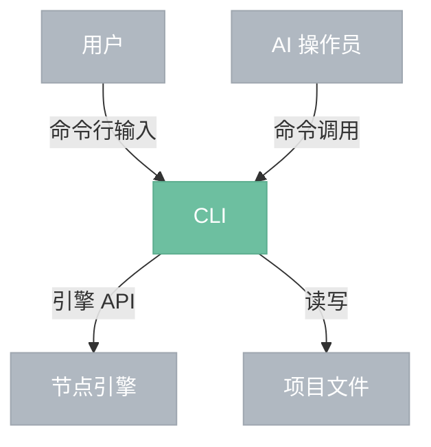

# CLI

> 命令行前端，执行节点图、批量处理。

## 总览

---

## 命令

| 命令 | 说明 |
|------|------|
| exec | 打开项目文件，执行节点图，输出结果 |
| batch | 批量处理——对多个输入文件执行同一节点图 |
| info | 显示项目文件信息（节点数、连接数、参数摘要） |

---

## 交互方式

| 交互 | 说明 |
|------|------|
| CLI → 引擎 | 同进程函数调用，与 GUI 共用同一套引擎 API |
| 引擎 → CLI | 事件系统推送，CLI 消费后输出到终端（进度条、完成提示、错误信息） |

CLI 无 GUI，不需要纹理缓存和预览面板。执行完成后进程退出。

---

## 边界情况

- **无 GPU**：图像处理节点回退 CPU 执行，AI 节点需要 Python 后端可用。
- **无 Python**：AI 节点不可用，仅图像处理节点和 API 节点可执行。
- **批量处理**：逐个文件执行，单个失败不中断整批，最后汇总报告成功/失败数。
