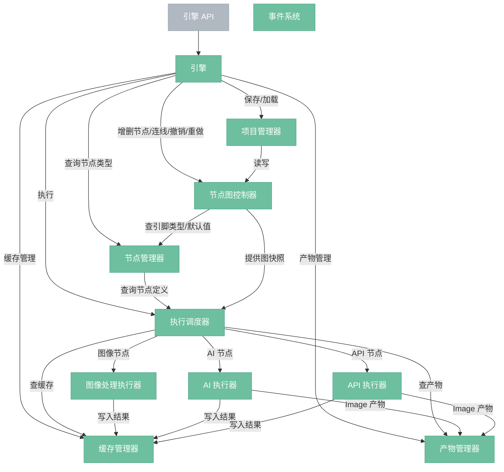

# 节点引擎

> 系统核心，始终本地运行，管理节点图、调度执行、缓存结果。

## 总览

---

## 组件

- **引擎 API**：对外统一接口，三个前端都通过它操作引擎。
- **引擎**：顶层协调者，持有所有子组件，委派调用。
- **节点管理器**：节点定义的收集、注册、索引与查询模块。内部按 `model/`、`collect/`、`store/`、`index/`、`query/` 分组；Python 节点经 `build.rs` 编译期扫描后与 Rust 节点统一进入 `inventory`。
- **执行调度器**：拓扑排序，维护脏标记，逐节点分发执行。统一查缓存判断是否跳过，缓存未命中时从产物管理器回源加载。
- **项目管理器**：管理 .nodeimg bundle 的生命周期（新建/打开/保存/关闭），协调序列化器和产物管理器读写项目文件。
- **缓存管理器**：所有节点执行结果的统一内存存储，也是节点间传递数据的通道。Handle 条目豁免 LRU 淘汰，淘汰时通知 Python 释放 GPU 内存。含预览纹理缓存。
- **产物管理器**：AI/API 节点产出 Image 时额外持久化的历史归档。按项目按节点索引，记录元数据，支持历史浏览和版本选用。只存图片，不存 Handle。缓存未命中时作为回源。
- **事件系统**：内部组件推送事件，前端被动接收（执行进度、状态变化、图变更）。
- **节点图控制器**：所有图变更的入口，内含节点图数据（纯数据结构），基于不可变状态 + 结构共享实现 undo/redo。

## 交互方式

| 连接 | 说明 |
|------|------|
| 引擎 API → 引擎 | 外部统一入口 |
| 引擎 → 各子组件 | 委派调用 |
| 项目管理器 → 节点图控制器 | 保存/加载通过控制器读写 |
| 节点管理器 → 调度器 | 查 NodeDef、展开后的正式接口，确定执行与连线语义 |
| 节点图控制器 → 节点管理器 | 查引脚类型（兼容性检查）、展开接口、默认参数 |
| 节点图控制器 → 调度器 | 提供图快照做拓扑排序 |
| 调度器 → 缓存管理器 | 统一查缓存判断是否跳过 |
| 调度器 → 产物管理器 | 缓存未命中时回源加载、用户选用历史版本 |
| 调度器 → 三路执行器 | 按节点类型分发 |
| 所有执行器 → 缓存管理器 | 执行结果统一写入缓存 |
| AI/API 执行器 → 产物管理器 | 输出 Image 时额外持久化 |
| 各组件 → 事件系统 → 前端 | 推送事件，前端被动接收 |
