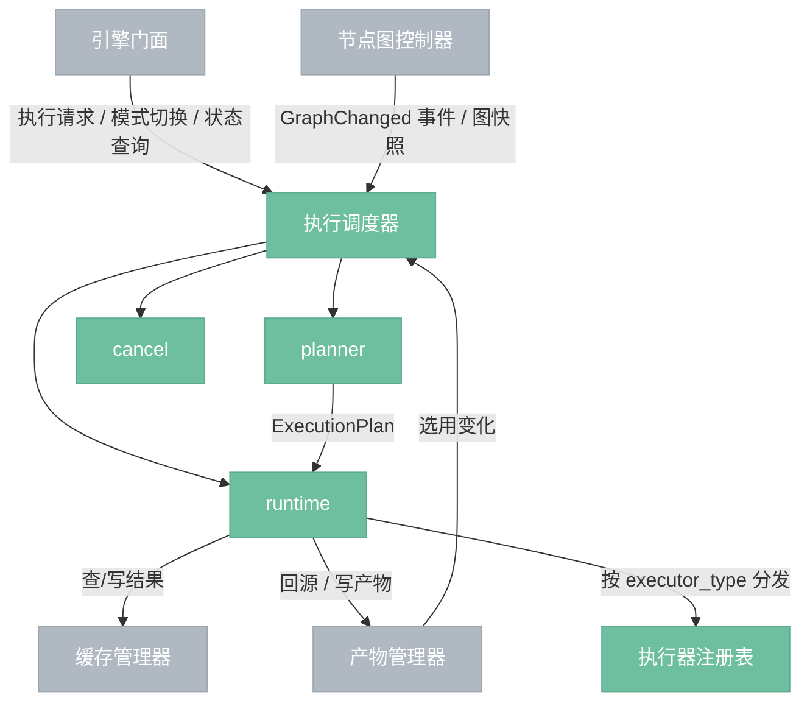
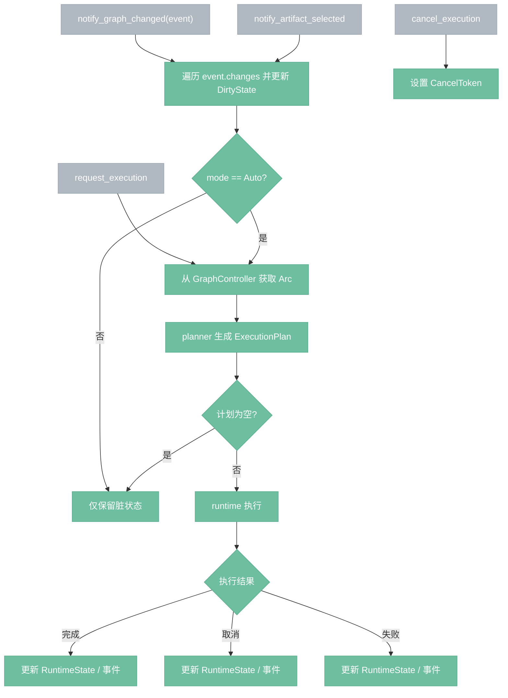
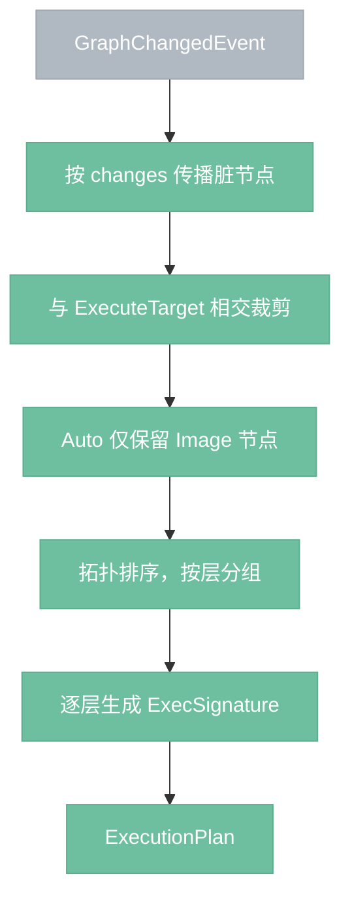
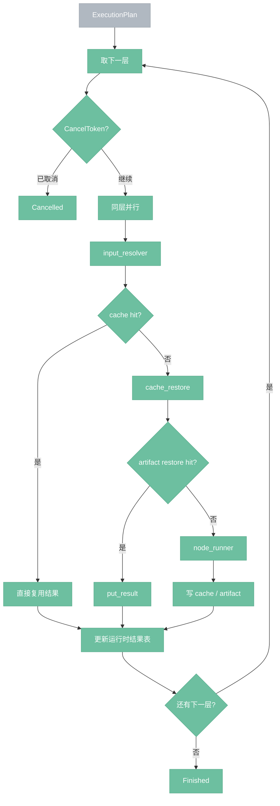

# 执行调度器

> 执行决策与执行生命周期管理模块。负责维护脏状态、生成执行计划、协调缓存/产物回源，并推进一次执行从开始到完成/取消/失败的全过程。

---

## 文档状态

本文件是 **.impl**，含义是：

- 模块定义、职责边界、对外接口、数据模型、流程图与跨模块契约均已收敛；
- 可作为 `engine/src/scheduler/`（调度器源码目录，engine/src/scheduler/）的实现依据直接落地；
- 具体函数签名、错误枚举和内部拆分可在实现阶段细化；
- 本文档定义的语义边界、设计决议与跨模块契约不应在实现阶段被随意改变。

---

## 定义

执行调度器是 **执行决策与执行生命周期管理模块**。

它负责：

1. 接收图变化与执行请求；
2. 持有并维护脏状态；
3. 根据运行模式、目标范围和缓存/产物可用性生成执行计划；
4. 在运行时协调缓存命中、产物回源、执行器分发、结果写回；
5. 管理运行中任务、取消、进度与最终状态。

一句话：

> **调度器 = 把图变化与用户运行意图，翻译成可执行流程的模块。**

### 不属于调度器的职责

- 图编辑命令本身（由 `GraphController`（节点图控制器，GraphController）负责）
- 缓存条目的内部存取、淘汰、预览纹理管理（由 `CacheManager`（缓存管理器，CacheManager）负责）
- 产物索引、持久化、导出、清理（由 `ArtifactManager`（产物管理器，ArtifactManager）负责）
- 节点定义注册与查询（由 `NodeManager`（节点管理器，NodeManager）负责）
- 项目保存/加载

---

## 总览



---

## 已确认设计决议

### D24：脏状态由调度器持有

- `DirtyState`（脏状态，DirtyState）属于调度器长期内部状态；
- 常规路径下，图变化会增量更新脏状态；
- 特殊情况下允许从图快照重建一次脏状态，作为校正兜底。

### D25：图变化以图控制器事件通知为主

- `GraphController` 在图编辑完成后向调度器发送 `GraphChangedEvent`（图变化事件，GraphChangedEvent）；
- 调度器遍历 `GraphChangedEvent.changes: Vec<GraphChange>`（图变化列表，changes: Vec<GraphChange>）增量更新脏状态；
- 常规路径下不要求调度器自行比较两份整图快照；
- `notify_graph_replaced(...)` 仅用于整图替换/恢复/重建状态。

### D26：节点定义必须声明执行器类型

- `NodeDef`（节点定义，NodeDef）必须显式声明 `executor_type`（执行器类型，executor_type）；
- 调度器与执行器注册表以该字段作为正式分类来源；
- 不依赖命名约定、目录约定或外部推断。

### D27：自动模式仅自动执行图像节点

- `Auto`（自动模式，Auto）首版仅自动执行 `executor_type == Image` 的节点；
- `AI/API` 节点在自动模式下只标脏，不自动进入执行计划；
- `Manual`（手动模式，Manual）下可显式请求执行脏节点。

---

## 对外接口

调度器对外暴露的是**执行域接口**，不是内部算法接口。

### 最小接口集

```rust
set_mode(mode)
notify_graph_changed(event)
notify_graph_replaced(snapshot_meta)
notify_artifact_selected(selection)
request_execution(request)
cancel_execution(run_id)
query_state()
```

### 接口约束

- 调度器接收的是**图变化事件**或**图快照替换通知**，不是图编辑命令本身；
- `planner`（规划器，planner）/ `runtime`（运行时，runtime）/ `cancel`（取消控制，cancel）不直接作为主要外部 API；
- 原始分层执行计划、缓存命中细节、产物回源细节不作为第一批正式外部契约暴露；
- `engine facade`（引擎门面，engine facade）负责把产品层术语翻译为调度器接口。

---

## 依赖接口

调度器除了提供执行域接口，还依赖若干外部模块的最小接口集。

### 对节点图控制器

```rust
get_graph_snapshot()
```

用途：

- 生成执行计划时读取当前图快照；
- 在 `notify_graph_replaced(...)` 路径中接收新的快照基线。

### 对节点管理器

```rust
get_node_def(type_id)
```

用途：

- 读取 `NodeDef.executor_type`（执行器类型，executor_type）；
- 读取输出定义、参数定义和默认值；
- 为签名生成与执行分发提供权威元信息。

### 对缓存管理器

```rust
get_result(key, generation)
put_result(key, generation, value)
invalidate_subgraph(node_ids)
clear_all()
```

用途：

- 查询缓存命中；
- 写入执行结果；
- 图变化后失效受影响子图；
- 在极端恢复路径下配合 generation（代际，generation）推进。

### 对产物管理器

```rust
resolve_artifact_for_restore(...)
create_artifact(...)
get_selected_artifact(...)
```

用途：

- 缓存未命中时按规则回源；
- 对允许持久化的节点输出统一落产物；
- 响应用户历史版本选用。

### 对执行器注册表

```rust
get_executor(executor_type)
```

用途：

- 按 `NodeDef.executor_type` 选择统一执行器；
- 避免调度器长期直接依赖具体执行器类型。

权威执行器 contract：`4.11.2-executor-contract.impl.md`

### 对事件系统

```rust
publish(event)
```

用途：

- 对外广播执行开始、进度、完成、取消、失败等事件。

权威事件模型：`4.8.1-engine-event.impl.md`

---

## 数据模型

本节给出首版最小 Rust 数据结构草案，作为 `model/` 目录的规范基础。

```rust
enum ExecutionMode {
    Auto,
    Manual,
}

struct RunId(u64);

// 由 manager 内 AtomicU64 生成，从 1 开始单调递增；
// 首版不跨重启持久化。

enum ExecuteTarget {
    Graph,
    Node(NodeId),
    Force(NodeId),
}

struct ExecutionRequest {
    target: ExecuteTarget,
}

struct PlannedNode {
    node_id: NodeId,
    executor_type: ExecutorType,
    exec_signature: ExecSignature,
}

struct ExecutionPlan {
    run_id: RunId,
    graph_snapshot: Arc<Graph>,
    generation: GenerationId,
    layers: Vec<Vec<PlannedNode>>,
}

struct DirtyState {
    dirty_nodes: HashSet<NodeId>,
    dirty_reasons: HashMap<NodeId, DirtyReason>,
}

enum DirtyReason {
    ParamChanged,
    UpstreamChanged,
    StructureChanged,
    ArtifactSelectionChanged,
    Forced,
}

enum RuntimeState {
    Idle,
    Planning { run_id: RunId },
    Running { run_id: RunId, progress: ExecutionProgress },
    LastCompleted { run_id: RunId, status: FinalStatus },
}

struct SchedulerStateSummary {
    mode: ExecutionMode,
    runtime_state: RuntimeState,
    dirty_count: usize,
    has_pending_changes: bool,
    last_run_id: Option<RunId>,
}
```

### 图变化事件

```rust
enum GraphChange {
    NodeAdded { node_id: NodeId },
    NodeRemoved { node_id: NodeId },
    ConnectionAdded { from: PinRef, to: PinRef },
    ConnectionRemoved { from: PinRef, to: PinRef },
    ParamCommitted { node_id: NodeId, param: ParamKey },
    Replaced,
    Undone,
    Redone,
}

struct GraphChangedEvent {
    graph_version: GraphVersion,
    dirty: bool,
    changes: Vec<GraphChange>,
}
```

说明：

- 调度器直接消费 `4.2.0-graph-controller.impl.md` 中定义的 `GraphChangedEvent` / `GraphChange`；
- 不单独维护一份粗化后的变更 schema（模式，schema）；
- 一次正式提交只通知一次 `notify_graph_changed(event)`，调度器内部遍历 `event.changes`；
- `Replaced` / `Undone` / `Redone` 允许触发全量脏状态重建。

### 产物选用通知

```rust
struct ArtifactSelection {
    node_id: NodeId,
    output_key: String,
    artifact_id: String,
}
```

### 错误与事件

```rust
enum SchedulerError {
    RunAlreadyInProgress,
    RunNotFound { run_id: RunId },
    GraphSnapshotUnavailable,
    PlannerFailed { message: String },
    RuntimeFailed { message: String },
    CancelFailed { run_id: RunId },
}

enum ExecutionEvent {
    Started { run_id: RunId, total_nodes: usize },
    NodeStarted { run_id: RunId, node_id: NodeId },
    NodeFinished { run_id: RunId, node_id: NodeId },
    NodeFailed { run_id: RunId, node_id: NodeId, error: String },
    Progress { run_id: RunId, completed: usize, total: usize },
    Finished { run_id: RunId },
    Cancelled { run_id: RunId },
    Failed { run_id: RunId, error: SchedulerError },
}
```

---

## 外部接口详细语义

### 1. `set_mode(mode)`

**调用方**：引擎门面、GUI

**输入**：`ExecutionMode`

**返回**：无

**副作用**：

- 更新调度器当前模式；
- 不直接修改图；
- 不直接清缓存；
- 不直接重建脏状态。

**状态迁移**：

- `Auto -> Manual`：当前运行中的任务继续，不自动取消；后续图变化只标脏，不自动触发执行。
- `Manual -> Auto`：立即尝试执行当前脏集合中 `Image` 类型节点对应的可执行子图。

**持久化**：首版不要求模式跨重启持久化，由上层决定是否恢复。

### 2. `notify_graph_changed(event)`

**调用方**：`GraphController`

**输入**：`&GraphChangedEvent`

**返回**：无

**副作用**：

1. 遍历 `event.changes` 计算受影响节点范围；
2. 若范围与当前运行中的计划有交集，先取消相关在飞任务；
3. 调用 `cache.invalidate_subgraph(...)`（子图失效，invalidate_subgraph）；
4. 增量更新 `DirtyState`；
5. 若当前模式为 `Auto`，尝试自动执行受影响范围内的图像节点。

说明：

- 单次图提交可能包含多条变化，例如“替换旧连接 = `ConnectionRemoved + ConnectionAdded`”；
- 调度器消费的是一个事件，而不是单条变化。
- 由于步骤 2 已先取消与受影响范围冲突的在飞任务，此处自动执行不会因已有冲突 run 而被拒绝；无冲突的旧任务可继续运行。

### 3. `notify_graph_replaced(snapshot_meta)`

**调用方**：引擎门面、项目加载逻辑、恢复逻辑

**输入**：

```rust
struct GraphReplaceSnapshotMeta {
    graph_snapshot: Arc<Graph>,
    graph_version: Option<GraphVersion>,
}
```

**返回**：无

**副作用**：

- 取消当前运行中的任务；
- 清理与旧计划关联的运行状态；
- 以新图快照重建脏状态；
- 作为 D25 的兜底路径。

### 4. `notify_artifact_selected(selection)`

**调用方**：引擎门面、产物管理器上层编排

**输入**：`ArtifactSelection`

**返回**：无

**副作用**：

1. 将来源节点视为“输出已切换”；
2. 来源节点不触发 executor（执行器，executor），但需要按契约 A 从 artifact 回源替换缓存中的来源节点结果；
3. 标脏其下游子图；
4. 调用 `cache.invalidate_subgraph(downstream_only)`（仅下游失效，downstream_only）失效下游缓存，不包含来源节点本身；
5. 在 `Auto` 模式下，自动尝试重跑受影响的图像节点。

### 5. `request_execution(request)`

**调用方**：引擎门面、GUI

**输入**：`ExecutionRequest`

**返回**：`Result<RunId, SchedulerError>`

**行为**：

- 若当前无运行中任务：创建新 `RunId`，拉取图快照，同时读取 `cache.current_generation()`（当前代际，current_generation），生成计划并执行；
- 若当前已有运行中任务：首版返回 `RunAlreadyInProgress`，不排队、不替换；
- `ExecuteTarget::Force(node_id)` 视为对指定节点及其下游施加 `DirtyReason::Forced` 后再执行。

### 6. `cancel_execution(run_id)`

**调用方**：引擎门面、GUI

**输入**：`RunId`

**返回**：`Result<(), SchedulerError>`

**行为**：

- 若 `run_id` 是当前运行中的任务：设置 `CancelToken`（取消令牌，CancelToken）；
- 若 `run_id` 不是当前运行中的任务：返回 `RunNotFound`；
- 若当前没有运行中任务：返回 `RunNotFound`。

### 7. `query_state()`

**调用方**：引擎门面、GUI

**返回**：`SchedulerStateSummary`

最小摘要至少包含：

- 当前模式
- 当前运行状态
- 脏节点集合大小
- 是否存在待执行变更
- 最近一次 `RunId`

---

## 流程

### 调度器主流程



### planner 主路径



### runtime 主路径



### 产物回源三步链路


---

## 与外部模块的契约

### 与图控制器的契约

- 图编辑由 `GraphController` 独占负责；
- 调度器不接收 `set_param` / `connect` / `remove_node` 这类编辑命令；
- 调度器通过 `notify_graph_changed(&GraphChangedEvent)` 接收图变化事件；
- 每次 `request_execution(...)` 时，调度器主动调用 `graph_controller.snapshot()` 获取 `Arc<Graph>` 快照；
- 整个 `Run`（运行轮次，Run）都基于该快照执行，不受执行过程中后续编辑影响。
- `notify_graph_changed(...)` 用于图控制器正式编辑/撤销/重做/替换路径；项目加载与恢复等不经图控制器事件链的入口，走 `notify_graph_replaced(...)`。

### 与缓存管理器的契约

#### 契约 A：cache miss 后的回源三步由调度器/运行时编排

调度器/运行时固定串联：

1. `resolve_for_restore`
2. `read_artifact`
3. `put_result`

`CacheManager` 不直接依赖 `ArtifactManager`。

#### 契约 B：失效前先取消在飞任务

收到 `notify_graph_changed(...)` 或 `notify_artifact_selected(...)` 后：

1. 先判断受影响范围与当前运行计划是否有交集；
2. 若有交集，先取消在飞任务；
3. 再调 `cache.invalidate_subgraph(...)`；
4. 最后更新 `DirtyState`。

#### 契约 C：`ExecSignature` 由调度器生成

- `ExecSignature`（执行签名，ExecSignature）由调度器生成，不由缓存管理器生成；
- 首版在 `planner/plan_builder.rs` 逐层生成并挂到 `PlannedNode` 上；
- 生成输入包括：节点最终参数、上游输入签名组合、节点版本信息。

#### 契约 D：`generation` 防回灌

- `request_execution(...)` 创建 `ExecutionPlan` 时，同时记录当前 `cache.current_generation()`；
- runtime 中所有 `get_result` / `put_result` 都基于该 `generation`；
- 若执行期间缓存代际被推进（例如 `clear_all()`），旧 run 的写入会被缓存层丢弃；
- runtime 需要把这种代际失配视为当前 run 已失效，并优雅终止为 `Cancelled`。

### 与产物管理器的契约

- 运行时在节点执行成功后，可根据节点/输出类型决定是否写入 artifact；
- `notify_artifact_selected(...)` 后，调度器负责回源替换来源节点缓存、标脏下游并失效下游缓存，不由产物管理器直接调度执行；
- 回源校验以 `param_signature` 与 `input_signature` 为准。

### 外部依赖接口清单（本轮固化）

本节列出调度器为了停止“靠猜”而必须依赖的外部稳定接口。它们是调度器之外的真源契约。

#### A. 图控制器输入接口

调度器必须稳定消费以下输入：

- `GraphChangedEvent`（图变化事件，GraphChangedEvent）
- `graph_controller.snapshot() -> Arc<Graph>`（图快照，snapshot）
- `graph_version`（图版本，graph_version）

约束：

- 调度器不直接感知 `set_param` / `connect` / `remove_node` 等编辑命令；
- 图控制器是图编辑唯一入口，调度器只消费事件与快照；
- `notify_graph_changed(...)` 的参数真源应直接对齐图控制器文档中的事件结构，不再额外定义粗化 schema（模式，schema）。

#### B. 图查询接口

调度器不应长期依赖 `Graph.connections` 等内部字段布局，至少需要稳定的查询能力：

- `upstream(node_id)`（上游查询，upstream）
- `downstream(node_id)`（下游查询，downstream）
- `topo_sort(target)`（拓扑排序，topo_sort）
- 目标子图求交能力

说明：

- 当前实现仍直接依赖部分 `Graph` 结构细节；
- 该接口组的目标是把 scheduler 对图内部布局的耦合降到查询函数级别。

#### C. 节点定义元信息接口

调度器必须稳定依赖以下元信息：

- `node_manager.get_node_def(type_id)`（获取节点定义，get_node_def）
- `NodeDef.executor_type`（执行器类型，executor_type）
- `NodeDef.params`
- `NodeDef.outputs`

说明：

- `NodeDef.executor_type` 是模式过滤、执行器注册、执行分发的权威来源；
- 若该字段不稳定，调度器只能继续依赖外部闭包或命名约定推断执行器类型。

#### D. 签名协议接口

调度器需要一套稳定的 `ExecSignature`（执行签名，ExecSignature）组成协议，至少明确：

- 参数如何归一化并参与 `params_hash`（参数哈希，params_hash）
- 上游输入如何归一化并参与 `upstream_hash`（上游哈希，upstream_hash）
- `node_version`（节点版本，node_version）的真源
- `sig_schema_version`（签名结构版本，sig_schema_version）的演进规则

约束：

- `ExecSignature` 结构继续复用 `cache/model/exec_signature.rs`；
- 签名生成责任在调度器或调度器专属子模块，不在缓存管理器内生成；
- 若签名协议未定，缓存命中/误失效行为都只能依赖临时实现。

#### E. 产物选用与回源输入接口

调度器需要稳定接收以下外部输入：

- `ArtifactSelection`（产物选用，ArtifactSelection）
  - `node_id`
  - `output_key`
  - `artifact_id`

以及稳定能力：

- `resolve_for_restore`
- `read_artifact`
- `create_artifact`

约束：

- 来源节点不触发 executor；
- 下游子图标脏与缓存失效由调度器负责；
- 来源节点缓存替换应通过回源链路完成，而不是靠“伪执行”。

#### F. 执行器运行接口

调度器还需要一个稳定的执行器运行协议，避免 `manager` 直接长期依赖具体执行器类型：

- registry（注册表，registry）条目到可执行对象的映射方式
- 或统一 executor trait（执行器特征，executor trait）
- 至少允许：按 `executor_type` 选择执行器，并执行一个计划节点

说明：

- 当前实现仍直接持有 `ImageExecutor`（图像执行器，ImageExecutor）；
- 这是最小实现路径，不应成为最终长期边界。

### 优先级

#### P0：必须先定的核心真源

1. 图控制器输入接口：`GraphChangedEvent + snapshot + graph_version`
2. 节点定义元信息接口：`NodeDef.executor_type + get_node_def`
3. 签名协议接口：`ExecSignature` 组成规则

#### P1：下一阶段需要收口

4. 产物选用与回源输入接口：`ArtifactSelection + resolve_for_restore/read_artifact/create_artifact`
5. 执行器运行接口：registry 条目到真实执行器的映射协议

#### P2：可以后补的稳定化接口

6. 图查询接口 facade（门面，facade）
7. cache 批量读取 / 语义型读取接口
8. 项目加载 / 恢复完成后的调用时机协议

### 当前实现约束

在上述 P0 接口全部成为稳定真源之前：

- 调度器实现中的部分逻辑只能采用最小闭环方案；
- `manager` 会承担更多过渡性编排职责；
- `ExecSignature`、执行器选择、artifact 选用后的行为仍可能需要二次收口。

---

## 内部分层

调度器内部首版固定为五层：

1. **manager**：统一入口与总编排
2. **model**：共享数据模型
3. **planner**：决定执行什么
4. **runtime**：决定怎么执行
5. **cancel**：取消与运行控制

### 各层职责

- **manager**：对外 API、运行状态机、模式切换、运行冲突处理。
- **model**：模式、请求、计划、脏状态、事件、错误模型。
- **planner**：脏传播、目标裁剪、模式过滤、分层与签名生成。
- **runtime**：输入解析、缓存命中、产物回源、执行器分发、结果写回。
- **cancel**：取消令牌、运行句柄、超时计时器。

### 当前不单独拆分的内容

- `event/`（事件，event）目录暂不单独建立；先以 `ExecutionEvent` 模型承载。
- 不在调度器内复制 `ExecSignature` 定义，继续复用 `cache/model/exec_signature.rs`。

### 线程模型

- `manager`（管理入口，manager）首版运行在单一专用调度线程上；
- `notify_*` / `request_execution` / `cancel_execution` / `query_state` 通过 channel（消息通道，channel）向调度线程投递命令；
- 接口函数本身应保持轻量，`request_execution(...)` 在成功受理后立刻返回 `RunId`；
- 真正的 planning / runtime 在调度线程编排，其中同层节点执行可进入 `rayon` worker pool（并行工作池，worker pool）；
- `GraphController` 侧对调度器的通知是同步提交命令、异步消费，不直接在图控制器线程里跑 runtime。

---

## 文件结构设计

```text
engine/src/scheduler/
├── mod.rs
├── manager.rs
├── model/
│   ├── mod.rs
│   ├── execution_mode.rs
│   ├── execution_request.rs
│   ├── execution_plan.rs
│   ├── dirty_state.rs
│   ├── runtime_state.rs
│   ├── state_summary.rs
│   ├── event.rs
│   └── error.rs
├── planner/
│   ├── mod.rs
│   ├── dirty_propagation.rs
│   ├── snapshot_rebuild.rs
│   └── plan_builder.rs
├── runtime/
│   ├── mod.rs
│   ├── input_resolver.rs
│   ├── cache_restore.rs
│   ├── executor_registry.rs
│   ├── node_runner.rs
│   └── artifact_sink.rs
└── cancel/
    ├── mod.rs
    ├── cancel_token.rs
    └── running_task.rs
```

### 文件职责

- `mod.rs`：仅导出，不承载业务逻辑。
- `manager.rs`：调度器对外总入口。
- `execution_mode.rs`：`Auto / Manual`。
- `execution_request.rs`：执行请求与目标。
- `execution_plan.rs`：计划、层次与 `PlannedNode`。
- `dirty_state.rs`：脏节点集合与脏原因。
- `runtime_state.rs`：运行状态与最终状态。
- `state_summary.rs`：`SchedulerStateSummary`（调度器状态摘要，SchedulerStateSummary）。
- `event.rs`：调度器事件模型。
- `error.rs`：调度器错误定义。
- `dirty_propagation.rs`：按 `GraphChange` 列表传播脏状态。
- `snapshot_rebuild.rs`：整图替换/恢复时的兜底状态重建。
- `plan_builder.rs`：目标裁剪、模式过滤、拓扑分层、签名生成。
- `input_resolver.rs`：解析节点输入与默认参数补全。
- `cache_restore.rs`：缓存未命中后的产物回源三步链路。
- `executor_registry.rs`：执行器注册与匹配。
- `node_runner.rs`：真正调用执行器执行节点。
- `artifact_sink.rs`：把可持久化结果写入产物管理器。
- `cancel_token.rs`：取消标记。
- `running_task.rs`：运行句柄与超时控制。

### 命名约束

- 不使用 `utils.rs` / `helpers.rs`；
- 不把 `planner`、`runtime`、`cancel` 压缩成巨型文件；
- `snapshot_rebuild.rs` 是兜底路径，不是主路径；
- `executor_registry.rs` 默认按 `executor_type` 匹配，保留 `can_handle` 闭包仅为未来细分变体预留空间。

---

## 执行器注册 API

```rust
executor_registry.register(ExecutorEntry {
    name: "image",
    can_handle: Box::new(|node_def| node_def.executor_type == ExecutorType::Image),
    executor: Arc::new(ImageExecutor::new()),
});
```

说明：

- 首版权威分类来源是 `NodeDef.executor_type`；
- 默认 `can_handle` 只是对 `executor_type` 的直接匹配；
- 保留闭包形式，是为未来同类型下的多执行器变体保留扩展空间。

---

## 边界情况

- **首次执行**：全图视为脏，由 planner 生成首轮计划。
- **强制重新执行**：通过 `ExecutionRequest { target: Force(node_id) }` 进入，不再保留独立悬空接口。
- **执行中修改图**：当前运行继续基于已有 `Arc<Graph>` 快照；新变更进入下一轮调度。
- **断开的子图**：脏传播只覆盖受影响子图；未变化子图零开销跳过。
- **Auto 模式下的 AI/API**：只标脏，不自动执行。

---

## 可观测性

最小事件：见 `ExecutionEvent`。

最小指标：

- `execution_total`
- `execution_failed_total`
- `execution_cancelled_total`
- `node_duration_by_executor`
- `cache_restore_total`
- `cache_restore_miss_total`

---

## 测试分层

### 1. 模型层测试

- `ExecutionMode` / `ExecuteTarget` / `DirtyReason` / `RuntimeState` 语义
- `ExecutionPlan` 与 `PlannedNode` 基本字段

### 2. planner 测试

- 脏传播
- 目标子图裁剪
- `Auto` 模式仅保留图像节点
- 逐层生成 `ExecSignature`
- 快照重建路径

### 3. runtime 测试

- 输入解析
- `cache miss -> artifact 回源 -> put_result`
- 执行器分发
- 成功/失败/取消路径

### 4. cancel 测试

- `CancelToken` 生效
- 超时取消
- 非当前 `RunId` 取消失败

### 5. manager 编排测试

- 模式切换
- 运行冲突（已有运行中任务时拒绝新执行）
- `notify_graph_changed` 的取消 + 失效 + 标脏责任链
- `notify_artifact_selected` 的下游标脏与缓存失效

### 6. 集成测试

- 图变化 -> 脏传播 -> 增量执行
- 产物选用切换 -> 下游重算
- 执行中修改图 -> 当前 run 不受影响，下一轮生效

---

## 推荐实现顺序

1. `model/`
2. `planner/dirty_propagation.rs`
3. `planner/plan_builder.rs`
4. `runtime/input_resolver.rs`
5. `runtime/cache_restore.rs`
6. `runtime/node_runner.rs` / `artifact_sink.rs`
7. `cancel/`
8. `manager.rs`
9. 与 `GraphController` / `CacheManager` / `ArtifactManager` / `Engine` 接线

顺序原则：先固定数据模型与纯规则，再补运行时编排，最后接入状态机与外部模块。

---

## 风险与未决问题

### 已知风险

- **R01**：同层并发下与缓存写锁竞争导致吞吐下降。
- **R02**：阻塞式 AI/API 执行占满线程池。
- **R03**：图变化通知遗漏会导致脏状态不一致。
- **R04**：签名生成若未按层处理，可能错误复用缓存。
- **R05**：调度线程与运行线程池之间的状态同步若处理不当，可能导致重复取消或状态覆盖。

### 当前未决但不阻塞实现计划的问题

- `ExecutionEvent` 是否在首版接入统一事件总线；
- 同类执行器的多实现切换策略。

---

## 设计决策汇总

- **D06**：独立后台线程 + `rayon`（并行库，rayon）并行，不引入 `async/await`（异步语法，async/await）。
- **D07**：AI/API 节点首版允许阻塞式等待，保持同步执行模型。
- **D23**：前端不阻塞，使用事件与状态查询获取进度。
- **D24**：脏状态由调度器持有，常规路径增量更新，特殊路径允许快照重建校正。
- **D25**：图变化通知以 `GraphChangedEvent` 为主，图快照替换为兜底接口。
- **D26**：`NodeDef` 显式声明 `executor_type`。
- **D27**：自动模式仅自动执行图像节点。
