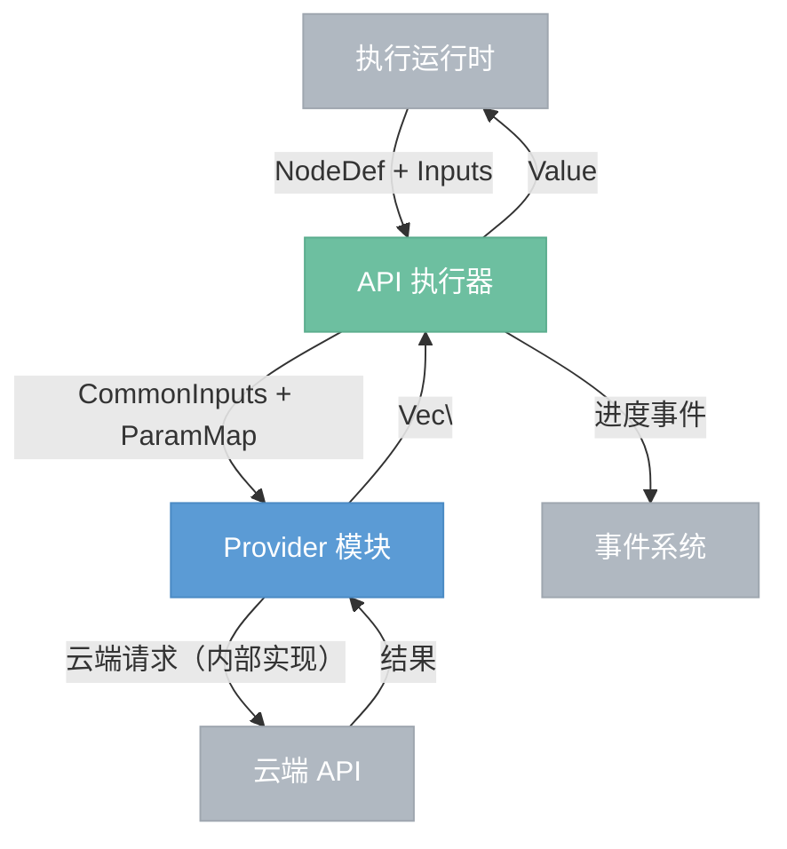
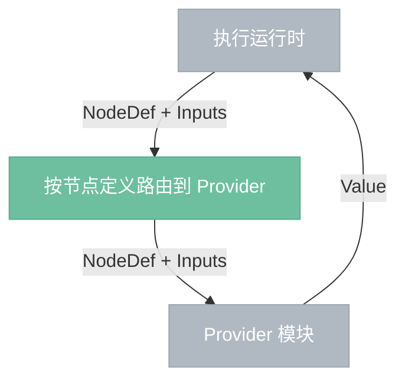

# API 执行器

> 调用云端模型 API 执行推理，薄调度层——接收引擎输入，调用 Provider 模块，返回 Value。

## 总览



---

## Provider 接口

Provider 是执行器的插件边界。每个 Provider 模块封装一套云端 API 的完整调用逻辑，对执行器暴露统一接口：

```
execute(node: NodeDef, inputs: Inputs) -> Result<Value>
```

Provider 内部自行负责一切：输入解析、格式转换（如图片上传）、认证、请求构建、polling、重试、输出打包。执行器对这些细节完全不感知。

---

## 执行流程



---

## 组件

- **路由**：从 NodeDef 中读取 provider 名称，在注册表中查找对应模块，将 NodeDef + Inputs 整体交给 Provider，不做任何转换。
- **Provider 注册表**：维护 provider 名称到模块的映射。
- **进度转发**：将 Provider 上报的进度事件转发给事件系统。

---

## 边界情况

- **Provider 未注册**：节点报错，不执行。
- **Provider 内部错误**：透传 Provider 返回的错误信息，不额外包装。
- **进度事件**：Provider 可选择性地通过回调上报进度，执行器转发给事件系统。
- **仅手动触发**：API 执行器只在手动执行（mode=manual）时被调用。参数拖动触发的自动执行（mode=auto）中，AI 节点被执行规划器标脏但跳过，不发起云端请求。
