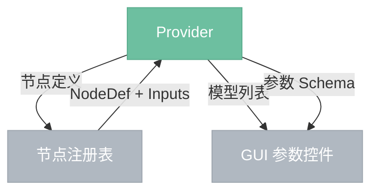

# Provider

> API 节点的插件单元。每个 Provider 封装一套云端 API，向引擎暴露节点定义、模型选单、参数选单和执行接口，引擎据此将其注册为可用节点。

## 总览



---

## 节点定义

Provider 声明节点的静态结构，供节点注册表注册：

| 字段 | 说明 |
|------|------|
| `name` | 节点名称，显示在节点库中 |
| `category` | 分类（如 `AI / 图像生成`） |
| `inputs` | 输入引脚列表（所有模型的超集，可选引脚按需连接） |
| `outputs` | 输出引脚列表 |

输入引脚示例：

| 引脚 | 类型 | 必填 |
|------|------|------|
| `image` | Image | 否 |
| `mask` | Image | 否 |

输出引脚固定为 `images: Vec<Image>`。

---

## 模型选单

Provider 返回可用模型列表，GUI 渲染为节点内的下拉选择器。`model` 是节点的内置参数，切换时触发参数选单重新加载。

```
models() -> Vec<ModelInfo>
```

**ModelInfo：**

| 字段 | 说明 |
|------|------|
| `id` | 模型标识符（传给 execute） |
| `display_name` | 显示名称 |

---

## 参数选单

参数选单是动态的——不同模型的参数不同。GUI 在模型切换时重新查询并重绘参数控件。

```
param_schema(model_id: &str) -> Vec<ParamDef>
```

**ParamDef：**

| 字段 | 类型 | 说明 |
|------|------|------|
| `name` | String | 参数名，写入节点参数表 |
| `label` | String | 控件显示标签 |
| `type` | ParamType | 见下 |
| `default` | Value | 默认值 |

**ParamType：**

| 类型 | 附加字段 | 渲染控件 |
|------|----------|----------|
| `Enum` | `options: Vec<String>` | 下拉选择器 |
| `Int` | `min, max, step` | 整数滑块 |
| `Float` | `min, max, step` | 浮点滑块 |
| `Bool` | — | 开关 |
| `String` | — | 文本输入框 |

---

## 执行接口

```
execute(node: NodeDef, inputs: Inputs) -> Result<Value>
```

Provider 内部自行处理一切：输入解析、格式转换、认证、请求构建、polling、重试、输出打包。

---

## 进度上报（可选）

Provider 可通过回调上报进度，执行器转发给事件系统：

```
on_progress: Option<Box<dyn Fn(f32)>>
```

不实现则无进度显示，节点执行期间状态栏仅显示"运行中"。
