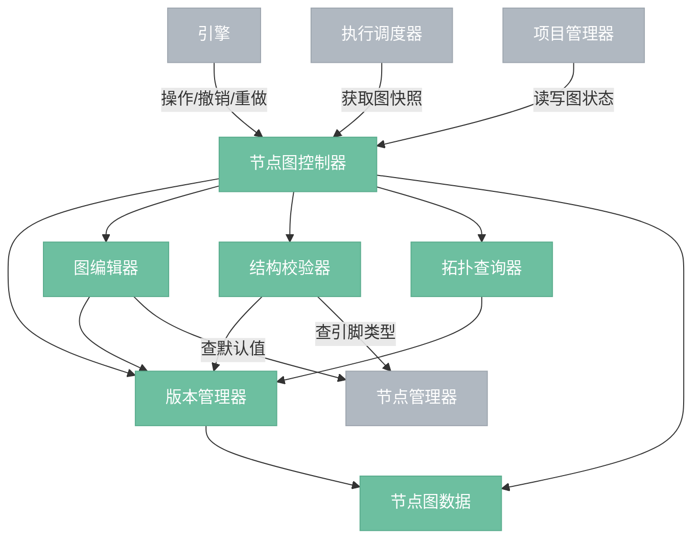
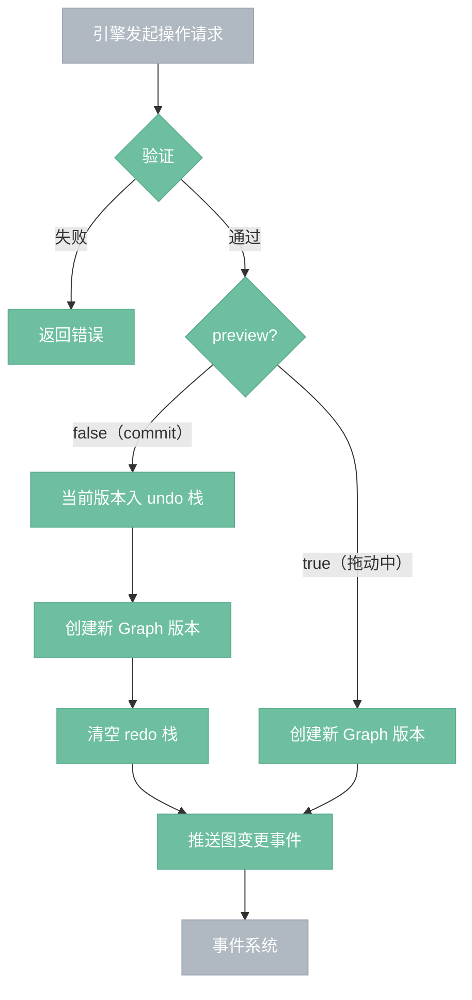
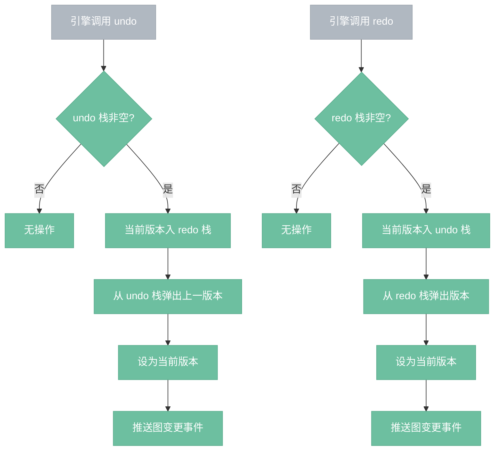

# 节点图控制器

> 所有图变更的入口，基于不可变状态 + 结构共享实现 undo/redo。

## 总览

---

## 操作流程

---

## 撤销/重做流程

---

## 组件

- **节点图数据**：纯数据结构（Graph、Node、Connection），不含操作逻辑。Graph 不持有 NodeDef，params 只存用户设置的值。依赖 nodeimg-types（NodeId、Position、Value、DataType、Constraint）。
- **版本管理器**：维护 undo 栈和 redo 栈，持有节点图数据的当前版本和历史版本。节点通过 Arc 持有，修改时只 clone 被改的节点，未改变的节点在版本间共享引用。
- **图编辑器**：add_node、remove_node、connect、disconnect、set_param、move_node。每次操作创建新版本，旧版本入 undo 栈。例外：set_param(preview=true) 和 move_node（可选）不入 undo 栈，只创建新版本推送事件。
- **结构校验器**：connect 前做环检测（DFS）和类型兼容性检查（查节点管理器获取引脚类型），remove_node 时级联删除相关连接，单输入引脚检查。
- **拓扑查询器**：topo_sort、upstream、downstream、validate。读取当前版本，不产生新版本。

## 操作

| 操作 | 说明 |
|------|------|
| add_node | 添加节点，返回 NodeId |
| remove_node | 删除节点，级联删除相关连接 |
| connect | 连线，含环检测，已有连接则先断开 |
| disconnect | 断线 |
| set_param(preview=false) | 修改节点参数，入 undo 栈（用户确认，如松手） |
| set_param(preview=true) | 修改节点参数，不入 undo 栈，不清空 redo 栈（拖动中实时预览） |
| move_node | 移动节点画布坐标 |
| undo | 回退到上一版本 |
| redo | 前进到下一版本 |
| snapshot | 获取当前图的不可变快照（供调度器使用） |
| replace | 替换整个图状态（项目加载时），重置 undo/redo 栈 |

## 边界情况

- **undo 栈深度**：可配置上限，防止内存无限增长。结构共享减少内存开销。
- **不进入 undo 栈的操作**：move_node（画布坐标变化）可选择不记录，避免拖拽时产生大量版本。set_param(preview=true) 同理，拖动滑块过程中不入栈，松手时以 preview=false 调用一次入栈，拖动前后只产生一条 undo 记录。
- **执行中的图修改**：调度器持有快照引用（Arc），不受后续版本变更影响。
