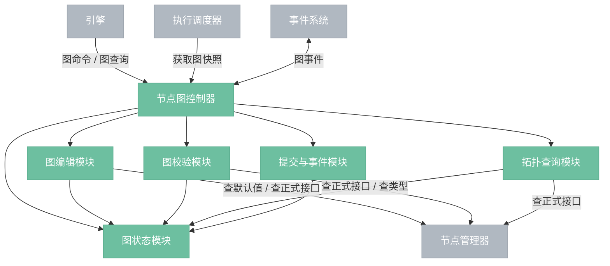
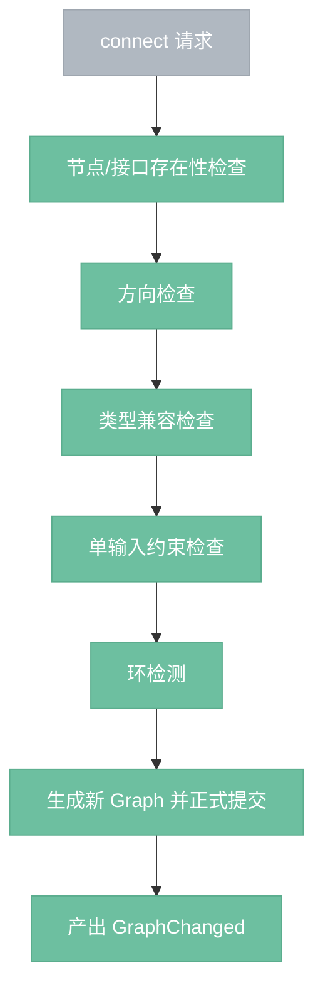
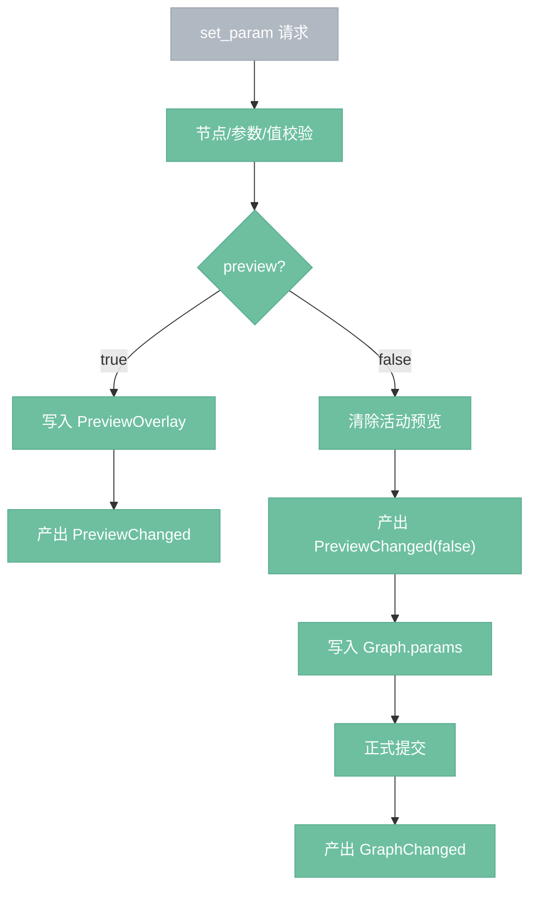
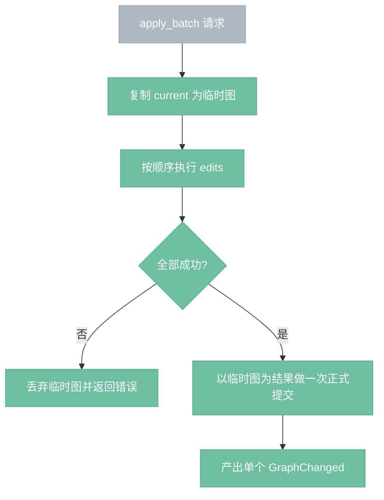
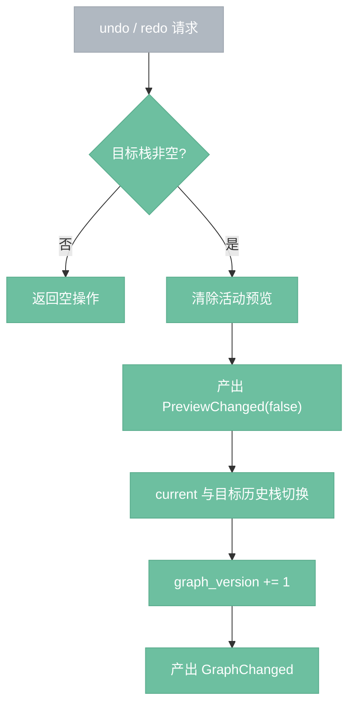

# 节点图控制器

> 引擎内计算图的唯一读写与查询边界。负责持有图状态、执行图编辑、提供图校验与拓扑查询，并维护提交语义与图事件。

## 定义

### 图（Graph）

图是引擎用于**计算、校验与依赖解析**的声明式数据结构，由**节点实例**与**连线**组成。

它描述：

- 存在哪些节点实例
- 每个节点实例引用哪个节点类型
- 每个节点实例当前持有的本地参数值
- 哪些正式接口之间存在连接关系

图中的正式接口，以节点管理器提供的展开接口视图为准，包含：

- 普通输入引脚
- 普通输出引脚
- 由 `Param.expose` 暴露出的参数输入接口
- 由 `Param.expose` 暴露出的参数输出接口

图**不包含**：

- 节点定义（`NodeDef`）
- 画布位置、节点大小、折叠状态、视口等布局信息
- undo / redo 历史
- `graph_version`、`dirty`、`preview` 等提交态信息
- 缓存、执行结果、界面状态

### 节点图控制器（graph controller）

节点图控制器是引擎内**唯一的计算图读写与查询边界**。

它负责：

- 持有和切换 `GraphState`
- 执行所有计算图编辑命令
- 提供所有计算图只读查询
- 维护提交语义：`graph_version`、`dirty`
- 产出图相关事件：`GraphChanged`、`PreviewChanged`

节点图控制器的全部连线、校验和拓扑语义，统一以节点管理器提供的**正式接口视图**为准，而不是只看原始引脚。

### 三层关系

- **Graph**：计算图本体
- **GraphState**：计算图的版本容器
- **graph controller**：`GraphState` 的唯一操作入口

---

## 总览


```mermaid
%%{ init: { 'flowchart': { 'curve': 'basis' } } }%%
flowchart TB
    classDef internal fill:#6DBFA0,stroke:#5BAD8E,color:#fff
    classDef external fill:#B0B8C1,stroke:#9EA6AF,color:#fff

    引擎["引擎"]:::external -->|"图命令 / 图查询"| 控制器["节点图控制器"]:::internal

    控制器 --> 状态["图状态模块"]:::internal
    控制器 --> 编辑["图编辑模块"]:::internal
    控制器 --> 校验["图校验模块"]:::internal
    控制器 --> 查询["拓扑查询模块"]:::internal
    控制器 --> 提交["提交与事件模块"]:::internal

    编辑 --> 状态
    校验 --> 状态
    查询 --> 状态
    提交 --> 状态

    编辑 -->|"查默认值 / 查正式接口"| 节点管理器["节点管理器"]:::external
    校验 -->|"查正式接口 / 查类型"| 节点管理器
    查询 -->|"查正式接口"| 节点管理器

    调度器["执行调度器"]:::external -->|"获取图快照"| 控制器
    事件系统["事件系统"]:::external <-->|"图事件"| 控制器
```

---

## 职责边界

### 属于图控制器

- 计算图数据的读取与修改
- 图版本切换与 undo / redo
- 图结构与参数值校验
- 上游 / 下游 / 子图解析等只读拓扑查询
- `graph_version` 与 `dirty` 的维护
- 图事件产出

### 不属于图控制器

- 节点定义收集与注册
- 节点执行与调度
- 项目文件读写
- 画布位置、视口、节点展开折叠等布局语义
- GUI 选中态、拖拽态、面板状态

说明：

- 节点位置不属于 Graph，而属于独立的布局模型
- 引擎只负责“能否连接、如何求值、依赖如何传播”
- GUI / 项目层负责“节点显示在哪、视口如何恢复、画布如何交互”

---

## 对外接口

### 图编辑命令

图控制器对外提供以下计算图写接口：

- **添加节点**：根据节点类型和初始参数创建节点实例，返回节点标识
- **删除节点**：删除指定节点，并级联删除相关连接
- **建立连接**：把一个输出接口连接到一个输入接口
- **断开连接**：删除指定连接
- **修改参数**：修改节点本地参数值；支持 `preview=true/false`
- **批量编辑**：把多步图编辑作为一次原子提交
- **撤销**
- **重做**
- **替换整张图**：用一份新的 Graph 整体替换当前图

说明：

- `move_node` 不属于图控制器；它是布局语义，不属于计算图语义

### 图查询

图控制器对外提供以下只读查询：

- **获取当前图快照**
- **校验图**
- **查询上游**
- **查询下游**
- **解析执行子图**
- **查询图状态摘要**：返回 `graph_version`、`dirty`、是否可撤销、是否可重做

### 图状态命令

图控制器对外还提供一个状态命令：

- **标记已保存**：在项目保存成功后，把当前正式提交图标记为已保存基线
- **丢弃预览**：清除当前活动预览，不修改 Graph 本体

### 图事件

图控制器必须向上层事件系统产出：

- `GraphChanged`
- `PreviewChanged`

---

## 依赖接口

图控制器除了提供图编辑与图查询接口，还依赖外部模块的最小接口集。

### 对节点管理器

```rust
get_node_def(type_id)
list_exposed_pins(type_id)
get_exposed_input_pin(type_id, pin_name)
get_exposed_output_pin(type_id, pin_name)
```

用途：

- 添加节点时读取默认参数；
- 连线与参数修改时做正式接口存在性与类型兼容性校验；
- 拓扑查询与子图解析时使用正式接口视图。

### 对调度器

```rust
notify_graph_changed(event)
notify_graph_replaced(snapshot_meta)
```

用途：

- 正式提交后通知调度器增量更新脏状态；
- 整图替换 / 恢复时通知调度器重建执行基线。

### 对事件系统

```rust
publish(event)
```

用途：

- 广播 `GraphChanged`（图变化，GraphChanged）与 `PreviewChanged`（预览变化，PreviewChanged）。

---

## 组件

### 1. 图状态模块

负责持有和切换图状态。

包含：

- 当前图
- undo 栈
- redo 栈
- 图版本号
- 脏标记

它解决“当前是哪张图、历史版本有哪些”。

### 2. 图编辑模块

负责执行图修改。

包含：

- 添加节点
- 删除节点
- 建立连接
- 断开连接
- 修改参数
- 批量编辑
- 替换整张图

它解决“怎样从旧图产生新图”。

### 3. 图校验模块

负责判断图是否合法。

至少覆盖：

- 节点类型是否存在
- 节点实例是否存在
- 正式接口是否存在
- 输入 / 输出方向是否正确
- 类型是否兼容
- 是否形成环
- 单输入约束是否满足
- 参数值是否满足约束

### 4. 拓扑查询模块

负责只读分析图结构。

包含：

- 查询上游
- 查询下游
- 拓扑排序
- 解析执行子图

说明：

- 拓扑排序是内部辅助查询能力
- 对外接口只暴露“解析执行子图”，不单独暴露“拓扑排序”

### 5. 提交与事件模块

负责把图编辑结果收口为统一提交语义。

包含：

- 正式提交
- 预览修改
- undo / redo 后的状态切换
- 图事件产出

它解决“哪些修改进入历史，哪些修改只是预览”。

---

## 正式接口语义

图控制器中的“接口”一词，默认指节点管理器展开后的**正式接口**，而不是节点定义中的原始字段。

因此：

- 连线合法性检查基于正式接口
- 类型兼容性检查基于正式接口
- 上游 / 下游查询基于正式接口
- 子图解析基于正式接口

参数暴露的语义：

- `Param.expose = input`：该参数可作为输入接口，被外部连线覆盖
- `Param.expose = output`：该参数可作为输出接口，对外输出该参数的最终值

参数最终值优先级：

1. 参数输入接口的外部连线值
2. 节点实例中的本地参数值
3. 节点定义中的默认值

---

## 提交语义

### 正式提交

以下操作属于正式提交：

- 添加节点
- 删除节点
- 建立连接
- 断开连接
- `set_param(preview=false)`
- 批量编辑成功提交
- 撤销
- 重做
- 替换整张图

正式提交的效果：

- 更新当前图
- 维护 undo / redo
- 递增 `graph_version`
- 更新 `dirty`
- 产出 `GraphChanged`
- 若提交前存在活动预览，额外产出 `PreviewChanged(has_preview=false)`

补充：

- `replace_graph` 也属于正式提交
- `replace_graph` 会替换当前图、重置 undo / redo、递增 `graph_version`，并产出 `GraphChanged`

### 预览修改

`set_param(preview=true)` 表示预览修改。

预览修改的约束：

- 不进入 undo 栈
- 不清空 redo 栈
- 不修改 `dirty`
- 不递增 `graph_version`
- 产出 `PreviewChanged`

说明：

- 预览修改是共享 contract 已固定的外部语义
- 内部实现可以采用临时 current、覆盖层或其他机制，但不得改变上述外部语义

---

## 查询语义

- **获取当前图快照**：返回当前 Graph 的只读快照
- **校验图**：纯查询；不修改图，不触发图版本变化
- **查询上游**：返回某节点的全部传递上游，而不是仅一层邻居
- **查询下游**：返回某节点的全部传递下游，而不是仅一层邻居
- **解析执行子图**：返回某次执行目标会涉及的节点集合与拓扑顺序

这些查询全部是纯读取：

- 不修改图
- 不修改 `dirty`
- 不修改 `graph_version`
- 不触发图事件

其中：

- **查询图状态摘要** 仅返回当前提交状态摘要，不返回图本体

---

## 文件结构

建议按“模型、写入、校验、查询”分层组织：

```text
engine/src/graph/
├── mod.rs                 // 对外导出 GraphController、Graph、查询/请求类型
│
├── controller.rs          // GraphController 总入口，对外接口收口
│
├── model/                 // 纯数据结构
│   ├── mod.rs
│   ├── graph.rs           // Graph、NodeInstance、Connection、PinRef、InterfaceName
│   ├── state.rs           // GraphState、GraphStateSummary、PreviewOverlay
│   ├── batch.rs           // 批量编辑请求/结果/编辑项
│   ├── validation.rs      // 校验报告、问题类型、IssueSubject
│   ├── events.rs          // GraphChanged / PreviewChanged payload
│   └── subgraph.rs        // ExecuteTarget、SubgraphInfo
│
├── edit/                  // 写路径
│   ├── mod.rs
│   ├── add_node.rs
│   ├── remove_node.rs
│   ├── connect.rs
│   ├── disconnect.rs
│   ├── set_param.rs
│   ├── replace_graph.rs
│   └── apply_batch.rs
│
├── history/               // 状态切换与提交历史
│   ├── mod.rs
│   ├── transitions.rs     // 正式提交、preview、dirty、mark_saved、discard_preview
│   └── undo_redo.rs       // undo / redo 规则
│
├── validate/              // 校验规则
│   ├── mod.rs
│   ├── structure.rs       // 节点存在、接口存在、单输入约束
│   ├── types.rs           // 类型兼容
│   ├── cycle.rs           // 环检测
│   └── params.rs          // 参数值校验
│
└── query/                 // 只读查询
    ├── mod.rs
    ├── snapshot.rs
    ├── state_summary.rs
    ├── upstream.rs
    ├── downstream.rs
    ├── topo_sort.rs
    └── resolve_subgraph.rs
```

组织原则：

- `model/` 只放稳定数据模型
- `edit/` 与 `query/` 分离，明确读写边界
- `history/` 单独承载状态切换与提交语义，不混入 `edit/`
- `validate/` 独立，避免规则散落在各命令中
- `controller.rs` 统一收口，对外不暴露内部实现细节

补充说明：

- `graph.rs` 统一收敛图基元：节点、连接、接口引用
- `state_summary.rs` 负责“查询图状态摘要”，避免由 `controller.rs` 直接绕过 `query/`
- `transitions.rs` 比 `commit.rs` 更准确，因为它同时覆盖正式提交、保存基线与预览生命周期

---

## 数据模型

```rust
type InterfaceName = String;
type ParamKey = String;
type GraphVersion = u64;

// NodeId、Value 引用 nodeimg-types 中的共享定义

struct PinRef {
    node: NodeId,
    interface: InterfaceName,
}

enum ExecuteTarget {
    Graph,
    Node(NodeId),
}

struct Graph {
    nodes: HashMap<NodeId, NodeInstance>,
    connections: Vec<Connection>,
}

struct NodeInstance {
    id: NodeId,
    type_id: String,
    params: HashMap<ParamKey, Value>,
}

struct Connection {
    from: PinRef,
    to: PinRef,
}

struct GraphState {
    current: Arc<Graph>,
    undo: Vec<Arc<Graph>>,
    redo: Vec<Arc<Graph>>,
    graph_version: GraphVersion,
    dirty: bool,
    preview: Option<PreviewOverlay>,
    saved_graph: Option<Arc<Graph>>,
}

struct PreviewOverlay {
    node_id: NodeId,
    param: ParamKey,
    value: Value,
}

struct GraphStateSummary {
    graph_version: GraphVersion,
    dirty: bool,
    can_undo: bool,
    can_redo: bool,
    has_preview: bool,
}

struct ValidationReport {
    is_valid: bool,
    issues: Vec<ValidationIssue>,
}

enum IssueSubject {
    Node(NodeId),
    Connection { from: PinRef, to: PinRef },
    Param { node_id: NodeId, param: ParamKey },
}

struct ValidationIssue {
    code: ValidationIssueCode,
    subject: Option<IssueSubject>,
    message: String,
}

enum ValidationIssueCode {
    CycleDetected,
    TypeMismatch,
    MissingNode,
    MissingNodeType,
    InvalidParamValue,
    InvalidInterface,
    InvalidDirection,
}

struct SubgraphInfo {
    target: ExecuteTarget,
    nodes: Vec<NodeId>,
    order: Vec<NodeId>,
}

enum BatchNodeRef {
    Existing(NodeId),
    Created(String),
}

struct BatchPinRef {
    node: BatchNodeRef,
    pin: InterfaceName,
}

enum GraphEdit {
    AddNode {
        client_key: String,
        type_id: String,
        param_overrides: HashMap<ParamKey, Value>,
    },
    RemoveNode { node_id: NodeId },
    Connect { from: BatchPinRef, to: BatchPinRef },
    Disconnect { from: BatchPinRef, to: BatchPinRef },
    SetParam {
        node: BatchNodeRef,
        param: ParamKey,
        value: Value,
        preview: bool,
    },
}

struct EditBatchRequest {
    edits: Vec<GraphEdit>,
    label: Option<String>,
}

struct EditBatchResult {
    created_nodes: HashMap<String, NodeId>,
    graph_version: GraphVersion,
}
```

约束：

- `Graph.nodes` 以 `NodeId` 为唯一键
- `Connection` 以 `(from, to)` 表示，不单独引入 `ConnectionId`
- `to` 必须指向输入方向的正式接口；同一输入接口最多一条入边
- `preview` 只允许同时存在一条活动预览；新的 `preview=true` 会覆盖旧预览
- `saved_graph` 表示最近一次 `mark_saved()` 对应的正式提交图快照；若为 `None`，表示当前尚无保存基线

### GraphState 设计决议

- **D01：Graph 只包含计算语义，不包含布局语义**
- **D02：图历史采用 `Arc<Graph>` 快照栈表达**
- **D03：preview 采用单条 `PreviewOverlay` 覆盖层表达，而不是 preview Graph 副本**

说明：

- 采用 `Arc<Graph>` 的原因是实现简单、语义直观，适合作为 P0
- 若后续证明内存压力明显，再评估持久化数据结构替换方案
- `PreviewOverlay` 只覆盖单个参数，读取参数最终值时按“preview → 本地参数 → 默认值”求值
- P0 最多只允许一条全局活动预览；不同节点或不同参数的并发预览不支持

### 并发模型

- 图控制器内部持有 `GraphState`，所有写入通过引擎串行化
- 读取返回 `Arc<Graph>` 快照；调度器持有快照期间的后续编辑不会影响该快照
- `preview`、`dirty`、undo / redo 都属于同一份串行化状态机的一部分

---

## 对外接口详细语义

本节定义的是**正式接口语义**。具体函数签名、错误枚举补充或内部拆分方式可以调整，但职责边界、输入输出语义与副作用约束不应改变。

### 1. 添加节点

- 输入：`type_id`、可选的 `param_overrides`
- 返回：`NodeId`
- 调用方：引擎 / GUI / CLI / AI 操作员

规则：

1. `NodeId` 由图控制器生成，调用方不得自带
2. 若节点类型不存在，返回错误，不创建节点
3. 新节点的本地参数值从“节点默认参数 + `param_overrides`”合成
4. `param_overrides` 中包含未知参数或非法值时，返回错误
5. 成功时产生一个正式提交、一个 undo 条目和一个 `GraphChanged`

### 2. 删除节点

- 输入：`node_id`
- 返回：空

规则：

1. 若节点不存在，返回错误
2. 删除节点时必须级联删除所有相关连接
3. 成功时产生一个正式提交、一个 undo 条目和一个 `GraphChanged`
4. 事件 payload 必须至少带出被删除节点 id；级联连接删除作为变化范围的一部分体现

### 3. 建立连接

- 输入：`from`、`to`
- 返回：空

校验顺序固定为：

1. 源节点与目标节点存在
2. `from` / `to` 对应的正式接口存在
3. `from` 必须是输出方向，`to` 必须是输入方向
4. 两端类型兼容
5. `from.node_id != to.node_id`
6. `to` 满足单输入约束
7. 新增该边后图中不形成环

补充规则：

- 输出接口允许扇出，一条输出可连向多个输入
- 输入接口已有旧连接时，先删除旧连接，再建立新连接；整个过程仍视为一次正式提交
- 校验失败时不修改图
- 成功时产出一个正式提交和一个 `GraphChanged`
- 若发生“替换旧连接”，则本次 `GraphChanged.changes` 必须同时包含旧连接删除与新连接新增

### 4. 断开连接

- 输入：`from`、`to`
- 返回：空

规则：

1. 若该连接不存在，返回错误
2. 成功时删除该连接，产生一个正式提交和一个 `GraphChanged`

### 5. 修改参数

- 输入：`node_id`、`param`、`value`、`preview`
- 返回：空

规则：

1. 节点不存在或参数不存在时，返回错误
2. 参数值不满足约束时，返回错误
3. `preview=false`：写入节点本地参数，形成正式提交
4. `preview=true`：只写入 `PreviewOverlay`，不修改 Graph 本体
5. 同一参数连续 `preview=true` 时，新值覆盖旧预览值，不新增历史
6. 任意正式提交发生时，已有预览先被丢弃，再执行正式提交
7. `undo` / `redo` 会清除活动预览
8. 任何导致活动预览被清除的路径，都必须产出 `PreviewChanged(has_preview=false)`

### 6. 批量编辑

- 输入：`EditBatchRequest`
- 返回：`EditBatchResult`

规则：

1. batch 内编辑按顺序执行
2. 第 k 步失败时，前 k-1 步全部回滚，整批不产生部分提交
3. 整个 batch 只产生一个 undo 条目和一个 `GraphChanged`
4. batch 内新增节点通过 `client_key` 暴露给后续编辑引用
5. batch 内禁止 `preview=true`；若出现则直接返回错误
6. batch 内禁止 `replace_graph`；整图替换只能通过独立接口完成

### 7. 撤销 / 重做

- 输入：空
- 返回：空

规则：

1. `undo` 在 undo 栈为空时返回空操作，不报错
2. `redo` 在 redo 栈为空时返回空操作，不报错
3. 只有在目标栈非空、即将发生实际切换时，才允许清除活动预览
4. 每次 `undo` / `redo` 都会切换 `current`，递增 `graph_version`，并产出 `GraphChanged`
5. `undo` / `redo` 时，目标栈顶的 `Arc<Graph>` 必须直接作为新 `current` 沿用，不得重新构造；这是 `Arc::ptr_eq` 脏标记重算机制成立的前提
6. undo 栈深度应可配置；**首版默认上限 = 128 步，全局应用级可配置**；超限时按 FIFO 丢弃最旧历史

### 8. 替换整张图

- 输入：`Graph`
- 返回：空

规则：

1. 传入图先完成完整校验，再允许替换
2. 成功时替换 `current`，清空 undo / redo，清除活动预览
3. `graph_version += 1`
4. `dirty = true`
5. 产出 `GraphChanged(Replaced)`
6. 若替换前存在活动预览，还必须额外产出 `PreviewChanged(has_preview=false)`
7. `replace_graph` 成功后，`saved_graph = None`

### 9. 获取当前图快照

- 返回：当前 Graph 只读快照

规则：

- 若存在活动预览，快照仍返回正式提交的 Graph，不合成预览值

### 10. 查询图状态摘要

- 返回：`GraphStateSummary`

规则：

- 只返回当前提交状态摘要，不返回图本体
- `has_preview` 用于让调用方感知当前存在活动预览

### 11. 校验图

- 返回：`ValidationReport`

规则：

- 校验对象是“当前正式提交图 + 当前活动预览覆盖值”形成的视图
- 校验失败只通过返回值体现，不修改任何状态

### 12. 查询上游 / 查询下游

- 输入：`node_id`
- 返回：`Vec<NodeId>`

规则：

- 返回传递闭包，而不是只返回一层邻居
- 返回结果不得重复，顺序采用稳定拓扑相关顺序

### 13. 解析执行子图

- 输入：`ExecuteTarget`
- 返回：`SubgraphInfo`

规则：

- `ExecuteTarget::Graph` 返回整张图的节点集合与拓扑顺序
- `ExecuteTarget::Node(node_id)` 返回该节点及其全部上游依赖
- 解析对象是当前正式提交图，不合成预览值

### 14. 标记已保存

- 输入：空
- 返回：空

规则：

1. `mark_saved()` 记录当前 `Arc<Graph>` 为 `saved_graph`
2. `mark_saved()` 令 `dirty=false`
3. `mark_saved()` 不修改图、不清理预览
4. `mark_saved()` 必须产出一个轻量 `GraphChanged`，其 `changes` 为空，且 `dirty=false`

### 15. 丢弃预览

- 输入：空
- 返回：空

规则：

1. 若当前没有活动预览，则返回空操作，不报错
2. 若当前存在活动预览，则清除 `PreviewOverlay`
3. `discard_preview()` 不修改 Graph 本体、不进入 undo 栈、不产出 `GraphChanged`
4. 成功清除预览时，必须产出 `PreviewChanged(has_preview=false)`

### 查询与预览可见性

- **获取当前图快照**：只看正式提交图，不看预览
- **查询图状态摘要**：不合成预览值，但通过 `has_preview` 暴露预览存在性
- **校验图**：看“正式提交图 + 当前活动预览覆盖值”
- **查询上游 / 查询下游**：只看正式提交图，不看预览
- **解析执行子图**：只看正式提交图，不看预览

---

## 事件模型

```rust
enum GraphChange {
    NodeAdded { node_id: NodeId },
    NodeRemoved { node_id: NodeId },
    ConnectionAdded { from: PinRef, to: PinRef },
    ConnectionRemoved { from: PinRef, to: PinRef },
    ParamCommitted { node_id: NodeId, param: ParamKey },
    Replaced,
    Undone,
    Redone,
}

struct GraphChangedEvent {
    graph_version: GraphVersion,
    dirty: bool,
    changes: Vec<GraphChange>,
}

struct PreviewChangedEvent {
    node_id: NodeId,
    param: ParamKey,
    has_preview: bool,
}
```

说明：

- 对外事件名称为 `GraphChanged`、`PreviewChanged`
- `GraphChangedEvent`、`PreviewChangedEvent` 是这两个事件各自的 payload 模型
- `PreviewChangedEvent` 不携带预览值本体；需要值的调用方应使用自己持有的交互上下文，或通过后续专用查询接口获取

规则：

- 每次正式提交只产出一个 `GraphChangedEvent`
- `changes` 必须表达本次变化范围，避免下游一律全量 diff
- batch 提交时，不使用粗粒度 `BatchApplied`；而是在 `changes` 中按顺序放入细粒度 `GraphChange`
- `replace_graph`、`undo`、`redo` 可使用粗粒度变化类型；下游按全量处理
- `PreviewChangedEvent.has_preview=false` 表示该预览已被清除
- 任何导致活动预览被清除的操作，都必须同时产出 `PreviewChanged(has_preview=false)`；该事件可与 `GraphChanged` 并行发出
- `GraphChangedEvent.changes=[]` 且 `dirty=false` 表示 `mark_saved()` 的轻量状态通知，不代表图内容发生变化

---

## dirty 语义

- `dirty=true` 表示“当前正式提交图自上次标记保存后已发生变化”
- `mark_saved()` 会记录当前 `Arc<Graph>` 为已保存基线，并令 `dirty=false`
- `preview=true` 不改变 `dirty`
- 图控制器对外提供一个额外状态接口：**标记已保存**

```rust
fn mark_saved(&mut self);
fn discard_preview(&mut self);
```

规则：

- `mark_saved()` 会把 `saved_graph` 更新为当前 `Arc<Graph>`，并把 `dirty` 置为 `false`
- `mark_saved()` 不修改图、不改变 `graph_version`
- 该接口供项目管理器在成功保存后调用

补充规则：

- 正式提交完成后：
  - 若 `saved_graph = None`，则 `dirty=true`
  - 若 `saved_graph` 与 `current` 指向同一 `Arc<Graph>`，则 `dirty=false`
  - 否则 `dirty=true`
- `undo` / `redo` 后，`dirty` 必须根据 `saved_graph` 与 `current` 的 `Arc::ptr_eq` 结果重新计算，而不是一律置为 `true`

说明：

- `saved_graph = None` 表示当前尚无保存基线；在这种状态下，正式提交后的图一律视为脏
- 新建未保存项目、`replace_graph` 后尚未保存的新图，都属于该情形

---

## 核心流程

### 建立连接流程


```mermaid
%%{ init: { 'flowchart': { 'curve': 'basis' } } }%%
flowchart TB
    classDef internal fill:#6DBFA0,stroke:#5BAD8E,color:#fff
    classDef external fill:#B0B8C1,stroke:#9EA6AF,color:#fff

    请求["connect 请求"]:::external --> 存在性["节点/接口存在性检查"]:::internal
    存在性 --> 方向["方向检查"]:::internal
    方向 --> 类型["类型兼容检查"]:::internal
    类型 --> 单输入["单输入约束检查"]:::internal
    单输入 --> 环检测["环检测"]:::internal
    环检测 --> 提交["生成新 Graph 并正式提交"]:::internal
    提交 --> 事件["产出 GraphChanged"]:::internal
```

### 修改参数流程


```mermaid
%%{ init: { 'flowchart': { 'curve': 'basis' } } }%%
flowchart TB
    classDef internal fill:#6DBFA0,stroke:#5BAD8E,color:#fff
    classDef external fill:#B0B8C1,stroke:#9EA6AF,color:#fff

    请求["set_param 请求"]:::external --> 校验["节点/参数/值校验"]:::internal
    校验 --> 预览{"preview?"}:::internal
    预览 -->|"true"| 覆盖["写入 PreviewOverlay"]:::internal
    覆盖 --> 预览事件["产出 PreviewChanged"]:::internal
    预览 -->|"false"| 清预览["清除活动预览"]:::internal
    清预览 --> 清预览事件["产出 PreviewChanged(false)"]:::internal
    清预览事件 --> 写本体["写入 Graph.params"]:::internal
    写本体 --> 正式提交["正式提交"]:::internal
    正式提交 --> 图事件["产出 GraphChanged"]:::internal
```

### 批量编辑流程


```mermaid
%%{ init: { 'flowchart': { 'curve': 'basis' } } }%%
flowchart TB
    classDef internal fill:#6DBFA0,stroke:#5BAD8E,color:#fff
    classDef external fill:#B0B8C1,stroke:#9EA6AF,color:#fff

    请求["apply_batch 请求"]:::external --> 临时图["复制 current 为临时图"]:::internal
    临时图 --> 顺序执行["按顺序执行 edits"]:::internal
    顺序执行 --> 成功{"全部成功?"}:::internal
    成功 -->|"否"| 回滚["丢弃临时图并返回错误"]:::internal
    成功 -->|"是"| 单次提交["以临时图为结果做一次正式提交"]:::internal
    单次提交 --> 事件["产出单个 GraphChanged"]:::internal
```

### undo / redo 流程


```mermaid
%%{ init: { 'flowchart': { 'curve': 'basis' } } }%%
flowchart TB
    classDef internal fill:#6DBFA0,stroke:#5BAD8E,color:#fff
    classDef external fill:#B0B8C1,stroke:#9EA6AF,color:#fff

    操作["undo / redo 请求"]:::external --> 有历史{"目标栈非空?"}:::internal
    有历史 -->|"否"| 无操作["返回空操作"]:::internal
    有历史 -->|"是"| 清预览["清除活动预览"]:::internal
    清预览 --> 清预览事件["产出 PreviewChanged(false)"]:::internal
    清预览事件 --> 切栈["current 与目标历史栈切换"]:::internal
    切栈 --> 递增版本["graph_version += 1"]:::internal
    递增版本 --> 图事件["产出 GraphChanged"]:::internal
```

---

## 测试策略

至少覆盖以下层次：

1. **模型层**：Graph / GraphState / PreviewOverlay 基本约束
2. **编辑层**：add_node / remove_node / connect / disconnect / set_param / replace_graph
3. **校验层**：类型检查、方向检查、单输入约束、环检测、参数约束
4. **查询层**：upstream / downstream / resolve_subgraph
5. **历史层**：undo / redo / 预览覆盖与正式提交切换
6. **批量层**：apply_batch 成功原子提交、失败全量回滚
7. **事件层**：GraphChanged / PreviewChanged payload 与时机

重点用例：

- `mark_saved()` 产出轻量 `GraphChanged`
- `discard_preview()` 只清预览，不改图
- 正式提交 / undo / redo / replace_graph 清预览时，额外产出 `PreviewChanged(false)`
- undo 栈为空时，返回空操作且不得清除预览
- 保存后编辑，再 undo 回到保存态时，`dirty=false`

---

## 风险与未决问题

- **R01：全量快照历史的内存成本** —— P0 接受，后续按真实数据量再评估持久化结构
- **R02：环检测性能** —— P0 使用全量 DFS；若交互性能不足，再引入增量策略
- **R03：preview 单覆盖层限制** —— P0 只支持单条活动预览，后续如有多控件并行预览需求再扩展

---

## 推荐实现顺序

1. 落 `model/` 数据结构
2. 落 `history/` 的 GraphState、提交与 undo / redo 规则
3. 落 `validate/structure.rs`、`validate/types.rs`、`validate/cycle.rs`
4. 落 `edit/add_node.rs`、`edit/remove_node.rs`、`edit/connect.rs`、`edit/disconnect.rs`
5. 落 `edit/set_param.rs` 与 `PreviewOverlay`
6. 落 `query/upstream.rs`、`query/downstream.rs`、`query/resolve_subgraph.rs`
7. 落 `edit/apply_batch.rs`
8. 最后收口 `controller.rs` 与事件编排

---

## 外部依赖接口清单

本节固定 graph controller（节点图控制器）对其他模块的**最小外部依赖接口集合**。

目的：

- 避免 graph controller 继续通过读取内部结构“猜测语义”
- 明确哪些接口已经可复用，哪些接口虽然存在但还不稳定，哪些接口尚未定义
- 为后续逐项讨论与收口提供清单

### A. 依赖 node_manager（节点管理器）的接口

#### A1. 节点定义与默认值

graph controller 依赖 node_manager 提供：

- `get_node_def(type_id)`
- `default_params(type_id)`

用途：

- `add_node` 生成节点实例时补齐默认参数
- `validate_graph` 校验节点类型是否存在
- 参数约束校验时获取参数定义

状态：

- **已存在，可复用**

#### A2. 正式接口视图

graph controller 依赖 node_manager 提供：

- `list_exposed_pins(type_id)`
- `get_exposed_pin(type_id, interface)`
- `get_exposed_input_pin(type_id, interface)`
- `get_exposed_output_pin(type_id, interface)`

用途：

- `connect` / `disconnect` / `validate_graph` 的接口存在性校验
- 输入 / 输出方向判定
- `Param.expose`（参数暴露）接口的正式语义接入

状态：

- **已存在，可复用**
- 但这些接口的字段级 contract 仍需固定，graph controller 不应继续依赖“字段名碰巧够用”的事实

#### A3. 参数规格查询

理想上，graph controller 依赖 node_manager 提供：

- `get_param_def(type_id, param_name)`
- `list_param_defs(type_id)`

用途：

- 参数约束校验
- 参数默认值与 expose（暴露方式）查询
- 避免 graph controller 直接穿透 `NodeDef.params`

状态：

- **当前缺失**
- P0 实现暂时通过 `get_node_def(type_id)` 间接读取 `NodeDef.params`
- 后续应收口为正式接口，避免 graph controller 绑定 node_manager 内部结构

### B. 向 scheduler（调度器）暴露的接口

调度器依赖 graph controller 提供：

- `snapshot()`
- `validate_graph()`
- `upstream(node_id)`
- `downstream(node_id)`
- `resolve_subgraph(target)`
- `graph_version` / `state_summary()`

用途：

- 读取图快照
- 计算脏传播范围
- 解析执行子图
- 观察图提交状态变化

状态：

- **已存在，但消费契约未完全固化**
- 调度器当前对 `GraphChanged` 的消费仍是“按实现读取 payload”，而不是按正式文档接口消费

### C. 图事件对外接口

graph controller 对外产出：

- `GraphChanged`
- `PreviewChanged`

事件 payload（事件载荷）包含：

- `GraphChangedEvent`
- `PreviewChangedEvent`

下游消费者至少包括：

- scheduler（调度器）
- GUI / project layer（项目层）
- 未来的缓存协调器或状态栏订阅者

状态：

- **已存在，但当前仍偏 P0**
- 目前实现是控制器内部 `Vec<GraphEvent>` 缓存，不是正式订阅/派发机制
- 本文先将 payload 结构固定，派发机制后续单独设计

### D. 与 project/save（项目保存）的协调接口

graph controller 需要项目层提供的调用约定：

- 保存成功后调用 `mark_saved()`
- 加载项目或整图替换时调用 `replace_graph(graph)`
- `replace_graph` 仅替换计算图，不负责 `GraphLayout`（布局数据）同步

用途：

- 维护 `dirty`（脏标记）与保存基线
- 在项目加载时替换当前图

状态：

- **语义已定，但调用契约仍待其他文档对齐**
- graph controller 不直接负责项目文件读写

### E. 与 runtime（运行时输入解析）的语义接口

运行时应依赖 graph controller 固定下列语义：

- 参数最终值优先级：外部参数输入 > 本地参数值 > 默认值
- `resolve_subgraph` / `upstream` / `downstream` 只基于正式提交图
- preview（预览）不改变正式图结构

用途：

- 避免 graph controller、scheduler、runtime 各自复制一份语义解释

状态：

- **部分已定，部分待对齐**
- 当前文档先固定语义口径，运行时侧是否通过独立接口调用仍待后续设计

### F. 依赖状态总表

#### 已存在，可复用

- `get_node_def(type_id)`
- `default_params(type_id)`
- `list_exposed_pins(type_id)`
- `get_exposed_pin(type_id, interface)`
- `get_exposed_input_pin(type_id, interface)`
- `get_exposed_output_pin(type_id, interface)`
- `snapshot()`
- `validate_graph()`
- `upstream()` / `downstream()` / `resolve_subgraph()`
- `mark_saved()` / `replace_graph()`

#### 已存在，但不稳定或消费契约未固定

- `GraphChanged` / `PreviewChanged` 的下游消费方式
- scheduler 对 graph 查询接口的依赖边界
- project layer 对 `mark_saved()` / `replace_graph()` 的调用时机

#### 当前缺失，后续应补

- `get_param_def(type_id, param_name)`
- `list_param_defs(type_id)`
- 正式事件订阅/派发机制
- project/save 与 `GraphLayout` 同步的正式协调接口

---

## 与其他层的关系

### 与节点管理器的关系

- 图控制器不持有 `NodeDef`
- 图控制器依赖节点管理器提供：
  - 默认参数值
  - 正式接口视图
  - 接口类型信息

### 与执行调度器的关系

- 调度器只读取图快照
- 图控制器不负责执行
- 执行中的图修改不影响已启动执行所持有的快照

### 与 GUI / 项目层的关系

- 图控制器不负责节点位置与视口
- 布局信息由 GUI / 项目层维护
- `replace_graph` 只替换计算图，不协调布局层；调用方（通常是项目管理器）负责同步 `GraphLayout`
- 项目保存时可聚合：
  - Graph（计算图）
  - GraphLayout（布局数据）

---

## 当前决议

基于“引擎只负责计算”的约束，当前文档固定以下口径：

1. Graph 是**计算图**，不包含布局语义
2. 节点位置属于独立的布局模型，不属于 Graph
3. 布局编辑不属于 graph controller
4. graph controller 只管理计算图的编辑、校验、查询和提交语义
5. 图控制器的连线与拓扑语义，统一基于节点管理器的正式接口视图

## 待对齐文档

本次决议已经在本文件固定，但以下文档仍需后续同步：

- `0.0.1-engine-contract.md` 中历史上与布局相关的图命令定义
- `5.0.0-project-file.draft.md` 中 Graph 与布局数据的文件归属
- `4.0.0-engine.md` 中“引擎持有数据 / Canvas 持有渲染状态”的边界表述

在这些文档完成同步前，以本文件对 graph controller 的边界定义为准。
