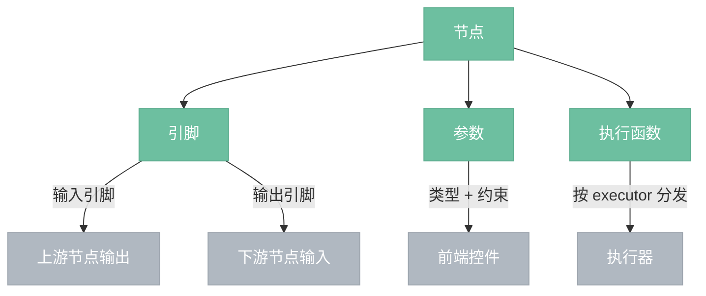

# 节点

> 节点是图中的最小处理单元，接收输入、执行处理、产出输出。本文档描述节点的概念模型和开发框架。

## 概念模型



---

## 节点组成

| 组成 | 说明 |
|------|------|
| 名称/标题/分类 | 节点的标识和归类 |
| 输入引脚 | 0~N 个，接收上游数据，有数据类型，可标记为必需 |
| 输出引脚 | 0~N 个，传递给下游，有数据类型 |
| 参数 | 0~N 个，用户可调值，有数据类型 + 约束 + 默认值 |
| 执行函数 | 节点的处理逻辑，按 executor 类型分发到不同执行器 |

---

## 数据类型

| 类型 | 含义 |
|------|------|
| Image | RGBA 图像 |
| Mask | 单通道灰度图 |
| Float | 浮点数 |
| Int | 整数 |
| Color | RGBA 颜色值 |
| Boolean | 布尔值 |
| String | 文本字符串 |
| Model / Clip / Vae / Conditioning / Latent | AI 节点专属类型，数据留在 Python 端，Rust 侧只持有 Handle |

---

## 执行器类型

| executor | 说明 | 分发目标 | 触发方式 |
|----------|------|----------|---------|
| Image（缺省） | 图像处理节点 | 图像处理执行器 | 自动 + 手动 |
| AI | 自部署 AI 节点 | AI 执行器 → Python 后端 | 仅手动触发 |
| API | 云端模型节点 | API 执行器 → 云端 API | 仅手动触发 |

---

## 节点开发框架

图像/API 节点在 Rust 侧定义，AI 节点在 Python 侧定义。Rust 编译时自动收集两端的节点定义。

### 图像/API 节点（Rust）

使用 `node!` 宏声明式定义，宏展开时自动生成 NodeDef 和 inventory 注册调用。

节点通过统一的 async `execute` 函数定义处理逻辑，接收包含 CPU 和 GPU 能力的 `ExecContext`，可按任意顺序调用。`node!` 宏内部将闭包包装为 `Box::pin(async move { ... })`，节点作者无需手写 async 样板：

> **原因：** M3 AI 节点天然异步（HTTP 调用 Python 后端），统一签名避免后续改动。

#### ExecuteFn 类型

```rust
pub type ExecuteFn = Box<
    dyn Fn(ExecContext<'_>, HashMap<String, Value>)
        -> Pin<Box<dyn Future<Output = Result<HashMap<String, Value>>>>>
        + Send + Sync
>;
```

#### 示例

```rust
// brightness/mod.rs — 纯 GPU 节点
node! {
    name: "brightness",
    title: "亮度",
    category: "颜色校正",
    inputs:  [image: Image required],
    outputs: [image: Image],
    params:  [brightness: Float range(-1.0, 1.0) default(0.0)],
    execute: |ctx, inputs| {
        ctx.gpu(|gpu| gpu.run_shader(include_str!("shader.wgsl"), &inputs))
    },
}

// lut_apply/mod.rs — CPU + GPU 混合节点
node! {
    name: "lut_apply",
    title: "LUT 应用",
    category: "颜色校正",
    inputs:  [image: Image required, lut_path: String required],
    outputs: [image: Image],
    params:  [],
    execute: |ctx, inputs| {
        let lut = ctx.cpu(|| cpu::parse_lut(&inputs["lut_path"]));
        ctx.gpu(|gpu| gpu.run_shader(include_str!("shader.wgsl"), &inputs, &lut))
    },
}
```

`ExecContext` 提供：
- `ctx.cpu(f)` — 在 CPU 上执行闭包，返回结果
- `ctx.gpu(f)` — 在 GPU 上执行闭包，返回 GpuTexture
- 可交替调用，顺序由节点自己决定

### AI 节点（Python）

使用 @node 装饰器定义元信息和执行函数，一个文件包含完整定义。Rust 编译时通过 build.rs 扫描 Python 节点文件，解析装饰器，自动生成 NodeDef。

#### Python 节点声明协议（P0）

`@node(...)` 的最小必填字段固定为：

- `type_id`：节点类型唯一标识；必须显式声明，不从文件名或函数名推导
- `title`：节点显示名称
- `category`：节点分类路径字符串
- `inputs`：输入引脚列表
- `outputs`：输出引脚列表
- `params`：参数列表；无参数时也必须显式写 `[]`

设计约束：

- `type_id` 是稳定身份，用于注册、保存、执行分发与兼容判断
- `title` 只承担展示职责，不作为稳定主键
- `category` 只定义节点归类，不承载颜色、排序等前端展示属性；推荐使用层级路径风格，如 `ai/sampling`
- `inputs` / `outputs` / `params` 必须是可静态扫描的字面量结构
- `timeout`、`description`、`tags`、`deprecated`、`experimental` 等扩展字段属于可选元数据，不纳入 P0 最小集合

##### Input Pin（P0）

输入引脚使用 `Pin(...)` 声明，最小字段为：

- `name`
- `data_type`
- `required`

语义：

- 输入引脚表示节点从外部接收的普通依赖输入
- `required=True` 表示该输入在执行时必须有值
- 输入值来源于普通连线输入

##### Output Pin（P0）

输出引脚使用 `Pin(...)` 声明，最小字段为：

- `name`
- `data_type`

语义：

- 输出引脚表示节点对外暴露的普通结果值
- 输出引脚不定义 `required`
- 普通输出引脚应由 `execute(...)` 返回值提供

##### Param（P0）

参数使用 `Param(...)` 声明，最小字段为：

- `name`
- `data_type`
- `default`
- `expose`

语义：

- `Param` 是节点本地持有的可配置状态
- `Param` 不直接等同于普通引脚
- `Param` 可按声明暴露为：
  - 控件
  - 参数输入接口
  - 参数输出接口

约束：

- `default` 必须显式声明
- `expose` 必须至少包含一项
- `expose=[]` 不合法

##### `expose`（P0）

`expose` 使用字符串数组，P0 允许值为：

- `control`
- `input`
- `output`

语义：

- `control`：该参数渲染为本地控件
- `input`：该参数暴露为参数输入接口，可被外部连线覆盖
- `output`：该参数暴露为参数输出接口，将参数当前值对外输出

参数的最终值按以下优先级确定：

1. 参数输入接口的外部连线值
2. 本地控件值
3. `default`

补充规则：

- 参数输入接口始终为可选，因为 `Param` 必须有 `default`
- 参数输出接口的值不由 `execute(...)` 返回，而是由引擎根据参数最终值自动生成
- `expose=["output"]` 合法，其语义为常量输出参数；若同时不包含 `control` 和 `input`，则输出值恒等于 `default`
- `expose` 必须非空，且值只能是 `control` / `input` / `output`

##### 命名冲突规则

节点内以下名称必须全局唯一：

- `inputs[].name`
- `outputs[].name`
- `params[].name`

约束：

- 输入侧接口名必须唯一，输出侧接口名必须唯一
- 允许同名输入与同名输出共存
- 参数名若暴露为输入接口，则不得与已有输入同名；若暴露为输出接口，则不得与已有输出同名
- 扫描阶段发现冲突应直接报错

##### Python 类型白名单（P0）

Python 节点声明中允许的 `data_type`：

- `IMAGE`
- `MASK`
- `FLOAT`
- `INT`
- `STRING`
- `BOOL`
- `MODEL`
- `CLIP`
- `VAE`
- `LATENT`
- `CONDITIONING`

默认值约束：

- `FLOAT / INT / STRING / BOOL` 可声明字面量默认值
- `IMAGE / MASK / MODEL / CLIP / VAE / LATENT / CONDITIONING` 只允许 `default=None`
- 上述复杂类型不允许声明非空默认值

##### 编译期声明校验（P0）

`build.rs` 在扫描 Python 节点声明时，至少执行以下校验：

- 输出 `Pin(...)` 不允许声明 `required`
- `Param.expose` 必须非空且只包含允许值
- 复杂类型参数必须使用 `default=None`
- 输入侧接口名必须唯一，输出侧接口名必须唯一

##### 执行函数签名（P0）

P0 固定为：

```python
def execute(ctx, inputs, params):
    ...
```

语义：

- `ctx`：运行上下文
- `inputs`：普通输入引脚提供的输入值
- `params`：参数最终值（已综合默认值、本地控件值和输入覆盖）

说明：

- 参数输入覆盖结果已体现在 `params`
- `execute` 不必自行处理参数覆盖逻辑

##### 返回值规范（P0）

`execute` 必须返回 `dict[str, Any]`。

约束：

- 返回字典的 key 必须对应普通输出引脚（`outputs`）中的名称
- 不允许返回未声明的普通输出
- 已声明的普通输出若缺失，视为执行错误
- 参数输出接口（`expose=["output"]`）不要求在返回字典中出现

##### 执行总规则

节点执行时，先解析所有输入连线（普通输入 + 参数输入接口），再确定参数最终值，执行 `execute(...)` 生成普通输出，最后由引擎补充参数输出。

```python
# python/nodes/ksampler.py
@node(
    type_id="ai.ksampler",
    title="KSampler",
    category="ai/sampling",
    timeout=600,
    inputs=[
        Pin("model", "MODEL", required=True),
        Pin("positive", "CONDITIONING", required=True),
        Pin("negative", "CONDITIONING", required=True),
        Pin("latent", "LATENT", required=True),
    ],
    outputs=[Pin("latent", "LATENT")],
    params=[
        Param("seed", "INT", default=0, expose=["control", "input"]),
        Param("steps", "INT", default=20, expose=["control", "input"]),
        Param("cfg", "FLOAT", default=7.0, expose=["control", "input"]),
        Param("sampler_name", "STRING", default="euler", expose=["control", "input"]),
        Param("scheduler", "STRING", default="karras", expose=["control", "input"]),
    ],
)
def execute(ctx, inputs, params):
    # 执行逻辑
    return {"latent": ...}
```

---

## 文件夹约定

```
crates/nodeimg-engine/src/
├── builtins/                    # 图像处理节点（Rust）
│   ├── brightness/
│   │   ├── mod.rs               # node! 宏定义
│   │   └── shader.wgsl          # GPU shader
│   ├── load_image/
│   │   ├── mod.rs
│   │   └── cpu.rs               # CPU 处理
│   ├── lut_apply/
│   │   ├── mod.rs
│   │   ├── shader.wgsl          # GPU 应用颜色映射
│   │   └── cpu.rs               # CPU 解析 LUT 文件
│   └── mod.rs
│
└── api_nodes/                   # API 节点（Rust）
    ├── sd_generate/
    │   └── mod.rs
    └── mod.rs

python/
├── nodes/                       # AI 节点（Python）
│   ├── load_checkpoint.py
│   ├── clip_text_encode.py
│   ├── empty_latent_image.py
│   ├── ksampler.py
│   └── vae_decode.py
├── server.py
├── executor.py
└── device.py
```

- Rust 图像节点：shader.wgsl 通过 `include_str!` 编译时嵌入
- Python AI 节点：build.rs 编译时扫描 `python/nodes/*.py` 生成 NodeDef
- 两端均为添加文件即自动生效，删除即自动移除

---

## 自动注册

```
编译期：
  Rust 节点：node! 宏展开 → inventory::submit!(NodeDef { ... })
  AI 节点：build.rs 扫描 python/nodes/*.py → 生成 NodeDef → inventory::submit!

启动期：
  inventory::iter::<NodeDef>() → 节点管理器就绪
```

---

## 约束与控件映射

参数的约束决定前端自动生成的控件类型：

| 参数类型 + 约束 | 默认控件 |
|----------------|---------|
| Float + range | 滑块 |
| Int + range | 整数滑块 |
| Boolean | 复选框 |
| String + enum | 下拉框 |
| Color | 颜色选择器 |
| String + file_path | 文件选择器 |

节点文件夹内可放 widget.rs 覆写默认控件映射，用于曲线编辑器等特殊控件。
