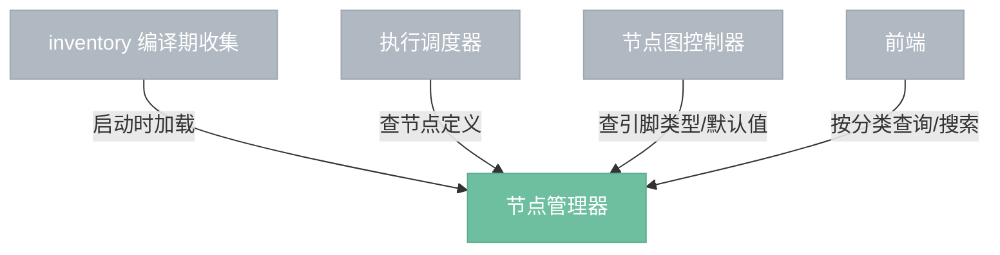

# 节点管理器

> 持有所有节点定义，为引擎内各组件提供节点信息查询服务。

## 总览

---

## 查询

| 查询 | 调用方 | 说明 |
|------|--------|------|
| 按类型查找 | 调度器 | 根据 node_type_id 返回 NodeDef，确定执行路径 |
| 查引脚类型 | 节点图控制器 | 返回指定引脚的 DataType，用于连接兼容性检查 |
| 取默认值 | 节点图控制器 | 返回参数默认值，用于创建节点和重置参数 |
| 按分类列举 | 前端 | 返回某分类下所有节点，用于菜单构建 |
| 搜索 | 前端 | 按名称/标题模糊匹配，用于节点搜索 |
| 列举分类 | 前端 | 返回所有分类列表，用于菜单结构 |

---

## 边界情况

- **节点类型不存在**：查询返回错误，节点图控制器拒绝创建该类型的节点。
- **重复注册**：同名节点在 inventory 收集阶段覆盖，启动时日志警告。
- **项目加载**：项目文件引用了当前版本不存在的节点类型时，节点标记为"未知"，保留数据但不可执行。
