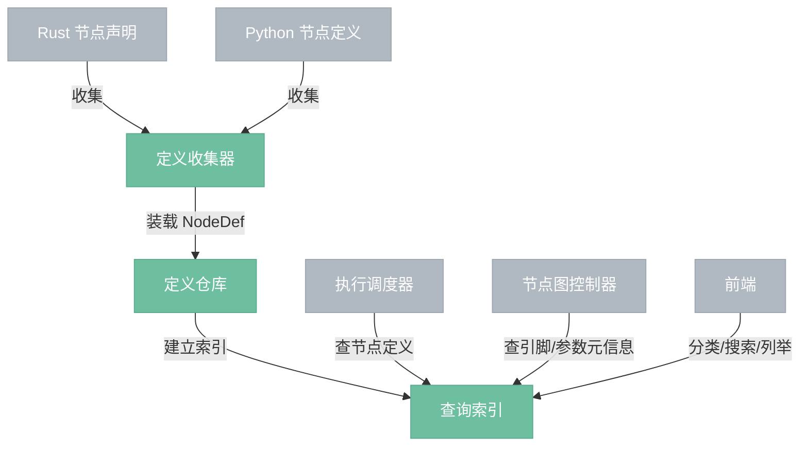

# 节点管理器

> 节点定义的收集、注册、索引与查询模块。

## 定位

节点管理器负责持有系统中的全部 `NodeDef`，并对外提供稳定的节点元信息查询能力。

它解决的问题只有一类：**节点是什么**。

它不负责节点实例的增删改，不负责节点执行，也不负责项目保存。

---

## 总览



---

## 内部组成

### 1. 定义收集器

负责把不同来源的节点定义收集为统一的 `NodeDef` 集合。

来源包括：

- Rust 侧声明式节点定义
- Python 侧扫描生成的节点定义

Python 节点收集规则：

- `engine/build.rs` 在编译期扫描 `python/nodes/*.py`
- 只接受新格式 `@node(...)`
- 扫描结果会生成：
  - Python 节点声明规格（供测试与调试读取）
  - Python 节点 `NodeDefEntry` 注册代码（进入 `inventory`）
- 节点管理器启动时不再直接解析 Python 文件，而是与 Rust 节点一样统一从 `inventory` 收集

### 2. 定义仓库

负责持有全部 `NodeDef`，并以 `type_id` 作为主键组织数据。

仓库中的数据是节点管理器的权威来源，后续所有查询都基于这里的数据返回结果。

### 3. 查询索引

负责把仓库中的节点定义组织成适合查询的视图。

建议至少包含：

- 类型索引：按 `type_id` 查询节点定义
- 分类索引：按分类列出节点
- 搜索索引：按名称 / 标题搜索节点
- 元信息索引：支持从节点定义中读取参数定义、默认值、约束等元信息

---

## 正式对外能力

| 能力 | 说明 | 典型调用方 |
|------|------|-----------|
| 列出全部节点定义 | 返回系统中全部已注册的 `NodeDef` | 前端 / CLI / AI 操作员 |
| 按类型查询节点定义 | 根据 `type_id` 返回单个节点定义 | 调度器 / 节点图控制器 |
| 按分类列举节点 | 返回某个分类下的全部节点 | 前端 |
| 搜索节点 | 按名称或标题搜索节点 | 前端 |
| 列出全部分类 | 返回当前所有节点分类 | 前端 |
| 查询参数定义 | 通过节点定义读取参数定义 | 前端 / 节点图控制器 |
| 查询默认值与约束 | 作为参数定义的一部分包含在节点定义中 | 节点图控制器 / 前端 |
| 列出展开后的正式接口 | 返回节点最终可见的输入/输出接口（含参数暴露出的接口） | 图校验 / 前端 |

---

## 对外接口（Query Interface）

节点管理器只提供只读查询接口，不提供写操作。

### 列出全部节点定义（`list_node_defs`）

- 输入：无
- 输出：`Vec<NodeDef>`
- 说明：返回全部已注册的节点定义

### 按类型查询节点定义（`get_node_def`）

- 输入：`type_id`
- 输出：`Option<NodeDef>`
- 说明：返回指定 `type_id` 对应的节点定义；不存在时返回空。引脚定义、参数定义、默认值与约束都包含在 `NodeDef` 中

### 按分类列举节点（`list_nodes_by_category`）

- 输入：`category`
- 输出：`Vec<NodeDef>`
- 说明：返回指定分类下的全部节点定义

### 搜索节点（`search_nodes`）

- 输入：`keyword`
- 输出：`Vec<NodeDef>`
- 说明：按节点名称或标题进行搜索，返回匹配结果

### 列出全部分类（`list_categories`）

- 输入：无
- 输出：`Vec<String>`
- 说明：返回当前全部节点分类

### 查询参数定义（`get_param_defs`）

- 输入：`type_id`
- 输出：参数定义集合
- 说明：通常通过 `get_node_def(type_id)` 取得完整 `NodeDef` 后读取；参数默认值、范围、枚举等约束随参数定义一起返回

### 列出展开后的正式接口（`list_exposed_pins`）

- 输入：`type_id`
- 输出：展开后的接口定义集合
- 说明：返回节点最终对外暴露的全部正式接口，包含：
  - 普通输入引脚
  - 普通输出引脚
  - 参数暴露出的输入接口
  - 参数暴露出的输出接口

补充：

- `list_exposed_input_pins` / `list_exposed_output_pins` 可作为基于 `list_exposed_pins` 的方向过滤辅助接口
- `Param.expose` 进入正式接口视图；它不再只是元数据备注

### 接口特征

- 全部为只读查询
- 不修改节点管理器内部状态
- 不触发事件

---

## 文件结构

节点管理器采用**按职责分组的子目录结构**。原因是该模块虽然整体收敛，但内部仍然天然分成“收集、存储、查询”三类职责；用子目录可以让文件树更自解释。

```text
engine/src/node_manager/
├── mod.rs                          // 仅导出
├── manager.rs                      // NodeManager 对外总入口
│
├── model/
│   ├── mod.rs                      // 仅导出
│   ├── pin_def.rs                  // PinDef
│   ├── param_def.rs                // ParamDef + ParamExpose
│   ├── exposed_pin.rs              // 展开后的正式接口视图
│   ├── node_def.rs                 // NodeDef + ExecuteFn
│   └── inventory_entry.rs          // NodeDefEntry + inventory 收集 + Python 注册包含
│
├── collect/
│   ├── mod.rs                      // 仅导出
│   ├── collect_rust_defs.rs        // 收集 Rust 节点定义
│   ├── collect_python_defs.rs      // Python 节点声明规格与 expose 解析辅助
│   └── merge_node_defs.rs          // 合并多来源 NodeDef
│
├── store/
│   ├── mod.rs                      // 仅导出
│   └── defs_by_type.rs             // 按 type_id 持有节点定义
│
├── index/
│   ├── mod.rs                      // 仅导出
│   ├── defs_by_category.rs         // 分类索引
│   └── defs_by_search.rs           // 搜索索引
│
└── query/
    ├── mod.rs                      // 仅导出
    ├── list_node_defs.rs           // 列出全部节点定义
    ├── get_node_def.rs             // 按 type_id 查询节点定义
    ├── list_nodes_by_category.rs   // 按分类列举节点
    ├── list_exposed_pins.rs        // 列出展开后的正式接口
    ├── list_exposed_input_pins.rs  // 过滤输入接口
    ├── list_exposed_output_pins.rs // 过滤输出接口
    ├── search_nodes.rs             // 搜索节点
    └── list_categories.rs          // 列出全部分类
```

分组逻辑：

- `model/`：节点类型模型与 inventory 入口
- `collect/`：节点定义从哪里来
- `store/`：节点定义以什么形式保存
- `index/`：为了查询建立哪些辅助视图
- `query/`：对外暴露哪些只读查询动作

约束：

- 文件名必须直接反映职责，不使用 `utils.rs`、`helpers.rs`、`common.rs` 这类模糊命名
- 每个文件只负责一个动作或一种稳定职责，即使文件很小也保持独立
- 各级 `mod.rs` 只负责组装与导出，不承载实际逻辑
- 引脚、参数、默认值、约束等元信息通过 `NodeDef` 返回，不为此再拆额外文件

---

## 代码目录与职责对应

| 目录 / 文件 | 责任 |
|---|---|
| `manager.rs` | 组装节点管理器，对外提供统一查询入口 |
| `model/node_def.rs` | 定义 `NodeDef` 与 `ExecuteFn` |
| `model/pin_def.rs` | 定义 `PinDef` |
| `model/param_def.rs` | 定义 `ParamDef` 与 `ParamExpose` |
| `model/exposed_pin.rs` | 定义展开后的正式接口视图 |
| `model/inventory_entry.rs` | 定义 `NodeDefEntry` 与 inventory 收集入口，并包含编译期生成的 Python 注册代码 |
| `collect/collect_rust_defs.rs` | 从 Rust inventory 收集节点定义 |
| `collect/collect_python_defs.rs` | 暴露 Python 节点声明规格与 `expose` 解析辅助 |
| `collect/merge_node_defs.rs` | 合并多来源节点定义 |
| `store/defs_by_type.rs` | 构建按 `type_id` 组织的主存储 |
| `index/defs_by_category.rs` | 分类视图与分类查询辅助 |
| `index/defs_by_search.rs` | 搜索视图与搜索查询辅助 |
| `query/list_node_defs.rs` | 实现“列出全部节点定义” |
| `query/get_node_def.rs` | 实现“按类型查询节点定义” |
| `query/list_nodes_by_category.rs` | 实现“按分类列举节点” |
| `query/list_exposed_pins.rs` | 实现“列出展开后的正式接口” |
| `query/list_exposed_input_pins.rs` | 基于正式接口过滤输入视图 |
| `query/list_exposed_output_pins.rs` | 基于正式接口过滤输出视图 |
| `query/search_nodes.rs` | 实现“搜索节点” |
| `query/list_categories.rs` | 实现“列出全部分类” |

说明：

- `model/` 负责“节点是什么”
- `collect/` 负责“节点定义从哪里来”
- `store/` 负责“节点定义存在哪里”
- `index/` 负责“如何高效查询”
- `query/` 负责“对外暴露哪些动作”

---

## 非职责

下列能力不属于节点管理器：

- 创建、删除、移动节点实例
- 创建、删除、校验连线
- 修改节点参数值
- 执行节点
- 保存或加载项目
- 广播事件

这些能力分别属于节点图控制器、执行调度器、项目管理器和事件系统。
