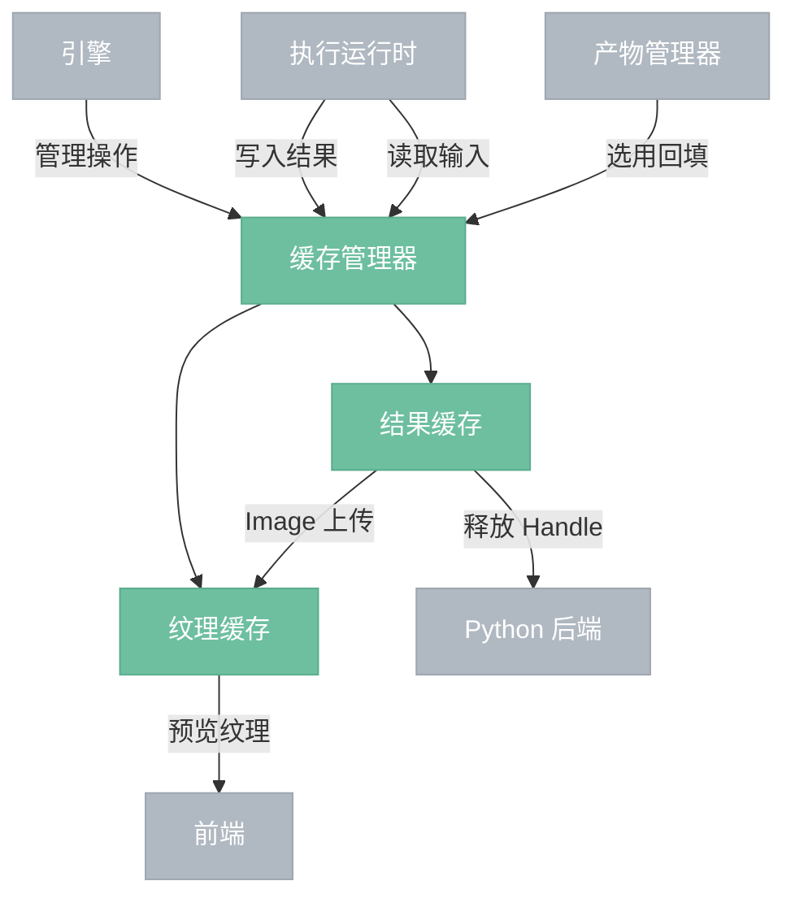
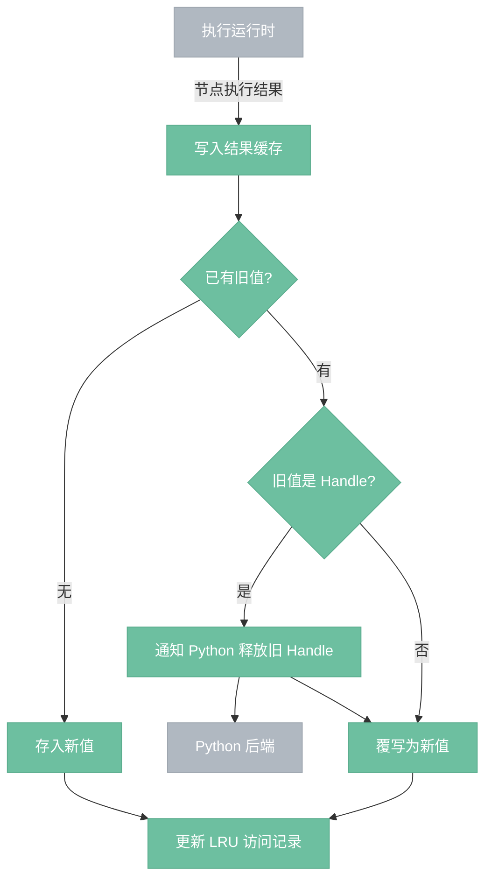
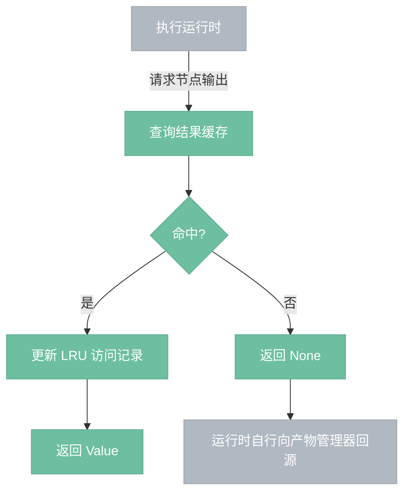
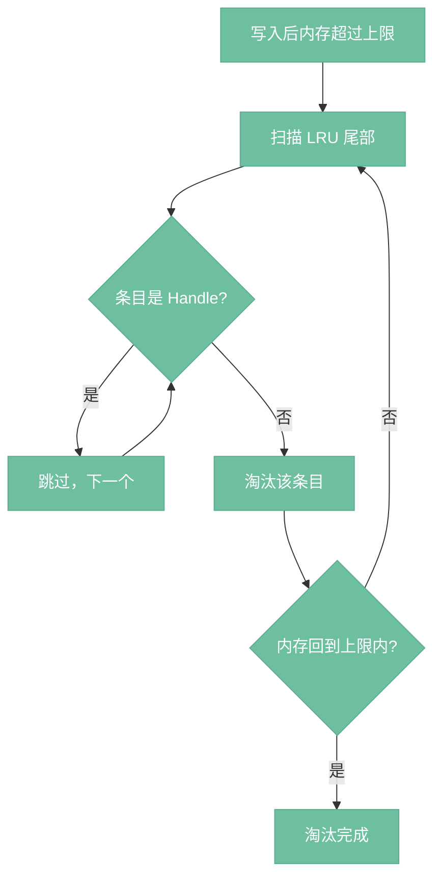
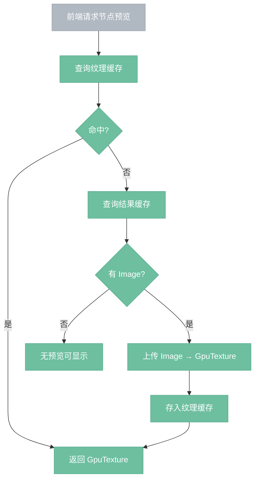

# 缓存管理器

> 所有节点执行结果的统一内存存储，节点间传递数据的通道。

## 总览

---

## 写入流程

---

## 读取流程

---

## LRU 淘汰流程

---

## 纹理请求流程

---

## 操作

| 操作 | 说明 |
|------|------|
| 写入 | 执行运行时写入节点结果，覆写时自动释放旧 Handle |
| 读取 | 执行运行时读取节点输出作为下游输入，未命中返回 None |
| 移除 | 清除指定节点的缓存条目，Handle 类型通知 Python 释放 |
| 请求预览 | 前端请求节点预览纹理，按需从结果缓存上传生成 |
| 清理 Handle | Python 崩溃时清除所有 Handle 条目，无需通知 Python |

---

## 组件

- **结果缓存**：`HashMap<(NodeId, OutputPin), Value>`，`RwLock` 保护。执行线程持写锁写入结果，UI 线程持读锁读取。LRU + 内存上限淘汰，Handle 条目豁免 LRU。覆写时检测旧值类型，Handle 自动通知 Python 释放。
- **纹理缓存**：`HashMap<NodeId, GpuTexture>`，仅 UI 主线程访问，无需同步。LRU + VRAM 上限淘汰。按需生成——前端请求预览时从结果缓存取 Image 上传为 GPU 纹理。淘汰代价低，从 Image 重新上传即可。

## 边界情况

- **Python 崩溃**：引擎调用清理接口，清除所有 Handle 条目。不通知 Python（进程已死，VRAM 随进程回收）。下次执行时自动重建。
- **LRU 全是 Handle**：极端情况下所有大条目都是 Handle，无法淘汰。不强制淘汰 Handle，仅日志警告。
- **并发访问**：结果缓存 `RwLock` 保护，执行线程写、UI 线程读互不阻塞。纹理缓存仅 UI 线程访问，无竞争。
- **项目加载**：缓存为空，所有节点需首次执行或从产物管理器回源。
- **纹理丢失**：纹理被 VRAM 淘汰后，下次请求预览时从结果缓存重新上传，用户无感知。

## 设计决策

- **D03**：结果缓存和纹理缓存分离。执行结果的失效由图变化驱动，纹理的淘汰由 VRAM 压力驱动，两者混在一起会导致淘汰逻辑互相干扰。
- **D04**：Handle 条目豁免 LRU 淘汰。重新加载模型到 VRAM 的代价（几十秒）远高于重新计算一张 Image（毫秒级），不应被内存压力驱逐。
- **D05**：纹理缓存 LRU + VRAM 上限。VRAM 有限必须主动淘汰，但纹理丢失代价低（从 Image 重新上传即可）。
