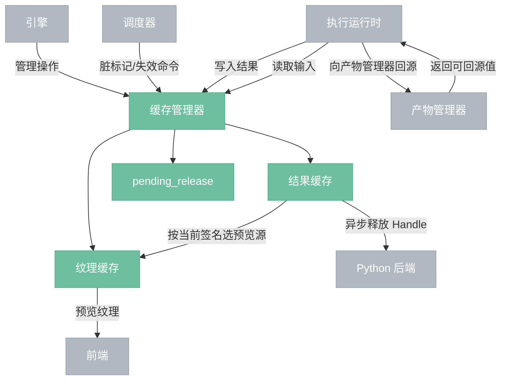
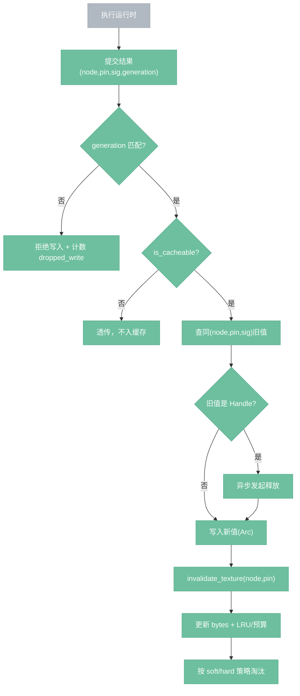
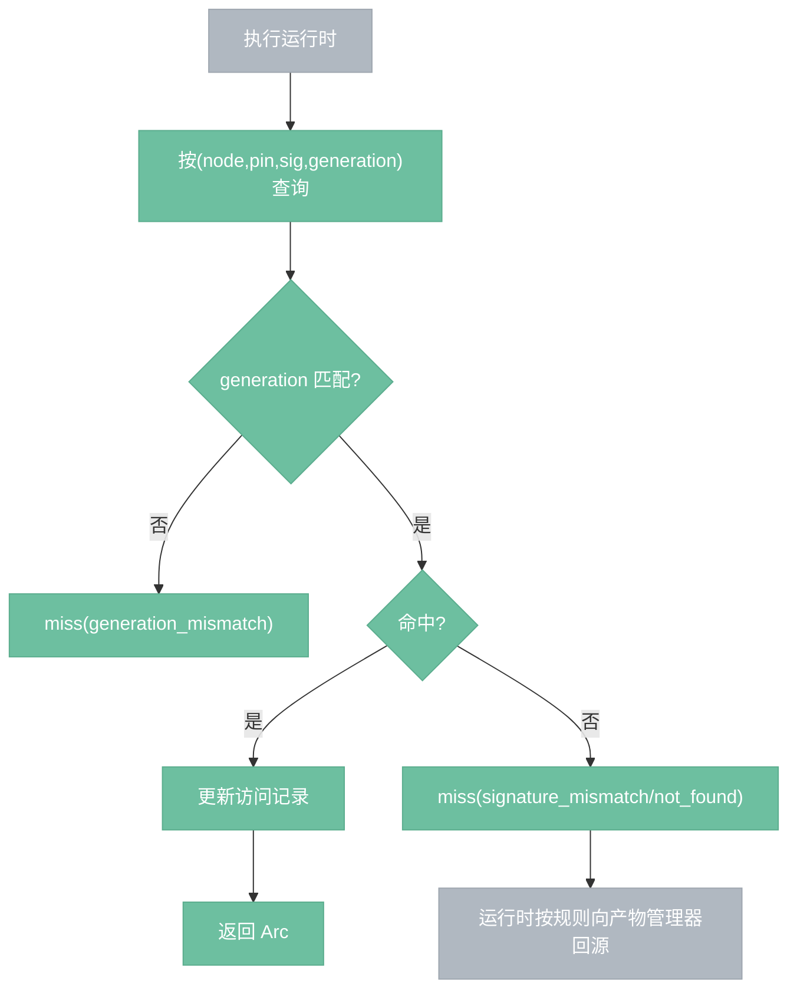
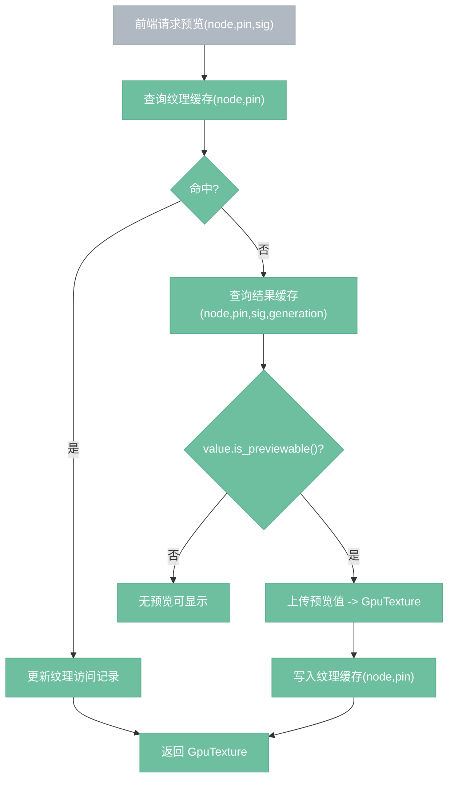
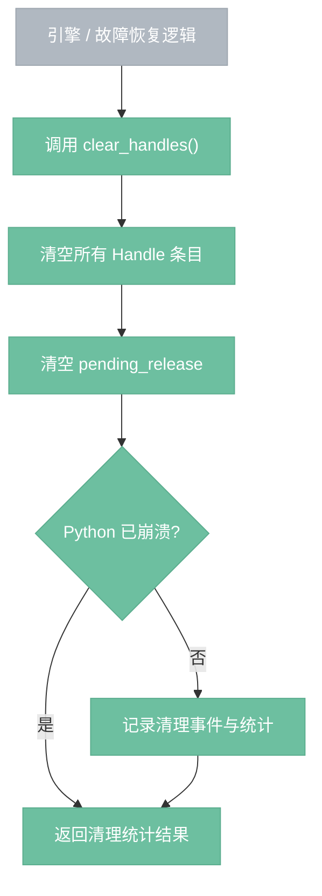

# 缓存管理器

> 所有节点执行结果的统一内存存储，节点间传递数据的通道。

## 总览



---

## 什么是缓存

在 nodeimg 中，**缓存**指引擎为避免重复计算、重复上传与重复读取而维护的、**按键可命中、按条件可失效的临时内存结果层**。

它同时满足四个条件：

1. **临时性**：生命周期属于当前引擎进程 / 当前项目会话，不属于项目文件内容。
2. **可复用性**：同一节点输出在相同执行条件下再次被请求时，可以直接命中并跳过重算。
3. **可失效性**：当参数、上游输入、图结构或 generation 变化时，旧值必须能被判定为无效。
4. **内存性**：主要驻留在 RAM / VRAM，而不是磁盘。

缓存不是“所有中间数据”的统称，而是分成两层：

- **结果缓存**：节点输出的 `Value`，服务执行流。
- **纹理缓存**：预览使用的 `GpuTexture`，服务前端显示。

二者都属于**运行时临时状态**，都不承担项目持久化语义。

### 不属于缓存的内容

以下内容不应放入缓存管理器职责内：

- **产物管理器**：负责持久化历史输出、版本选用、跨会话恢复。
- **调度器脏标记**：负责决定哪些节点需要重算，属于执行决策状态，不是缓存值。
- **项目管理器状态**：负责项目打开 / 保存 / 关闭，不负责维护运行时结果内容。

### 定义带来的设计约束

因此缓存管理器的核心职责只有三类：

- **存取**：按键保存与读取运行时结果。
- **失效**：在签名、节点、子图、generation 变化时清除旧值。
- **淘汰**：在内存预算约束下释放不再优先保留的条目。

缓存管理器**不负责**：

- 决定是否执行某个节点；
- 决定是否从 artifact 回源；
- 持久化任何缓存值到项目文件；
- 编排项目打开 / 保存生命周期。

---

## 关键契约（P0）

1. **结果缓存键**：`(NodeId, OutputPin, ExecSignature)`，不再只用 `(NodeId, OutputPin)`。
2. **精确命中**：`ExecSignature` 完全一致才命中，否则 miss。
3. **纹理缓存键**：`(NodeId, OutputPin)`，解决多输出串图。
4. **结果更新即失效纹理**：写入某个 `(node,pin)` 后立即失效对应纹理条目。
5. **generation 防回灌**：缓存读写都校验当前 `GenerationId`；旧 generation 写入直接丢弃。
6. **Handle 内存硬保护**：Handle 仍豁免 LRU，但超 `hard` 水位时拒绝新增 Handle，返回 `HandleMemoryPressure`。

---

## 文件结构

```text
engine/src/cache/
├── mod.rs
├── manager.rs
├── model/
│   ├── mod.rs
│   ├── cache_key.rs
│   ├── exec_signature.rs
│   ├── generation_id.rs
│   ├── preview_request.rs
│   ├── result_entry.rs
│   ├── texture_entry.rs
│   ├── budget.rs
│   ├── error.rs
│   └── stats.rs
├── result_store/
│   ├── mod.rs
│   ├── lookup.rs
│   ├── write.rs
│   ├── invalidate.rs
│   ├── lru.rs
│   ├── eviction.rs
│   └── bytes.rs
├── texture_store/
│   ├── mod.rs
│   ├── store.rs
│   ├── preview_source.rs
│   ├── upload.rs
│   ├── lru.rs
│   └── bytes.rs
└── release_queue/
    ├── mod.rs
    ├── queue.rs
    ├── releaser.rs
    └── retry_policy.rs
```

### 目录职责

- `manager.rs`：缓存管理器对外入口，负责跨子模块编排。
- `model/`：缓存共享数据模型，包括键、签名、预览请求、generation、结果条目、纹理条目、预算、错误与统计。
- `result_store/`：结果缓存本体，负责 `Value` 条目的查询、写入、失效、LRU、淘汰与字节计量。
- `texture_store/`：纹理缓存本体，负责预览纹理存取、预览源选择、上传、LRU 与字节计量。
- `release_queue/`：Handle 延迟释放、失败重试与重试策略队列。

### 文件设计原则

- 文件结构 = 软件结构。
- 文件名忠实反映用途，不使用 `utils.rs` / `helpers.rs`。
- 一个文件一个职责。
- `mod.rs` 只做导出与模块组织，不承载核心业务逻辑。

---

## 数据模型

```rust
type CacheKey = (NodeId, OutputPin, ExecSignature);
type TextureKey = (NodeId, OutputPin);

struct ExecSignature {
    sig_schema_version: u16,
    node_version: u16,
    params_hash: u64,
    upstream_hash: u64,
}

struct ResultEntry {
    generation: GenerationId,
    value: Arc<Value>,
    bytes: usize,
    updated_at: Instant,
}

struct TextureEntry {
    generation: GenerationId,
    texture: Arc<GpuTexture>,
    bytes: usize,
    updated_at: Instant,
}
```

`ResultEntry.generation` 的作用有三点：

1. 为读取路径提供条目级 generation 校验；
2. 为诊断与统计提供写入时上下文；
3. 为并发场景下的重入保护保留条目级证据，即使未来不再采用全量清空策略也可复用。

参数哈希必须先做规范化（字段排序、浮点量化），保证同语义输入得到同签名。

### 参数规范化规则

`params_hash` 基于**节点最终有效参数集**计算，规则如下：

1. 先补全默认参数，使“未显式填写默认值”和“显式填写默认值”得到相同签名。
2. 参数按 key 字典序稳定排序后再序列化。
3. 标量类型（`bool` / `int` / `string`）按标准稳定表示参与序列化。
4. 浮点类型统一做量化后再序列化，首版精度固定为 **1e-6**。
5. `color` 等复合浮点结构按成员逐项量化。
6. 空字符串、空数组、`false` 等真实值不跳过，按实际值参与签名。

目标：同语义参数必须得到同一个 `params_hash`，避免因字段顺序、默认值补全差异或浮点噪声导致假 miss。

### Handle 模型与释放协议

`Handle` 是 `Value` 的一种特殊变体，表示**外部资源引用**，而不是资源本体。典型场景是 Python 后端或外部运行时持有的大对象，Rust 缓存只保存其引用牌据。

最小语义要求：

- `handle_id`：唯一标识外部资源
- `data_type`：句柄对应的数据类型
- `backend`：句柄来源后端 / 运行时
- `bytes`：近似资源占用，用于预算控制

释放协议：

1. 覆盖或淘汰旧 `Handle` 时，不在主写入路径同步等待释放完成，而是发起**异步释放**。
2. 若异步释放失败，不阻塞主执行流程，而是写入 `pending_release`。
3. 后续由释放队列后台重试释放。
4. 后端 `free(handle_id)` 必须满足**幂等**语义：重复释放同一个 `handle_id` 不应报致命错误。
5. Python 后端崩溃时，本地直接清空全部 `Handle` 与 `pending_release`，不再尝试通知远端。

淘汰约束：

- `Handle` 默认豁免普通 LRU。
- 但 `Handle` 不得突破 `hard` 水位保护。
- 当超过 `hard` 且可淘汰项只剩 `Handle` 时，拒绝新增 `Handle`。

---

## 写入流程



`is_cacheable?` 的判定来源固定为：

1. 上层写入策略（如节点定义或执行策略显式声明不缓存）；
2. 值类型规则（如错误值默认不缓存）；
3. 运行时特殊策略（如 AI / API 错误短 TTL 防抖）。

缓存管理器执行判定结果，但不负责推导节点级缓存策略来源。

---

## 读取流程



---

## LRU 与内存水位

1. 结果缓存、纹理缓存、Handle 代理资源分别维护预算：`result_budget_bytes` / `texture_budget_bytes` / `handle_budget_bytes`。
2. 每次写入前后调用 `estimate_bytes(Value)` 计量并校正。
3. **Handle 不进入主 LRU**：主 LRU 只记录普通 `Value` 条目；Handle 仅参与独立记账与释放协议，不参与普通淘汰扫描。
4. 超 `soft`：记录告警与指标；超 `hard`：强制淘汰非 Handle。
5. 当新增 `Handle` 后预测会超过 `handle_budget_bytes.hard`，且当前不存在可立即释放的过期 `Handle` 时：拒绝新增 `Handle`（`HandleMemoryPressure`）。
6. `clear_handles()` 为人工兜底操作。

### `estimate_bytes(Value)` 规则

`estimate_bytes(Value)` 的目标不是精确复刻真实分配器占用，而是为缓存淘汰提供**稳定、单调、不过度低估**的预算依据。

规则如下：

1. `Float` / `Int` / `Bool` / `Color` 记为 `0`，不参与细粒度预算竞争。
2. `String` 按 UTF-8 字节长度计量。
3. `Image` 在**结果缓存预算**中只按 CPU 驻留部分计量：
   - 存在 CPU 图像时，按像素近似字节数计量；
   - GPU 纹理占用不计入 `result_budget_bytes`，统一由 `texture_budget_bytes` 管理。
4. `Handle` 不计入 `result_budget_bytes`，而是优先使用后端 / 运行时显式上报的 `bytes` 计入 `handle_budget_bytes`；若上报缺失，则使用保守代理值，禁止记为 `0`。

约束：

- 预算计量按资源类型分桶：本地结果进 `result_budget_bytes`，本地纹理进 `texture_budget_bytes`，远端代理资源进 `handle_budget_bytes`。
- 允许近似估算，但不允许系统性低估重对象，尤其是 `Image` 与 `Handle`。

---

## 纹理请求流程



上传阶段不得持有结果缓存读锁。

### 预览源选择规则

结果缓存允许同一 `(node,pin)` 下多签名并存，因此预览请求必须由上层显式提供**当前活动签名**。

规则固定如下：

1. `get_preview_texture` 必须接收当前 `ExecSignature`。
2. 纹理未命中时，只查询 `(node,pin,sig,generation)` 对应的结果条目，不做“最新条目”猜测。
3. 若该签名对应结果不存在，则视为无预览源，不上传纹理。
4. 同一 `(node,pin)` 下写入不同签名结果时，纹理缓存仍按 `(node,pin)` 失效；重新请求预览时必须由上层携带当前签名重建纹理。

上层（引擎预览查询接口或调度器）负责将节点当前已应用的参数集翻译为 `ExecSignature`；该转换由统一签名生成器提供，不属于缓存管理器职责。

该规则的目的，是保留多签名并存能力，同时避免仅按 `updated_at` 选择预览源带来的签名竞争与显示错乱。

---

## 并发与职责边界

- **并发语义**：结果缓存用 `RwLock` 保护；读-读可并发，写会阻塞读。
- **读写解耦**：对外返回 `Arc<Value>`，拿到后立即释放锁，慢操作（解码、GPU 上传、Python RPC）在锁外执行。
- **职责边界**：
  - 调度器只决定脏标记与失效范围；
  - 缓存管理器只负责存取、淘汰、删除；
  - 执行器只写不删。

---

## 操作

| 操作 | 说明 |
|------|------|
| 写入 | 按 `(node,pin,sig,generation)` 写入；校验代际；失效同 `(node,pin)` 纹理 |
| 读取 | 按精确签名读取；未命中返回 `None`，由运行时决定回源/重算 |
| 失效节点 | `invalidate_node(node_id)`，清除该节点所有结果/纹理条目 |
| 失效子图 | `invalidate_subgraph(node_ids)`，批量失效 |
| 清缓存 | 全量清空并递增 `generation`，防止旧任务回灌 |
| 清理 Handle | 清空 Handle 条目；Python 崩溃场景无需通知 Python |
| 请求预览 | 以 `(node,pin,sig,generation)` 请求当前签名对应预览；纹理未命中时按需上传 |

---

## 对外 API

缓存管理器对外只暴露**缓存语义**，不暴露内部 `RwLock`、LRU、索引结构与释放队列细节。

本节定义的是**正式接口语义**。后续实现中，具体函数签名、返回结构或错误枚举可以细化，但以下职责边界、输入输出语义与副作用约束不应改变。

约束：**命中 / 未命中 / generation 不匹配**属于缓存查询结果语义，不属于错误语义；只有违反资源约束或写入约束时才返回错误。

### 1. `get_result(node_id, output_pin, exec_signature, generation)`

- **调用方**：调度器 / 执行运行时
- **输入**：`NodeId`、`OutputPin`、`ExecSignature`、`GenerationId`
- **返回**：命中返回 `Arc<Value>`；未命中返回 `None`
- **副作用**：命中时更新结果缓存访问记录
- **失败条件**：无；generation 不匹配视为 miss，不抛错

### 2. `put_result(node_id, output_pin, exec_signature, generation, value)`

- **调用方**：执行运行时
- **输入**：`NodeId`、`OutputPin`、`ExecSignature`、`GenerationId`、`Value`
- **返回**：
  - 写入成功；或
  - 因 generation 过期被丢弃；或
  - 因内存硬保护被拒绝并返回错误
- **副作用**：
  - 校验 generation
  - 覆盖同 `(node,pin,sig)` 旧值
  - 写入后立即失效同 `(node,pin)` 的纹理缓存
  - 更新字节统计与 LRU
  - 必要时触发淘汰
- **失败条件**：
  - 新增 Handle 时超 `hard` 水位，返回 `HandleMemoryPressure`

### 3. `get_preview_texture(node_id, output_pin, exec_signature, generation, device, queue)`

- **调用方**：前端预览层 / 引擎预览查询接口
- **输入**：`NodeId`、`OutputPin`、`ExecSignature`、`GenerationId`、GPU `device/queue`
- **返回**：命中纹理时返回 `Arc<GpuTexture>`；结果可上传时返回新建纹理；否则返回 `None`
- **副作用**：
  - 纹理命中时更新纹理访问记录
  - 纹理未命中但当前签名对应结果可上传时，执行一次上传并写入纹理缓存
- **失败条件**：
  - generation 不匹配视为无预览
  - 上传失败按无预览处理，由上层决定是否报错

### 4. `invalidate_output(node_id, output_pin)`

- **调用方**：调度器 / 上层编排器
- **输入**：`NodeId`、`OutputPin`
- **返回**：无
- **副作用**：清除该输出对应的所有结果签名条目与对应纹理条目
- **失败条件**：无；目标不存在时静默返回

### 5. `invalidate_node(node_id)`

- **调用方**：调度器 / 图编辑相关上层模块
- **输入**：`NodeId`
- **返回**：无
- **副作用**：清除该节点下全部结果条目与纹理条目
- **失败条件**：无

### 6. `invalidate_subgraph(node_ids)`

- **调用方**：调度器
- **输入**：一组 `NodeId`
- **返回**：无
- **副作用**：批量清除指定子图内节点的结果与纹理缓存
- **失败条件**：无

### 7. `clear_all()`

- **调用方**：引擎 / 项目管理器 / 调试命令
- **输入**：无
- **返回**：新的 `GenerationId`
- **副作用**：
  - 清空结果缓存
  - 清空纹理缓存
  - 递增 generation，防止旧执行任务回灌
- **失败条件**：无

### 8. `current_generation()`

- **调用方**：调度器 / 执行运行时
- **输入**：无
- **返回**：当前 `GenerationId`
- **副作用**：无
- **失败条件**：无

### 9. `clear_handles()`

- **调用方**：引擎 / 后端健康检查 / 故障恢复逻辑
- **输入**：无
- **返回**：清理统计结果
- **副作用**：
  - 清空所有 Handle 条目
  - 清空 `pending_release`
  - Python 崩溃场景下不要求通知 Python
- **失败条件**：无；释放失败应转为统计与事件，不阻塞清理流程

### 10. `stats_snapshot()`

- **调用方**：状态栏 / 调试面板 / 指标导出
- **输入**：无
- **返回**：当前缓存统计快照
- **副作用**：无
- **失败条件**：无

### 不对外暴露的能力

以下能力属于内部实现细节，不应作为缓存管理器公开接口：

- 直接访问结果缓存内部 map
- 直接访问纹理缓存内部 map
- 手工操作 LRU 顺序
- 直接操作 `pending_release` 队列内部结构
- 由缓存管理器直接调用产物管理器完成回源

缓存 miss 后是否向 artifact 回源，属于调度器 / 运行时编排责任，不属于缓存管理器。

---

## 边界情况

- **Python 崩溃**：清空 Handle 条目与 `pending_release`，不通知 Python。
- **执行中清缓存**：旧任务提交被 generation 校验拒绝，计入 `dropped_write_count`。
- **多输出节点**：`(node,pin)` 级纹理缓存，避免串图。
- **项目加载**：缓存可为空；是否预热由调度器策略决定。
- **错误值**：默认不缓存；AI/API 可配置短 TTL 失败防抖。

---

## 图变更与缓存失效责任链

图变更不由缓存管理器自行感知，而由上层模块显式驱动失效。

责任链固定如下：

1. **节点删除**：由节点图控制器或其上层编排器调用 `invalidate_node(node_id)`。
2. **节点参数变化**：由调度器根据脏传播结果调用 `invalidate_subgraph(node_ids)`。
3. **连线变化**：由调度器根据受影响下游范围调用 `invalidate_subgraph(node_ids)`。
4. **节点替换**（同位置替换为不同定义）：先对旧节点调用 `invalidate_node(node_id)`，再由新节点参与后续执行。

约束：

- 图控制器负责感知“图发生了什么变化”。
- 调度器负责计算“哪些节点结果已失效”。
- 调度器在调用 `invalidate_*` 之前，必须先取消相关在飞任务，避免旧任务用相同 `GenerationId` 回灌已失效条目。
- 缓存管理器只负责执行失效命令，不自行推导脏范围。

该规则的目标，是避免已删除节点、已断开连线节点或旧节点定义对应的缓存条目长期滞留在内存中。

---

## `clear_handles()` 流程



`clear_handles()` 是**本地强制兜底清理**操作，不以远端释放成功为前置条件。其目标是尽快让本地缓存状态回到一致、可继续运行的状态。

---

## 可观测性

最小指标：

- `cache_hit_total` / `cache_miss_total`（按原因分桶）
- `cache_bytes` / `texture_bytes` / `handle_bytes`
- `eviction_count` / `dropped_write_count`
- `pending_release_count`
- `preview_upload_latency_ms`

最小事件：

- `CachePressure(level, bytes)`
- `HandleReleaseFailed(handle_id, retry_count)`
- `WriteDroppedByGeneration(node_id, generation)`

---

## 决策汇总

### D06：缓存命中基于 `ExecSignature`

缓存命中判定采用精确签名匹配，`ExecSignature` 固定包含：

- `sig_schema_version`
- `node_version`
- `params_hash`
- `upstream_hash`

约束：

- `ExecSignature` 由调度器生成，不由缓存管理器生成。
- `params_hash` 基于节点最终有效参数集计算，包含默认值补全后的参数。
- `upstream_hash` 基于上游输入签名按稳定顺序组合，不直接对上游值本体做缓存键拼接。

### D07：结果键与纹理键分离

- `CacheKey = (NodeId, OutputPin, ExecSignature)`
- `TextureKey = (NodeId, OutputPin)`

结果缓存负责精确复用执行结果；纹理缓存负责当前输出口的预览显示，不保留多签名并存的纹理副本。预览请求必须由上层显式提供当前活动签名。

### D08：条目模型分离

缓存条目分为两类：

- `ResultEntry { generation, value, bytes, updated_at }`
- `TextureEntry { generation, texture, bytes, updated_at }`

二者共享 generation、字节计量和更新时间语义，但分别承载执行结果与预览纹理。

### D09：缓存与 artifact 解耦

缓存管理器不直接依赖产物管理器。

cache miss 后，由调度器 / 运行时串联：

1. `resolve_for_restore`
2. `read_artifact`
3. `put_result`

缓存管理器只负责回填后的内存存取，不负责回源决策。

### D10：并发模型采用“锁内快、锁外慢”

- 结果缓存与纹理缓存分开加锁。
- 首版使用 `RwLock`。
- 锁内只执行：查表、写表、LRU 更新、字节记账、状态变更。
- 锁外执行慢操作：GPU 上传、Python RPC、图像解码与格式转换。

### D11：参数规范化采用“默认值补全 + 稳定排序 + 浮点量化”

`params_hash` 必须基于节点最终有效参数集计算，并固定采用字段稳定排序与 1e-6 浮点量化规则。

### D12：`Handle` 作为 `Value` 变体管理，并遵循释放队列协议

`Handle` 不单独建立平行值体系，而作为 `Value` 的特殊变体进入缓存主链路；覆盖、淘汰或清理时按**异步释放 + `pending_release` 重试**协议处理，后端 `free` 必须满足幂等语义。同时，`Handle` 不进入主 LRU，只参与独立内存记账与硬水位保护。

### D13：预算按结果 / 纹理 / Handle 三类资源分桶

`result_budget_bytes` 只管理结果缓存中的本地结果占用，`texture_budget_bytes` 只管理本地纹理占用，`handle_budget_bytes` 只管理远端代理资源占用；三者不混算。

### D14：图变更通过上层责任链显式驱动缓存失效

图控制器负责发现结构变化，调度器负责计算受影响范围，缓存管理器只执行 `invalidate_*` 命令，不自行推导失效子图。

## 测试分层

### 1. 模型层测试

- `ExecSignature` 相等 / 不等判定
- `CacheKey` 与 `TextureKey` 键语义
- `GenerationId` 推进与比较
- `ResultEntry` / `TextureEntry` 基本字段语义

### 2. 结果缓存层测试

- 相同签名命中，不同签名 miss
- `invalidate_output` / `invalidate_node` / `invalidate_subgraph`
- LRU 淘汰

### 3. 纹理缓存层测试

- 同 `(node,pin)` 预览命中
- 指定 `exec_signature` 的预览请求只能读取对应签名结果
- 纹理命中后更新纹理 LRU
- 结果更新后纹理立即失效
- 多输出节点不串图
- 非可预览值（`is_previewable() == false`）不生成预览

### 4. 释放队列测试

- Handle 释放失败入队
- 重试成功出队
- Python 崩溃后直接清空 `pending_release`
- `clear_handles()` 清空本地 Handle 与 `pending_release`

### 5. Handle 预算与硬保护测试

- `handle_budget_bytes.hard` 下拒绝新增 `Handle`
- 存在可立即释放的过期 `Handle` 时优先释放，不直接报 `HandleMemoryPressure`

### 6. 管理器编排测试

- `put_result` 后可 `get_result`
- `clear_all()` 后旧 generation 写入被丢弃
- `get_preview_texture()` 可从当前签名结果回填纹理缓存

### 7. 后续集成测试

- cache miss → artifact 回源 → cache 回填
- artifact 选用切换后的缓存与下游失效链路

首版最小验收应至少覆盖：精确命中、generation 防回灌、结果更新失效纹理、多输出不串图、hard 水位保护。

---

## 推荐实现顺序

1. `model/`
2. `result_store/`
3. `texture_store/`
4. `release_queue/`
5. `manager.rs`
6. 与 `scheduler` / `artifact` / `engine facade` 的集成接线

顺序原则：先完成纯类型，再完成结果缓存主链路，再补预览与释放补偿，最后统一编排并接入外部模块。

---

## 风险与未决问题

### 已知风险

1. 当前代码中 `Handle` 类型尚未正式落地，`release_queue/` 的细节实现需要等待该前置类型与释放协议稳定。
2. `RwLock` 粗粒度写入在同层并行执行下可能形成瓶颈，后续实现需评估是否保持该方案或引入更细粒度结构。
3. `get_preview_texture()` 依赖 GPU 设备句柄，接口放置位置与上层调用方式需要在引擎 API 设计中保持一致。

### 未决问题

1. `node_version` 的正式来源：建议来自 `NodeDef` 版本，而不是图节点实例版本。
2. `ExecSignature` 的参数规范化规则已在本文定义，但仍建议后续下沉为独立实现细则，统一序列化格式、量化实现与跨模块复用方式。
3. 错误值是否缓存：当前默认为不缓存，AI / API 场景下的失败防抖 TTL 仍待后续专题决策。
4. `Handle` 最终字段集合需要与后端协议保持一致，当前只固化最小语义，不固化最终传输结构。
5. `Handle.bytes` 的最终来源需要与后端协议统一；当前规则只固化“协议优先，缺失时使用保守代理值”。
6. 后端 `free(handle_id)` 的幂等保证需要在 Python 后端协议文档中同步固化。
7. `pending_release` 的重试上限、退避策略与死信处理仍待独立细化。

---

## 设计决策

- **D03**：结果缓存与纹理缓存分离；失效与淘汰策略解耦。
- **D04**：Handle 默认豁免 LRU，但增加 hard 水位硬保护，防止内存失控。
- **D05**：纹理按 `(node,pin)` 管理，结果更新即失效，保证预览一致性。
- **D06**：缓存命中基于 `ExecSignature` 精确匹配，且由调度器生成。
- **D07**：结果键与纹理键分离，分别服务执行复用与预览显示。
- **D08**：结果条目与纹理条目分离建模。
- **D09**：缓存与 artifact 解耦，由调度器 / 运行时串联回源。
- **D10**：并发模型采用“锁内快、锁外慢”。
- **D11**：参数规范化采用“默认值补全 + 稳定排序 + 浮点量化”。
- **D12**：`Handle` 作为 `Value` 变体管理，并遵循释放队列协议。
- **D13**：预算按结果 / 纹理 / Handle 三类资源分桶。
- **D14**：图变更通过上层责任链显式驱动缓存失效。
