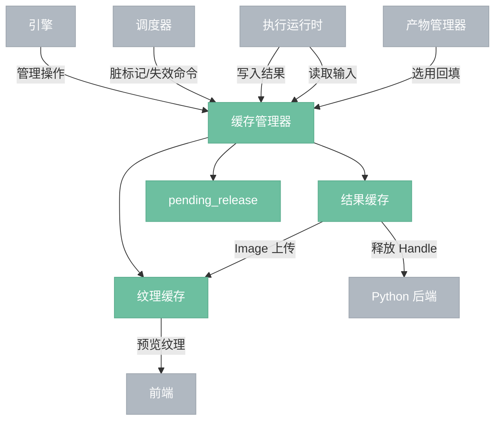
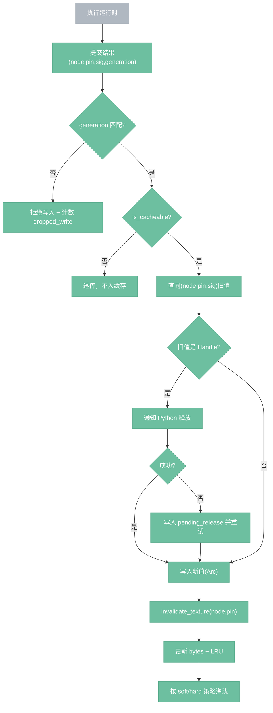
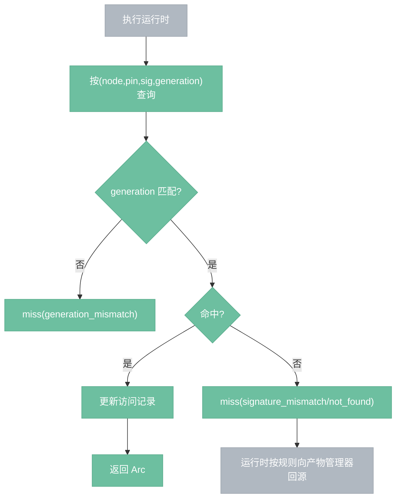
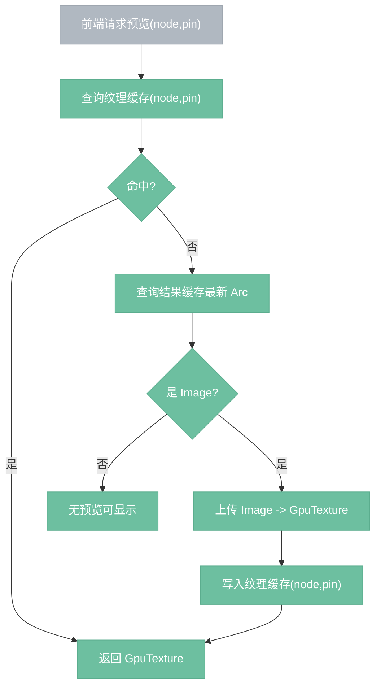

# 缓存管理器

> 所有节点执行结果的统一内存存储，节点间传递数据的通道。

## 总览



---

## 关键契约（P0）

1. **结果缓存键**：`(NodeId, OutputPin, ExecSignature)`，不再只用 `(NodeId, OutputPin)`。
2. **精确命中**：`ExecSignature` 完全一致才命中，否则 miss。
3. **纹理缓存键**：`(NodeId, OutputPin)`，解决多输出串图。
4. **结果更新即失效纹理**：写入某个 `(node,pin)` 后立即失效对应纹理条目。
5. **generation 防回灌**：缓存读写都校验当前 `GenerationId`；旧 generation 写入直接丢弃。
6. **Handle 内存硬保护**：Handle 仍豁免 LRU，但超 `hard` 水位时拒绝新增 Handle，返回 `HandleMemoryPressure`。

---

## 数据模型

```rust
type CacheKey = (NodeId, OutputPin, ExecSignature);
type TextureKey = (NodeId, OutputPin);

struct ExecSignature {
    sig_schema_version: u16,
    node_version: u16,
    params_hash: u64,
    upstream_hash: u64,
}

struct CacheEnvelope {
    generation: GenerationId,
    value: Arc<Value>,
    bytes: usize,
    updated_at: Instant,
}
```

参数哈希必须先做规范化（字段排序、浮点量化），保证同语义输入得到同签名。

---

## 写入流程



---

## 读取流程



---

## LRU 与内存水位

1. 结果缓存、纹理缓存分别维护预算：`result_budget_bytes` / `texture_budget_bytes`。
2. 每次写入前后调用 `estimate_bytes(Value)` 计量并校正。
3. 超 `soft`：记录告警与指标；超 `hard`：强制淘汰非 Handle。
4. 若超 `hard` 且可淘汰项全是 Handle：拒绝新增 Handle（`HandleMemoryPressure`）。
5. `clear_handles()` 为人工兜底操作。

---

## 纹理请求流程



上传阶段不得持有结果缓存读锁。

---

## 并发与职责边界

- **并发语义**：结果缓存用 `RwLock` 保护；读-读可并发，写会阻塞读。
- **读写解耦**：对外返回 `Arc<Value>`，拿到后立即释放锁，慢操作（解码、GPU 上传、Python RPC）在锁外执行。
- **职责边界**：
  - 调度器只决定脏标记与失效范围；
  - 缓存管理器只负责存取、淘汰、删除；
  - 执行器只写不删。

---

## 操作

| 操作 | 说明 |
|------|------|
| 写入 | 按 `(node,pin,sig,generation)` 写入；校验代际；失效同 `(node,pin)` 纹理 |
| 读取 | 按精确签名读取；未命中返回 `None`，由运行时决定回源/重算 |
| 失效节点 | `invalidate_node(node_id)`，清除该节点所有结果/纹理条目 |
| 失效子图 | `invalidate_subgraph(node_ids)`，批量失效 |
| 清缓存 | 全量清空并递增 `generation`，防止旧任务回灌 |
| 清理 Handle | 清空 Handle 条目；Python 崩溃场景无需通知 Python |
| 请求预览 | 以 `(node,pin)` 查询纹理，未命中按需上传 |

---

## 边界情况

- **Python 崩溃**：清空 Handle 条目与 `pending_release`，不通知 Python。
- **执行中清缓存**：旧任务提交被 generation 校验拒绝，计入 `dropped_write_count`。
- **多输出节点**：`(node,pin)` 级纹理缓存，避免串图。
- **项目加载**：缓存可为空；是否预热由调度器策略决定。
- **错误值**：默认不缓存；AI/API 可配置短 TTL 失败防抖。

---

## 可观测性

最小指标：

- `cache_hit_total` / `cache_miss_total`（按原因分桶）
- `cache_bytes` / `texture_bytes`
- `eviction_count` / `dropped_write_count`
- `pending_release_count`
- `preview_upload_latency_ms`

最小事件：

- `CachePressure(level, bytes)`
- `HandleReleaseFailed(handle_id, retry_count)`
- `WriteDroppedByGeneration(node_id, generation)`

---

## 设计决策

- **D03**：结果缓存与纹理缓存分离；失效与淘汰策略解耦。
- **D04**：Handle 默认豁免 LRU，但增加 hard 水位硬保护，防止内存失控。
- **D05**：纹理按 `(node,pin)` 管理，结果更新即失效，保证预览一致性。
