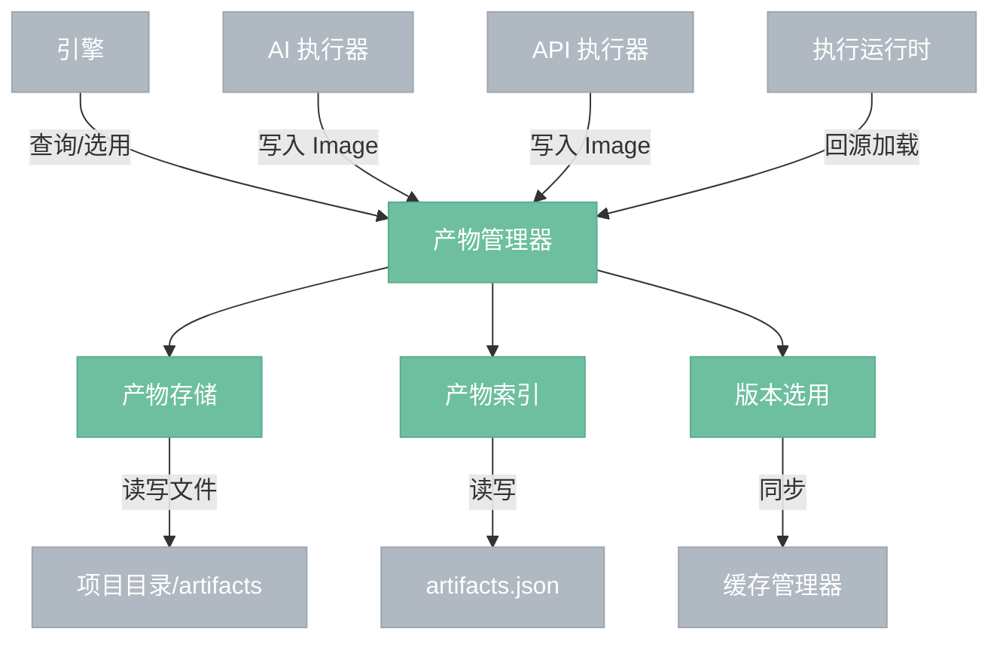
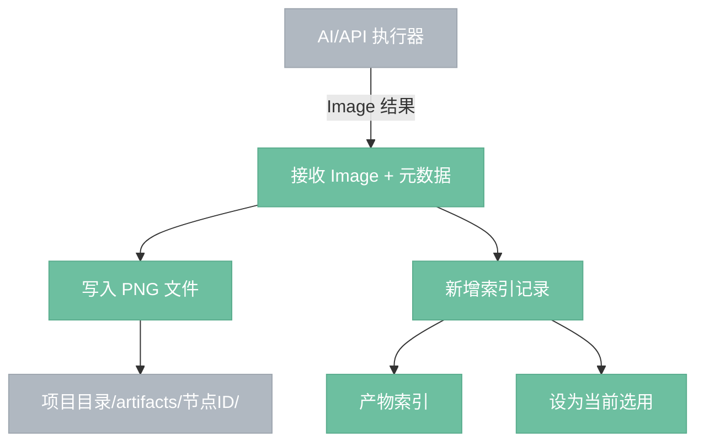
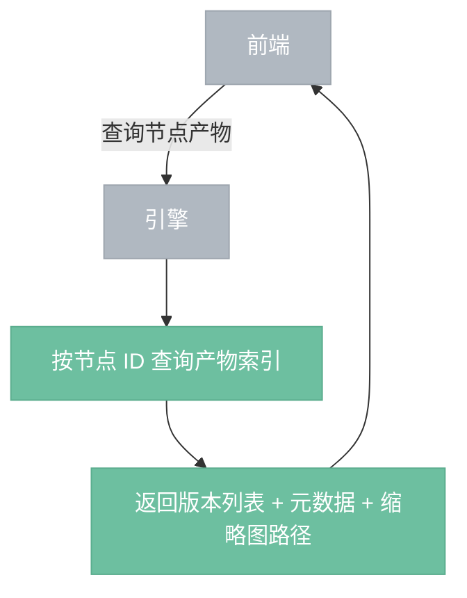
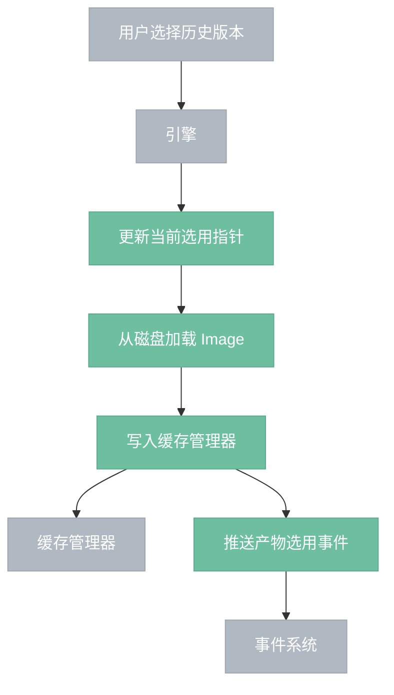
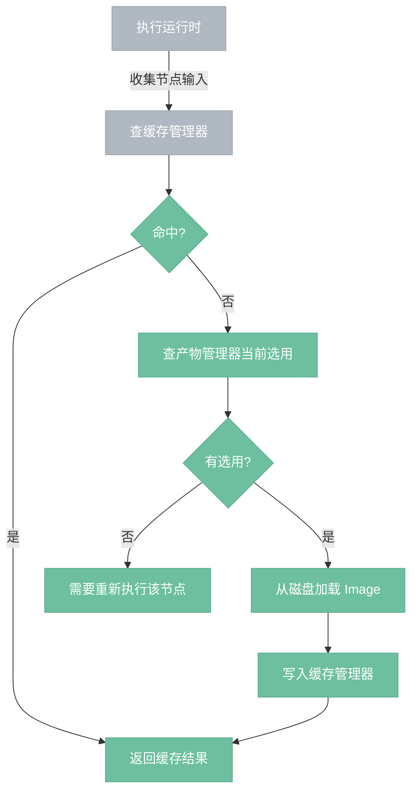
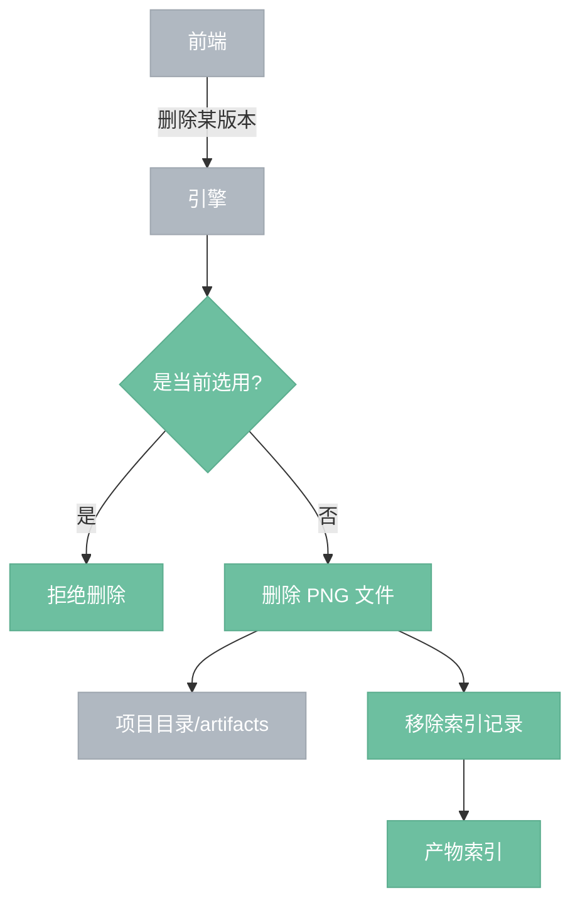

# 产物管理器

> 管理节点执行后形成的持久化输出快照，支持索引、查询、版本选用与按规则回源。

## 产物定义

**产物（Artifact）**是：某次节点执行产出的、被系统**正式持久化并登记**的**输出快照**。它不是普通执行结果，也不是任意落盘文件，而是具备稳定标识、最小可追溯元数据，并可被后续再次引用的正式版本。

换句话说：

- **执行结果**是广义概念，可能只存在于内存中；
- **产物**是执行结果中被系统承认为正式快照的那一部分。

一个输出要被视为产物，必须同时满足：

1. **来源于一次节点执行输出**，而不是人工塞入目录的任意文件；
2. **是正式输出快照**，而不是执行中间态、预览图或临时副本；
3. **已持久化**，有稳定路径、URI 或对象 ID，重启后仍可访问；
4. **具备最小元数据**，至少包含来源节点、创建时间、数据类型/格式，以及参数或输入签名；
5. **可被再次引用**，用于项目内选用、回源、审计，或外部导出复用。

### 最小元数据

为保证产物可识别、可追溯、可校验、可加载，一个产物记录至少包含以下字段：

| 字段 | 说明 |
|------|------|
| `artifact_id` | 产物记录唯一 ID，用于稳定引用 |
| `node_id` | 来源节点 ID |
| `output_key` | 来源输出口标识；单输出节点可固定为 `output` |
| `version` | 该节点该输出口下的递增版本号 |
| `created_at` | 创建时间 |
| `data_type` | 数据类型，如 `Image`、`Text` |
| `format` | 持久化格式，如 `png`、`json` |
| `path` | 实际存储路径、URI 或对象 ID |
| `param_signature` | 节点参数签名，用于判断参数上下文是否一致 |
| `input_signature` | 输入签名，用于判断上游输入上下文是否一致 |

其中：

- `artifact_id`、`node_id`、`output_key` 用于**识别与定位**；
- `version`、`created_at` 用于**排序与版本管理**；
- `data_type`、`format`、`path` 用于**加载与反序列化**；
- `param_signature`、`input_signature` 用于**回源校验**。

示例：

```json
{
  "artifact_id": "art_01JXYZ...",
  "node_id": "node_ai_generate",
  "output_key": "image",
  "version": 3,
  "created_at": "2026-04-11T14:23:00Z",
  "data_type": "Image",
  "format": "png",
  "path": "artifacts/node_ai_generate/image/v3.png",
  "param_signature": "sha256:aaa...",
  "input_signature": "sha256:bbb..."
}
```

以下字段不属于最小元数据，但可作为扩展字段按需补充：`thumbnail_path`、`is_selected`、`is_orphaned`、`seed`、`width`、`height`、`executor_kind`。

### 产物分类

- **可回源产物**：项目内版本化产物，可进入项目索引，并在缓存未命中时按规则回填缓存。当前典型例子是 **AI 生成节点** 输出的 Image。
- **不可回源产物**：导出型产物，已持久化、可追溯，但不进入项目版本选用与回源链路。当前典型例子是 **保存图片节点** 输出的文件。

这里要强调：

- “**是否可回源**”是产物的**子类能力**，不是产物定义本身；
- 也就是说，**先是产物，再区分是否参与项目内版本选用与回源**。

### 非产物

下列对象不属于产物：

- 纯内存缓存值；
- Python Handle；
- 预览纹理；
- 未成功持久化的临时结果；
- 仅用于执行期传递、无稳定标识的中间态数据；
- 调试 dump、日志截图等未被系统登记为正式输出快照的副本。

### 当前范围

当前版本的产物管理器主要负责**项目内可回源产物**的管理；导出型产物在概念上属于产物，但不纳入版本索引与回源流程。

## 总览



---

## 对外能力

产物管理器对外提供的能力分为**核心能力**和**扩展能力**两层。

### 核心能力

| 能力 | 说明 |
|------|------|
| 创建 / 登记 | 接收节点输出快照与元数据，完成持久化、写入索引，并返回 `artifact_id` |
| 查询 | 按 `node_id + output_key` 查询历史版本列表，按 `artifact_id` 查询详情，获取当前选用版本 |
| 选用 | 将某个历史版本设为当前选用，并同步缓存管理器、通知调度器标脏下游节点 |
| 回源 | 在缓存未命中时，按 `param_signature` 和 `input_signature` 校验当前选用产物是否可复用；可复用则加载并回填缓存 |
| 删除 | 删除非当前选用的历史版本，清理文件与索引，保证当前选用指针不悬空 |
| 校验 / 恢复 | 校验索引与磁盘是否一致，在项目加载或异常恢复时修复缺失、损坏或孤立记录 |

### 扩展能力

| 能力 | 说明 |
|------|------|
| 导出 | 将已有产物导出到项目外部，可附带格式转换、命名规则和元数据打包；导出通常消费已有产物，不默认进入项目内可回源版本链路 |
| 清理 | 按规则删除旧版本、孤立产物或超配额产物，用于控制磁盘占用 |
| 统计 | 提供按项目、节点、类型维度的产物数量、版本数、磁盘占用、孤立记录数等统计信息 |

### 设计约束

- **查询** 和 **回源** 是两类不同能力：查询面向 UI 和管理，回源面向运行时恢复；
- **手动选用** 和 **自动回源** 是两类不同语义：前者体现用户明确选择，后者必须通过签名校验；
- **导出** 是对已有产物的外部复用，不应默认与项目内版本选用和回源流程耦合；
- **清理** 和 **统计** 属于存储治理能力，不应反向改变核心执行语义。

### 典型接口

```rust
create_artifact(...)
list_artifacts(...)
get_artifact(...)
get_selected_artifact(...)
select_artifact(...)
resolve_artifact_for_restore(...)
delete_artifact(...)
validate_artifact_store(...)
export_artifact(...)
cleanup_artifacts(...)
get_artifact_stats(...)
```

---

## 创建流程



---

## 查询流程



---

## 选用流程



---

## 回源流程



---

## 删除流程



---

## ArtifactHandler 注册 API

产物管理器通过注册机制支持任意数据类型，不只是 Image。新增类型只需注册处理器：

```rust
artifact_registry.register(ArtifactHandler {
    data_type:   DataType::Image,
    serialize:   Box::new(|value, path| { /* 写 PNG */ }),
    deserialize: Box::new(|path| { /* 读 PNG → Value */ }),
    thumbnail:   Box::new(|path| { /* 生成缩略图 */ }),
    extension:   "png",
});
```

执行器产出结果时，产物管理器查找对应 `DataType` 的 handler 决定如何持久化。新增 Video、Text 等类型注册各自的 handler，产物管理器无需修改。

## 操作

| 操作 | 说明 |
|------|------|
| 创建 | AI/API 执行器产出数据时写入新版本，自动设为当前选用 |
| 查询 | 按节点 ID 返回历史产物列表（缩略图 + 元数据） |
| 选用 | 切换当前选用版本，同步缓存管理器，标脏下游节点 |
| 删除 | 删除某个历史版本，释放磁盘空间。当前选用版本不可删除 |

---

## 组件

- **管理器**：对外统一入口，负责编排存储、索引、选用、回源、清理、导出等能力。
- **模型**：定义产物记录、请求、统计、错误等数据结构。
- **持久化**：负责产物文件读写、内存索引维护，以及 `artifacts.json` 的磁盘格式读写。
- **生命周期规则**：负责当前选用、自动回源、校验恢复、清理、导出等规则。
- **处理器注册**：负责按 `DataType` 分发具体序列化/反序列化实现。

## 代码目录结构

```text
engine/src/artifact/
├── mod.rs                  // 仅导出
├── manager.rs              // 对外总编排入口
│
├── model/
│   ├── mod.rs
│   ├── record.rs           // ArtifactRecord
│   ├── request.rs          // Create/Select/Delete/Export 请求
│   ├── stats.rs            // 统计结果
│   └── error.rs            // 错误定义
│
├── persistence/
│   ├── mod.rs
│   ├── store.rs            // 产物文件读写
│   ├── index.rs            // 内存索引
│   └── index_file.rs       // artifacts.json 磁盘结构
│
├── lifecycle/
│   ├── mod.rs
│   ├── selector.rs         // 当前选用
│   ├── restorer.rs         // 自动回源
│   ├── validator.rs        // 一致性校验
│   ├── cleaner.rs          // 清理策略
│   └── exporter.rs         // 导出
│
└── handler/
    ├── mod.rs
    ├── handler.rs          // ArtifactHandler trait
    ├── registry.rs         // handler 注册表
    └── image.rs            // Image handler
```

目录设计原则：

- `mod.rs` 只负责模块声明和导出，不承载实现；
- 文件名直接反映职责，不使用 `utils.rs`、`helpers.rs` 这类模糊命名；
- 目录层级直接表达软件结构：模型、持久化、生命周期规则、类型处理器、总编排彼此分离；
- 手动选用与自动回源分文件实现，避免语义混杂；
- 内存索引与磁盘索引格式分文件实现，避免运行时结构与持久化格式耦合。

## 边界情况

- **首次执行**：节点无产物记录，回源查询返回空，节点需要执行。
- **项目加载**：产物文件和索引已在磁盘上，产物管理器扫描项目目录重建内存索引。
- **删除节点**：产物记录保留（支持 undo 恢复），标记为孤立。
- **磁盘空间**：产物可能积累很多，需要支持手动清理或自动淘汰旧版本。
- **产物写入失败**：磁盘满等情况不影响执行流（缓存里有结果），仅影响历史记录，通过事件系统通知前端。
