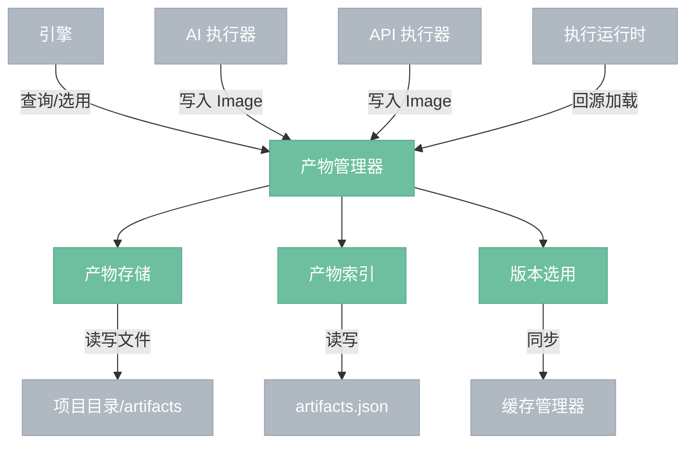
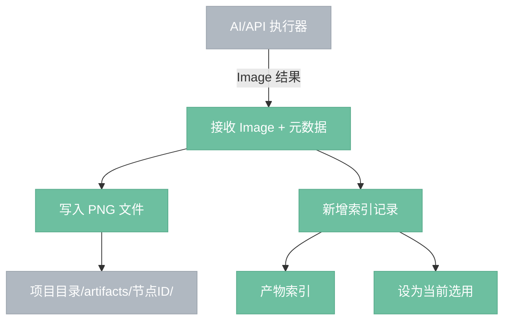
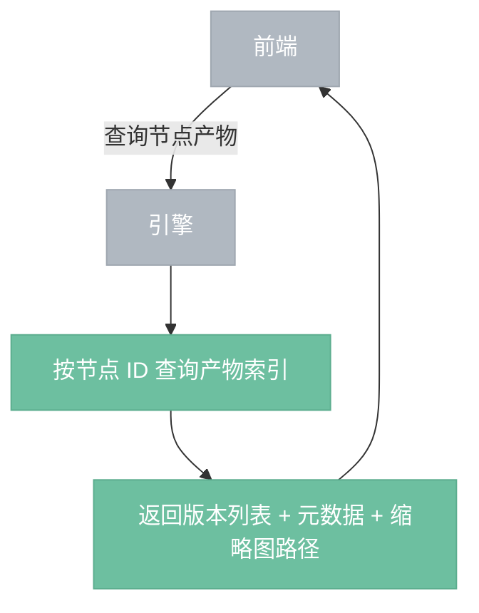
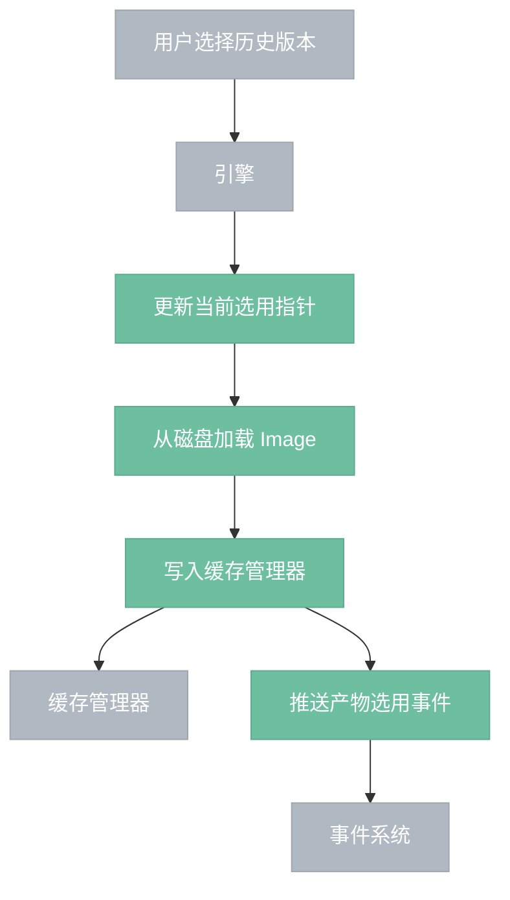
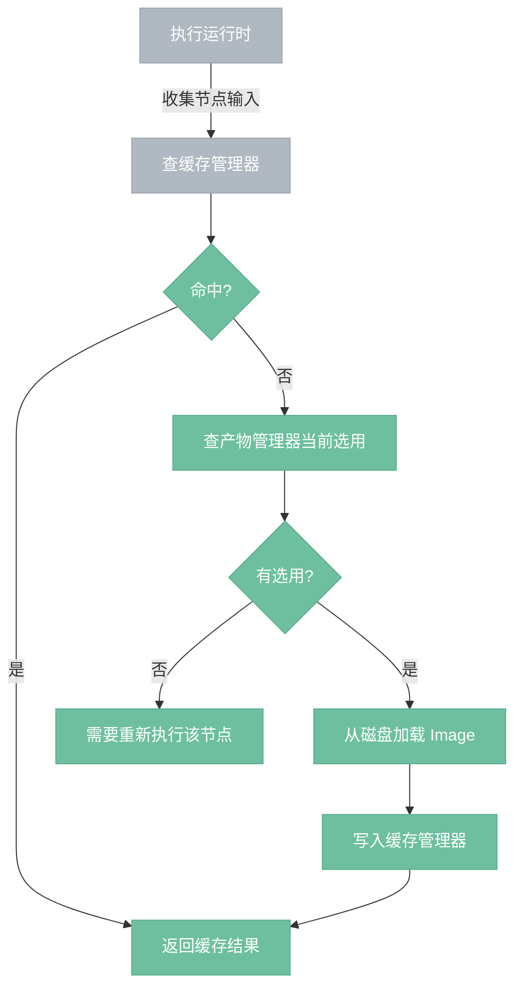
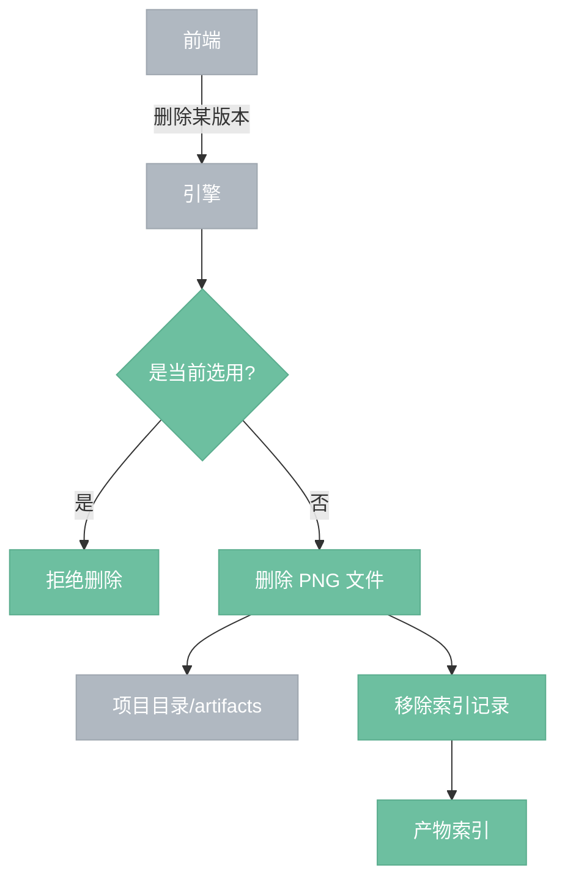

# 产物管理器

> AI/API 节点产出 Image 时额外持久化的历史归档，支持浏览和版本选用。

## 总览



---

## 创建流程



---

## 查询流程



---

## 选用流程



---

## 回源流程



---

## 删除流程



---

## ArtifactHandler 注册 API

产物管理器通过注册机制支持任意数据类型，不只是 Image。新增类型只需注册处理器：

```rust
artifact_registry.register(ArtifactHandler {
    data_type:   DataType::Image,
    serialize:   Box::new(|value, path| { /* 写 PNG */ }),
    deserialize: Box::new(|path| { /* 读 PNG → Value */ }),
    thumbnail:   Box::new(|path| { /* 生成缩略图 */ }),
    extension:   "png",
});
```

执行器产出结果时，产物管理器查找对应 `DataType` 的 handler 决定如何持久化。新增 Video、Text 等类型注册各自的 handler，产物管理器无需修改。

## 操作

| 操作 | 说明 |
|------|------|
| 创建 | AI/API 执行器产出数据时写入新版本，自动设为当前选用 |
| 查询 | 按节点 ID 返回历史产物列表（缩略图 + 元数据） |
| 选用 | 切换当前选用版本，同步缓存管理器，标脏下游节点 |
| 删除 | 删除某个历史版本，释放磁盘空间。当前选用版本不可删除 |

---

## 组件

- **产物存储**：文件 I/O，将 Image 写为 PNG 存入项目目录下的 artifacts 文件夹，按节点 ID 分目录。
- **产物索引**：维护每条产物记录的元数据（节点 ID、版本号、时间戳、种子、参数快照、文件路径），持久化为 artifacts.json，支持按节点查询所有版本。产物管理器拥有索引的读写权，项目管理器通过委派产物管理器实现持久化。
- **版本选用**：每个节点维护一个"当前选用"指针，默认指向最新版本。切换选用时同步写入缓存管理器，并通知调度器强制标脏下游。

## 边界情况

- **首次执行**：节点无产物记录，回源查询返回空，节点需要执行。
- **项目加载**：产物文件和索引已在磁盘上，产物管理器扫描项目目录重建内存索引。
- **删除节点**：产物记录保留（支持 undo 恢复），标记为孤立。
- **磁盘空间**：产物可能积累很多，需要支持手动清理或自动淘汰旧版本。
- **产物写入失败**：磁盘满等情况不影响执行流（缓存里有结果），仅影响历史记录，通过事件系统通知前端。
