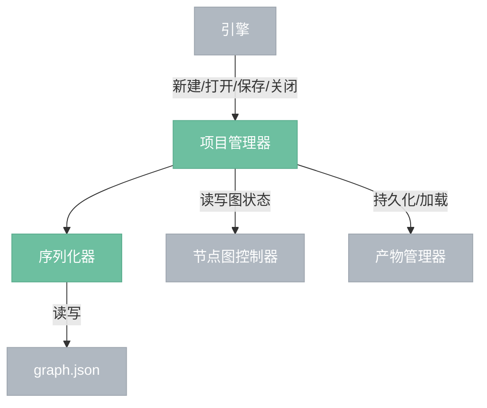
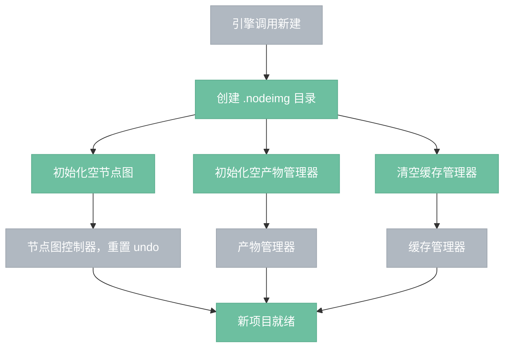
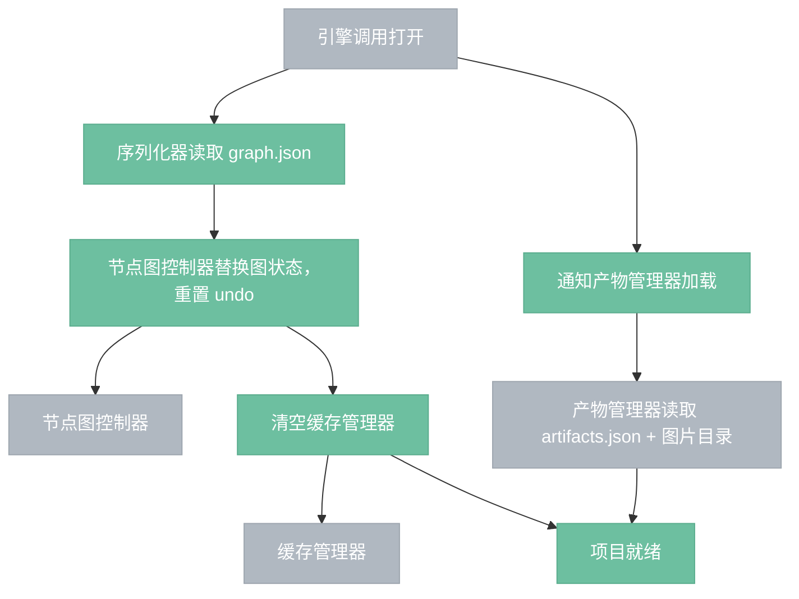
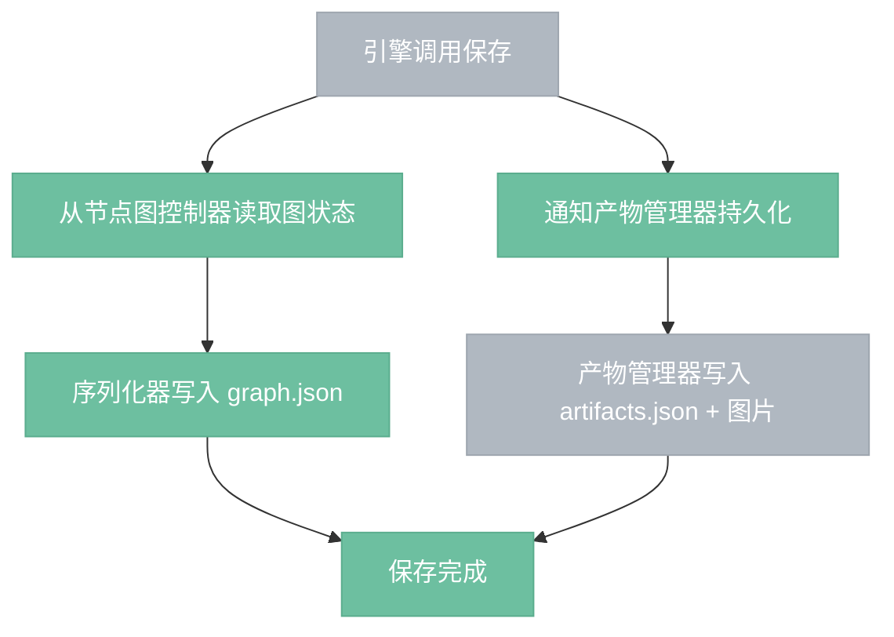
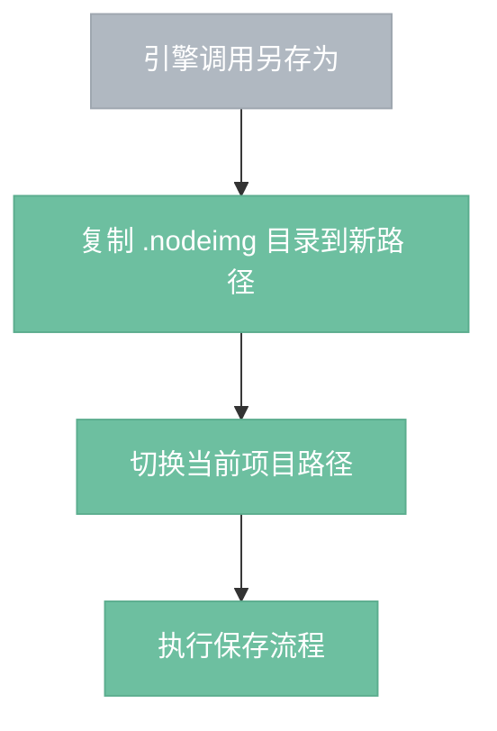

# 项目管理器

> 管理 .nodeimg bundle 的生命周期，协调序列化器和产物管理器读写项目文件。

## 总览

---

## 新建流程

---

## 打开流程

---

## 保存流程

---

## 另存为流程

---

## 操作

| 操作 | 说明 |
|------|------|
| 新建 | 创建空 .nodeimg bundle，初始化空节点图和空产物索引 |
| 打开 | 加载已有 .nodeimg bundle，恢复节点图和产物状态 |
| 保存 | 将当前状态写入 .nodeimg bundle |
| 另存为 | 复制当前项目到新路径，切换到新项目 |
