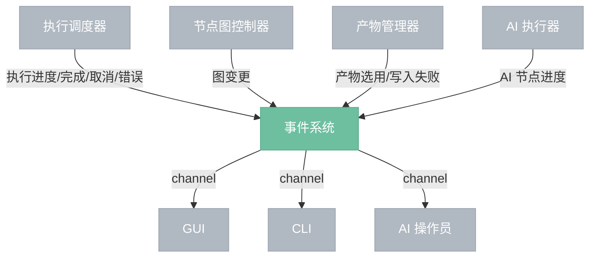

# 事件系统

> 内部组件推送事件，前端被动接收。

## 总览

---

## 事件类型

| 事件 | 推送方 | 说明 |
|------|--------|------|
| NodeStarted | 调度器 | 节点开始执行 |
| NodeProgress | AI 执行器 | AI 节点迭代进度（步数、可选预览图） |
| NodeFinished | 调度器 | 节点执行完成 |
| NodeError | 调度器 | 节点执行失败 |
| ExecutionFinished | 调度器 | 整轮执行完成 |
| ExecutionCancelled | 调度器 | 执行被用户取消 |
| ExecutionError | 调度器 | 执行因错误终止 |
| GraphChanged | 节点图控制器 | 图结构变更（增删节点/连线/参数修改/撤销/重做） |
| ArtifactSelected | 产物管理器 | 用户选用了历史产物版本 |
| ArtifactWriteFailed | 产物管理器 | 产物写入磁盘失败（不影响执行） |

---

## 机制

事件系统基于 channel（mpsc）实现：

- **推送端**：各组件持有 Sender，随时推送事件
- **接收端**：前端持有 Receiver，每帧轮询消费
- **不阻塞**：推送是非阻塞的，前端消费也是非阻塞的（try_recv）
- **多前端**：GUI、CLI、AI 操作员各持有独立的 Receiver（broadcast channel）

---

## 边界情况

- **前端消费慢**：channel 有缓冲区，短时间积压不丢事件。极端情况下缓冲区满，旧事件被丢弃，前端下次全量刷新。
- **无前端**：引擎可以无前端运行（如测试），事件推送到空 channel，无开销。
- **事件顺序**：同一组件推送的事件保证顺序（channel FIFO）。不同组件的事件无顺序保证。

## 设计决策

- **D23**：前端不阻塞。channel 通信 + 事件驱动 + AtomicBool 取消标志。前端每帧轮询事件，不等待执行完成。
