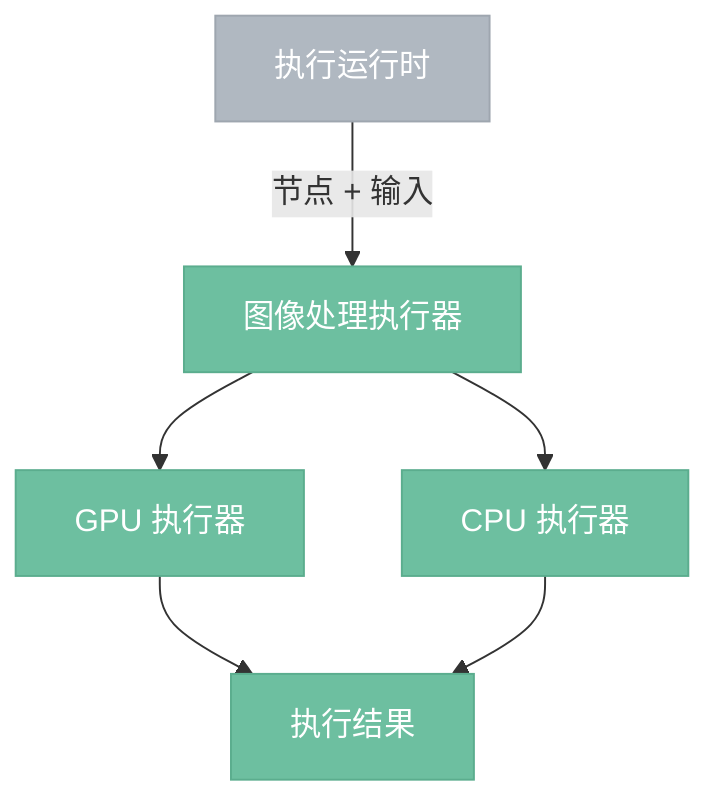
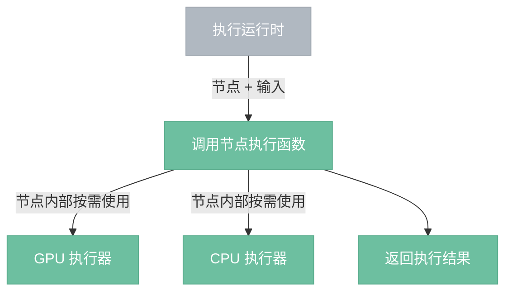

# 图像处理执行器

> 本地 GPU/CPU 执行像素运算和文件 I/O。

## 总览



GPU 执行器和 CPU 执行器是协作关系。GPU 负责给可并行的计算提速，CPU 处理 GPU 做不了的事。一个节点执行过程中可能只用其中一个，也可能两者都用。

**性能原则**：数据留在显存里最快（零搬运）。CPU 介入意味着显存 → 内存 → 显存的往返开销。因此能纯 GPU 完成的节点尽量纯 GPU，只有文件 I/O、复杂算法等 GPU 做不了的事才让 CPU 介入。

---

## 执行流程



---

## ExecContext API

执行器构建 `ExecContext` 传给节点的 `execute` 函数，节点自己决定调用顺序：

```rust
pub struct ExecContext<'a> {
    gpu: &'a GpuExecutor,
    cpu: &'a CpuExecutor,
}

impl ExecContext<'_> {
    pub fn cpu<T>(&self, f: impl FnOnce() -> T) -> T
    pub fn gpu<T>(&self, f: impl FnOnce(&GpuExecutor) -> T) -> T
}
```

节点可以任意组合：纯 CPU、纯 GPU、CPU → GPU、GPU → CPU → GPU 等，执行器不感知内部结构。

---

## 统一执行器边界

图像执行器是统一 `Executor`（执行器，Executor）接口的一种实现，而不是调度器直接绑定的特例。

权威 contract：`4.11.2-executor-contract.impl.md`

### 推荐接口形态

```rust
execute(request: ExecutionRequest) -> Result<ExecutionOutputs>
```

约束：

- 输入使用统一 `ExecutionRequest`（执行请求，ExecutionRequest）；
- 输出使用按输出口命名的 `ExecutionOutputs`（执行输出映射，ExecutionOutputs）；
- 是否写产物不由图像执行器决定；
- 是否缓存由 `NodeDef.execution.cache_policy`（缓存策略，cache_policy）与运行时共同决定。

## 组件

- **GPU 执行器**：通过 WGSL compute shader 加速像素级并行运算。内含 wgpu device/queue 和 Pipeline 缓存。统一模式：获取输入 GpuImage → 创建空输出纹理 → 获取/缓存 Pipeline → 构建 bind group → 提交 GPU 计算 → 返回 GpuImage。所有 shader 使用 16x16 workgroup size。
- **CPU 执行器**：处理 GPU 无法完成的操作——文件 I/O、文件解析（LUT）、复杂数学算法（bicubic/lanczos3 插值）。
- **ExecContext**：构建后传给节点的 `execute` 函数，持有 GPU 执行器和 CPU 执行器的引用。节点自己决定调用顺序，ExecContext 不参与格式转换。

> **格式转换已移入 `Image` 类型内部。** `Image` 使用 `OnceLock` 懒缓存 CPU（`DynamicImage`）和 GPU（`GpuTexture`）两种表示，首次访问时自动转换。ExecContext 不再需要处理格式转换，节点看到的 `Image` 自动按需转换。

## 边界情况

- **GPU 不可用**：节点调用 `ctx.gpu()` 时 GPU 不可用，抛出错误。节点可在 `execute` 里自行 fallback 到 `ctx.cpu()`。
- **Pipeline 缓存**：同名 shader 只编译一次，后续调用直接复用。
