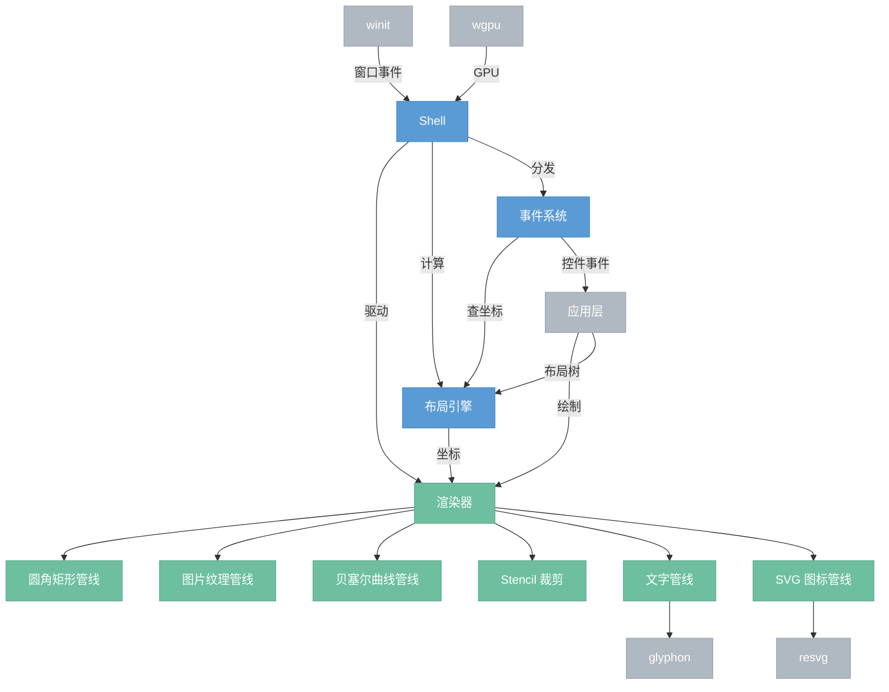

# 渲染层

> 自建渲染基础设施。用 winit + wgpu + glyphon + resvg 替代 iced/eframe，完全控制所有管线。服务于整个应用：面板系统、节点画布、预览、主题。

## 总览



## 文件结构

```
gui/src/
├── shell/                         ── Shell（窗口 + 帧循环）
│   ├── mod.rs                        App trait、run() 启动函数
│   ├── window.rs                     winit 窗口创建 + 事件循环
│   └── gpu.rs                        wgpu Device / Queue / Surface 初始化
├── renderer/                      ── Renderer（统一绘制接口 + 管线）
│   ├── mod.rs                        Renderer struct：begin / draw_* / end
│   ├── quad.rs                       圆角矩形管线（SDF 圆角 + 边框 + 阴影）
│   ├── image.rs                      图片纹理管线（采样 + UV）
│   ├── text.rs                       glyphon 文字管线
│   ├── svg.rs                        resvg SVG → 纹理缓存
│   ├── curve.rs                      贝塞尔曲线管线（连线用）
│   ├── stencil.rs                    Stencil 裁剪（push_clip / pop_clip）
│   └── shaders/                      WGSL 着色器
│       ├── quad.wgsl
│       ├── image.wgsl
│       └── curve.wgsl
├── layout/                        ── 布局引擎
│   ├── mod.rs                        LayoutNode + 两遍算法
│   └── types.rs                      Size / Rect / Edges / SizeHint
├── event/                         ── 事件系统
│   ├── mod.rs                        AppEvent 定义 + 分发逻辑
│   └── hit_test.rs                   命中测试（point-in-rect，z-order）
├── canvas/                        ── 节点画布
├── controls/                      ── 控件（2.9.0）
├── panels/                        ── 面板实例（2.9.0）
├── panel/                         ── 面板框架（2.9.0）
├── theme/                         ── 主题
└── lib.rs
```

---

## 1. Shell

薄封装层。管理 winit 窗口、wgpu 初始化、帧循环。

### App trait

```rust
trait App {
    fn init(ctx: &mut AppContext) -> Self;
    fn event(&mut self, event: AppEvent, ctx: &mut AppContext);
    fn update(&mut self, ctx: &mut AppContext);
    fn render(&mut self, renderer: &mut Renderer, ctx: &mut AppContext);
}
```

### AppContext

```rust
struct AppContext {
    gpu: GpuContext,          // wgpu device + queue（复用 nodeimg-gpu）
    window: Arc<Window>,
    surface: wgpu::Surface,
    size: PhysicalSize<u32>,
    scale_factor: f64,
    dt: f32,                  // 帧间隔
}
```

### 帧循环

```
winit EventLoop
  ├── Resized           → 重建 surface config
  ├── *Input*           → app.event(AppEvent)
  ├── RedrawRequested   → app.update() → layout → app.render() → present
  └── AboutToWait       → window.request_redraw()
```

GpuContext 复用 `nodeimg-gpu` 已有的 device + queue。Shell 只新增 surface 和 swapchain 管理。

---

## 2. Renderer

统一绘制接口。所有管线的入口。每帧一次 begin / end。

### 接口

```rust
impl Renderer {
    // 帧生命周期
    fn begin_frame(&mut self, surface_view: &TextureView, size: PhysicalSize<u32>);
    fn end_frame(&mut self);

    // 图元
    fn draw_rect(&mut self, rect: Rect, style: &RectStyle);
    fn draw_image(&mut self, rect: Rect, texture: &GpuTexture, uv: Option<Rect>);
    fn draw_text(&mut self, pos: Point, text: &str, style: &TextStyle);
    fn draw_svg(&mut self, rect: Rect, icon: &str, color: Color);
    fn draw_curve(&mut self, points: &[Point; 4], width: f32, color: Color);

    // 裁剪
    fn push_clip(&mut self, rect: Rect, radius: f32);
    fn pop_clip(&mut self);

    // 相机（画布用）
    fn set_transform(&mut self, transform: Transform2D);
    fn reset_transform(&mut self);
}
```

### 渲染顺序

```
begin_frame
  set_transform(camera)        // 画布坐标系
    draw 节点、连线...
  reset_transform()            // 回到屏幕坐标系
  for panel in z_order:
    push_clip(panel_rect, 8px)
      draw 面板内容...
    pop_clip()
end_frame → present
```

---

## 3. 管线

### 3.1 圆角矩形

SDF 方式——fragment shader 中计算像素到圆角矩形的距离，smoothstep 抗锯齿。不需要细分顶点。

**实例数据：**

```rust
#[repr(C)]
struct QuadInstance {
    rect: [f32; 4],          // x, y, w, h
    color: [f32; 4],         // RGBA
    border_color: [f32; 4],
    border_width: f32,
    radius: [f32; 4],        // 四角
}
```

**批处理：** 每帧收集所有 quad 到一个 instance buffer，一次 draw call。

**样式：**

```rust
struct RectStyle {
    color: Color,
    border: Option<Border>,      // { width, color }
    radius: [f32; 4],            // 四角圆角半径
    shadow: Option<Shadow>,      // { color, offset, blur }（后续扩展）
}
```

### 3.2 图片纹理

纹理采样四边形。和圆角矩形共用顶点结构，fragment 中采样纹理。

**流程：**

```
image crate 解码 → wgpu::Texture (RGBA8) → bind group
渲染：textured quad + UV 坐标 → fragment 采样
```

**缓存：** `HashMap<ImageId, GpuTexture>`。预览面板直接使用引擎产出的 GpuTexture，零拷贝。

### 3.3 文字（glyphon）

glyphon 自带 wgpu 渲染器，直接注入 render pass。

```rust
struct TextPipeline {
    font_system: glyphon::FontSystem,
    swash_cache: glyphon::SwashCache,
    atlas: glyphon::TextAtlas,
    text_renderer: glyphon::TextRenderer,
}
```

**每帧流程：**

```
收集所有 draw_text 调用 → glyphon::Buffer（布局 + 整形）
→ atlas 更新（光栅化新 glyph）
→ text_renderer.render() 注入 render pass
```

### 3.4 SVG 图标（resvg）

光栅化为位图后上传为纹理。

```
SVG 文件 → resvg::Tree → render to tiny_skia::Pixmap → wgpu::Texture
```

**缓存：** `HashMap<(icon_name, size), GpuTexture>`。图标尺寸有限（16/20/24px），缓存命中率高。

**着色：** 光栅化前修改 SVG 的 fill 属性为目标颜色。主题切换时清除缓存重新光栅化。

### 3.5 贝塞尔曲线

节点连线用。三次贝塞尔细分为线段，三角化为带宽度的条带。

```
4 个控制点 → adaptive subdivision → 线段序列
→ 每段线段生成 2 个三角形（宽度条带）
→ 顶点 buffer → draw
```

抗锯齿：条带边缘 alpha 渐变（fragment shader 中根据距线段中心的距离 smoothstep）。

### 3.6 Stencil 裁剪

面板圆角裁剪。支持嵌套。

```
push_clip(rect, radius):
  stencil pass —— 写入圆角矩形区域（stencil ref += 1）
  后续 draw —— stencil test: Equal(当前 ref)

pop_clip():
  stencil pass —— 清除区域（stencil ref -= 1）
```

深度/stencil 纹理格式：`Depth24PlusStencil8`。

---

## 4. 布局引擎

两遍算法：measure（自底向上，期望尺寸）→ arrange（自顶向下，分配位置）。

### LayoutNode

```rust
enum LayoutNode {
    Column   { children: Vec<LayoutNode>, spacing: f32, padding: Edges },
    Row      { children: Vec<LayoutNode>, spacing: f32, padding: Edges },
    Scrollable { child: Box<LayoutNode>, offset: f32 },
    Sized    { width: SizeHint, height: SizeHint, child: Box<LayoutNode> },
    Leaf     { id: ControlId, size: Size },
}

enum SizeHint {
    Fixed(f32),     // 固定像素
    Fill,           // 占满剩余空间
    FitContent,     // 由内容决定
}
```

### 输出

```rust
struct LayoutResult {
    rects: HashMap<ControlId, Rect>,  // 控件 ID → 屏幕坐标矩形
}
```

### Measure（自底向上）

```
Leaf      → 控件固有尺寸
Column    → 宽 = max(子宽) + padding，高 = sum(子高) + spacing*(n-1) + padding
Row       → 宽 = sum(子宽) + spacing*(n-1) + padding，高 = max(子高) + padding
Sized     → 覆盖对应维度
Scrollable → 同子节点，但高度可被约束截断
```

### Arrange（自顶向下）

```
Column → y 逐项累加，Fill 子节点平分剩余高度
Row    → x 逐项累加，Fill 子节点平分剩余宽度
Scrollable → 子节点偏移 -scroll_offset，超出区域裁剪
```

---

## 5. 事件系统

### 事件类型

```rust
enum AppEvent {
    // 鼠标
    MouseMove(Point),
    MousePress(MouseButton, Point),
    MouseRelease(MouseButton, Point),
    MouseScroll(Vector),
    // 键盘
    KeyPress(Key, Modifiers),
    KeyRelease(Key, Modifiers),
    TextInput(String),
    // 窗口
    Resized(PhysicalSize<u32>),
    ScaleFactorChanged(f64),
}
```

### 命中测试

```
鼠标事件
  → 遍历面板（z-order，最前优先）
    → point in panel_rect?
      → 遍历面板内控件 rect
        → 命中 → ControlEvent(panel_id, control_id, event_type)
  → 未命中任何面板 → 转发给画布（画布自己做 hit test）
```

### 焦点

```rust
struct FocusState {
    panel: Option<PanelId>,
    control: Option<ControlId>,
}
```

- 点击控件获得焦点
- Tab 切换焦点
- 键盘事件只发给 focused control
- Escape 清除焦点

---

## 6. 坐标系统

两套坐标：

| 坐标系 | 用途 | 变换 |
|--------|------|------|
| 屏幕坐标 | 面板、控件、事件 | 1:1 像素（DPI 缩放后） |
| 画布坐标 | 节点、连线 | camera transform（平移 + 缩放） |

```rust
struct Transform2D {
    offset: Vector,  // 平移
    scale: f32,      // 缩放
}

// 屏幕 → 画布
canvas_pos = (screen_pos - offset) / scale
// 画布 → 屏幕
screen_pos = canvas_pos * scale + offset
```

`set_transform` 更新 uniform buffer，GPU 侧做变换。面板始终屏幕坐标，不受画布相机影响。

---

## 7. 依赖

| 依赖 | 版本 | 用途 | 状态 |
|------|------|------|------|
| wgpu | 27 | GPU 渲染 | 已有 |
| winit | 0.30+ | 窗口 / 事件循环 | 新增 |
| glyphon | 0.6+ | 文字整形 + 光栅化 | 新增 |
| resvg | 0.44+ | SVG → 位图 | 新增 |
| image | 0.25 | 图片解码 | 已有 |
| bytemuck | 1 | buffer 数据转换 | 已有 |

移除：iced、eframe、egui-snarl。
