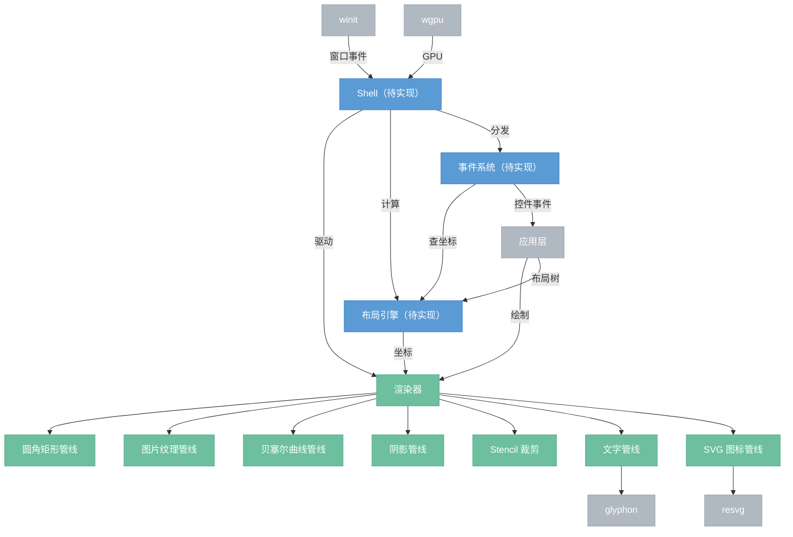

# 渲染层

> 自建渲染基础设施。winit + wgpu + glyphon + resvg，完全控制所有管线。服务于整个应用：面板系统、节点画布、预览、主题。

## 总览



## 文件结构

```
gui/src/
├── shell/                         ── Shell（窗口 + 帧循环）
│   ├── mod.rs                        模块导出
│   ├── app.rs                        App trait 定义
│   ├── context.rs                    AppContext 结构体
│   ├── window.rs                     winit 窗口创建
│   ├── gpu.rs                        wgpu Device + Queue 初始化
│   ├── surface.rs                    Surface + swapchain 管理
│   ├── event.rs                      winit 事件 → AppEvent 转换
│   └── runner.rs                     run() + 主循环调度
└── renderer/
    ├── mod.rs                        模块导出
    ├── renderer.rs                   Renderer struct：begin / draw_* / end
    ├── command.rs                    DrawCommand 枚举
    ├── prepare.rs                    命令预处理（tessellation → PreparedFrame）
    ├── dispatch.rs                   帧调度（上传 buffer → render pass）
    ├── buffer.rs                     DynamicBuffer（帧间复用）+ SharedViewport
    ├── types.rs                      Rect、Point、Color
    ├── style.rs                      RectStyle、TextStyle、Border、Shadow
    ├── quad.rs                       圆角矩形管线（lyon tessellation）
    ├── curve.rs                      贝塞尔曲线管线 + 三角化缓存
    ├── image.rs                      图片纹理管线（instance-based）
    ├── shadow.rs                     阴影管线（形状 → 高斯模糊 → 合成）
    ├── stencil.rs                    Stencil 裁剪（push_clip / pop_clip）
    ├── text.rs                       glyphon 文字管线 + Buffer 缓存
    ├── svg.rs                        resvg SVG → 纹理缓存 + 像素级着色
    └── shaders/
        ├── quad.wgsl                 圆角矩形顶点 + 片段
        ├── curve.wgsl                贝塞尔曲线顶点 + 片段
        ├── image.wgsl                图片纹理采样
        ├── stencil.wgsl              Stencil 写入
        ├── gaussian_blur.wgsl        高斯模糊 compute shader
        └── shadow_composite.wgsl     阴影合成
```

---

## 1. Shell（待实现）

薄封装层。管理 winit 窗口、wgpu 初始化、帧循环。

### App trait

```rust
trait App {
    fn init(ctx: &mut AppContext) -> Self;
    fn event(&mut self, event: AppEvent, ctx: &mut AppContext);
    fn update(&mut self, ctx: &mut AppContext);
    fn render(&mut self, renderer: &mut Renderer, ctx: &AppContext);
}
```

### AppContext

```rust
struct AppContext {
    device: wgpu::Device,
    queue: wgpu::Queue,
    window: Arc<Window>,
    surface: wgpu::Surface,
    size: PhysicalSize<u32>,
    scale_factor: f64,
    dt: f32,                  // 帧间隔
}
```

### 帧循环

```
winit EventLoop
  ├── Resized           → 重建 surface config
  ├── *Input*           → app.event(AppEvent)
  ├── RedrawRequested   → app.update() → layout → app.render() → present
  └── AboutToWait       → window.request_redraw()
```

---

## 2. Renderer（已实现）

统一绘制接口。即时模式：每帧 begin_frame → draw_* → end_frame。

### 接口

```rust
impl Renderer {
    // 帧生命周期
    fn begin_frame(&mut self, view: TextureView, size: PhysicalSize<u32>, scale_factor: f64);
    fn end_frame(&mut self, device: &wgpu::Device, queue: &wgpu::Queue);

    // 图元
    fn draw_rect(&mut self, rect: Rect, style: &RectStyle);
    fn draw_text(&mut self, pos: Point, text: &str, style: &TextStyle);
    fn draw_image(&mut self, rect: Rect, view: Arc<wgpu::TextureView>);
    fn draw_curve(&mut self, points: [Point; 4], width: f32, color: Color);

    // 裁剪
    fn push_clip(&mut self, rect: Rect, radius: f32);
    fn pop_clip(&mut self);
}
```

### 两阶段帧架构

```
begin_frame → 收集 DrawCommand
end_frame:
  阶段 1  文字 prepare（glyphon 布局 + 字形光栅化）
  阶段 2  阴影 prepare（缓存 miss 时渲染形状 + 高斯模糊）
  阶段 3  prepare_frame（命令列表 → tessellation → PreparedFrame）
  阶段 4  upload（顶点/索引 → GPU buffer，viewport uniform 写入一次）
  阶段 5  render pass（按 DrawOp 顺序绘制，管线按需切换）
  阶段 6  文字渲染（glyphon 注入 render pass）
  → queue.submit
```

### 共享 viewport uniform

所有管线共用一份 `SharedViewport` buffer（`buffer.rs`）。每帧写入一次 `[viewport_w, viewport_h]`，各管线通过缓存的 bind group 引用同一份 buffer。

### MSAA

4× 多重采样抗锯齿。渲染到 MSAA texture，resolve 到 surface texture。

---

## 3. 管线

### 3.1 圆角矩形（quad.rs）

lyon tessellation 方式——CPU 侧将圆角矩形路径三角化为顶点/索引，上传 GPU 绘制。使用 Figma 风格 cornerSmoothing 算法（squircle）。

**顶点数据：**

```rust
struct QuadVertex {
    position: [f32; 2],
    color: [f32; 4],
}
```

**批处理：** 连续的矩形合并为一个 draw call（顶点/索引拼接）。管线切换时 flush。

**边框：** 同路径 stroke tessellation，独立颜色。

**样式：**

```rust
struct RectStyle {
    color: Color,
    border: Option<Border>,      // { width, color }
    radius: [f32; 4],            // 四角圆角半径
    shadow: Option<Shadow>,      // { color, offset, blur, spread }
}
```

### 3.2 阴影（shadow.rs）

离屏渲染 + 高斯模糊 + 合成。三阶段管线：

```
1. 形状渲染：圆角矩形 tessellation → 离屏 Rgba8Unorm 纹理
2. 高斯模糊：compute shader 两遍分离式模糊（水平 → 垂直）
3. 合成：模糊结果采样 → 主 render pass 叠加
```

**缓存：** `HashMap<CacheKey, CachedShadow>`，key = (宽高 + 圆角 + 模糊/扩展/颜色)。命中直接复用模糊后的纹理。60 帧未使用自动清理。

**形状阶段 viewport 独立：** 使用阴影纹理尺寸，不共享主视口 buffer。

### 3.3 图片纹理（image.rs）

Instance-based 渲染。每张图片一次 draw call。

```
调用者提供 Arc<wgpu::TextureView> → bind group(viewport + texture + sampler)
→ vertex shader 根据 rect instance 生成 6 个顶点 → fragment 采样
```

### 3.4 文字（text.rs）

glyphon 自带 wgpu 渲染器，直接注入 render pass。

```rust
struct TextPipeline {
    font_system: FontSystem,
    swash_cache: SwashCache,
    atlas: TextAtlas,
    text_renderer: TextRenderer,
    viewport: Viewport,
    buffer_cache: HashMap<TextCacheKey, CachedBuffer>,  // 帧间复用
}
```

**缓存：** 按 (text, font_size) 缓存 glyphon Buffer。内容不变时跳过 set_text + shape。每帧标记使用状态，未使用的帧结束清理。

### 3.5 SVG 图标（svg.rs）

光栅化为位图后上传为纹理。

```
SVG bytes → resvg::usvg::Tree → render to Pixmap → 像素级颜色替换 → wgpu::Texture
```

**缓存：** `HashMap<(data_hash, size, color), SvgEntry>`。命中直接返回 `Arc<TextureView>`。

**着色：** 光栅化后逐像素替换 RGB，保留原始 alpha。不依赖 SVG 源文件中的颜色格式。

### 3.6 贝塞尔曲线（curve.rs）

节点连线用。三次贝塞尔曲线通过 lyon stroke tessellation 三角化为带宽度的条带。

**三角化缓存：** `HashMap<CurveCacheKey, CachedTessellation>`，key = (控制点 + 线宽 + 颜色)。控制点不变时跳过 tessellation。

### 3.7 Stencil 裁剪（stencil.rs）

面板圆角裁剪。支持嵌套。

```
push_clip(rect, radius):
  stencil pass —— 写入圆角矩形区域（stencil ref += 1）
  后续 draw —— stencil test: Equal(当前 ref)

pop_clip():
  stencil pass —— 清除区域（stencil ref -= 1）
```

深度/stencil 纹理格式：`Depth24PlusStencil8`。内容管线只读 stencil，不写入。

---

## 4. GPU Buffer 管理（buffer.rs）

### DynamicBuffer

预分配 GPU buffer，帧间复用。数据量 ≤ 当前容量时 `queue.write_buffer`；超出时 2× 增长重建。用于顶点/索引/uniform buffer。

### SharedViewport

主视口 uniform buffer。每帧写入一次 `[viewport_w, viewport_h]`。所有管线通过缓存的 bind group 引用同一份 buffer。

```
dispatch:
  shared_viewport.upload(viewport_size)   // 写入一次
  quad.update_bind_group(viewport_buf)    // 首帧创建，后续复用
  curve.update_bind_group(viewport_buf)
  stencil.update_bind_group(viewport_buf)
```

---

## 5. 布局引擎（待实现）

两遍算法：measure（自底向上，期望尺寸）→ arrange（自顶向下，分配位置）。

### LayoutNode

```rust
enum LayoutNode {
    Column   { children: Vec<LayoutNode>, spacing: f32, padding: Edges },
    Row      { children: Vec<LayoutNode>, spacing: f32, padding: Edges },
    Scrollable { child: Box<LayoutNode>, offset: f32 },
    Sized    { width: SizeHint, height: SizeHint, child: Box<LayoutNode> },
    Leaf     { id: ControlId, size: Size },
}
```

---

## 6. 事件系统（待实现）

### 事件类型

```rust
enum AppEvent {
    MouseMove(Point),
    MousePress(MouseButton, Point),
    MouseRelease(MouseButton, Point),
    MouseScroll(Vector),
    KeyPress(Key, Modifiers),
    KeyRelease(Key, Modifiers),
    TextInput(String),
    Resized(PhysicalSize<u32>),
    ScaleFactorChanged(f64),
}
```

### 命中测试

```
鼠标事件
  → 遍历面板（z-order，最前优先）
    → point in panel_rect?
      → 遍历面板内控件 rect
        → 命中 → ControlEvent(panel_id, control_id, event_type)
  → 未命中任何面板 → 转发给画布
```

---

## 7. 坐标系统

两套坐标：

| 坐标系 | 用途 | 变换 |
|--------|------|------|
| 屏幕坐标 | 面板、控件、事件 | 1:1 逻辑像素（DPI 缩放后） |
| 画布坐标 | 节点、连线 | camera transform（平移 + 缩放，待实现） |

---

## 8. 依赖

| 依赖 | 版本 | 用途 | 状态 |
|------|------|------|------|
| wgpu | 28 | GPU 渲染 | 已有 |
| winit | 0.30 | 窗口 / 事件循环 | 已有 |
| glyphon | 0.10 | 文字整形 + 光栅化 | 已有 |
| resvg | 0.44 | SVG → 位图 | 已有 |
| lyon | 1 | 路径 tessellation | 已有 |
| bytemuck | 1 | buffer 数据转换 | 已有 |
| image | 0.25 | 图片解码 | 已有 |
