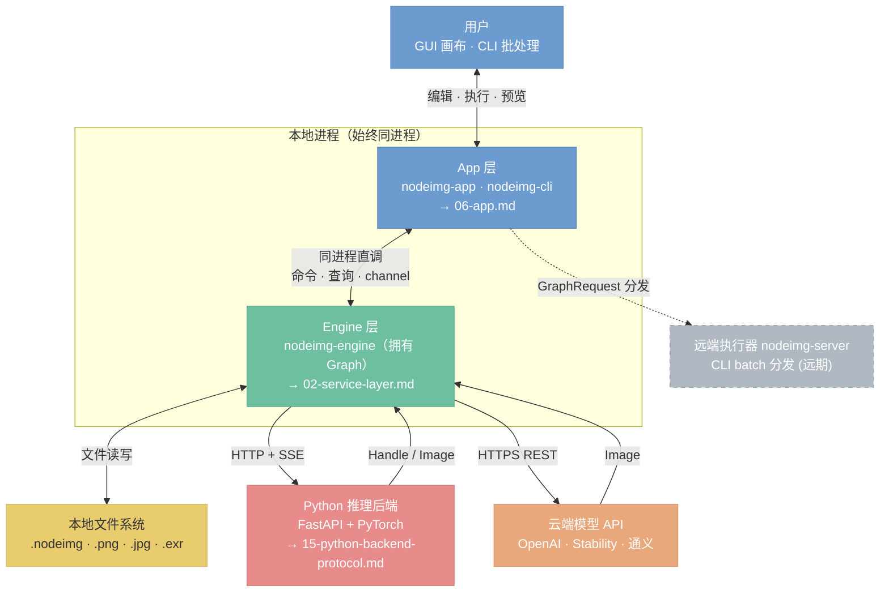
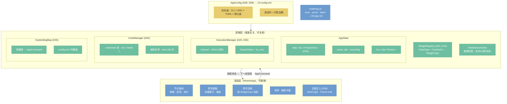
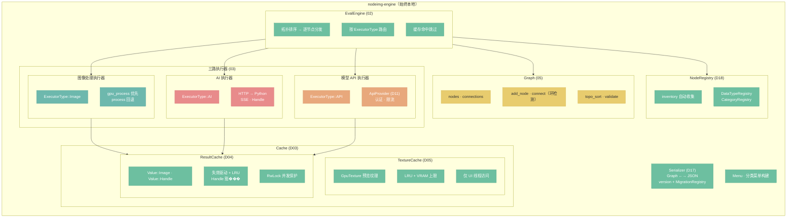
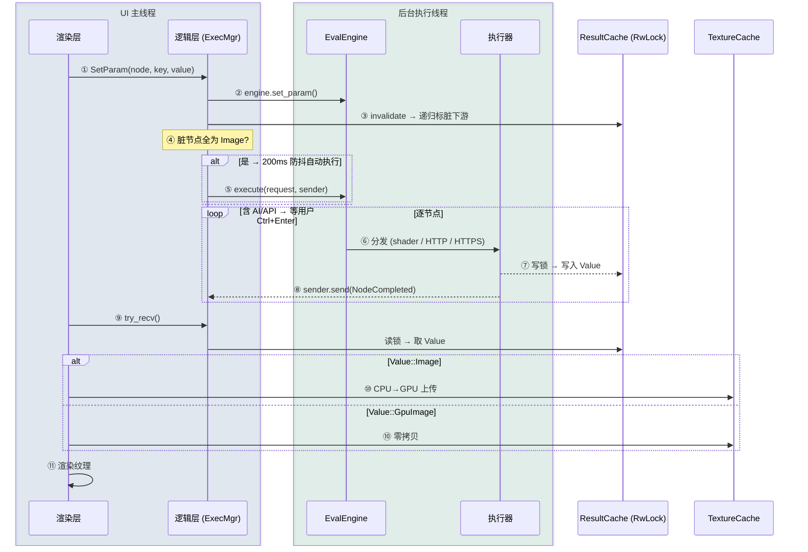
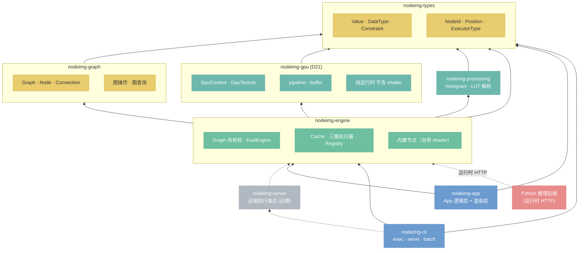
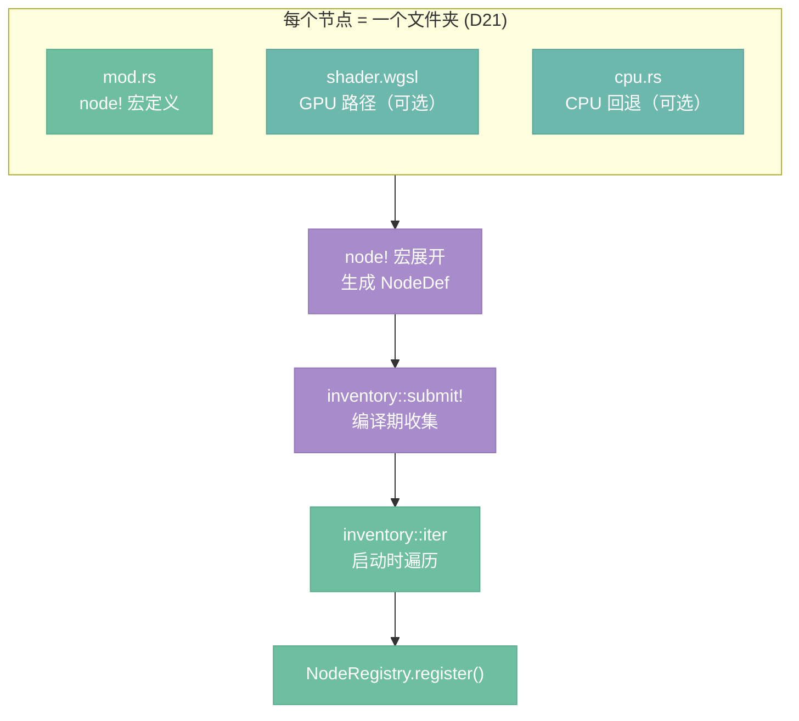

# nodeimg 目标架构

本目录是 nodeimg 目标架构的文档体系。目标架构描述系统**应当成为的样子**，是设计决策的集中记录，也是重构和新功能开发的参考基准。

---

## 总架构图

**核心原则：Engine 始终本地运行，Graph 由 Engine 拥有。** App 通过命令接口操作 Engine；远端能力仅限 AI 推理和云端 API。

5 张竖向模块图，每张聚焦一个维度。组件标注对应文档和决策 ID，实线 = 当前，虚线 = 远期。

---

### 图 1 — 系统分层与边界

> 谁和谁通信、边界在哪。对应 [00](./00-context.md)、[01](./01-overview.md)、[11](./11-cross-cutting.md)。



---

### 图 2 — App 层内部

> 逻辑/渲染分离，GUI 与 CLI 并列。对应 [06](./06-app.md)、[10](./10-config.md)。



---

### 图 3 — Engine 层内部

> Graph 所有权、调度、缓存、三路执行。对应 [02](./02-service-layer.md)、[03](./03-executors.md)、[05](./05-graph.md)。



---

### 图 4 — 执行数据流（参数变更 → 预览刷新）

> 标注线程边界和数据类型。对应 [06](./06-app.md)（D23、D35）、[08](./08-concurrency.md)、[15](./15-python-backend-protocol.md)。



---

### 图 5 — Crate 依赖 + 节点注册

> 编译期依赖方向和节点自动发现流程。对应 [01](./01-overview.md)、[07](./07-node-framework.md)（D18、D21）。



节点注册流程（编译期 → 启动期）：



---

### 关键架构约束

| 约束 | 说明 | 文档 |
|------|------|------|
| Engine 始终本地 | App 与 Engine 同进程直调，不经网络 | 01, 02 |
| Graph 归 Engine | App 通过命令操作图，不直接持有 Graph | 05, 06 |
| GPU+CPU 协作 | GPU 做像素运算，CPU 做 I/O 和分析，Image 节点 200ms 防抖自动执行 | 06 (D35) |
| AI 用户可控 | AI/API 节点 Ctrl+Enter 手动，旧结果保留 | 06 (D35) |
| 远端仅限推理 | Python 和云端 API 可远端，图像处理始终本地 | 03, 11, 15 |
| 批量分发远期 | CLI batch 可分发 GraphRequest 到远端执行器 | 04, 11 |
| Handle 豁免 LRU | Handle 不被淘汰，释放由失效或 VRAM 不足驱动 | 02, 15 (D04) |
| 节点内聚 | 一节点 = 一文件夹（mod.rs + shader + cpu） | 07 (D21) |
| 声明式注册 | node! 宏 + inventory，新增节点不改聚合文件 | 07 (D18) |
| 逻辑/渲染分离 | 逻辑层���引用 egui，换框架只重写渲染层 | 06 |

### 文档覆盖对照

| 图 | 覆盖文档 |
|---|---------|
| 1. 系统分层 | 00（边界）、01（协作）、11（部署模式） |
| 2. App 内部 | 06（逻辑/渲染、D20–D36）、10（配置） |
| 3. Engine 内部 | 02（调度、Cache）、03（执行器）、05��Graph） |
| 4. 执行数据流 | 06（D23、D35）、08（线程、channel）、15（SSE） |
| 5. Crate + 注册 | 01（依赖图）、07（node! 宏、D18、D21） |
| 横跨 | 04（远端执行）、09（错误）、12–14（决策、风险、术语）、15（Python 协议）、16（节点目录） |

---

## 文档索引

| 文件 | 主题 | 定位 |
|------|------|------|
| [00-context.md](./00-context.md) | 系统上下文 | nodeimg 系统与外部世界的边界和交互对象 |
| [01-overview.md](./01-overview.md) | 调用链总览 | 系统顶层架构，模块间如何协作，crate 如何依赖 |
| [02-service-layer.md](./02-service-layer.md) | 服务层内部 | EvalEngine 如何调度执行，服务层内部模块如何组织 |
| [03-executors.md](./03-executors.md) | 三路执行器 | 图像处理、AI 推理、模型 API 三路执行器的详细设计 |
| [04-transport.md](./04-transport.md) | Transport + server | Transport trait 实现协议透明性，server 接口定义远端通信契约 |
| [05-graph.md](./05-graph.md) | 节点图数据模型 | nodeimg-graph crate 的数据结构和操作 API |
| [06-app.md](./06-app.md) | App 层 + CLI | 逻辑/渲染分离架构，框架无关的核心逻辑设计，CLI 子命令规格 |
| [07-node-framework.md](./07-node-framework.md) | 节点架构 | 节点开发者体验——如何用最少的代码定义新节点 |
| [08-concurrency.md](./08-concurrency.md) | 并发模型 | 线程模型、并行策略、前端异步交互方式 |
| [09-error-handling.md](./09-error-handling.md) | 错误处理 | 分层 Error 类型、传播路径、前端展示策略 |
| [10-config.md](./10-config.md) | 配置系统 | 配置源、配置项清单、加载时机 |
| [11-cross-cutting.md](./11-cross-cutting.md) | 横切关注点 | 安全、日志、测试、性能、部署、版本 |
| [12-decisions.md](./12-decisions.md) | 设计决策表 | 所有架构决策的索引 |
| [13-risks.md](./13-risks.md) | 风险与技术债 | ��识别的风险和已知的技术债务 |
| [14-glossary.md](./14-glossary.md) | 术语表 | 项目中使用的领域术语定义 |
| [15-python-backend-protocol.md](./15-python-backend-protocol.md) | Python 后端协议 | AI 执行器与 Python 推理后端的通信协议、数据格式、生命周期管理 |
| [16-node-catalog.md](./16-node-catalog.md) | 节点目录 | v1 全量节点规格（AI 推理 + 图像处理 + 工具 + 模型 API） |

---

## 文档模板

所有文件（除 `README.md` 和 `12-decisions.md`）遵循统一模板：

```markdown
# 标题

> 一句话定位（这个模块是什么、解决什么问题）

## 总览

概述 + 核心 mermaid 图（一张图说清楚整体结构）

## [主题小节]

按逻辑展开：
- 设计意图和规则
- 必要时配 mermaid 图
- 关键接口/数据结构用 rust 代码块示意
- 约束和决策理由在上下文中内联说明
```

核心原则：**定位 → 总览图 → 按主题展开**（约束和决策内联，不单独列出）。

---

## Mermaid 配色规范（风格 A：柔和专业）

全局语义化 classDef，**所有文件统一使用**，不得自行引入其他颜色：

```
classDef frontend    fill:#6C9BCF,stroke:#5A89BD,color:#fff
classDef transport   fill:#A78BCA,stroke:#9579B8,color:#fff
classDef service     fill:#6DBFA0,stroke:#5BAD8E,color:#fff
classDef ai          fill:#E88B8B,stroke:#D67979,color:#fff
classDef api         fill:#E8A87C,stroke:#D6966A,color:#fff
classDef foundation  fill:#E8CC6E,stroke:#D6BA5C,color:#333
classDef compute     fill:#6DB8AD,stroke:#5BA69B,color:#fff
classDef future      fill:#B0B8C1,stroke:#9EA6AF,color:#fff,stroke-dasharray:5 5
```

### 语义映射

| classDef | 用于 | 色调 |
|----------|------|------|
| `frontend` | GUI、CLI、App 层组件 | 柔蓝 |
| `transport` | Transport trait、协议层、HttpTransport | 淡紫 |
| `service` | EvalEngine、Registry、Cache、服务层组件 | 薄荷绿 |
| `ai` | AI 执行器、Python 后端、SDXL 相关 | 柔红 |
| `api` | 模型 API 执行器、云端 provider | 柔橙 |
| `foundation` | nodeimg-types、nodeimg-graph、基础数据结构 | 柔黄 |
| `compute` | nodeimg-gpu、GpuContext、shader、pipeline | 青绿 |
| `future` | 远期功能、未实现部分 | 灰色虚线 |

### 图表规则

- 只用 hex 颜色，不用颜色名
- 用 classDef 语义类名，不在节点上内联 `style`
- 每张图配简短文字说明，不依赖图自解释
- flowchart 方向：系统层级用 `TB`（上到下），时序流程用 `LR`（左到右）
