# AI 执行器架构（Rust 侧 + Python 侧）

```mermaid
flowchart TB
    classDef service     fill:#6DBFA0,stroke:#5BAD8E,color:#fff
    classDef transport   fill:#A78BCA,stroke:#9579B8,color:#fff
    classDef ai          fill:#E88B8B,stroke:#D67979,color:#fff
    classDef foundation  fill:#E8CC6E,stroke:#D6BA5C,color:#333
    classDef compute     fill:#6DB8AD,stroke:#5BA69B,color:#fff

    %% ── Rust 侧入口 ──
    EE["EvalEngine\n拓扑排序后逐节点分发\nexecutor == ExecutorType::AI"]:::service

    subgraph RUST["Rust 侧（AI 执行器）"]
        direction TB

        subgraph R_RECV["① 接收节点"]
            direction TB
            R1A["node_type"]:::service
            R1B["inputs"]:::service
            R1C["params"]:::service
        end

        subgraph R_SER["② 输入序列化"]
            direction TB
            R2A["Image → bytes\nmultipart part"]:::service
            R2B["Handle → id 字符串"]:::service
            R2C["Float / Int / String\n→ 原样"]:::service
        end

        subgraph R_REQ["③ 构建 HTTP 请求"]
            direction TB
            R3A["POST /node/execute"]:::transport
            R3B["Part 1: JSON\n节点信息"]:::transport
            R3C["Part 2+: binary\n图像数据（可选）"]:::transport
            R3A --> R3B
            R3A --> R3C
        end

        subgraph R_RESP["④ 读取响应"]
            direction TB
            R4A["SSE 流\nHandle 输出"]:::transport
            R4B["multipart\nImage 输出"]:::transport

            R4A1["progress 事件\n→ 转发进度回调"]:::transport
            R4A2["result 事件\n→ 解析 handle_id"]:::transport
            R4B1["Part 1: JSON\n尺寸/格式"]:::transport
            R4B2["Part 2: binary\n图像字节"]:::transport

            R4A --> R4A1
            R4A --> R4A2
            R4B --> R4B1
            R4B --> R4B2
        end

        subgraph R_PARSE["⑤ 响应解析"]
            direction TB
            R5A["handle_id\n→ Value::Handle"]:::service
            R5B["image_bytes\n→ Value::Image"]:::service
        end

        subgraph R_CANCEL_S["取消机制"]
            direction TB
            RCA["POST /node/cancel\nexecution_id"]:::service
            RCB["设置 CancelToken"]:::service
            RCA --> RCB
        end

        subgraph R_TIMEOUT_S["超时机制"]
            direction TB
            RTA["按节点类型差异化"]:::service
            RTB["LoadCheckpoint: 120s\nCLIPTextEncode: 30s\nKSampler: 600s"]:::service
            RTC["收到 progress\n重置计时器"]:::service
            RTA --> RTB
            RTA --> RTC
        end

        R_RECV --> R_SER --> R_REQ --> R_RESP --> R_PARSE
    end

    %% ── 网络边界 ──
    HTTP["HTTP localhost\n独立进程通信"]:::transport

    subgraph PYTHON["Python 侧（FastAPI + PyTorch 推理后端）"]
        direction TB

        subgraph SERVER["server.py — HTTP 路由"]
            direction LR
            EP_EXEC["/node/execute\nPOST"]:::ai
            EP_CANCEL["/node/cancel\nPOST"]:::ai
            EP_RELEASE["/handles/release\nPOST"]:::ai
            EP_HEALTH["/health\nGET"]:::ai
        end

        subgraph EXECUTOR["executor.py — 执行调度"]
            direction TB
            subgraph EX_QUEUE_S["请求入队"]
                EX_QUEUE["并发请求入队"]:::ai
            end
            subgraph EX_SCHED_S["调度策略"]
                EX_SCHED_L["轻量节点\n可并行"]:::ai
                EX_SCHED_H["重型节点\n独占 GPU"]:::ai
            end
            subgraph EX_CANCEL_S["取消控制"]
                EX_CANCEL_FLAG["取消标志位\n迭代节点每步检查"]:::ai
            end
            EX_QUEUE_S --> EX_SCHED_S
        end

        subgraph HANDLE["handle_store.py — Handle 生命周期"]
            direction TB
            subgraph HS_IN["写入"]
                HS_STORE["store(obj)\n→ handle_id"]:::ai
            end
            subgraph HS_OUT["读取"]
                HS_RESOLVE["resolve(id)\n→ GPU 对象"]:::ai
            end
            subgraph HS_DEL["释放"]
                HS_RELEASE["release(ids)\ndel + gc.collect()\n+ empty_cache()"]:::ai
            end
            subgraph HS_QUERY["查询"]
                HS_LIST["list_all()\n→ HandleInfo\n+ VRAM 占用"]:::ai
            end
        end

        subgraph DEVICE["device.py — 设备检测"]
            direction LR
            DEV_DETECT["CUDA / MPS / CPU\nfloat16 / float32"]:::compute
            DEV_VRAM["VRAM 总量\n剩余查询"]:::compute
        end

        subgraph NODES["nodes/*.py — 纯执行函数"]
            direction LR
            N_LOAD["load_checkpoint\n→ Model"]:::ai
            N_CLIP["clip_text_encode\n→ Conditioning"]:::ai
            N_EMPTY["empty_latent\n→ Latent"]:::ai
            N_KSAMP["ksampler\n→ Latent\n(progress + cancel)"]:::ai
            N_VAE["vae_decode\n→ Image bytes"]:::ai
        end

        SERVER --> EXECUTOR
        EXECUTOR -->|"还原 Handle"| HANDLE
        EXECUTOR -->|"调用节点函数"| NODES
        NODES -->|"Python 专属类型"| HANDLE
        EP_HEALTH --> DEVICE
        EP_HEALTH --> HANDLE
        EP_RELEASE --> HANDLE
        EP_CANCEL --> EX_CANCEL_S
    end

    %% ── 连接关系 ──
    EE -->|"executor: AI"| R_RECV
    R_REQ --> HTTP
    HTTP --> SERVER
    R_CANCEL_S --> HTTP

    R_PARSE -->|"写入 ResultCache"| CACHE["ResultCache\nRwLock 保护\nHandle 豁免 LRU"]:::service

    %% ── 缓存失效触发释放 ──
    CACHE -->|"条目失效\n且类型为 Handle"| RELEASE_CALL["POST /handles/release\n批量释放"]:::transport
    RELEASE_CALL --> EP_RELEASE

    %% ── VRAM 不足恢复 ──
    subgraph VRAM_RECOVERY["VRAM 不足恢复流程"]
        direction TB

        subgraph VR_DETECT["① 检测 OOM"]
            direction TB
            VD1["Python 执行节点失败"]:::ai
            VD2["返回 error_type:\nexecution_error"]:::ai
            VD3["携带 vram_info\nvram_total / vram_free\nrequired / handles 列表"]:::ai
            VD1 --> VD2 --> VD3
        end

        subgraph VR_DECIDE["② Rust 侧决策"]
            direction TB
            VDE1["读取 vram_info\n中的 Handle 列表"]:::service
            VDE2["按策略选择释放目标\n（最久未被下游引用）"]:::service
            VDE1 --> VDE2
        end

        subgraph VR_RELEASE["③ 释放 Handle"]
            direction TB
            VR1["POST /handles/release\n批量释放选中 Handle"]:::transport
            VR2["Python 侧:\ndel 对象 + gc.collect()\n+ torch.cuda.empty_cache()"]:::ai
            VR1 --> VR2
        end

        subgraph VR_INVALIDATE["④ 失效缓存"]
            direction TB
            VI1["失效 ResultCache\n对应条目"]:::service
            VI2["递归失效\n下游节点缓存"]:::service
            VI1 --> VI2
        end

        subgraph VR_RETRY["⑤ 重试执行"]
            direction TB
            VRT1["重新发送\nPOST /node/execute"]:::transport
        end

        VR_DETECT --> VR_DECIDE --> VR_RELEASE --> VR_INVALIDATE --> VR_RETRY
    end

        %% ── 进程生命周期（6 状态） ──
    subgraph LIFECYCLE["进程生命周期管理（6 状态）"]
        direction TB

        subgraph LC_S1["① 创建"]
            direction TB
            LC1_SPAWN["spawn python server.py"]:::service
            LC1_PORT["端口冲突自动递增\n最多 3 次"]:::service
            LC1_LOG["stdout/stderr\n→ tracing 日志"]:::service
            LC1_SPAWN --> LC1_PORT
            LC1_SPAWN --> LC1_LOG
        end

        subgraph LC_S2["② 初始化"]
            direction TB
            LC2_POLL["轮询 GET /health\n间隔 500ms"]:::service
            LC2_TIMEOUT["最多等待 30s"]:::service
            LC2_FAIL["超时 → AI 节点灰显"]:::ai
            LC2_POLL --> LC2_TIMEOUT
            LC2_TIMEOUT --> LC2_FAIL
        end

        subgraph LC_S3["③ 就绪"]
            direction TB
            LC3_VER["校验 protocol_version"]:::service
            LC3_OK["主版本匹配\n→ AI 节点可用"]:::service
            LC3_WARN["次版本差异\n→ 日志警告"]:::foundation
            LC3_VER --> LC3_OK
            LC3_VER --> LC3_WARN
        end

        subgraph LC_S4["④ 运行"]
            direction TB
            LC4_SERVE["处理 /node/execute"]:::service
            LC4_HANDLE["管理 Handle 存储"]:::ai
            LC4_LIVE["Liveness 检查\nGET /health 每 30s"]:::transport
            LC4_FAIL["连续 3 次失败\n→ 判定异常"]:::ai
            LC4_LIVE --> LC4_FAIL
        end

        subgraph LC_S5["⑤ 异常恢复"]
            direction TB
            LC5_CLEAN["清除所有 Handle 缓存\n递归失效下���"]:::ai
            LC5_BACKOFF["指数退避\n1s → 2s → 4s"]:::ai
            LC5_LIMIT["最大重试 3 次"]:::ai
            LC5_CLEAN --> LC5_BACKOFF --> LC5_LIMIT
        end

        subgraph LC_S6["⑥ 终止"]
            direction TB
            LC6_CANCEL["POST /node/cancel\n取消执行中节点"]:::transport
            LC6_TERM["SIGTERM"]:::service
            LC6_WAIT["等待 5s"]:::service
            LC6_KILL["未退出 → SIGKILL"]:::ai
            LC6_CANCEL --> LC6_TERM --> LC6_WAIT --> LC6_KILL
        end

        LC_S1 --> LC_S2 --> LC_S3 --> LC_S4
        LC_S4 -->|"进程退出 / liveness 失败"| LC_S5
        LC_S5 -->|"重试次数未超限"| LC_S1
        LC_S5 -->|"超过最大重试"| LC_S6
        LC_S4 -->|"App 退出"| LC_S6
    end
```



## SSE 事件流格式

```
迭代节点（如 KSampler）:
  event: progress    data: {"step": 1, "total": 20}
  event: progress    data: {"step": 5, "total": 20, "preview": "<base64>"}
  ...
  event: result      data: {"outputs": {"latent": {"handle": "ksampler_latent_0005", "data_type": "latent"}}}
  event: done        data: {}

非迭代节点（如 LoadCheckpoint）:
  event: result      data: {"outputs": {"model": {"handle": "load_checkpoint_model_0001", "data_type": "model"}}}
  event: done        data: {}

Image 输出节点（如 VAEDecode）:
  → 不走 SSE，返回 multipart/form-data
  Part 1: {"outputs": {"image": {"width": 1024, "height": 1024, "format": "png"}}}
  Part 2: <image bytes>

错误:
  event: error       data: {"error_type": "execution_error", "message": "CUDA out of memory", "vram_info": {...}}

取消:
  event: cancelled   data: {}
```

## Handle ID 格式

`{node_type}_{output_pin}_{自增计数器}`

| 示例 | 来源 |
|------|------|
| `load_checkpoint_model_0001` | LoadCheckpoint 输出的 model |
| `clip_encode_conditioning_0002` | CLIPTextEncode 输出的 conditioning |
| `ksampler_latent_0005` | KSampler 输出的 latent |
