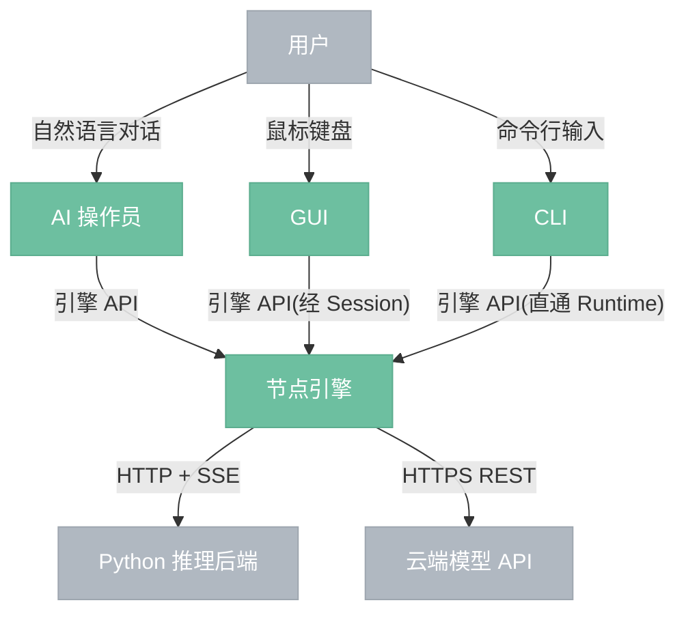

# 整体架构

> nodeimg 系统的顶层参与者、模块和交互方式。

---

## 总览

---

## 参与者

- **用户**: 通过 GUI、CLI 或 AI 操作员使用系统
- **AI 操作员**: GUI 内嵌的对话助手,接收用户自然语言指令,直接调用引擎 API 操作

## 模块

- **GUI**: 图形界面前端,画布编辑节点图、预览结果,内含 AI 对话面板。**经 Session 层**访问引擎。
- **CLI**: 命令行前端,执行节点图、批量处理。**直接访问 Runtime**,不经 Session。
- **节点引擎**: 系统核心,始终本地运行,管理节点图、调度执行、缓存结果。内部包含 8 层分层结构(见 `first-principles-architecture.md`)
- **Python 推理后端**: 独立进程,FastAPI + PyTorch,执行模型推理
- **云端模型 API**: 第三方云服务(OpenAI、Stability AI 等)

## 交互方式

| 连接 | 方式 | 说明 |
|------|------|------|
| 用户 → AI 操作员 | 自然语言对话 | GUI 内对话面板 |
| 用户 → GUI | 鼠标键盘 | 拖拽、连线、调参 |
| 用户 → CLI | 命令行输入 | exec / serve / batch |
| AI 操作员 → 引擎 | 引擎 API(经 Session) | 直接调用,GUI 自动刷新 |
| GUI → 引擎 | 引擎 API(经 Session) | 同进程函数调用,走 Session 层 |
| CLI → 引擎 | 引擎 API(直通 Runtime) | 同进程函数调用,跳过 Session |
| 引擎 → Python | HTTP + SSE | AI 节点推理,流式回传进度 |
| 引擎 → 云端 | HTTPS REST | API 节点推理,无状态调用 |

---

## 引擎内部分层

引擎内部采用 8 层分层结构。详见 `first-principles-architecture.md`。

| 层 | 模块 |
|---|------|
| Layer 7 | Interface(UI / CLI / Server) |
| Layer 6 | Project(容器,正交于 Graph) |
| Layer 5 | Session(交互层) |
| Layer 4 | Runtime(副作用、single-flight、cache) |
| Layer 3 | Capability(路由) |
| Layer 2 | Planner(纯函数) |
| Layer 1 | Graph(不可变值) |
| Layer 0 | 代数层(类型与值) |

---

## 关键非对称

1. **GUI 与 CLI 不对等**: GUI 经 Session,CLI 直通 Runtime——这让 Session 的存在有了"可选但必要时在场"的严格意义
2. **Project 与 Graph 正交**: Project 是容器,不在执行链路上;"无 Project 的 Graph" 是合法路径
3. **Capability 与 ExecutorType 不对等**: Capability 是路由主键,ExecutorType 降格为粗粒度分组
4. **preview cache 与正式 cache 不共享**: 前者归 Session,后者归 Runtime

---

## 与其他文档的关系

- `architecture-invariants.md` —— 8 条真源
- `first-principles-architecture.md` —— 8 层分层与所有权
- `0.0.1-engine-contract.md` —— 引擎共享契约
- `0.0.2-module-contract-template.md` —— 模块契约模板
