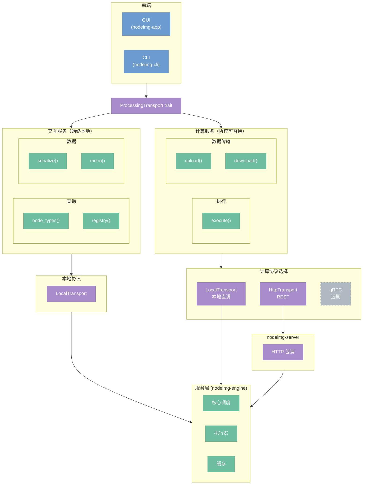
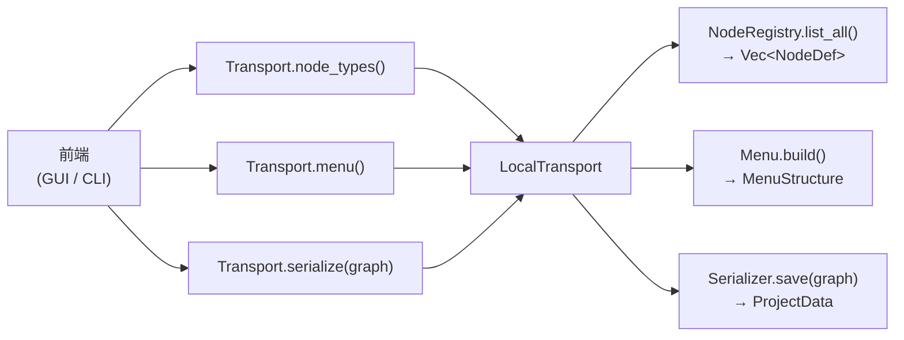
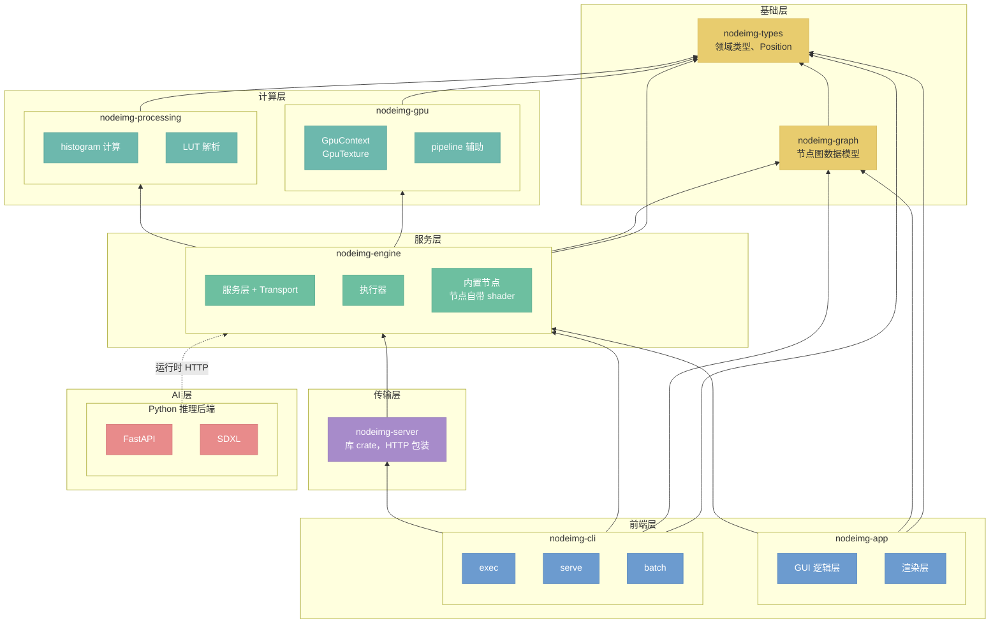

# 调用链总览

> 系统顶层架构，模块间如何协作，crate 如何依赖

## 总览

nodeimg 的调用链以 **ProcessingTransport trait** 为枢纽：GUI 和 CLI 都只面向这一统一接口，不感知底层协议。服务被分为两类——**交互服务**（轻量查询，始终本地）和**计算服务**（重操作，协议可替换）。

前端只看到统一的 `ProcessingTransport` trait，不感知底层是直调还是 HTTP 或 gRPC。

---

## 交互服务与计算服务

分离的核心原因是**操作特性不同**：

| 维度 | 交互服务 | 计算服务 |
|------|---------|---------|
| 典型操作 | 查节点类型、构建菜单、序列化图 | 执行图、上传/下载图像 |
| 数据量 | 小（元数据、结构体） | 大（像素数据、执行结果） |
| 延迟要求 | 低延迟（UI 响应） | 可容忍较高延迟 |
| 协议需求 | 无需跨进程，始终本地 | 需要支持本地/远端可替换 |

交互服务固定走 `LocalTransport` 直调，消除协议协商开销，保证 UI 流畅。计算服务则通过配置决定协议，支持嵌入式（LocalTransport）、分离部署（HttpTransport）和远期集群化（gRPC）。

---

## 交互服务流程

交互服务始终在同一进程内完成，无网络往返。

三条查询路径均由 `LocalTransport` 直接转发给服务层的对应模块，不经过任何序列化/反序列化，返回值是 Rust 原生类型。

---

## 计算服务协议选择

计算服务通过配置在启动时绑定协议，运行期不切换。三种协议的适用场景：

| 协议 | 适用场景 | 备注 |
|------|---------|------|
| `LocalTransport` | 单机嵌入，GUI 直接调用引擎 | 默认，零开销 |
| `HttpTransport` | 前端与服务端分离部署，REST API | 通过 nodeimg-server 暴露 |
| gRPC | 远期集群/分布式场景 | 未实现，接口对齐即可接入 |

**约束**：三种协议均实现相同的 `ProcessingTransport` trait，前端代码无需修改即可切换。接口对齐是唯一门槛。

---

## Crate 依赖图

**关键约束说明：**

- **GUI 不依赖 nodeimg-gpu**：GPU 资源由 engine 内部管理，GUI 层通过 Transport 接口获取结果，不直接持有 `GpuContext`。
- **CLI 内嵌 server**：`nodeimg-cli` 在 `serve` 子命令下直接启动 `nodeimg-server`，因此显式依赖该 crate。
- **nodeimg-gpu 定位为运行时基础设施**：只包含 `GpuContext`、`GpuTexture`、pipeline 辅助函数等基础设施；shader（WGSL）跟随节点文件夹，不集中存放在 gpu crate。
- **Python 后端为运行时依赖**：编译期不存在依赖关系，通过 HTTP 协议在运行时调用，图中用虚线表示。
