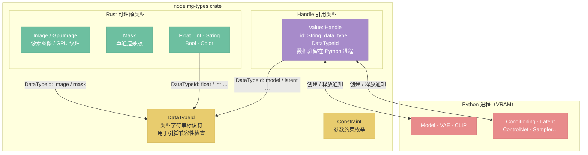
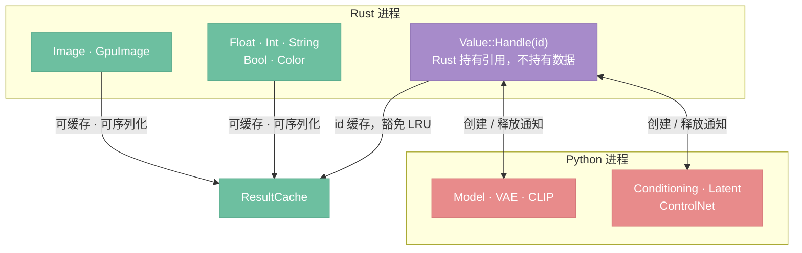

# 数据类型体系

> 定位：nodeimg-types crate 的核心类型定义——Value、DataType、Constraint，以及 Rust/Python 类型边界。

## 架构总览



---

## 与 nodeimg-graph 的边界（决策 D22）

**结论：** Node 定义在 nodeimg-graph，nodeimg-types 只保留原子类型。

| 属于 nodeimg-types | 属于 nodeimg-graph |
|--------------------|--------------------|
| `NodeId`（`type NodeId = Uuid`） | `Node`（完整节点结构体） |
| `Position`（`struct Position { x: f32, y: f32 }`） | `Connection`（连接关系） |
| `Value`（枚举，图像/浮点/整数/字符串/布尔） | `Graph`（容器和操作集合） |
| `DataType`、`Constraint` | 所有图操作和图查询方法 |

理由：nodeimg-types 是无依赖的原子层，被 gpu、processing、engine 等多个 crate 共用；把 Node 放进 types 会使 types 承载业务语义，破坏分层。nodeimg-graph 依赖 types，engine / app / cli 依赖 graph。

---

## Value 枚举

`Value` 是节点引脚之间传递的运行时数据，分为三类：

```rust
pub enum Value {
    // ── Rust 可理解类型（可序列化、可缓存、可直接操作）──
    Image(DynamicImage),        // 像素图像（RGBA）
    GpuImage(Arc<GpuTexture>),  // GPU 纹理（仅本地模式，不可序列化）
    Mask(DynamicImage),         // 单通道蒙版
    Float(f64),
    Int(i64),
    String(String),
    Bool(bool),
    Color([f32; 4]),            // RGBA 浮点色值

    // ── Python 专属类型（通过 Handle 引用，不含实际数据）──
    Handle { id: String, data_type: DataTypeId },
}
```

**Handle 说明：** AI 节点的输出（Model、Conditioning、Latent 等）驻留在 Python 进程的 GPU 内存中，Rust 端只持有不透明的 string ID。Handle 的创建、引用、释放遵循 [50-python-protocol.md](./50-python-protocol.md) 定义的协议。

---

## DataTypeId 与 Python 专属类型

`DataTypeId` 是类型的字符串标识符，用于引脚定义和连接兼容性检查：

| DataTypeId | 说明 | Value 表示 | 存在位置 |
|------------|------|-----------|---------|
| `image` | 像素图像 | `Value::Image` / `Value::GpuImage` | Rust 内存 / GPU |
| `mask` | 单通道蒙版 | `Value::Mask` | Rust 内存 / GPU |
| `float` | 浮点数 | `Value::Float` | Rust |
| `int` | 整数 | `Value::Int` | Rust |
| `string` | 字符串 | `Value::String` | Rust |
| `bool` | 布尔值 | `Value::Bool` | Rust |
| `color` | RGBA 颜色 | `Value::Color` | Rust |
| `model` | Diffusion 模型（UNet/DiT） | `Value::Handle` | Python VRAM |
| `clip` | 文本编码器模型 | `Value::Handle` | Python VRAM |
| `vae` | VAE 编解码模型 | `Value::Handle` | Python VRAM |
| `conditioning` | 条件化信息（embedding + metadata） | `Value::Handle` | Python VRAM |
| `latent` | 潜空间张量 | `Value::Handle` | Python VRAM |
| `control_net` | ControlNet 模型 | `Value::Handle` | Python VRAM |
| `clip_vision` | CLIP Vision 模型 | `Value::Handle` | Python VRAM |
| `clip_vision_output` | CLIP Vision 编码输出 | `Value::Handle` | Python VRAM |
| `style_model` | Style/IP-Adapter 模型 | `Value::Handle` | Python VRAM |
| `upscale_model` | 超分辨率模型 | `Value::Handle` | Python VRAM |
| `sampler` | 采样算法对象 | `Value::Handle` | Python |
| `sigmas` | Sigma 调度序列 | `Value::Handle` | Python |
| `noise` | 噪声对象 | `Value::Handle` | Python |
| `guider` | 引导器对象 | `Value::Handle` | Python |

**类型兼容性规则：** 连接两个引脚时，`DataTypeId` 必须完全匹配。特殊例外：`image` 类型的输出可以连接到 `mask` 类型的输入（自动提取亮度通道），反之亦然。兼容性判断由 engine 层的 `DataTypeRegistry` 负责，graph 层不做类型检查（见 [11-graph.md](./11-graph.md) 第 4 节）。

---

## Constraint 枚举

参数约束，用于校验和控件映射：

```rust
pub enum Constraint {
    Range { min: f64, max: f64 },            // 数值范围
    Enum(Vec<String>),                       // 枚举选项
    FilePath(Vec<String>),                   // 文件选择器，限定扩展名
    Multiline,                               // 多行文本输入
}
```

---

## Rust / Python 类型边界



Rust 侧不直接管理 Python 对象的内存，Handle 只是一个不透明的字符串 ID。

- 详见 [20-engine.md](./20-engine.md)（Handle 缓存策略）
- 详见 [50-python-protocol.md](./50-python-protocol.md)（Handle 跨进程管理）
